# 科技产品时代的下一个运动是体验。让我解释一下。

> 原文：<https://medium.datadriveninvestor.com/the-next-movement-in-the-era-of-tech-products-is-about-experience-let-me-explain-2cd62125e127?source=collection_archive---------23----------------------->

***TL；博士:*** *下一代消费产品将围绕销售工程化体验和基于体验的产品来设计、销售和构建技术。*

关于下一代创新的对话包括以下主题:人工通用智能、增强现实/虚拟现实、机器学习、自动驾驶汽车、太空旅行、延长寿命、基因组工程、轻松沟通、新的交通模式、清洁能源、去中心化网络、加密货币、拯救地球技术，等等

这些主题中的几个共同点是，它们都基于这样一种理念，即人类生活总是在进步，而且必须继续进步，并朝着给我们带来更好的生活体验的未来前进，无论是交流、旅行还是幸福。公平地说，人类渴望体验。

我们希望通过生活在一个基于经验的世界来感知我们所做的一切。许多问题，什么是现实？现实可以被认为是只有我们感知并相信是真实的东西。如果有人在一个没有窗户和时钟的房间里，他们怎么知道现在是白天还是晚上？如果有人在一个有窗户的房间里，有某种光线透过窗户，但看不到光源(太阳或强力卤素)，他们可能会认为这是白天。这很自然，那是对人类的客观观察。公平地说，现实是我们自己创造的。

伟大的马可·奥勒留甚至曾经说过:“我们认为自己的思想是什么，我们的世界就是什么。”对于一个出生于公元 121 年的人来说，这无疑是一些永恒的智慧之言和疯狂的人类观察。你今天早上是怎么醒来的？你的一天和事情的进展有关联吗？那到底是什么体验？

《牛津词典》将“经历”一词定义为“给某人留下印象的事件或事件”,在本文的上下文中，它也有同样的定义。如果你看下面的图表，你会注意到在过去的几百年里，这个词在书中的使用一直在逐渐上升。尽管这是我能检索到的最新数据，但你可以有把握地推断，21 世纪的急剧上升可能与消费者创业公司的诞生以及应用商店的出现有关，它们将慢慢征服世界。随着优步、Airbnb、Whatsapp、Spotify、Twitter 等公司的兴起，“体验”一词开始出现在对话中，尤其是在大众科技产品的背景下。我们可以推断，在 2018 年，该图可能会继续快速上升。

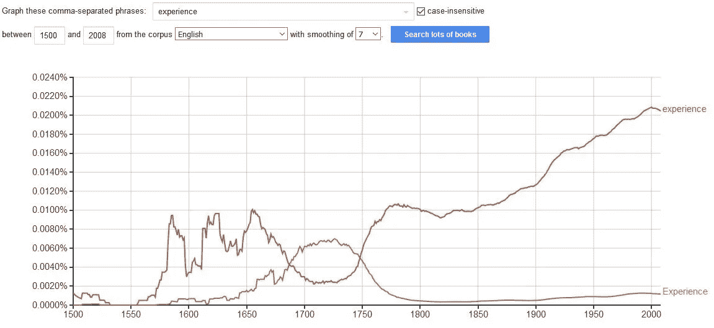

**本博客上下文中的经验定义与上述牛津词典中的定义相同。**

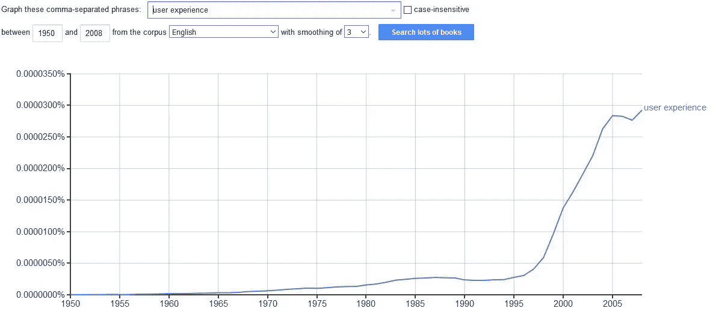

User Experience popping up in lot more books after 2000 (Practically 0 before 1960's)

那么，下一代产品会是什么样子呢？

让我们先来看看一些关键的观察结果(沃伦·巴菲特支持的标志性公司)

为什么可口可乐总是在广告中推销可乐瓶恰好出现在最美好和最难忘的时刻的体验？为什么它不推荐一些与饮料本身相关的东西，比如味道等？你看，可乐已经在心理层面上把自己和幸福绑在了一起。不仅如此，可乐还有无味的记忆！请看沃伦·巴菲特在年度股东信中的名言。

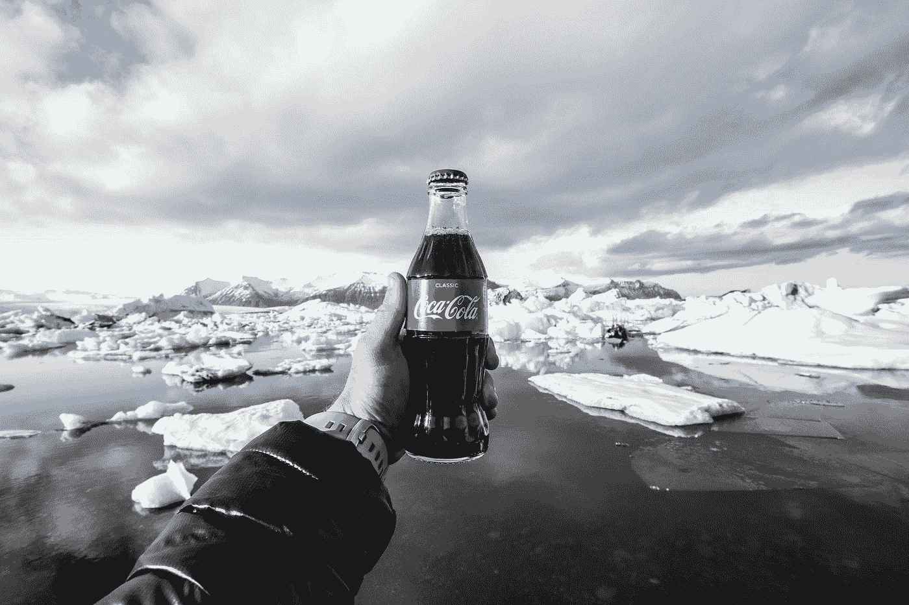

Photo by [Jeremy Bishop](https://unsplash.com/@tentides?utm_source=medium&utm_medium=referral) on [Unsplash](https://unsplash.com?utm_source=medium&utm_medium=referral)

> 有一点大家不明白…可乐没有味觉记忆。你可以在 9:00，11:00，下午 3:00，5:00 喝一杯可口可乐。五点的那杯和你早上喝的一样好喝。你不能用奶油苏打、根汁汽水、橘子汁、葡萄汁，你能想到的。所有这些都会累积在你身上。大多数食物都是如此。和饮料。过一会儿你就会厌倦它们……可乐没有味觉记忆。这意味着世界各地的人都是重度使用者，他们每天喝五杯…他们永远不会用其他产品喝。所以你得到了这个不可思议的人均消费。

所以我们不得不把喝可乐和任何看起来特别的地方联系起来。试着想想可口可乐赞助的所有事情，包括世界杯、奥运会、电影、活动等等。这个想法是，当你做这些事情的时候，可口可乐可能会给你一个快乐的体验。公平地说，喝可乐是一种体验。

这里有一个超级有趣的。为什么参加世界杯或者奥运会是件大事？我想每个人都知道基本的答案:因为它们每四年才发生一次，最好的团队将成为冠军！更深层的答案是，是我们的想象力赋予了它重要性。这不仅仅是另一场比赛或州际比赛，这是世界杯！因此，当你亲临现场，甚至在家观看时，你也是体验的一部分。你正在见证“历史”,参与梦寐以求的游戏。我打赌你知道有人在看这些比赛的时候喝可口可乐😃

French President Emmanuel Macron celebrating France’s victory

可口可乐让伯克希尔·哈撒韦公司赚了很多钱，而巴菲特梦寐以求的生意是喜事糖果。远比可乐赚钱。刚发现的时候很惊讶。你最后一次去看是什么时候？你还记得商店的外观和感觉吗？优雅的白墙为各种色泽鲜艳的巧克力包装提供了完美的背景。热情快乐的工作人员总是分发令人惊叹的样品，如果你对糖果有“甜蜜”的偏好，这几乎会迫使你购买天堂的糖果。哦。店面也不大。只需扫几眼，您就可以看到所有的产品和选项。那么像这样的东西怎么会比可乐更有利可图呢？以下是巴菲特对这一经历的分析。

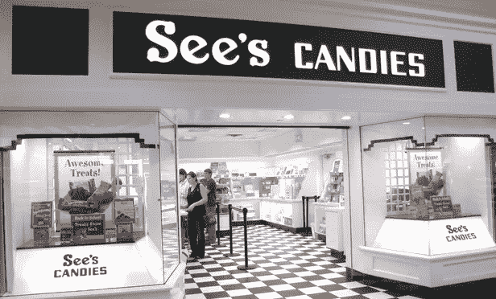

> 内疚，内疚，内疚——人们在高速公路上左拐右拐。当我们通过广播广告说服他们时，他们不敢不带着一盒巧克力回家。所以情人节是最重要的一天。你能想象在情人节回家吗——由于我的才华，我们的糖果现在是 11 美元一磅。假设有一种(竞争对手的)糖果，每磅 6 美元。你真的想在情人节走进去，手握着——这些年来她对喜事糖果的印象都很好——然后说，‘亲爱的，今年我买了低价的。’递给她一盒糖果。这是行不通的。因此，从某种意义上说，还有未开发的定价能力——它不依赖于价格。”“我们所知道的是，他们在加利福尼亚有共同的想法。有一些特别的东西。在加州，每个人心里都有一些关于喜事糖果的想法，而且绝大多数人都很喜欢它。他们在情人节那天给一个女孩送去了一个盒子，她吻了他。如果她扇了他一巴掌，我们就没生意了。只要她吻他，那就是我们在他们心目中想要的。See's Candy 的意思是被吻。如果我们能让人们记住这一点，我们就能提高价格。

虽然我还没有亲自尝试过这种方法，但它确实很吸引人，并且很好地推销了这种体验。糖果显然很棒，但这里卖的是温暖、甜蜜、爱和幸福时刻的体验。奥马哈先知令人难以置信的观察。

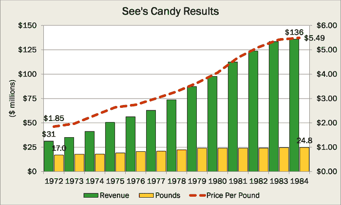

他确实提高了价格。1972 年，喜斯售出了 1700 万磅糖果，到 1984 年，这一数字上升到 2500 万磅，大约增长了 50%。然而，它的收入从 3100 万美元增加到 1.36 亿美元，增幅为 333%。请看年度信函中的图表。

以这种方式投资被称为价值投资。它被定义为“一种投资策略，选择交易价格低于其内在价值的 T2 股票”他们押注于公司长期提供的价值，而不是市场价格。我不会深入探讨这个问题，但重要的是理解这个概念。

我们再快速看一个。伯克希尔·哈撒韦公司最近投资了苹果公司(伯克希尔目前最大的投资)，该公司持有超过 2 亿股股票。

“Many Apple products lovingly on display with their original packaging” by [Julian O'hayon](https://unsplash.com/@anckor?utm_source=medium&utm_medium=referral) on [Unsplash](https://unsplash.com?utm_source=medium&utm_medium=referral)

虽然我可以整天谈论苹果和他们在产品制造方面的独创性，但如果你从整体上看苹果，它不仅仅是科技产品。我听到人们把他们描述为时尚公司、品牌公司、健康公司、生活方式公司，以及其他许多可能不直观的公司。当他们的所有产品同步时，他们的生态系统简直就是魔术。信息的无缝体验加上迷人的物理设计无疑使它不仅仅是一个技术产品。从我个人的经验来看，苹果产品被视为一种身份的象征，尤其是在美国以外。我甚至被告知，羞耻的蓝色泡泡不会给人留下深刻印象。这是给你一个第一手例子的最好方法。你是如何阅读这篇文章的？在安卓还是苹果上？如果你现在有 iPhone 或 Mac，为什么不买 Android 或 HP next 呢？不管是什么原因，在内心深处，它陷入了对苹果体验的渴望。产品给人的整体感。人们愿意为这种体验支付额外费用。

这正是伯克希尔投资了许多这些杰出公司的原因。1994 年，查理·芒格在南加州大学的一次令人难以置信的演讲中，透露了他寻找和投资不仅仅提供产品的公司的秘密公式。他说…

> **“实际上，在一些行业中，你会发现在一生中有几次，任何经理都可以通过提高价格来大幅提高回报——然而他们并没有这样做。因此，他们有巨大的未开发的定价能力，他们没有使用。这是最简单的方法。**

现在这很有意义了。如果苹果明天将 iCloud、iPad 和 Mac 的价格提高几美元，并不意味着人们会转向竞争产品。他们会对他们提供的简单和优雅的体验保持忠诚。

迪士尼乐园可能会存在很长时间的原因。见鬼，他们称之为“地球上最快乐的地方”，他们在推销这种体验。你和家人在一起的经历，在骑行中，吃高价披萨，与米奇合影，在想象的城市和人物的背景下用壮观的烟火结束夜晚。

那么，这一切在科技产品的未来中处于什么位置呢？注意那些已经成为我们生活一部分的小事。

为什么每个派对都需要有一个好的 Spotify 播放列表作为背景，这是一个很棒的派对？

为什么太空旅行突然变得令人兴奋，为什么人类有必要仰望星空，或许在群星之间定居？当然，乍一看，你会认为我们在地球上有我们需要的一切。

我不记得在哪里听到过这句话，但有一句话是这样说的:人的行为可以改变，但人性不能。也许渴望体验和探索未知是人类与生俱来的天性。

## 我真的相信，下一代消费产品将围绕销售工程化体验和基于体验的产品来设计、销售和构建技术。

也许我们已经看到了一些处于萌芽阶段。这种体验可以是任何东西，从与世界的联系，见证一种现象，成为一场运动的一部分，想要成为一个故事的一部分，到 FOMO 的想法(害怕错过)。如果你问自己或其他人“为什么”的次数足够多，你最终会找到我们为什么选择做某些事情的根本原因。生活本身就是一种瘾，至少可以说是一种好瘾。我认为我们每天做的事情是为了让我们的生活发挥出最大的潜力。

这里有一个简单的例子:我和一个朋友进行了一次简单的对话。通常问为什么足够多的次数有助于触及核心。你为什么锻炼？所以我可以保持良好的身材和健康。为什么你想看起来漂亮又健康？所以我可以享受生活而不容易生病，享受生活的乐趣。为什么会这样？生活本身有太多美好的东西可以提供，我想尽可能地得到更多。虽然他有点恼火，但他对自己的回答也感到惊讶。

总之，锻炼能让你保持良好的状态，良好的状态让你健康，健康意味着生活中少一些身体问题，少一些身体问题会让你有更多的机会长寿。生活本身就是一种瘾，好好利用它吧。在一个合理的日子里，你有没有在睡觉的时候想着我希望明天不要醒来？可能不是，事实上，恰恰相反。

事实上，这里有一些我最近学到的有趣的东西(有太多东西我仍然不知道)。我们的记忆是围绕着记忆事物、故事、感觉、经历以及不仅仅是冰冷数据的事物而建立的。在卡尔·纽波特的书中，他分享了前美国记忆冠军和世界记录保持者朗·怀特使用的一种记忆卡片的技术，这种技术是关于我们的记忆是如何工作的。他说“我们没有快速内化抽象信息的能力。”抽象信息是冰冷的数据，你可能无法理解或与之相关。他确实提到“然而，我们真的很擅长记忆场景。”这就是根据几千年前口头流传的故事写成的书。为了证明这一点，请注意，相当多的人仍然不理解气候变化的意义的原因是因为他们无法理解或保留关于气候变化影响的客观数据([地球的温度正在上升超过 1 摄氏度，这是非常高的，当你查看地球的历史数据](https://climate.nasa.gov/evidence/))。虽然理性和基于逻辑的辩论是建设更美好未来的更好途径，但我在向那些不了解气候变化的人解释气候变化时，经常听到的论点是这样的:“我们希望为我们的孩子留下一个更美好的世界，这样他们也可以像我一样享受自然。我希望他们健康快乐地生活，不用担心食物短缺、干旱、土地战争等等…

作为一名 Z 世代，我所做的一切都是基于体验满足生活的理念。你甚至可以称之为我们世界的游戏化。如果你问人们如果他们中了大奖会做什么，他们会说什么？很多人表示，他们会以某种方式或形式使用这些资金，去探索和体验我们这个世界的美丽。

让我们来看看一些开创了这个以体验为基础的社会新时代的创业公司，也许还可以看看产品将如何演变的未来。

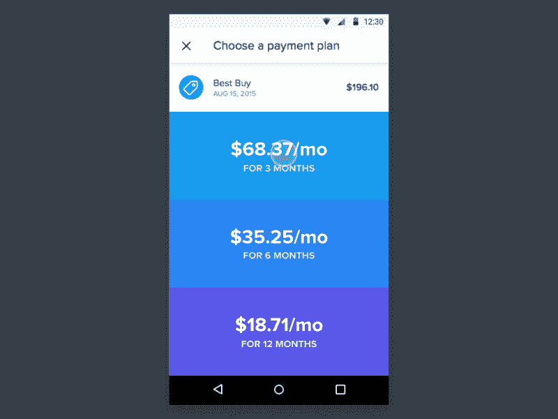

[**申明**](https://www.affirm.com/buy-with-affirm)——专注支付的 fintech 公司。这是 Affirm 平台的一个很好的例子，它优先考虑简单性和透明性。付款计划有一个清晰的细分，带有易于使用的选项，后面是对整个金额以及如何细分的详细描述。

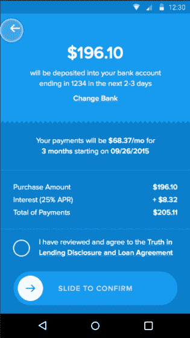

如果今天的支付设计以主要用户为中心，展示了一个
不同的场景，我们今天可能不会面对，但在未来会怎样。像极简的用户界面，最大的透明度和卓越的分析，更好地了解用户的生活方式，无论你是即将步入成年的千禧一代还是即将退休的婴儿潮一代。用户参与地区和生活方式事务的界面。

[**沃比·帕克**](https://www.warbyparker.com/)——一个以革命性低价提供设计师眼妆的生活方式品牌。在舒适的家中，你可以免费试戴 3 副名牌眼镜。你可以以大约 95 美元的价格订购这些处方眼镜，而市场替代品的平均价格很容易超过 300 美元。以三分之一的价格，你就可以买到名牌眼镜，你可以在家中舒适地选择。他们的网站和商店位置甚至根据你的面部结构提供推荐。这里的要点是，您可以通过便利节省时间，享受购买产品的乐趣，并且价格对于普通客户来说也是超级实惠的。这是一个很棒的工程体验，这在之前的处方眼罩中是从未有过的。

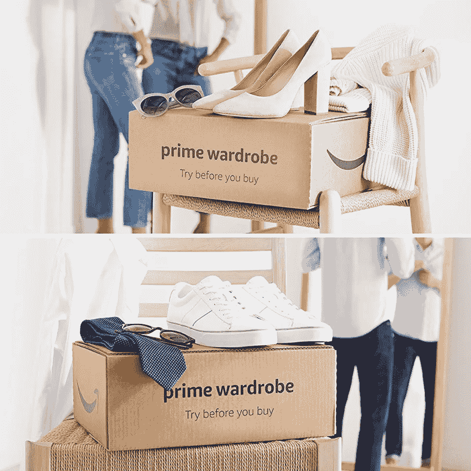

[**亚马逊衣柜**](https://www.amazon.com/learn-more-prime-wardrobe/b?ie=UTF8&node=16122413011)——这是一种顶级的独家产品，你可以在家中舒适地试穿各种衣服、鞋子和配饰。它是这样工作的。你至少要在你的“盒子”里装满 3 件物品，然后你有 7 天的时间来试穿这些物品，并简单地退回你不想要的物品。盒子是可重新密封的，并附有印刷的退货标签。这是一个非常了不起的创新，正面挑战了典型的零售店。在你的房子里，你可以随心所欲地试穿物品，并尝试与你已经拥有的物品进行各种组合。节省大量时间，最重要的是，给你最好的购买体验。就在你家，你还没买。还能更容易吗？

“View from the back seat on a man in glasses driving in heavy traffic” by [Dan Gold](https://unsplash.com/@danielcgold?utm_source=medium&utm_medium=referral) on [Unsplash](https://unsplash.com?utm_source=medium&utm_medium=referral)

**——汽车搭车服务，只需点击几下鼠标，你就可以搭车，并在几分钟内到达目的地。设计一个强大的基础设施，支持由双方激励培育起来的巨大供需，这是非常明智的。他们最近通过了 100 亿次里程碑式的旅行，其中一半是在去年完成的。优步设计了一种体验，这种体验不仅是一种节省时间和提供便利的伟大实用工具，而且是一种让人们对他们的服务感到放心的体验(当你在聚会上喝酒时，你做了什么你不应该也喝，优步 it！)**

**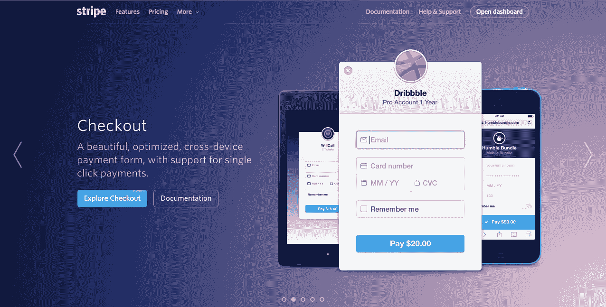**

**[**Stripe**](https://stripe.com/about) —提供一套统一的 API 和工具，使企业能够立即接受和管理在线支付。他们认为自己是“经营互联网业务的最佳软件平台”他们正在将互联网商务从支持初创企业扩展到财富 500 强，经营一家电子商务公司从未如此容易。他们的服务基本上使整个后端流程变得如此直观和简单，以至于您只需关注核心业务。凭借代码的力量，他们设计了一种超级简单有效的方式，让人们体验创办公司并大幅改善生活的力量。**

**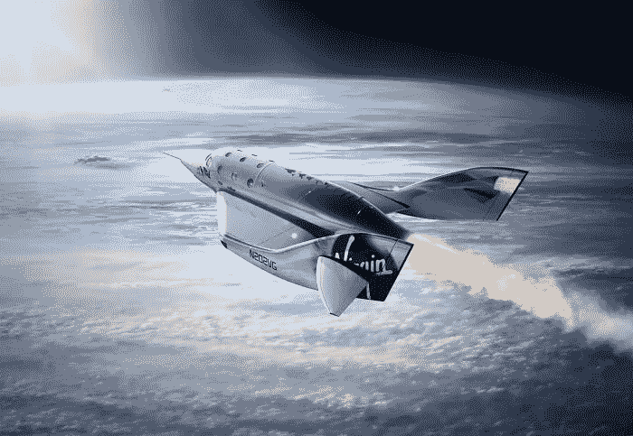**

****——一家准备向付费公众提供亚轨道太空飞行的公司。虽然我同意这最初是为那些买得起这种奢侈品的人准备的，但我真的相信在我们的有生之年，中产阶级公众将有并且应该有能力体验太空的黑暗，从工程车辆上看到人类(地球)的曲线。这种改变生活的时刻可以带来很多东西，而且这可能是一种自我推销的商业模式。如果你愿意，可以把它想象成世界上最好的过山车。****

****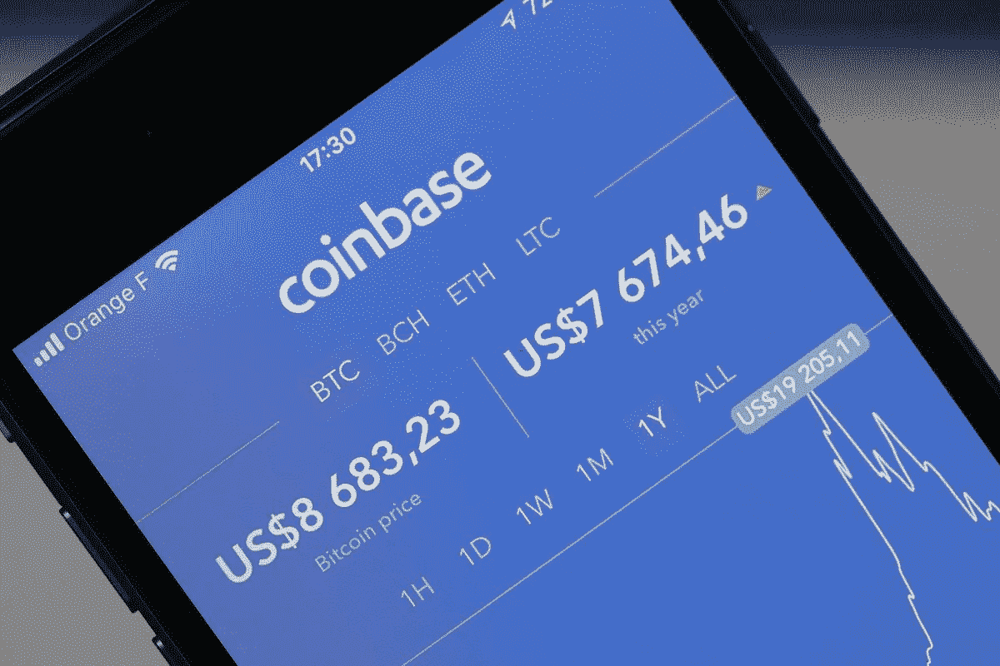****

****[**比特币基地**](https://www.coinbase.com/about) —一种数字货币钱包，可以让你购买各种数字资产，如比特币、以太坊等。现在你可能会认为这有点奇怪，甚至可能有悖直觉，但将参与现代金融变革的能力带给普通消费者并不比火箭科学更容易。当你将比特币这样复杂的技术与已经复杂的现代金融系统融合在一起时，你就拥有了一个只有行业专家才能理解的超复杂系统。直面这一挑战，并希望在这个世界上建立一个开放的金融体系，即使是小学生也能理解，这是一个崇高而务实的目标。采用像区块链这样的现代技术，可以提供合理公正的系统，让每个人都有能力成为该系统的一部分，这是金融体验的一个显著变化。****

****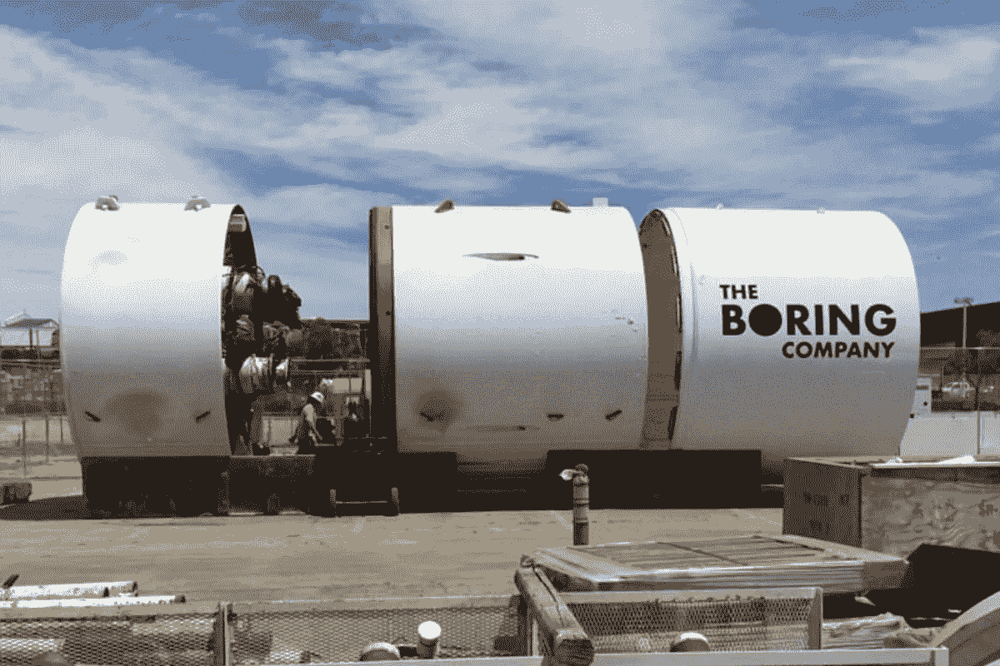****

****[**钻探公司**](https://www.boringcompany.com/faq/)——基本上就是挖隧道来建立地下运输网络。你遇到过交通堵塞吗？更好，你体验过洛杉矶的高峰时间交通吗？如果你有，你已经想要这个工作，如果你没有，你还记得杰特森的漫画吗？在这里，交通相当顺畅，是一种快乐的体验，你可以阅读、工作、做任何事情，所有这些都比开车相对安全。****

****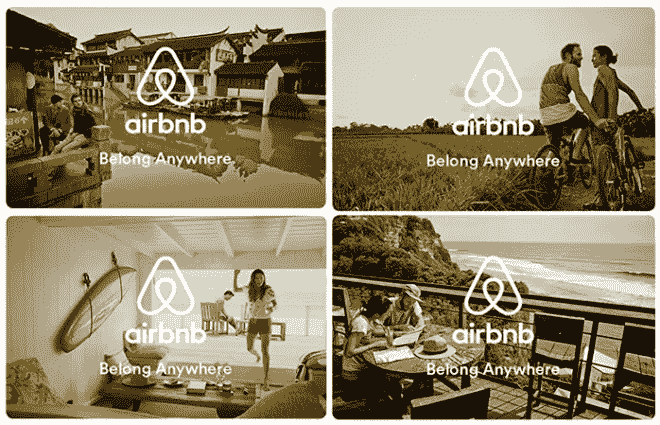****

****[**Airbnb**](https://www.airbnb.com/)——一个在线社区市场，在这里你可以通过旅行和探索的方式发现世界，这也许是最好的例子。10 年前，我们从来没有能力把家里的空房间出租给陌生人以获得额外的现金，更不用说想象这样的事情了。在当地人的家中和镜头下探索新地方和发现新知识的能力是非常了不起的。他们的核心产品提供住宅、餐馆，最近还提供体验，这是一个推销自己的卖点，迎合了人们想看和感受新事物的好奇心。很棒的东西。更多即将到来。****

****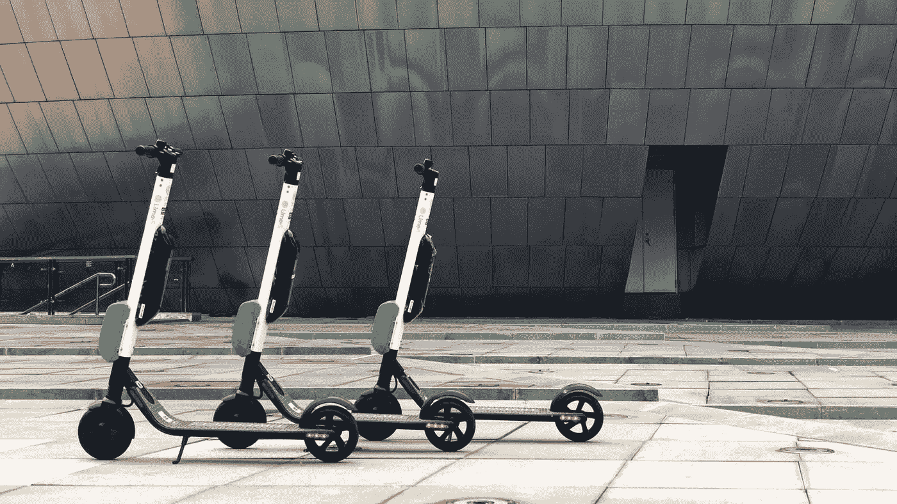****

****[**Lime Bikes**](https://www.li.me/about-us)——解决最后一公里通勤问题同时又环保的电动滑板车。Lime 和其他踏板车初创公司通过一个移动应用程序和一个还配备踏板自行车的移动车队来实现城市内的无缝交通。让普通用户负担得起，同时扩展到世界各地的城市并应对当地法规，这是一个不小的挑战。我个人骑过不同的时间，让我告诉你，这是游览一个城市的最佳方式。另外，你觉得自己又像个孩子了。****

****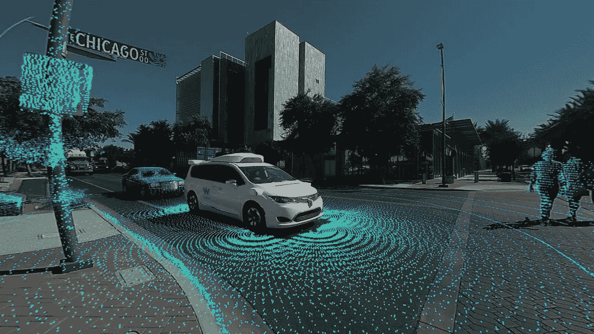****

****[**Waymo**](https://waymo.com/journey/) —自动驾驶汽车为您服务。走出谷歌的实验室，Waymo 成为世界上第一辆在公共道路上行驶的完全自动驾驶汽车，没有方向盘或踏板。自主的未来并不遥远！想象一下，坐在车里去任何地方，都可以阅读、睡觉、写作，而不用担心能否安全到达目的地。一个富有成效的未来，也是一个对人类生活更加安全的未来。目前，Waymo 正在凤凰城地区测试一项早期乘车计划，该计划将人们“从工作场所，到学校，到电影院等等”。他们刚刚获得了加州第一张无人驾驶汽车的驾驶许可！****

****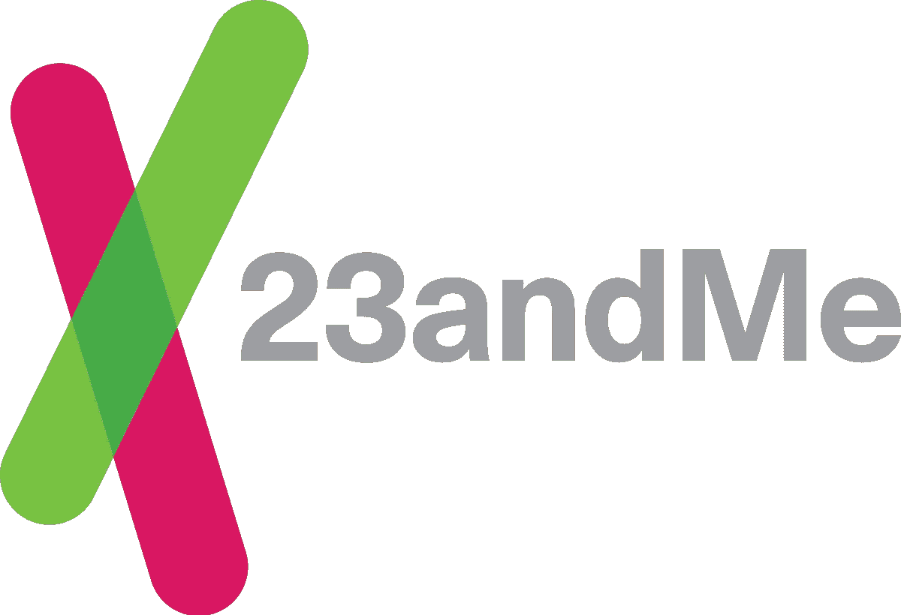****

****[**23 & Me** 他们是第一家提供直接面向消费者的基因测试的公司，你只需把装在盒子里的唾液寄给他们。超级简单的流程。结果可能会令人震惊。作为 69 美元的回报，你可以获得一份关于你全球血统的百分比的深度报告，让你有能力与你未知的 DNA 亲属联系，并发现遗传健康风险，健康数字，携带者状态和你独有的特征！你知道，他们接触并最终受益于对你的人类基因组的了解。你的确很特别。在这种情况下，探索未知的刺激很有吸引力。](https://www.23andme.com/howitworks/)****

****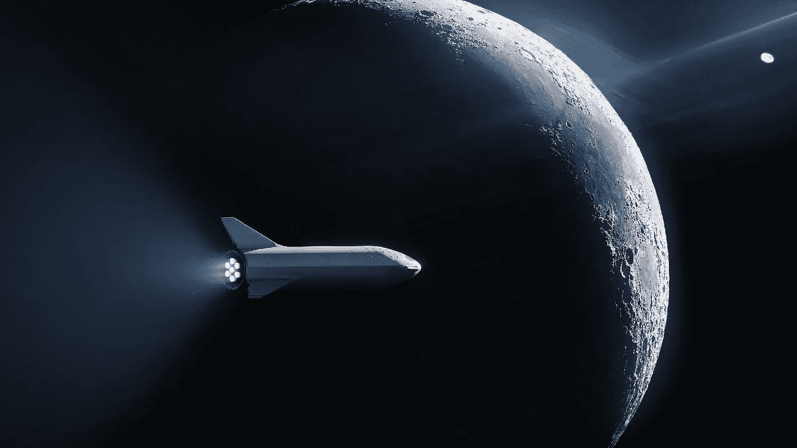********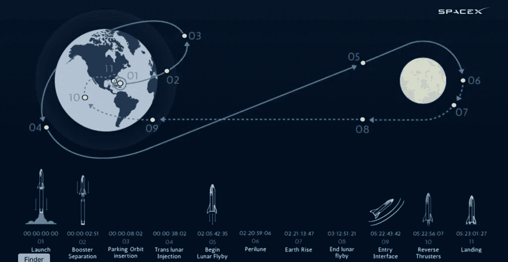****

****最后，[**SpaceX**](https://www.spacex.com/)——你以为我会漏掉这个！？😄极致体验。人类成为星际物种！还需要我多说吗？2023 年，大型“猎鹰”火箭的首次客运飞行将围绕月球进行为期 11 天的旅程，其中包括我们世界上一些最多产的艺术家。人性和好奇心的极致。在我们的有生之年，人类将会登上火星，而且火星上很有可能会有一群人类。活着并消费一些可笑的酷产品是多么令人兴奋的时刻。****

****这些公司只是将服务经验注入前所未有的行业的一小部分。构建这些产品的真实性是一种催化剂，它会给你一个用户非常重视的产品。****

****那么到目前为止我们学到了什么？当谈到经验时，人类至少在某种程度上是贪得无厌的。作为一个民族，我们必须不断创新。****

****游戏化、探索和独特的解决方案将让位于新的体验。你看到体验总是存在的，是你，你的正念是暂时的(想想当你去主题公园和平常的一天相比，你是多么快乐)****

****大多数软件企业将发生转变，开始意识到需要强调推动解决客户面临的问题/提供创新解决方案的目标，而不是推动经常充斥着功能安装的产品路线图。****

****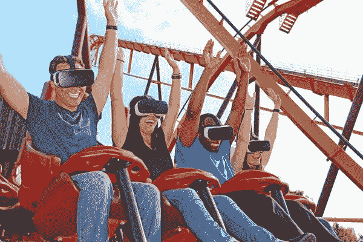****

****一个很好的例子就是虚拟现实和过山车在六旗游乐园的融合。通过软件想象增强身体刺激的结合。****

****也许本杰明·富兰克林在他的一篇永恒的文章中说得很好:“人是一种社会性的生物，据我所知，被社会排斥是最糟糕的惩罚之一。”对连接世界和带来不可思议的体验的追求还远远没有结束。****

****随着新技术的出现，我们将看到我们的社会逐渐转变成一个史诗般的迪斯尼乐园，在那里一切都是一种美丽的体验，甚至可能是一种上瘾的体验。****

******总结:下一代消费产品将围绕销售工程化体验和基于体验的产品来设计、销售和构建技术。******

*****如果你正在读这篇文章，你就是真正的 MVP😄。当然希望你喜欢它。如果你喜欢这个，你也可以❤️我的播客，* [*人们的视野*](https://itunes.apple.com/us/podcast/vision-of-the-people/id1386339640) *在这里我采访了一些了不起的领导者(Twitter 的联合创始人，Virgin Orbit 的 CEO，General Catalyst 的 MD，等等经营数十亿美元公司的人),谈论他们的产品、愿景，以及他们将与年轻人分享的对世界产生影响的建议！期待收到你的回复。在推特上找到我@LilRushiShah*****

## ******多❤️
到下次，继续努力！******