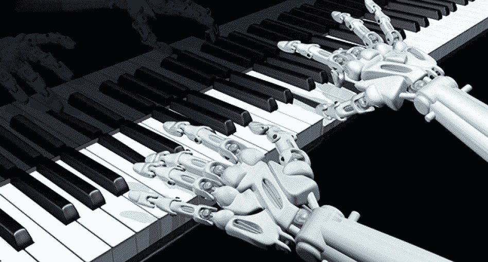
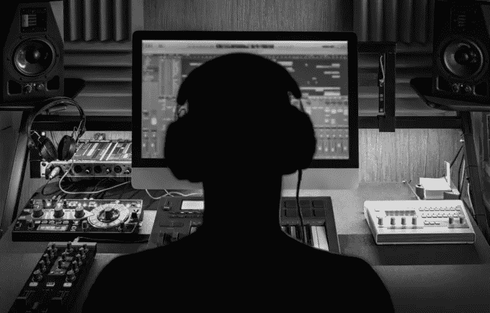
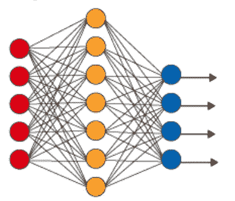

# 下一个莫扎特是个机器人

> 原文：<https://medium.datadriveninvestor.com/the-next-mozart-is-a-robot-fe5305952eb7?source=collection_archive---------5----------------------->

除非你生活在岩石下，否则你知道**人工智能(AI)是下一件大事！** AI 可以做一些很酷的事情，改变人类看待世界的方式。如果我告诉你人工智能可以创造音乐…看起来像电影里的东西，对吗？嗯，现在是现实了！ ***AI 正在以我们从未想过的方式*改变音乐产业** *！从创作音乐到帮助制作音乐…太对了！🤯*

## 用人工智能创作音乐的公司

Amper Music 是一家总部位于纽约的公司，是人工智能音乐创作的全球领导者！它允许用户使用人工智能工具来执行、创作和提供媒体内容的定制音乐。该网络应用程序允许创作者选择作曲风格、情绪和长度，以他们想要的方式创作音乐。

 [## 模式和机器人:复杂的现实|数据驱动的投资者

### 哈耶克的名著《复杂现象理论》(哈耶克，1964)深入探讨了复杂性的话题，并断言…

www.datadriveninvestor.com](https://www.datadriveninvestor.com/2019/03/04/patterns-and-robotics-a-complex-reality/) 

最好的部分是，创作者不需要任何背景音乐知识或技能，这是一个易于使用的平台！

## “幕后”

令人震惊的权利！虽然这看起来很酷，但开发这种基于人工智能的软件还有很多工作要做。像 Amper Music 这样的公司是如何设法建立一个人工智能在线网络工具来制作音乐的？嗯，你可能认为它超级复杂，但它不是。

这些公司这样做的方式是通过使用 ***深度学习。*** *深度学习是模仿人脑神经网络*(我们大脑处理信息的方式)*的机器学习的子集。*

神经网络被称为**人工神经网络(ann)。**神经网络由神经元组成，神经元将信号从一个神经元传递到下一个神经元，就像我们的人脑一样。

你看到的每个圆圈都是神经元。**每个神经元接收、理解，然后向另一个神经元发送信号。**整个神经网络由层组成，*输入层(红色神经元)，隐藏层(黄色神经元)，输出层(蓝色神经元)。总会有一个输入层(第一层)、一个输出层(最后一层)和隐藏层(中间的所有层)。*

A Neural Network

## 每一层的角色

每一层都有其用途。让我们浏览这些层，了解它们各自的用途。对于每个描述，我们将使用上面的图像作为例子。

**输入层(第一层)**

输入层是图中的红色神经元。每个神经元代表提供给模型的数据集中的一个变量。输入层的神经元将信息发送到下一层，即隐藏层。输入层和隐藏层中神经元之间的每个连接被赋予 0 或 1 的权重。连接件的重量取决于连接件的强度。

**隐藏层(输入和输出层之间的所有层)**

隐藏层是图中黄色的神经元。如前所述，每个隐藏层都是输入层和输出层之间的层。它们被称为隐藏层的原因是它们与外界没有联系，因为它们接收的唯一信息来自输入层。隐藏层执行计算并将信息从输入层传输到输出层。神经网络可以有零到多个隐藏层。

**输出层(最后一层)**

输出层是图中的蓝色神经元。输出层中的神经元负责将计算从网络传输到外部世界。

## 训练神经网络

神经网络“学习”和被训练的一种方式是 ***强化学习。这是一种方法，通过增加其“奖励”来教会 AI 决定下一步需要采取什么行动，以达到某些目标。强化学习不需要标记数据，这也是为什么 AI 模型可以在没有任何明确指令的情况下创作音乐。由于人工智能模型不需要得到明确的指示，因此它在创作音乐时可以发挥创造力。***

## 关键要点:

*   人工智能正被用于创作音乐以及辅助音乐的创造性
*   Amper Music 是一款在线人工智能工具，可以为媒体内容表演、创作和提供定制音乐
*   深度学习是机器学习的一个子集，它使用人工神经网络
*   强化学习是一种特定的机器学习技术，其中系统基于其过去的错误进行学习以执行任务

***如果你喜欢这篇文章:***

*   ***分享给你的人脉***
*   ***关注我的***[***LinkedIn***](https://www.linkedin.com/in/krish-chandarana-25a197177/)***，***[***Twitter***](http://twitter.com/krishchandarana)***，以及***[***Medium***](https://medium.com/@krishchandarana)***随时更新我的 AI 进度！***
*   **查看我的网站** [**这里**](http://krishchandarana.com)