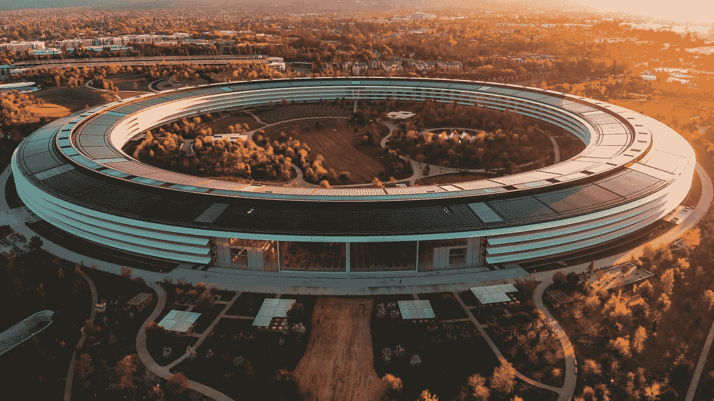

# 苹果的下一个 20 年

> 原文：<https://medium.datadriveninvestor.com/the-next-two-decades-of-apple-b128af86424c?source=collection_archive---------28----------------------->

*这是摘自我去年优秀* [*AltMBA*](https://altmba.com/) *期间写的一些东西。我很想知道你在下面的评论中是怎么想的。*

Photo by [Carles Rabada](https://unsplash.com/@carlesrgm?utm_source=medium&utm_medium=referral) on [Unsplash](https://unsplash.com?utm_source=medium&utm_medium=referral)

价值数十亿的公司和失败的公司有什么区别？运气当然扮演了一个角色，但是你很难找到任何人会认为运气是唯一的变量。是天赋吗？领导力？是的，都是。但这还不是全部。伟大的公司围绕着一个共同的目标结盟。伟大的公司有一致的战略。伟大的公司让服务中的一切都服从于这一战略。

但是好的战略从何而来？好策略和差策略的区别是什么？优秀的书[好策略/坏策略](https://www.amazon.com/Good-Strategy-Bad-Difference-Matters/dp/0307886239)断言好策略来自三个核心原则:

1.  解释挑战的诊断
2.  应对挑战的指导性政策
3.  一组被设计来执行动作的连贯动作

因此，最好的公司是那些领导者能够准确识别机会，将机会的意义和重要性传达给公司每个层面，然后通过协调公司每个人行动的指导性政策来调动其资产的全部力量的公司。

战略是我们告诉自己的故事、我们可以利用的资产以及我们根据自己的价值观给自己设定的界限的总汇。因此，让我们更仔细地看看一个可能的未来是如何在现在世界上最著名的公司——苹果公司的范围内展开的。

*注意:我从未在苹果公司工作过，所以这里的一些/大部分肯定是不准确的。*

## 资产

*   2850 多亿美元的现金！
*   世界上最知名的品牌之一
*   品牌影响力(进入他们想要的任何市场的谈判技巧)
*   强大的福音派顾客骨干
*   设计能力
*   硬件工程能力
*   软件设计能力(你看到模式了吗？)
*   云计算基础设施
*   硬件、软件和服务的紧密垂直集成
*   紧密结合的分销渠道(应用商店、iTunes 商店等。)

## 边界

*   我们要求对用户体验的各个方面进行最高程度的控制
*   我们不会推出任何不符合良好品味的产品，并坚持我们的设计原则
*   我们关注大众的用户体验，而不是为少数人定制
*   我们不会在价格上竞争
*   我们尊重用户的隐私

## 叙述

*   我们比任何人都有品位
*   我们的顾客都是眼光独到、品味高雅的人。
*   集成的软件和硬件带来了更好的用户体验
*   我们不必按现状行事。我们以自己的方式建造和构建事物。
*   我们不满足于任何不优秀的东西
*   我们是独特的
*   我们对许多事情说不，比我们对 T2 说是，要多得多
*   我们是由史蒂夫·乔布斯创立的

# 前进的道路

所以，你碰巧发现自己坐拥 2850 亿美元现金。占主导地位的品牌名称。数千名敬业的员工在设计、工程、供应链物流方面拥有深厚的专业知识，并对保密情有独钟。你该怎么办？

定义一个组织的战略是非常危险、非常可怕的事情。它要求你选择一条路，避开所有其他的路。没有“正确”的答案。没有办法获得 A，至少在传统或直接的意义上没有。策略有时需要几十年才能发挥出来，要么证明其创造者是正确的，要么使其成为受害者。

本质上，苹果是一家消费者公司。他们为大众市场创造产品，他们对大众市场确实欣赏和关心设计良好和精心制作的物品这一事实下了长期赌注。推而广之，大众市场将会为这些物品支付额外的费用。那么苹果现在何去何从。在过去的 20 年里，他们主导了个人设备市场的利润份额。他们将奢侈品的定价和营销带到了大众市场，并因此获得了丰厚的报酬。他们能从这里去什么地方吗？第一世界的许多人，如果不是大多数人，每天使用和依赖的另一个项目是什么？有没有一项是需要软硬件紧密集成的？当然有，但是装不进口袋。普通美国人每天花在汽车上的时间刚刚超过 100 分钟。也就是一天 7%多一点！更重要的是，在那段时间里，我们完全是被俘虏的观众。汽车是苹果的未来。

想象一下下面的场景。你和你的孩子说再见，亲吻你的伴侣，然后出门。你不用带钥匙，因为你手腕上的手表和口袋里的手机会感知你的意图，并在你还在十英尺之外时打开车门。当车门打开时，电动机给汽车提供动力。当你坐下的时候，驾驶座已经调整到你喜欢的位置，而且，因为今天外面很冷，已经开始升温了。

“Siri，请带我去上班”，你随口说。

Siri 认可了你的请求，开始倒车出车道。你从包里拿出报纸，从吃早餐的地方继续看。几分钟后，你写完了这篇文章，把报纸放回包里。抬头一看，你注意到你就要上高速公路了。

“Siri，新闻上有什么？”，你往后一靠，闭上眼睛。

Siri 开始播放来自你预定的新闻渠道的新闻报道，并穿插来自家庭成员、社会新闻和其他来源的更新。一旦你赶上了，你从包里拿出你的 iPad，把它放在你面前的小桌子上。不需要方向盘，就有足够的空间放置小设备和附属键盘。你花剩下的 25 分钟回复邮件，准备一天中的第一次会议。

当你在办公室门前走出汽车时，你让 Siri 在那天晚上 6 点回来接你。门轻轻地关上了，拉的比推的多，汽车开走了。

虽然这一幕对你来说似乎有些超前，但苹果已经拥有了实现这一目标的所有技术。他们有一套设计和制造复杂机器的高度完善的系统。他们与主要的制造合作伙伴有着密切的关系。他们可以构建软件，他们可以通过无线方式更新软件，他们可以使用您已经随身携带的设备将用户体验集成到一个无缝的整体中。他们甚至有现金支付任何“杂费”。

最近的苹果已经失去了一些光彩。它的一些不敬。他们已经习惯了为他们的摇钱树挤奶，不再强迫自己。苹果的下一步发展需要鼓舞人心。它需要电击。它需要迫使我们所有人提高期望值。它需要有明确的目标，这只能来自有协调行动支持的良好战略。

