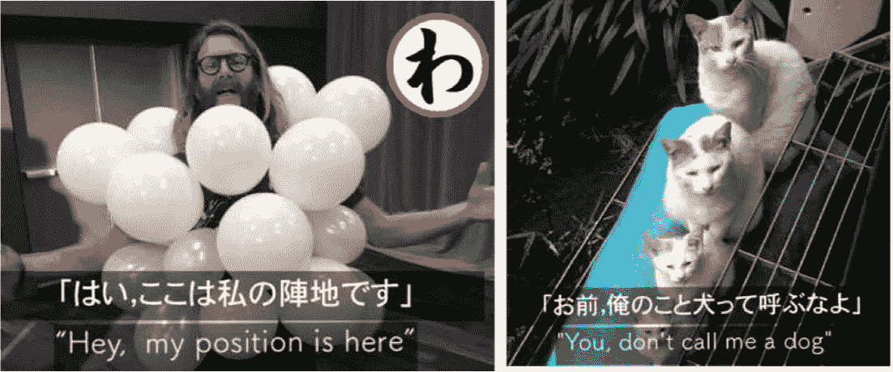
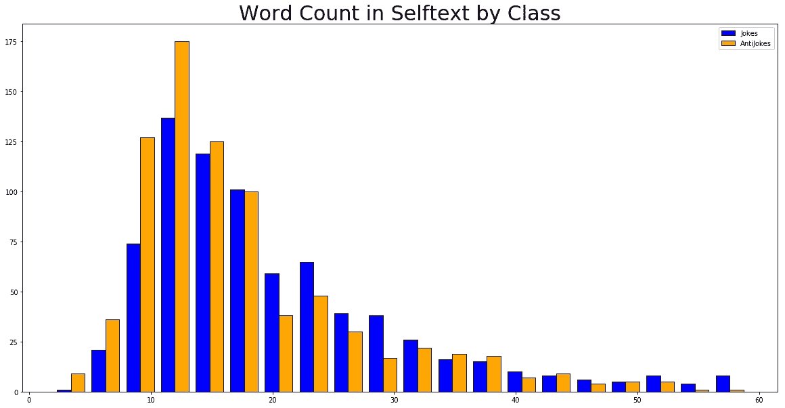
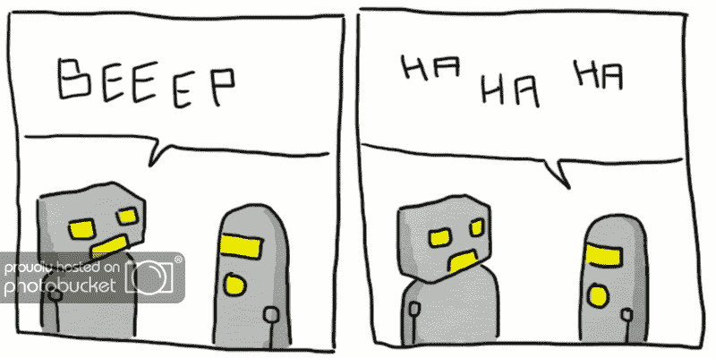

# 幽默的自然语言

> 原文：<https://medium.datadriveninvestor.com/the-nlp-of-humor-20deb591f953?source=collection_archive---------8----------------------->

Picture by [Mark Daynes](https://unsplash.com/photos/J6p8nfCEuS4?utm_source=unsplash&utm_medium=referral&utm_content=creditCopyText) on Unsplash.com

不可否认，在过去的十年里，我们在人工智能领域取得了突飞猛进的发展。顾名思义，[人工智能](https://en.wikipedia.org/wiki/Artificial_intelligence)是由机器展示的智能(相对于人类和动物展示的自然智能)。

Not real people but faces generated by AI | [Karras, Laine, Aila at Nvidia](https://arxiv.org/pdf/1812.04948.pdf)

近年来，人工智能已经成为我们智能手机和家庭的日常伴侣，[击败了国际象棋大师和顶级围棋选手](https://deepmind.com/research/alphago/)，甚至[想象出了自己的人脸](https://arxiv.org/pdf/1812.04948.pdf)！

人工智能的所有这些进步让我们想知道极限是什么(或者是否有极限！).难怪许多人对这种发展速度感到震惊，甚至害怕，特别是在模仿人类行为和“战胜”人类智力方面。你可能对图灵测试很熟悉，这是一种测试机器是否可以显示与人类行为没有区别的行为。在 2018 年 I/O 大会上，谷歌展示了其名为 [Duplex](https://ai.googleblog.com/2018/05/duplex-ai-system-for-natural-conversation.html) 的新数字助理，其唯一目的是代表一个人打电话(安排约会、预订或其他日常任务)。换句话说，Duplex 的目的是*模仿人类行为，这样人类就无法轻易地将其与真人*区分开来。我们是否越来越近(或者我们已经到达？)到一个 AI 可以被误认为真人的世界？

Duplex making a reservation in a male voice

进入幽默。我们知道，人类有一种觉得事情好笑的感觉，这本身就是一件好笑的事情。为什么我们会嘲笑我们所做的事情？为什么我们会在幽默中找到快乐？尽管看起来很简单，但真正的答案要复杂得多。此外，最难理解的幽默之一(我认为也很难品味)是讽刺。通过声音的细微变化或对一个词的细微强调，一个陈述的意义可以完全改变。不管是哪一种，幽默实际上是相当复杂的。问题是，计算机能理解幽默吗？

AI-generated “humorous” captions from the “Neural Joking Machine” | [Yoshida et al](https://arxiv.org/pdf/1805.11850.pdf)

我的 [大会数据科学沉浸式项目的第三个项目](https://github.com/rbkim1990/reddit-nlp-project)是研究自然语言处理(NLP)和幽默的概念。作为一个快速概述，自然语言处理是计算机科学、数据科学和人工智能的一个子领域，涉及计算机和自然(或人类)语言之间的交互。计算机究竟是如何理解和分析文本、电子邮件或语音信息的？这就是 NLP 关心的问题。

在我的项目中，我分析了两个子编辑(来自流行的讨论板【www.reddit.com[】](http://www.reddit.com)))来开发一个机器学习程序，该程序可以分类一个帖子是来自一个子编辑还是来自另一个子编辑。在我的项目中，我决定继续这个关于计算机和幽默的想法，我选择了两个子主题/r/笑话和/r/反笑话。我的问题陈述如下:

> 使用 NLP 和分类技术，我是否可以创建一个模型，以比 50%的基线更高的准确度正确地预测帖子属于/r/anti keys 子编辑？我能在属于/r/笑话和/r/反笑话的文本中找到一些信号，让机器学习区分这两者吗？

我的项目过程从使用 Reddit API 收集数据开始，一直到使用随机森林和 Boosting 算法来创建分类模型，以预测帖子是否来自子编辑之一。这里是该项目的一个快速概述。

**收集数据:**使用 Reddit API，我能够从每个 subreddit 收集大约 5000 个帖子。我不得不对检索到的帖子做一些小的清理。我结合了每个帖子的标题和帖子的内容。

**探索性数据分析:**我使用自然语言处理技术(计数向量化、术语-频率-逆-文档-频率)分析数据。查看最常出现的单词和文章分类之间的相关性。查看每个子编辑中最常见的单词，并删除增加噪音的常见单词。查看了两个子主题的情感分析。

Analysis: Do posts from a certain subreddit have more words than posts from another?

**潜在语义分析:**应用潜在语义分析，查看哪些单词彼此具有高交互，以及具有降维的好处。

**建模:**使用随机森林和梯度推进来创建分类模型，以预测帖子的子主题。达到了大约 65%的最终准确率。

65%的准确率比仅仅猜测一篇文章属于两个子条目中的哪一个要好，但也好不到哪里去。虽然分数告诉我可能有一些信号区分这两者，但这也意味着有一个强有力的指标存在于当前自然语言处理能力的范围之外。

我的结论也可能是人工智能的最后一个前沿:计算机没有能力理解幽默的细微差别(至少现在没有)。这是为什么呢？根据[关于神经开玩笑机器](https://arxiv.org/pdf/1805.11850.pdf)的文章，“笑是一种特殊的高阶功能，只有人类才拥有”。在[大卫 o .写的一篇关于人工智能和幽默的文章](https://medium.com/@davidolarinoye/will-ai-ever-be-able-to-make-a-joke-808a656b53a6)中，他说:

> 可能会有专门为笑话而建造的机器人或人工智能系统，但它们对其他事情将毫无用处。这是因为讲一个新鲜的随机笑话需要智慧的不完美。

Ha! | [http://crashsuit.tumblr.com/post/15816848902/robot-jokes](http://crashsuit.tumblr.com/post/15816848902/robot-jokes)

也许我们距离人工智能生成幽默还有几年，如果不是几十年的话，更不用说人工智能理解幽默了。如果幽默真的是我们人类独有的一个方面，也许我们永远也到不了那一步。也许这才是真正的图灵测试，AI 是否能理解并产生幽默。