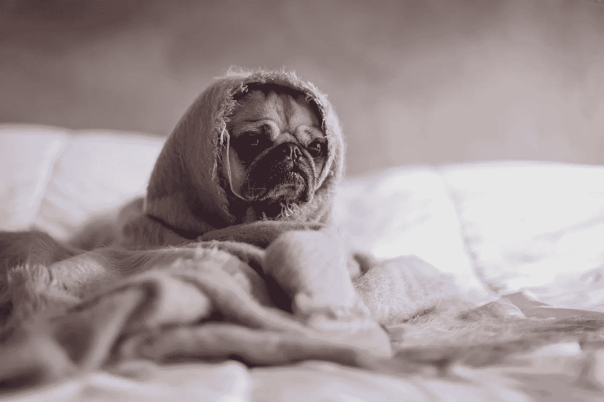
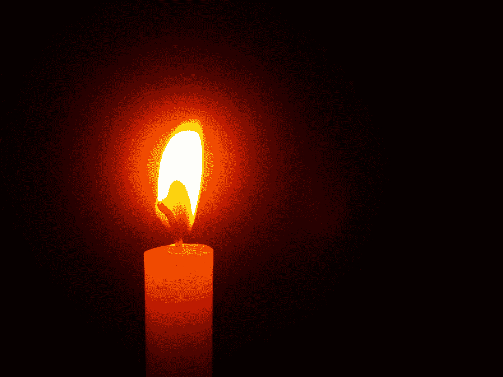
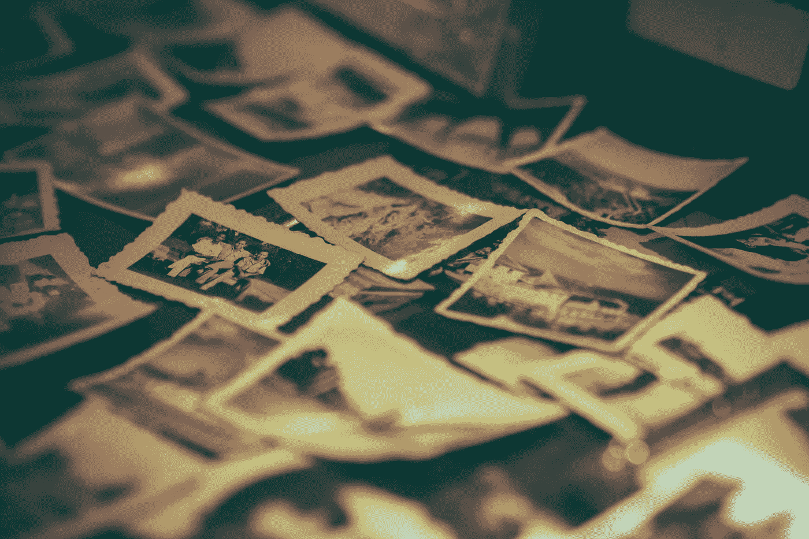
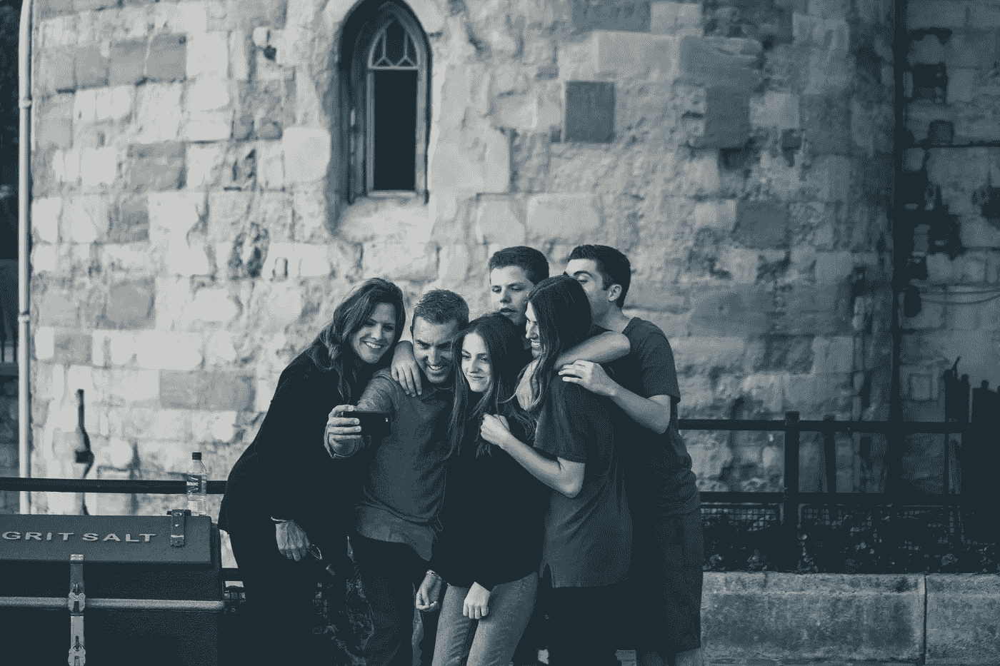
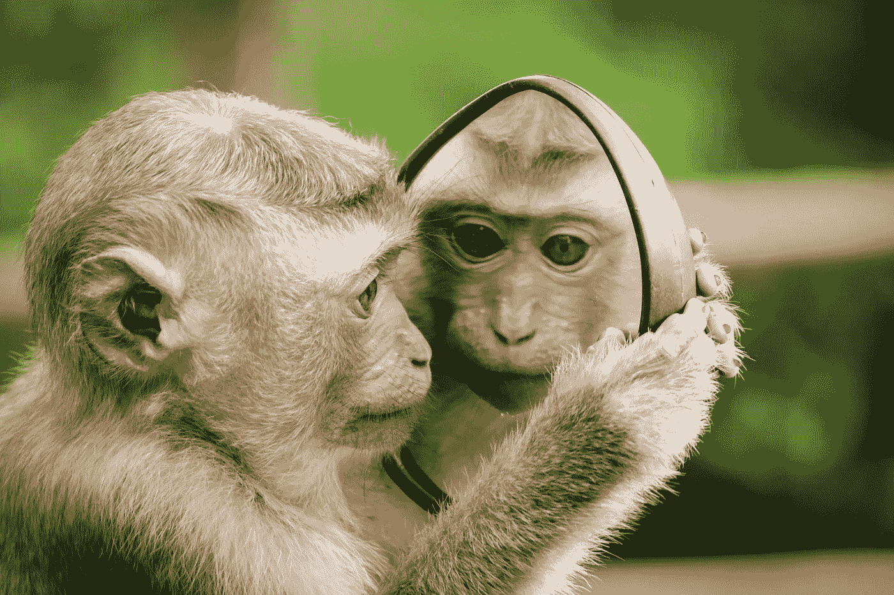
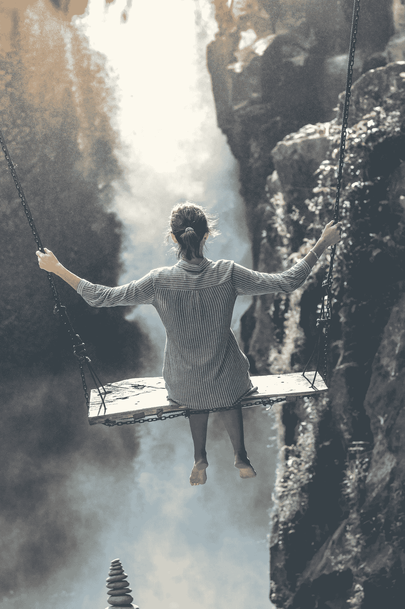
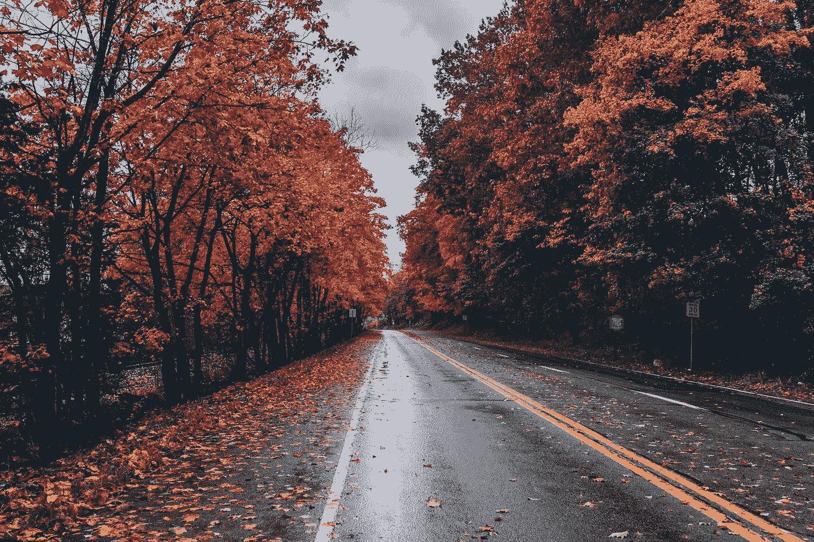

# 怀旧陷阱

> 原文：<https://medium.datadriveninvestor.com/the-nostalgia-trap-d6aa0783b1bb?source=collection_archive---------9----------------------->

## 我们生活在一个前所未有的时代

[Source: Pexels](https://www.pexels.com/photo/person-with-body-painting-1209843/)

*哈利！*

*这将是一封很长的电子邮件。它将有一个情节，上升的行动，冲突，和所有的好东西。希望你喜欢……*

这是我最好的朋友四年前写给我的一封(很长)信的开头。我在非洲的喀麦隆留学，凯文回到了我们在康涅狄格州的大学校园。

[Source: Pexels](https://www.pexels.com/photo/ball-shaped-blur-close-up-focus-346885/)

这封信简单而怀旧；他写到了过时的迷恋，他咖啡店里坏掉的浓缩咖啡机。比如:*你回来后一定要看看我的房间。我肯定你会喜欢的。我有一个叫雷吉的小肉质植物。他是个快乐的人。*

但是，我读得越久，就越觉得不自然。我在阅读关于进入酒吧未成年，可爱的女孩，期中考试和无伴奏合唱戏剧从成人的外来景观。简单的细节在我的胃里留下痛苦。这是完全坦率的，真实的。然而，从这里看，它描绘的画面是如此的陌生。

读它导致一种沉重的孤独感。

过去的我，我们，已经不在了。虽然凯文和我仍然是好朋友，当然四年已经在很多方面改变了我们。面对存在主义的恐惧，我开始怀疑自己目前是否走在正确的道路上。我想知道当我们住在对门的时候，我和凯文的关系是不是更好。我倒在沙发上，手里拿着一杯葡萄酒，打开朱利安·贝克的音乐，沉浸在自我怀疑中。

[Source: Pexels](https://www.pexels.com/photo/close-up-photography-of-fawn-pug-covered-with-brown-cloth-374898/)

然后，我意识到:这个反应，不可能是对的。我决定找出原因。打开电脑，我试图找到怀旧不好的科学证据。

# 发现 1:怀旧还不错。

达格。

事实证明，怀旧对我们来说是件好事。[根据一篇文章](https://www.bustle.com/p/7-ways-nostalgia-changes-your-brain-according-to-science-12062453)，它可以增加我们对未来的适应力和积极性，并增强我们的自尊。在一定程度上，怀旧可以引起温暖和舒适的感觉。

[Source: Pexels](https://www.pexels.com/photo/collection-of-gray-scale-photos-699782/)

所以，让我感觉糟糕的不是怀旧本身。是因为我使用它的方式吗？我对心理学的热爱让我陷入了理论的陷阱。很快，我以罪魁祸首的身份寻求社会比较；这里肯定有一些有趣的东西…

1954 年，心理学家利昂·费斯汀格提出了[社会比较理论](https://www.psychologytoday.com/us/basics/social-comparison-theory)。费斯汀格假设，我们与周围的人进行比较，试图评价自己。社会比较可能有进化上的好处，因为它帮助我们感知风险，保护自己免受威胁。

社会比较是自然的，但它是我们在过去一百万年进化中的普遍需要。当然，在我们狩猎采集的时代，社会比较是有帮助的，那时我需要认识到一个部落成员比我大得多。我不想为几个浆果打架，伙计们。

然而，仅上个世纪就带领我们穿越了我们的祖先无法想象的帝国。对于过去的一百年，从蒸汽机到 iPhones，我们该说些什么呢？在这个新的全球背景下，我们如何相互联系？

[Source: Pexels](https://www.pexels.com/photo/collection-of-gray-scale-photos-699782/)

# 发现 2:社会比较在现代世界是不同的

如今，攀比的冲动可能会，嗯，变得肆无忌惮；它不仅发生在我们和我们的亲密朋友和家人之间，还发生在我们和 Instagram 影响者、名人，甚至我们认识的每个人之间，如果我们参与的话。我们从未被如此多的人平易近人地包围着，与他们进行比较。

随着我们越来越习惯这种新的联系方式，我们很快发现这并不健康:有证据表明社交媒体比较与抑郁和沉思以及其他副作用有关。

[Source: Pexels](https://www.pexels.com/photo/apple-applications-apps-cell-phone-607812/)

我们知道我们不应该把自己和 Instagram 的影响者相提并论，但是有一个更明显的威胁潜伏在网上。

**我们比以往任何时候都更能与过去的自我进行比较。**

这就是我们，或者说，曾经是。但这不是现实:所表现的是一个半壳，掩盖了过去的深刻细微差别。今天的技术允许并鼓励我们在网上创造一个几乎作为实体存在的自我。就像名人影响者一样，我们正在发布我们最新和最棒的照片，而不是我们今天忘记带走的垃圾的照片(讽刺的是，我写了没有带走垃圾的照片。蠢…蠢…)

[Source: Pexels](https://www.pexels.com/photo/selfie-family-generation-father-9746/)

也许我们会在脸书上发布一个状态，或者在 Instagram 上发布一张照片。除了少数幸运和神经质的人，我们的收件箱每天都在积累。我的邮箱里装满了我高中以来的所有邮件。我不知道你怎么想，但我真的不需要从大二开始就去偶然发现每一首情诗。尽管如此，保存这些东西并不是一个很好的选择。

在线时，一切都自动*保存。*

但这并不意味着保存的数据比我们劣质的记忆更准确。

*这就是不自然的*。科技让我们可以将自己与过去和现在的自我(以及他人的整个世界)的美化的、看似完整的二维版本*进行比较。*

[Source: Pexels](https://www.pexels.com/photo/closeup-photo-of-primate-1207875/)

*终于*，我给自己找到了一些证据。根据《今日心理学》的报道，我们可以通过自我比较来[做出苛刻的](https://www.psychologytoday.com/us/blog/philosophy-stirred-not-shaken/201804/comparing-your-present-self-your-past-self)自我评价。此外，《赫芬顿邮报》写道:

> 我们将目前的状况与我们最成功的时候进行比较。我保证你知道自己处于最佳状态的确切时间。你和抓不到的鱼约会的那年。你拥有最令人羡慕的工作的时代。
> 
> 这些时间点作为我们当前决策的隐形但深度侵入的调节器。它们是我们衡量下一步是否稳妥的晴雨表。

你过去的自己并不完美。她充满了担忧，存在的焦虑(只有我，还是……？)和粗活杂事。但是 2D 的版本说了一些不同的东西。这引发了一种消极的关系，这种关系对未来的自己撒谎并给自己施加压力。变得更好，更成功，更积极，更漂亮…

更加过滤。

## 这种关系不一定是消极的

在《T4:记忆的艺术》中，我了解到一切都归结于专注。在反思过去的自己时，文章这样说:

> 那些把每一次美好经历都视为永久充实的人更有可能获得情绪提升。但是一个主要关注过去和现在的对比的人，会带着这样的态度诅咒每一次好的经历，那就是未来没有任何事情可以辜负它。

这也是我看了朋友的信后心情不好的原因:**我的视角错了。我现在专注于我生活中缺失的部分，从出国到凯文有一个小多汁植物告诉我。**

[Source: Pexels](https://www.pexels.com/photo/ball-shaped-blur-close-up-focus-346885/)

过去的海莉生来就不完美。她似乎没有任何紧迫的情感包袱(那些日子确实背负着这些包袱)，也没有今天的，当然感觉紧迫。她生活在一个被书写、编辑和创造的世界里。

读这封信似乎是超现实的，因为它是:我读它产生了事实和幻想的混合。在最好的情况下，这封信是一件艺术品；它代表主题，但绝不代表有形的现实。

# 外卖:21 世纪的怀旧情结

从现在开始，我们可以在日常生活中做一些事情。

**首先**，我们可以*贴*意图:挑战自己真实。偶尔发一张模糊的自拍照，或者一张简单反映你当下所处位置的图片。

**下一个**，当你可以的时候，*有目的地保存*:我个人认为让你的记忆改变和消退是很自然的——这是我们如何进化到有序和理解我们复杂的记忆。保存一些你朋友的来信，但是删除你的电子邮件或者任何你不需要偶然发现的邮件。这将需要一些有意识的意志力，因为这么多是自动保存的。

[Source: Pexels](https://www.pexels.com/photo/pile-of-covered-books-159751/)

**最后**，试着*也有目的地反映*:记得当你回卷照片时，要把一只手放在现实的轮子上。没有任何纪念品能准确地代表过去。怀旧是美妙的，当它被大量消耗时，你会对你曾经去过的地方产生积极的感觉。

在一天结束的时候，我很感激能够改变、成长和体验新事物。我也可以为我已经经历过的时代感到高兴，但是是从脚踏实地的角度。也许我会试着用心再读一遍那封信。

[Source: Pexels](https://www.pexels.com/photo/wide-angle-photo-of-road-1563355/)

愉快的反思，伙计们。具有讽刺意味的是，变化是我们生活中唯一不变的事情之一。我们不妨拥抱它！