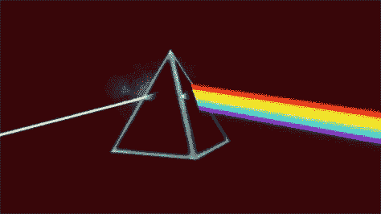
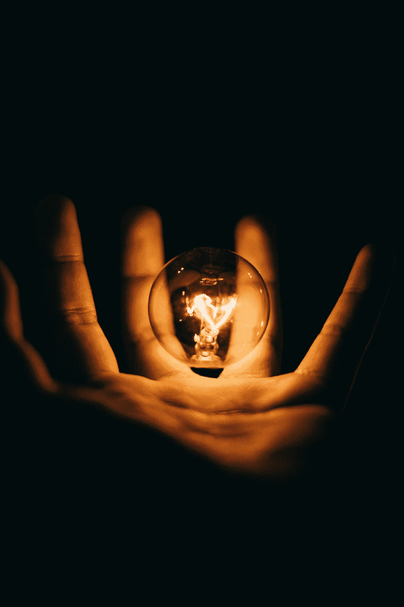
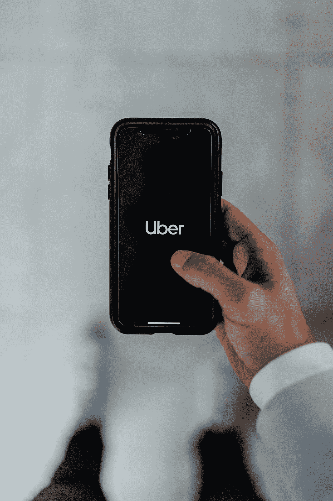
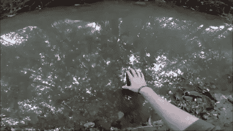
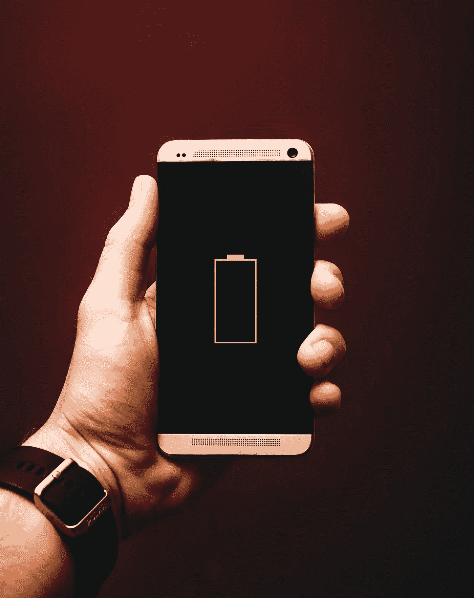

# 欧米伽能量理论

> 原文：<https://medium.datadriveninvestor.com/the-omega-energy-theory-86484ab71b2?source=collection_archive---------5----------------------->

*关于生物能微调的一些未来思维*

Photo by [Yoal Desurmont](https://unsplash.com/@yoal_des?utm_source=unsplash&utm_medium=referral&utm_content=creditCopyText) on [Unsplash](https://unsplash.com/search/photos/scifi?utm_source=unsplash&utm_medium=referral&utm_content=creditCopyText)

想象一个你可以随意改变眼睛颜色的世界。

用俯卧撑或慢跑给手机充电。

我相信我们正处于这样一个世界的黎明。

 [## 忘记石油吧，水是未来。数据驱动的投资者

### 我们不会耗尽燃料的替代品。能源行业曾经是投资者的荣耀，无论…

www.datadriveninvestor.com](https://www.datadriveninvestor.com/2018/11/14/forget-about-oil-water-is-the-future/) 

量子物理学为我们指明了方向。

我们只需要最后一个发现，就能把人类带到存在的下一个层次。

这一发现是对生物能控制的更深理解。

但是首先，我们必须学会如何提取重要的能量，然后如何按照我们的愿望重新调整能量的流向。

# 我对能量的定义

如果我谈到能量，我指的是身体和精神上的力量。

以下是一些基本的能量物理学原理:

*   能量在宇宙中是不变的，不能被毁灭，只能被转化
*   能量和物质是同一“物质”或事物的两种形式。
*   能量转换的其余产物是热
*   根据热力学，热不能转化为其他形式的能量。

此外，我同意意识是物理宇宙的基础，正如量子物理学中的[观察者效应](https://en.wikipedia.org/wiki/Observer_effect_(physics))所解释的那样。

# 对知识的探索

科学仍然没有回答四个问题。

1.  什么是能量？
2.  收集和储存能量时会发生什么？
3.  人类是如何将能量转化为物质的？
4.  能量是如何以各种状态转化的？

到目前为止，科学仍然不能对这些问题给出完全全面或结论性的答案。

因此，在我们谈论我的基本能量概念之前，我们必须谈谈人类历史上的发展。

# 历史第一

Photo by [Jason Briscoe](https://unsplash.com/@jbriscoe?utm_source=unsplash&utm_medium=referral&utm_content=creditCopyText) on [Unsplash](https://unsplash.com/search/photos/steam-engine?utm_source=unsplash&utm_medium=referral&utm_content=creditCopyText)

看看我们所有的集体成就；他们通过优化我们使用日常能量的方式来释放时间。

在我看来，人类进化的红线是伴随着对能量更好理解的意识发展过程。

在农业革命中，人类从猎人和采集者的生活方式转变为以农村社区为基础的生活方式。我们可以专注于人类对生活本身的体验，而不是 24/7 都忙于生存。

在基础设施革命期间，我们从部落主义跳到了集体社会。道路和车辆让我们减少了运输时间，这启动了商人的商业世界和全球知识的库存。

科学革命转移了我们对伪科学的宝贵关注，这样我们就可以专注于手头的事情，如医学研究、哲学、心理学和物理学。

在工业革命中，机器允许重新定义工作与生活的平衡。作为一个社会，我们最终可以提出并挑战我们的政府所依赖的资本主义和民族主义的原则。

上一次重大革命，互联网开启了全球通信。人文视角从国家视角转向全球视角。

未来的革命可能是人工智能、基因工程或太空采矿。

只有时间能证明一切。

所有这些历史革命增加了人类整体能量的振动。

换句话说，我们已经学会弯曲我们的内在能量和我们周围环境中的能量。

# 识别问题

物理学家如何用具体的术语将能量概念化？

根据爱因斯坦的理论，能量和物质是一枚硬币的两面。

物质和能量的面具后面是什么？

或者你如何看待变形人的原始形态，比如哈利波特系列中的[博格特](https://harrypotter.fandom.com/wiki/Boggart)？

据我所知，一个接近的概念是禅宗的[公案](https://en.wikipedia.org/wiki/Kōan)。

> 公案是在[禅](https://en.wikipedia.org/wiki/Zen)练习中使用的一种说法，用来激起“极大的怀疑”并练习或测试学生在禅方面的进步。

一个著名的精神公案是，空间是空的，空就是空间，这是很难把握你周围的思想。

[source](https://giphy.com/gifs/circle-draw-oeX33b4yXJVHG)

如果你拿一张白纸画一个圈。你在环内创造了空间，但它是空的。因此，圆圈内的空与空间内的环境形成了一个特定的区域。

Negative space can also create shapes. [Source](https://www.artinstructionblog.com/an-introduction-to-negative-drawing-with-mike-sibley)

如果你拿一张白纸，通过将一些部分涂成深色来破坏整个页面的空白。你创造了一个椅子或杯子形式的白色真空。这些白色的形状通过周围黑暗空间的对比而存在。

因此空间=空。

# 一些替代理论

根据观察者效应，物理学同样与假定的现实二元性作斗争。

观察者效应和薛定谔猫心实验表明，在量子水平上，现实是不稳定的，根据观察者的状态，实验会得出某种结果。

例如，在一些实验中，光表现得像一个粒子，而另一些则像一根弦。

对任何物理学家来说都是真正的噩梦。

因此，一些聪明的头脑想出了一些其他的方法来解释这个现实的双重性。

[弦理论](https://www.youtube.com/watch?v=Da-2h2B4faU)提出我们都是初始频率的偏差。

通俗地说，大爆炸开启了一首交响乐，而我们只是宇宙之歌中的一个低音。

或者[全息理论](https://www.youtube.com/watch?v=FYnb2GvCEWw&list=PLYRAmtDzQomhXkwbXgVoZPN4HjopE2j8m&index=1)提出在我们的现实基础上有一个非常先进的量子计算机，它把我们对物质和能量的经验投射到这个现实中。

它就像一个棱镜，将我们在物理视角中感知的所有颜色的纯光弯曲。

[source](https://tenor.com/view/pink-floyd-prism-dark-side-of-the-moon-gif-8974839)

# 我与能源的关系

根据我的经验，我给了能量一些属性:

*   能量是可塑的。
*   能量是可以储存的。
*   能量无法不振动。
*   意识用焦点控制能量。
*   意图先于任何能量的使用。
*   体能是有极限的。
*   只有信念通过扭曲现实来限制精神能量。

如果这些都是真的，你可以说人类对能量有相当好的控制。

我们可以根据自己的意愿重塑自己的思维、身体和环境。

# 微调能量控制

作为物种，我们在能量传递方面取得了重大的飞跃，就像在通信方面，我们有全球新闻、金融系统和约会应用程序。

此外，我们优化了农业和饮食，以改善食物向生物能源的转化。

此外，我们可以通过斯多葛派、佛教和瑜伽等哲学传统重塑我们对世界的精神感知。

我们创造了如此多的体育锻炼、实践和运动来改善身体的消化和能量储存。

如果我们能控制这么多不同形式的能量，为什么我们不能控制基本层次的能量？

# 欧米茄能量

Photo by [Rohan Makhecha](https://unsplash.com/@rohanmakhecha?utm_source=unsplash&utm_medium=referral&utm_content=creditCopyText) on [Unsplash](https://unsplash.com/search/photos/electricity?utm_source=unsplash&utm_medium=referral&utm_content=creditCopyText)

按照我的想法，有一种东西叫做欧米伽能量或者基础能量。

正是这种东西改变形状，形成物质或能量。

就像干细胞一样，它可以在那一刻变成任何它需要的样子。

而不是只专注于能量的症状，如动力，电磁相互作用，生物能，重力，弱力和强力。

**我们应该关注核心。**

我希望我们作为物种将变得更加意识到仍然通过宇宙散发的原始的、重要的、基本的能量。

在量子物理学中，物理学家称之为[零点能量场](https://www.youtube.com/watch?v=iTG6XVM8ATg)，或者宗教和精神实践称之为‘上帝’

如果我们能够进入这个领域，能量，生命能量，我们将会把人类的进化带到一个新的水平。

# 德乌斯人

生物能控制并不意味着我们仅仅通过思考就可以开始建造行星。

或者获得精神控制，飞行或任何其他神秘力量。

我们不会成为神。

它只是意味着，例如，当你被一个小伤口弄伤时。你可以把你的生物能量重新集中在这个小伤口上。

可能愈合得更快或更有效。

因此，你正在控制体内生命能量的分布。

# 便利

Photo by [Austin Distel](https://unsplash.com/@austindistel?utm_source=unsplash&utm_medium=referral&utm_content=creditCopyText) on [Unsplash](https://unsplash.com/search/photos/uber?utm_source=unsplash&utm_medium=referral&utm_content=creditCopyText)

你还记得在优步出现之前就打车了吗？

你会挥挥手，希望有司机来接你。

或者在国外度假，你就必须协商价格。

这是我最好的选择可怕的。

所以当一个聪明人想到优步的时候。

像许多改变模式的转型企业一样，投资者也很谨慎。

但是人们很兴奋。

现在带着这个跳跃的信念和我一起探索生物能控制的可能性。

# 生物能控制

意味着你可以随心所欲地驾驭和转化生物能。

[source](https://www.youtube.com/watch?v=WItKQFGlpVo)

以下是一些潜在的应用

*   调整你身体的振动，在水中产生涟漪。
*   转化多余的能量，比如补充大脑中的脂肪。
*   将你的生物能量集中在身体的特定部位，让它更快地清除毒素或给它额外的氧气。

# 生物能源电池

Photo by [Alexander Andrews](https://unsplash.com/@alex_andrews?utm_source=unsplash&utm_medium=referral&utm_content=creditCopyText) on [Unsplash](https://unsplash.com/search/photos/battery?utm_source=unsplash&utm_medium=referral&utm_content=creditCopyText)

如果你能在电池中收集这样的欧米伽能量。

然后你可以通过将物理能量转化为欧米伽能量来给你的手机充电。

在采纳者的帮助下，你可以给你的电子设备充电。

可能每个人都会保留这样的电池以备不时之需。

例如，当你感到饥饿，没有时间去超市时，你将欧米伽能量转化为生物能。

或者在军队中，当他们营救人质时，不是给他们肾上腺素，而是给他们恢复性的生物能量。

# 精神护理

如果像阿尔法、伽马等精神状态。脑电波是能量的一种形式。

那么抑郁，一个人感觉被世界榨干，只是我们波长的偏差。

也许我们在未来的生物能源捐赠诊所。

像我这样的人可以摆脱多余的精力，把它给那些没有动力的人。

也许未来的可口可乐是罐装的激励能量？

# 结论

虽然我们在能源控制的发展上取得了重大的飞跃，但我们仍然不了解能源的基本原理。

据我所知，我们正处于一个新世界的黎明，在这个新世界里，我们都能够随心所欲地转化生物能源。

注:这篇博客包含了我个人对能源的看法。我不是学物理的，也不是物理学家。本文谈生物能控制的发展

*这篇博文是 30 天博客挑战的第 9 篇。*