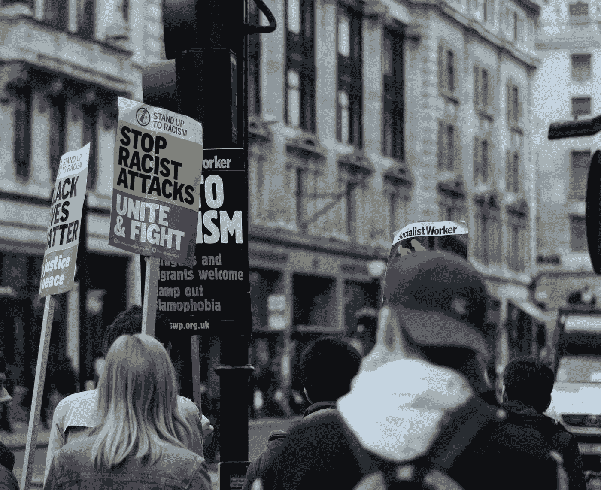

# 行动主义的机会成本

> 原文：<https://medium.datadriveninvestor.com/the-opportunity-cost-of-activism-1bd450fc6f91?source=collection_archive---------16----------------------->

Photo by [Henry Be](https://unsplash.com/@henry_be?utm_source=medium&utm_medium=referral) on [Unsplash](https://unsplash.com?utm_source=medium&utm_medium=referral)

我们被告知，你们的世界正处于崩溃的边缘。有一个气候危机，一个种族主义总统，一个每个男人内心的掠夺者！街上有游行，有以这种或那种方式动摇人们的运动，有人疯狂地敲击键盘，写下愤怒的推特回应。但是，如果所有这些行动主义实际上没有任何用处，或者更糟，如果它实际上对它试图解决的问题产生了负面影响，那该怎么办？

> 人们看起来很好，我没有时间做大量的研究，我会信任他们。

现在比以往任何时候都更容易找到落后的理由。每天都有像我一样的网络用户发布堆积如山的内容，这些内容可能会成为一些激进变革的催化剂。阳光下的每一种意识形态都潜伏在网上的某个地方，等着用平等或纯洁或个人奖励的诱人信息诱惑路人。

此外，我们生活在一个信息丰富、注意力贫乏的世界。我们比人类历史上任何时候都有更大的潜力，然而我们做任何事情的时间却越来越少。我们给一个触动我们心弦的帖子一个赞，然后快速前进，自我满足。发布该图片的页面将会欣赏其季度参与度的上升。

 [## 为什么包容性财富指数比 GDP 更能衡量社会进步？|数据驱动…

### 你不需要成为一个经济奇才或金融大师就能知道 GDP 的定义。即使你从未拿过 ECON 奖…

www.datadriveninvestor.com](https://www.datadriveninvestor.com/2019/03/08/why-inclusive-wealth-index-is-a-better-measure-of-societal-progress-than-gdp/) 

因此，那些足以激励人们走上街头的东西是精华。它们是关于我们这个世界的最引人注目的叙述，迷因已经深深扎根于成千上万人的心中。然而，即使有这些，当我们为一个目标前进时，我们认为我们为之奋斗的东西并不总是正确的。

即使是最激励人心的原因，我们也常常不会超越我们立即被告知的事情。一句话的口号铭记在我们心中。明亮的颜色。我们模糊地认同这个运动，我们想，为什么不去帮助他们。人们看起来很好，我没有时间做大量的研究，我会信任他们。

不幸的是，这种信任经常被那些寻求真理的人背叛。当我们发现我们支持的抗议活动的领导者持有与我们相反的价值观时，我们明白我们被耍了。当我们意识到我们的时间和努力被浪费在我们不相信的事情上时，我们花在行动主义上的时间变成了苦涩的灰烬。

> 告诉其他人回收很容易，但在我们自己的生活中筛选塑料、纸张和玻璃却很难。

肤浅的激进主义盛行。除了一个吸引人的口号之外，没有时间或欲望去关注更远的人的行动主义。只追求政治目的的激进主义，不关心这个事业是否会有积极的，甚至是想要的效果。激进主义消耗年轻人的灵魂、精力和质疑精神，并引导他们追求有问题的、只顾自己的目标。

像我这样的年轻人，最容易被激进主义冲昏头脑。我们仍然在决定我们如何看待生活中最重要的问题。我们在现实世界中可能还没有什么经验。我们充满活力、理想主义和激情。我们也懒惰、不确定，在一个为不同时代构建的世界中，我们面临着一场艰苦的战斗。

然而，作为年轻人，我们大有希望把世界变得更好。有如此多的潜力去实现有意义的、持久的改变，然而我们却把时间花在了人类失败的战斗上。如果我们不把时间花在推特上战斗，有多少疾病可以被根除？开发了多少革命性的技术？养活了多少饥饿的人口？

然而，行动的方式是困难的。大喊大叫直到其他人改变他们正在做的事情并倾听是容易的，但是我们自己采取行动是困难的。告诉其他人回收比筛选我们生活中的塑料、纸张和玻璃更难。

这是问题的核心，也是肤浅的现代激进主义的主要缺陷。当我们花时间告诉别人该做什么时，我们忘记了采取行动，直接让我们自己和我们周围的环境变得更好。我们把精力花在只会提高我们的自我和自以为是感的事情上。

当我们决定把时间花在自我手淫上，而不是真正做出积极的改变时，这个世界会有很大的机会成本。

Photo by [Clem Onojeghuo](https://unsplash.com/@clemono2?utm_source=medium&utm_medium=referral) on [Unsplash](https://unsplash.com?utm_source=medium&utm_medium=referral)

把那些希望我支持他们新事业的人的吵闹声排除在外，我在工作的困难中发现了巨大的意义。志愿给残疾儿童一个假期，建立一个企业来改善年轻人的福利教育，在 Medium 上整理我的想法，希望它们可能在某个时候对某人有用。

在一个充满意图的世界里，行动仍然是唯一能产生有意义结果的东西。如果我们不把时间和精力花在按照别人的计划改变世界上，而是采取行动来改善我们自己和我们周围的人，这个世界将会是一个非常不同的地方。

与其游行抗议，试图让别人为你做这件事，为什么不去当地的无家可归者收容所做志愿者呢？你的行动将直接改善那些最需要帮助的人。你将真正改变人们的生活，而不是简单地为一些抽象的理想而奋斗，这些理想让你模糊地感觉自己做了一些有意义的事情。

我发现采取困难的行动并致力于解决我所关心的问题会有无限的回报。

这并不是说所有的激进主义都是不好的，也不是说它没有价值。事实上，行动主义对于让精英承担责任、改变公众对重要问题的看法以及为更广泛的受众带来新思想至关重要。但是对大多数人来说，激进主义是一种干扰。它让你无法解决生活中最重要的问题，也无法产生你想要的积极影响。

> 我们不知道如果我们致力于解决我们自己的问题和我们周围的人的问题，这个世界会变得多么神奇。

当你看到热门的新趋势，下一个要追随的潮流时，问问你自己，你的时间是否会更好地花在更有成效、更切实的事情上。当一个原因突然出现在你面前时，不要采取最起码的必要行动让你觉得自己是个好人，而是看看当地是否有你可以帮忙的组织。

我们不知道如果我们致力于解决我们自己的问题和我们周围的人的问题，这个世界会变得多么神奇。如果我们不等待其他人来解决我们已经发现的许多弊病，而是采取行动来纠正那些谁知道会有什么积极结果的事情。

今天，当有人要求你支持他们的事业时，问问这是否会有真正的效果。在街上游行、把自己粘在公共交通工具上或在 Twitter 上发帖真的会对任何人产生积极的影响吗？

如果没有，尝试一些新的东西。尝试行动，而不是激进主义。

# 关于作者:

罗曼是 Merudite 的联合创始人，致力于将心理健康和自我意识教育引入数字世界，帮助年轻人建设一个有意义的未来。他是布里斯托尔期货在线课程的创新和企业导师。你可以在 [LinkedIn](https://www.linkedin.com/in/roman-bromidge-bba65b13a/?source=post_page---------------------------) 或者 [Medium](https://medium.com/@romanbromidge?source=post_page---------------------------) 上找到他。