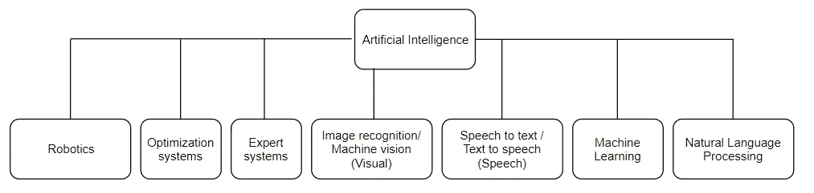

# 人工智能的起源

> 原文：<https://medium.datadriveninvestor.com/the-origin-of-artificial-intelligence-bb75340b932c?source=collection_archive---------2----------------------->

人工智能这个术语现在被抛来抛去，但是人工智能到底是什么？为了弄清楚这一点，我决定写这篇文章。

让我们来看看人工智能的基本和第一个定义。它最早是由约翰·麦卡锡在 1955 年创造的。像艾伦·图灵这样的研究人员在此之前对人工智能做了一些研究工作，但他们并没有在人工智能这个名字下特别地工作。最纯粹的定义来自他们为一个研究项目提交的提案。上面写着，

学习的每一个方面或智力的任何其他特征原则上都可以被精确地描述，以至于可以制造一台机器来模拟它。人们将试图发现如何让机器使用语言，形成抽象概念，解决现在留给人类的各种问题，并自我完善。” ( [来源](http://www-formal.stanford.edu/jmc/history/dartmouth/dartmouth.html)的定义)

基本上，人工智能是一台具有解决问题的*能力的机器，这些问题通常由人类利用自然智能来解决。如果一台计算机能够学会自我改进并解决这些问题，那么它将展示一种智能。*

 [## 挑战你对人工智能和社会的看法的 4 本书——数据驱动的投资者

### 深度学习、像人类一样思考的机器人、人工智能、神经网络——这些技术引发了…

www.datadriveninvestor.com](https://www.datadriveninvestor.com/2019/02/28/4-books-on-ai/) 

1955 年的提案定义了人工智能的 7 个方面，下面将会提到

1.  模拟人脑
2.  给机器编程，使它能使用通用语言
3.  神经元如何假设性地排列以形成概念
4.  确定和衡量问题的复杂性
5.  自我改进系统
6.  处理想法而不是事件的质量
7.  随机性和创造性

现在，如果我们回到关于智力的讨论，根据杰克·科普兰的观点，智力的一些基本因素是

*   泛化学习，使机器在以前没有遇到的情况下表现得更好
*   根据手头的情况得出结论
*   根据提供的数据解决问题
*   分析环境并做出决策
*   像人类一样，通过遵循规则来理解语言

就方法而言，有不同类型的人工智能

1.  强 AI:

强人工智能是一种与人类智能相当的智能形式。它有意识，有思想，有觉悟。强 AI 还不存在。有人说它将在 2030 年出现。它将具有人类的认知能力，并能处理单个人能处理的所有问题。

1.  弱 AI:

弱人工智能是一种局限于特定或狭窄区域的智能形式。它通过自动化冗余的耗时任务来造福人类。弱人工智能通过检测模式和进行预测，帮助将大数据转化为可用信息。

下面的图表包含了与人工智能相关的主题，并展示了不同的智能子集。我未来的一些文章将基于这些主题。

在结束本文之前，我想提到的最后一个概念是专家系统。大多数人工智能算法都是专家系统。

> 专家系统是一种在计算机中运用人类知识来解决可能需要人类干预的问题的系统。

它有助于在实际应用中使用知识数据库。这篇文章的主要内容是人工智能是如何起源的，以及智能来自许多不同方面的事实，人工智能可以有大量的应用。人工智能是新的前沿技术，可以推动每个行业的业绩以两位数的速度增长。