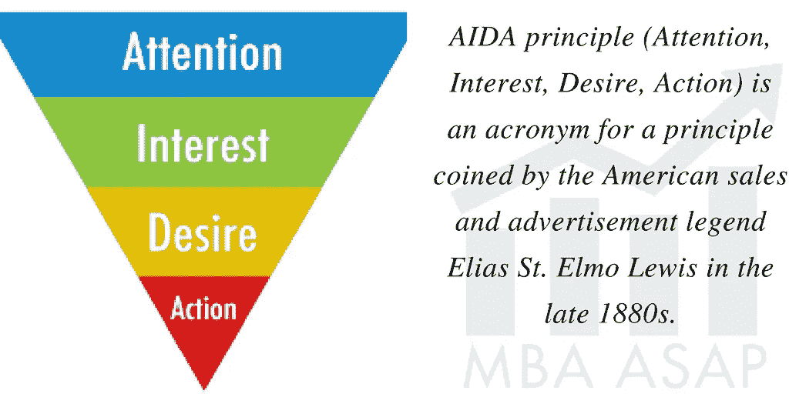
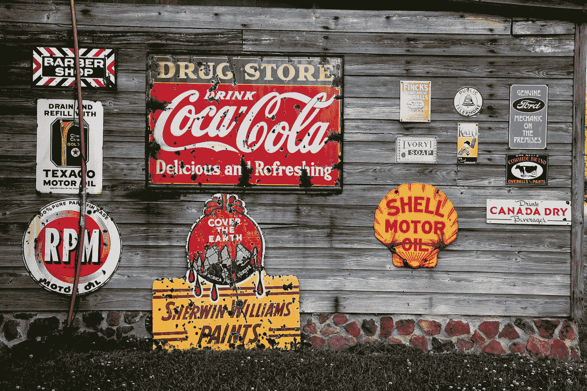

# 现代营销的起源

> 原文：<https://medium.datadriveninvestor.com/the-origins-of-modern-marketing-8728fb30e2de?source=collection_archive---------10----------------------->

## 宣传、先令香烟和西格蒙德·弗洛伊德

弗洛伊德和荣格第一次乘同一艘船去美国旅行。驶进纽约港，西格蒙德·弗洛伊德和卡尔·荣格一起站在甲板上，凝视着自由女神像和地平线。

美国知识界和那些对新兴心理学领域感兴趣的人非常期待他们的到来。欧洲关于心灵的革命性理论有许多含义。弗洛伊德转向荣格说，“他们没有意识到我们正在给他们带来瘟疫。”

“就这么做”“想法不同”

“世界上最有趣的人。”“伸出手去触摸某人。”“舔手指很好。“不管喜欢与否，广告是美国文化素养的一部分。

每年超级碗的一大看点是广告。哦，对了，他们还在广告间隙踢足球。中间有一个音乐节目，被广告包围着。

那些广告真的有用吗？历史和行为经济学的答案是肯定的。

广告不仅仅是美国的现象。奥迪的著名口号——“vor sprung durch Technik”“通过技术进步”表明，更清醒的文化依靠广告口号来传达他们的使命和激励客户。

第一次世界大战后，现代广告和公共关系在美国起飞。它始于 19 世纪晚期的阿依达概念和约翰·沃纳梅克的著名评论。

虽然许多人可能认为唐·德雷珀是美国广告影响力背后的天才，但现实生活中物质欲望的创造者是一个你很可能从未听说过的人:**爱德华·伯奈斯**。他是制造需求的最初推销员。

伯奈斯在 20 世纪 20 年代提出了现代公共关系的概念。他在 1928 年出版的《宣传》一书中整理了自己的观点。他的论点是公共关系是一种强大的精神控制技术:

> *“有意识地和明智地操纵群众的有组织的习惯和意见是民主社会的一个重要因素。操纵社会这种看不见的机制的人，构成了一个看不见的政府，这才是我们国家真正的统治力量。我们被统治，我们的思想被塑造，我们的品味被形成，我们的想法被提出，大部分是由我们从未听说过的人…是他们拉着控制公众思想的电线。”*

# **弗洛伊德的侄子**

爱德华·伯奈斯 1891 年出生于奥地利，他的父母都是西格蒙德·弗洛伊德的侄子。他的母亲安娜是弗洛伊德的妹妹。他的父亲伊利是弗洛伊德妻子的兄弟。

当爱德华只有一岁的时候，他的家人搬到了纽约。他去了康奈尔大学学习农业，但最终成为了一名记者。第一次世界大战期间，他为伍德罗·威尔逊政府工作，通过宣传美国的努力和牺牲给欧洲带来了民主的理念，帮助影响了美国的参与。

伯奈斯亲身经历了战争期间宣传是多么有效。战后，他开始研究这些技术如何在和平时期的商业活动中同样有效。这时，宣传这个词已经开始带有贬义，所以伯奈斯推广了“公共关系”这个词。一朵玫瑰，不管它叫什么名字…

他把他叔叔西格蒙德关于潜意识的心理学见解发展成一套他称之为“同意工程”的原则。他发明了“在群众不知情的情况下，按照我们的意愿控制和组织群众”的技术。为了有效地工作，信息必须吸引人，不是理性思维，而是潜意识。

这就是营销人员现在所说的情感投入。这是内容营销的关键，在内容营销中，与信息的强烈情感联系被视为购买行为的催化剂。买家当心。

伯奈斯大力推广这一策略，并与通用电气、宝洁和美国烟草公司等客户合作。

伯奈斯的竞选是传奇的。为了鼓励女性吸烟，他发起了一场运动，让时尚的年轻女性炫耀她们的“自由火炬”，以此来表明她们新获得的解放地位。

20 世纪 30 年代，他帮助推广香烟作为减肥辅助手段，以保持苗条身材。许多人仍然带着这个有益的想法开始他们一生的习惯。

他的想法是现代的，并且付诸实践非常有效。第三帝国接受了他关于宣传和公共关系的著作。

约瑟夫·戈培尔是伯奈斯思想和作品的狂热崇拜者。戈培尔是第三帝国的宣传部长。将伯奈斯的概念发挥到极致推动了他的议程。

伯奈斯是犹太人。他意识到纳粹在 1933 年使用了他的想法:

> “他们利用我的书作为对德国犹太人进行破坏性运动的基础。这让我震惊，但我知道任何人类活动都可能被用于社会目的，或者被滥用于反社会目的。”

他的思想和实践为舆论的形成提供了深刻而有力的手段。他的想法是中立的，可以用于有益或无益的目的。当我们在社交媒体活动中与他们的角色角力的时候，他的想法在今天是极其相关的。

他和他的客户的根本目的是赚钱。目标是通过让人们相信他们想要他们不需要的东西来创造和影响需求，

伯奈斯帮助创造了我们的消费文化。在我们现在生活的世界里，人为的欲望试图控制我们的购买力，去追求幸福的海市蜃楼。我们已经走了很长的路，宝贝？

