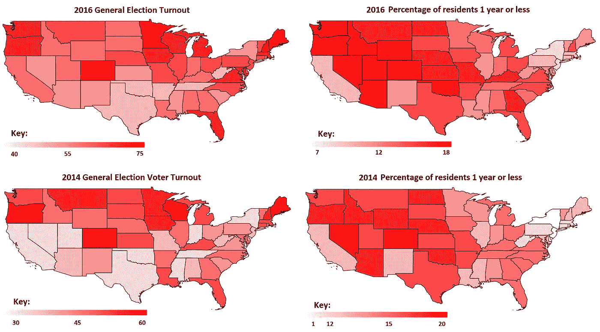
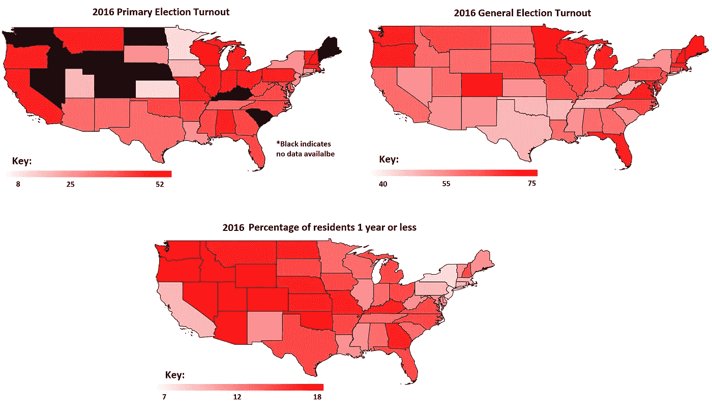
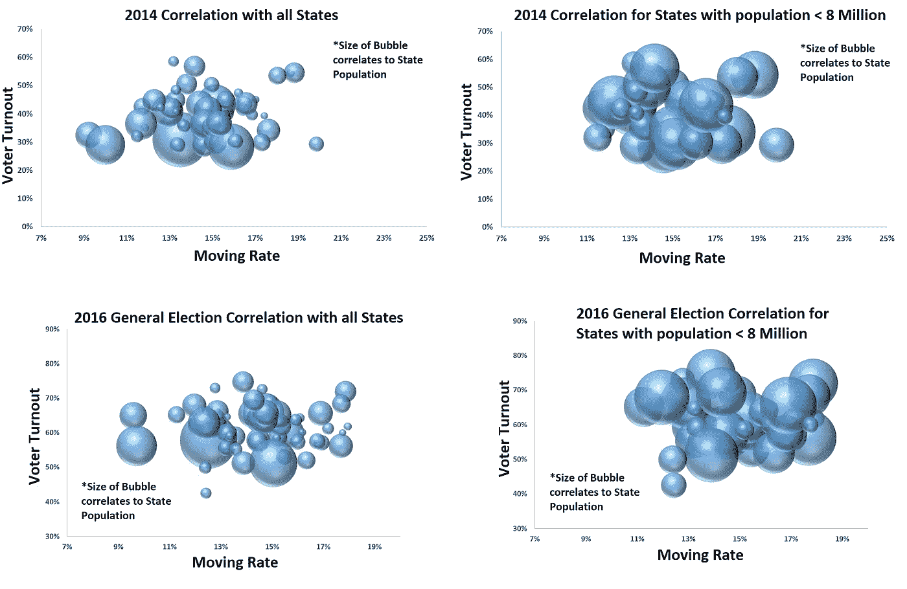
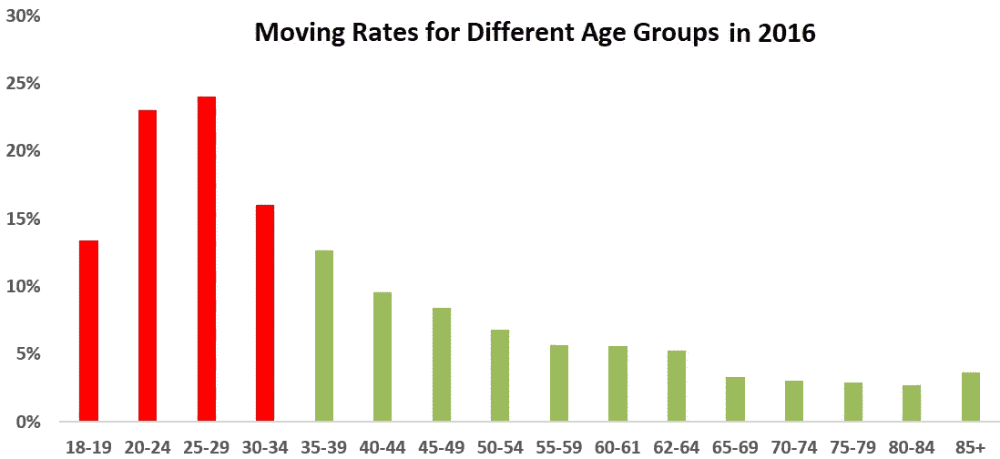
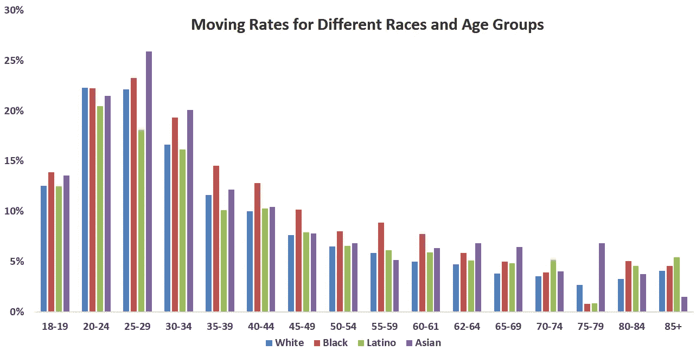

# 投票率低的部分原因是人们经常搬家

> 原文：<https://medium.datadriveninvestor.com/the-other-reason-people-might-not-be-voting-98978a44675f?source=collection_archive---------8----------------------->

注意:本文表达的观点仅是我个人的观点，并不代表我的雇主或任何其他人的观点。

随着中期选举的到来，每个人都在关注选民投票率，特别是在民主党，他们的基础在最近的选举中没有那么活跃。对投票率的关注已经转向选民登记、提前投票和人们对投票缺乏兴趣，出于各种原因关注千禧一代，无论是懒惰、对政治的幻灭、对候选人的无知等。

这些原因可能是真的，但还有另一个原因:人们，尤其是千禧一代，可能对投票不太感兴趣，这正在发生变化。美国人经常搬家，根据 T2 人口普查局的数据，美国每年大约有 4500 万人搬家。在这 4500 万人中，17%的人每年都会搬到不同的州。

那么，为什么这很重要呢？要成为另一个州或县的合格选民，你只需在该地区居住至少 10 个月。另一方面，如果你经常搬家，那么你就不太关心当地的选举，因为你觉得自己在这个系统中的地位更低了。根据来自*人口普查局*【1】【2】的移动数据和来自*【3】和*选举项目*【4】的选民数据，我们可以从中推断出一些事情:*

***搬家对中期选举的影响比总统选举更大***

**

***初选的影响比大选更大***

**

***负相关对人口较少的州更好***

**

***千禧一代比其他几代人流动更多，这可能会降低他们的投票率***

**

***不同比赛的移动率非常相似，显示出与投票率的相关性很小***

**

*从这一点来看，很明显，移动利率正在损害中期选举和千禧一代的投票率。搬家和政治不是什么新鲜事。想想为什么酒店比公寓贵得多。根据定义，去酒店的人并不住在那个地区，因此没有投票权。正因为如此，城市对酒店征收的税比对公寓和住宅征收的税要多得多，因为他们知道他们可以逃脱惩罚。换句话说，如果人们不断流动，那么他们就不太可能让代表他们利益的人掌权。*

*大选和少数族裔的低投票率与其他问题有关，但并不令人感动。初选投票率低可能与初选的类型有关。爱荷华州有党团会议，新罕布什尔州有大会。所有这些都不是你传统的投票方式，需要更多的努力和奉献。那里的投票率很低，这意味着你只能得到最狂热的支持者。*

*有时候，地方选举在国家层面上如此引人注目，以至于即使人们对那个州或县非常陌生，他们也觉得必须投票。想想 2012 年威斯康星州的斯科特·沃克或 2017 年阿拉巴马州的道格·琼斯。*

*还应注意的是，选民投票率是基于登记选民，即参加投票的登记选民的百分比。理论上，这是有道理的，然而，很多人在车管所这样的地方自动登记投票。相反，当我们看投票率时，我们应该关注总投票人口，而不仅仅是登记选民。这就带来了两个问题——如果不感兴趣的选民决定不投票，那么登记他们是没有意义的，我们应该关注选民登记而不是投票率！*

***来源:***

*1.[https://www . census . gov/data/tables/time-series/demo/geographic-mobility/state-to-state-migration . html](https://www.census.gov/data/tables/time-series/demo/geographic-mobility/state-to-state-migration.html)*

*2.[https://www . census . gov/data/tables/2017/demo/geographic-mobility/CPS-2017 . html](https://www.census.gov/data/tables/2017/demo/geographic-mobility/cps-2017.html)*

*3.[https://www.fairvote.org/voter_turnout#voter_turnout_101](https://www.fairvote.org/voter_turnout#voter_turnout_101)*

*4.[http://www . elect project . org/home/voter-turn out/voter-turn out-data](http://www.electproject.org/home/voter-turnout/voter-turnout-data)*

*5.[https://slate . com/business/2012/11/hotel-prices-why-urban-hotels-cost-so more-than-houses-or-apartments-in-the-same-city . html](https://slate.com/business/2012/11/hotel-prices-why-urban-hotels-cost-so-much-more-than-houses-or-apartments-in-the-same-city.html)*