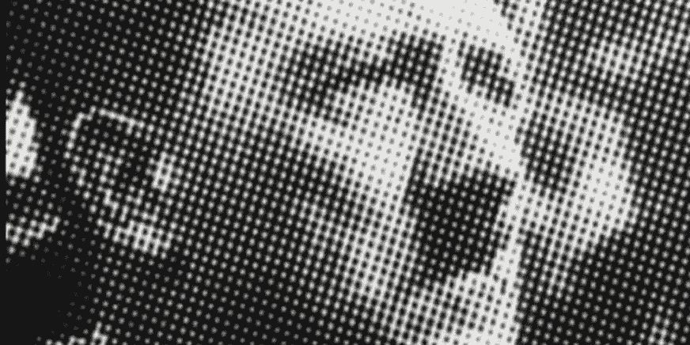

# 痛苦及其力量

> 原文：<https://medium.datadriveninvestor.com/the-pain-and-its-power-19fd5a8fa27a?source=collection_archive---------20----------------------->

伟大的发现和发明往往是偶然的结果。历史已经向我们证明了这一点。但是，这个“机会”不仅仅是一个想法的失误，仅此而已。大多数情况下，相关人员已经在项目上工作了一段时间，但仍然没有成功。

直到一个与预期完全不同的结果改变了一切。

写一部基于自然行为的交响乐，如维瓦尔第；或者研究放射性的影响，比如玛丽·居里；或者可能寻找能够杀死或阻止感染伤口中细菌生长的物质，例如弗莱明；或者，谁知道呢，写一封情书然后创作一部宇宙文学的杰作，就像你一样。

不要扔掉你的草稿。救救他们！

正如巴斯德曾经说过的，机遇只青睐有准备的头脑，“并且不放弃观察。”好奇心是让我们有创造力的关键因素。没有它，即使一切对我们有利，也不会创造任何东西，也不会转变任何东西。与泰坦乐队宣称的相反，当你分心时，机遇不会保护你。注意，因为老办法总有新办法。这就是好奇，这就是重塑世界。这就是重塑自我的力量！

我们大脑的可塑性和这个多样化世界的无限可能性保证了我们可以自由进入新奇世界，即使一开始看起来很奇怪(而且总是如此)。

好奇心是困扰我们的“痛”。一件在我们脑海角落发痒的事情。我们无时无刻不在用很多方式提问。但大多数时候，我们更喜欢定义明确、最好是确定的答案。当我们感到地面开始移动时，就会产生不好的感觉——又来了。地震先于变化。事物永远不会或永远不会在同一个地方。这让你很困扰:毕竟，谁不喜欢天堂的想法呢？

这种痛苦让我们理解折磨我们所爱的人的疾病的一切。它，痛苦，也让我们克服限制去打动那些从不满意我们在学校成绩的父母。曾经，它感动了文艺复兴时期的虔诚或羡慕的艺术家，他们想推翻对方，以便再次打动有钱的家庭，这些家庭会购买他们的作品，以在精致的客厅中曝光，以打动其他有钱的家庭。

创意来源于一种痛苦。渴望克服自己或他人的局限。

这种感觉增强了我们的好奇心，寻找尚未经历过的侧面和深度。罗马帝国的压迫导致早期基督徒发明了越来越多的替代方法来继续传福音，逃离充满沙子的竞技场、鲜血和饥饿的狮子。60 年代巴西的艰难时期激发了许多歌曲和文学作品，它们的精致程度令人惊讶，既能绕过审查，又不会丢失需要传递给公众的信息。艰难的日子让好奇心成为爆炸性元素。没有什么能摆脱它的力量。

禁忌之爱可以创造诗人。最高安全监狱可以创造专家逃犯。冷战导致宇航员进入太空，这显然是一场权力之争。他书中描述的希特勒的“痛苦”，最终导致数百万无辜者丧生。缺水或缺水迫使我们采取措施来保证我们的生存。也就是生命的尖端在潜伏，无时无刻不在要求众生的一种态度。在我们的情况下，我们可以对此进行推理，并以多种方式参与其中，但只有情感上的痛苦才会使我们走向问题，充满勇气甚至恐惧，以解决问题。

祝福还是诅咒？谁也说不准。不知道的痛苦将继续把我们推向一个永远无法预测的未来，只有生活，越来越有趣的挑战版本激励我们向善与恶。毕竟，什么是善，什么是恶？看这痛苦。