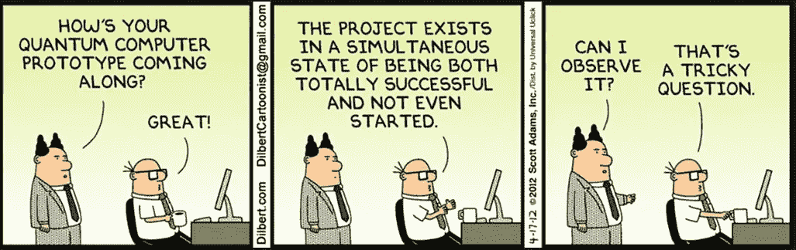
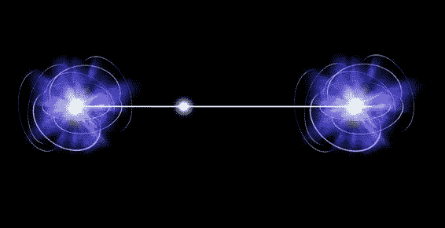

# 量子计算的潘多拉盒子

> 原文：<https://medium.datadriveninvestor.com/the-pandoras-box-of-quantum-computing-24f07d2951e5?source=collection_archive---------4----------------------->

量子计算已经成为科技市场的最新炒作，主要是因为与经典计算机相比，它具有超乎寻常的能力。当我说“非凡”时，你会立即想到计算或计算能力的指数级增强。相信我，这远远不止这些！所以，让我们揭开潘多拉魔盒，探索非凡。

量子计算机的基本构建模块是一个量子位，类似于经典计算机中的二进制位。“经典”一词意味着这些计算机遵循牛顿力学，不违背自然法则。然而，术语“量子”意味着计算机遵循量子力学，无视所有可能的自然法则！

 [## 2019 年即将改变世界的技术|数据驱动的投资者

### 很难想象一项技术会像去年的区块链一样受到如此多的关注，但是……

www.datadriveninvestor.com](https://www.datadriveninvestor.com/2019/01/17/the-technologies-poised-to-change-the-world-in-2019/) 

**什么是量子位？**

要回答这个问题，我们首先要知道什么是 bit(二进制数字的缩写)。它可以是 0 或 1 的状态。经典的计算机只理解比特语言，因此在执行任何任务之前，它将所有的数据翻译成比特。一个量子位有点像，但是有 0 & 1 和更多可能的状态。

**符号:**处于 0 状态的量子位表示为

|0 >表示法

处于 1 状态的量子位由下式表示

|1 >在 Braket 符号中。

量子比特(qubit)的一般形式是*C1** | 0>+*C2** | 1>其中 *c1* 和 *c2* 是系数，分别表示系统测量时达到|0 > & |1 >的概率。因此应该满足 *c1* + *c2* = 1，以确保系统一定会崩溃到某个状态。

所以 c1 和 c2 可以取任何值，因此，单个量子位也可以是|0 >和|1 >状态的线性组合。现在你知道一个量子位如何能以多种状态存在。这是量子位的第一个“超乎寻常”的能力，将量子计算机的操作与经典计算机区分开来。

**测量**

我说的测量系统是什么意思？为了回答这个问题，我想回忆一下薛定谔著名的盒子里的猫实验，它为量子力学铺平了道路。他把一只猫放在一个装有放射性物质的盒子里。随着放射性物质开始衰变，它会释放出毒素，猫吸入会死。但是我们不知道这种物质何时会释放毒素。所以，不打开盒子，我们无法知道猫的状态。

“如果你把猫放在盒子里，如果没有办法说出猫在做什么，你就必须把它当成同时在做所有可能的事情——活着和死去，”米利金大学物理学和天文学副教授埃里克·马爹利解释道。如果你试图做出预测，并假设你知道猫的状况，你(很可能)会错。另一方面，如果你假设它是所有可能状态的组合，你就对了。

[Source](https://www.redbubble.com/people/glalertton/works/26121744-wanted-dead-and-alive-schrodinger-cat?p=art-print)

所以在量子计算机中，量子位可以在任何时间以任何状态存在。只有当我们试图测量系统时，我们才会知道系统的当前状态。所以，当我们测量系统时，测量后会看到概率最大的状态。

[Source](https://blogs.msdn.microsoft.com/uk_faculty_connection/2017/10/30/microsofts-software-for-quantum-computing-liqui/)

**量子叠加**

如果将 2 个经典位放在一起，则可能的状态总数为 2，即每个位可以是 0 或 1。因此，所有可能的状态是 00、01、10、11，并且这些情况中只有一种会一次性存在。

在 2 个量子位的情况下，我们知道每个量子位可以以 c1|0>+c2|1 >的形式存在。因此，如果我们把两个量子位放在一起，一个广义的系统将会如下图所示。

(C1 * | 0 >+C2 * | 1 >)(C3 * | 0 >+C4 * | 1 >)= C1 ' * | 00 >+C2 ' * | 01 >+C3 ' * | 10 >+C4 ' * | 11 >

上面右边的结果表明，2 个量子位的系统在任何时候都是这 4 个状态的“叠加”，即|00 >、|01 >、|10 >、|11 >。可以说一下这个系统目前处于什么状态吗？直到我们测量了系统。

这两个量子位被称为相互“叠加”以创造这种状态。没有一个真正的概念，哪个量子位先走，或者这个量子位什么时候进入系统。这是量子计算理论的真正症结所在。这些操作是以并行方式在整个状态集上完成的，这一概念被称为量子并行。这是量子位的第二个“非凡”能力，它将量子计算机的操作与经典计算机区分开来。

**量子纠缠**

纠缠系统被定义为这样一种系统，其量子态不能被分解为其局部成分的态的乘积。这是一种不可逆的状态。

量子纠缠是一种物理现象，当成对或成组的[粒子](https://en.wikipedia.org/wiki/Particle)以某种方式相互作用或共享空间接近度，使得每个粒子的[量子状态](https://en.wikipedia.org/wiki/Quantum_state)无法独立于其他粒子的状态进行描述，即使粒子相距很远。这意味着，如果两个量子位处于纠缠态，并且如果我们测量其中一个量子位，我们就可以肯定第二个量子位的状态。这仍然是一个无法解释的现象，但在这个领域有许多应用。量子位元的这种能力永远无法在经典系统上复制，因此对量子电脑来说是非常特殊和怪异的。

[Source](https://pixels.com/featured/quantum-entanglement-victor-de-schwanberg.html)

**量子计算机的问题**

虽然这种新技术看起来非常令人兴奋和创新，但它伴随着量子物理和化学的同样具有挑战性的应用。人们只能想象建造量子计算机的实际成本。我想大约是 1500 万美元..像 IBM、Google、微软这样的跨国公司已经在建立这些技术方面取得了重大进展。D-Wave、Rigetti Computing 是一些主要专注于量子计算机的新兴公司。现在让我们来看看建立量子计算机所涉及的一些主要问题。

**调试挑战**

你不能检查量子系统或量子位的波函数——你只能测量或观察单个可观察量，然后导致波函数的其余部分崩溃。你不能检查一个量子位的基本向量的概率振幅。你不能在量子程序中设置断点，检查量子状态，甚至可能改变量子状态，然后继续执行。端到端地成功运行量子算法将是困难的。

**量子相干**

量子计算中最具挑战性的问题之一是，在计算进行时，系统应该是严格相干的。“相干性”意味着量子位系统将被部署的环境将需要严格的零度以下的温度，以显示它们超乎寻常的量子能力，如上所述。来自环境的热波或噪音与量子位元之间的任何交互作用，都会导致整个系统崩溃或瓦解。因此，系统中量子位元的数量越多，它们受这些杂讯影响的机率就越大。

**量子电路模拟器**

人们可能会想，如果这些量子计算机是最近才建立的，那么研究人员和量子专家是如何构建他们的量子算法的，他们在哪里进行测试？量子电路就是那个地方。量子电路是一个直观的拖放模拟器，其中可以添加量子位，门和运算符只是可以附加到电路上的可拖动对象。量子位通过这些门的流动和各自的转换，所产生的量子态的概率和振幅可以很容易地被可视化。它是真实世界量子计算机计算的伟大复制品。就创建和测试新的量子算法而言，它让生活变得更加容易。这个地区有几个机构。IBM Q，Forest，Quirk 等等。已经创建了几个 python 集成库，使研究人员能够尝试和测试他们的算法。

**结论**

可以想象，如果通过技术进步来解决这些障碍，很快量子计算将在技术世界中塑造一个新时代。来自世界各地的研究人员一直在努力缓解这些挑战，并使量子计算机能够为公众所用。

目前，一些创业公司已经在量子计算机上运行量子算法方面取得了真正的成功。基于云的服务将提供给公司，在那里他们可以真正利用量子计算机的能力。混合量子计算的概念看起来非常有前景，来自政府、协会、机构和银行的投资和合作已经开始涌入。只有到那时，这个庞大的技术才会改变人们对计算机及其功能的看法。

如果你觉得这有帮助，请鼓掌，或分享或关注。谢了。