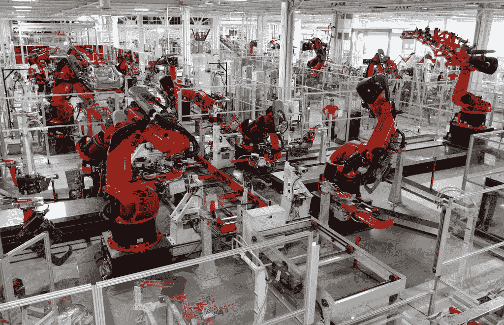

# 工作场所的范式转变需要新的经济模式

> 原文：<https://medium.datadriveninvestor.com/the-paradigm-shift-in-workplace-needs-a-new-economic-model-cd6e0579ca12?source=collection_archive---------10----------------------->

蒸汽机、电力和以计算机为媒介的通信技术推动了第一次、第二次和第三次工业革命，这些革命逐步改变了工作场所，从根本上改变了我们的生活。然而，不管技术进化的幅度有多大，机器总是保持低能，因此需要人类来指导和运行它们。但在人类历史上，我们第一次看到了认知机器出现的前景，这种机器有可能将人类完全挤出工作场所。

Fully automated manufacturing facility. Image Credit: Paul Sakuma/Associated Press

世界各地的工作场所，无论是制造工厂还是办公室，都在经历着一场变革。人们准时去工作场所，整天粘在椅子或工作站上，处理他们遇到的任务的日子已经一去不复返了。现在，人们通过使用超便携计算设备来工作，这为他们提供了永远在线的连接，使他们不仅可以在办公室工作，甚至可以远程工作。在制造工厂中，机器人手非常高效地执行大部分工作，几乎没有缺陷。已经开始的职场转型将在未来达到新的高度。

一些新兴技术，如物联网(IoT)、大数据、人工智能(AI)以及增强和虚拟现实，预示着所谓的第四次工业革命，将引发人们生活和工作方式的范式转变。现在正在进行的那种自动化与我们迄今所目睹的有着质的不同。到目前为止，我们所拥有的技术和由此产生的小玩意被证明仅仅是愚蠢的机器，需要人类的干预才能发挥作用。与之形成鲜明对比的是，新兴技术有能力创造具有认知能力甚至个性的机器，因此有可能让人类过时。因为这些精密设计的认知机器具有深度学习能力，能够做出数据驱动的决策，比人类更高效，更不容易出错。

在任何自由市场经济中，投资者都以利润最大化为目标。全球化使得美国和欧洲的跨国公司将他们的工作转移到发展中国家，目的是降低他们的劳动力成本。现在，为了进一步削减成本，他们计划在工作场所不再雇佣人类，而是用机器人来代替。德勤进行的一项研究发现，虽然将制造业工作外包给低成本经济体可以节省高达 65%的劳动力成本，但用机器人取代人类工人可以节省高达 90%的成本。许多专家预测，未来人类只会被部署在那些绝对需要他们存在的地方。他们还预测，全职工作将会非常少，而“零工经济”将会蓬勃发展，换句话说，大量自由职业者在网上等待抓住“计件工作”的机会，他们可以按任务获得报酬。声誉引擎使客户能够对自由职业者的质量进行评级，这反过来又使自由职业者能够与他们建立信任。

技术导致的失业成为现实的可能性在人们中间引起了很大的焦虑。戴尔技术公司在其最近题为“人机合作的下一个时代”的研究中指出，2030 年将存在的 85%的工作尚未被发明出来，因此对失业的担忧是没有根据的。还有一些人，尤其是一些硅谷企业家，主张引入普遍基本收入(UBI)作为对即将到来的失业的补偿。不同的观点表明，人们对技术将如何影响就业前景没有清晰的认识。

颠覆性技术的出现可能会带来巨大的变化，而且速度也很快。为了保持就业，人们不得不“在此刻”学习新知识和掌握新技能，虚拟和增强现实等技术可能会对他们有用。此外，当前的教育体系非常强调向孩子灌输知识，而不是培养认知技能，这需要立即改革。

在不久的将来，大多数重复性的任务将被分配给机器，只有那些需要高度创造力和认知能力的任务才会被分配给人类。由于并非所有的人都被赋予同样好的创造能力，可能会有许多人在这场激烈的竞争中被甩在后面，因此可能会被剥夺谋生的来源。由于谋生机会和社会正义在任何民主社会都是至关重要的，人们失业的想法本身就很难消化。

历史上充满了这样的例子，更多的技术和更多的机械化总是加强了资本主义利润贩子的手，削弱了劳动力的地位。正如卡尔·马克思正确指出的那样，“可以说，机器是资本家用来镇压专业化劳动反抗的武器”。无论技术和工作场所如何发展，世界各国政府都必须制定适当的政策来保护“人”的利益，而不是“机器”的利益，因为当他们保护机器利益时，最终的受益者将是拥有这些机器的大企业。

工作场所即将发生的范式转变需要引入新的经济模式。否则，被冤枉的人可能会被极左或极右所吸引，这必然会产生许多社会问题。随着唐纳德·特朗普(Donald Trump)的出现，世界已经见证了这一现象。因此，世界需要建立一种新的经济模式，这种模式不仅能最大限度地提高全人类的福祉，还能吸引他们走向可持续生活。然而，这不是很容易实现的，尽管不是不可能的。因为自新自由主义出现以来一直享受着全盛时期的自由市场资本家不会这么轻易放弃他们的权力和特权。

# DDI 特色数据科学课程:

*   [**用于数据科学的 Python**](http://go.datadriveninvestor.com/intro-python/mb)
*   [**深度学习**](http://go.datadriveninvestor.com/deeplearningpython/mb)
*   [**数据可视化**](http://go.datadriveninvestor.com/datavisualization/mb)

**DDI 可能会从这些链接中收取会员佣金。我们感谢你一直以来的支持。*