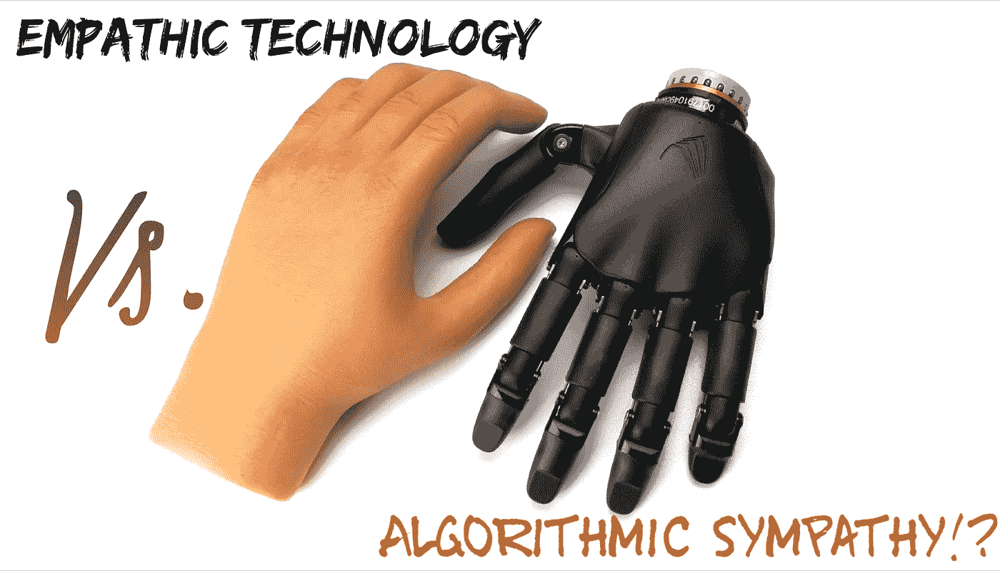

# 医学中移情转移的悖论:移情技术与算法同情

> 原文：<https://medium.datadriveninvestor.com/the-paradox-of-empathetic-transference-in-medicine-empathic-technology-vs-algorithmic-sympathy-222f76a694db?source=collection_archive---------2----------------------->

**Empathic Technology vs. Algorithmic Sympathy**

从历史上看，人类对技术有着过分狂热的迷恋。纵观几代人，人类甚至用相应的技术成就来标记时代，例如从公元 1340 年至 1470 年的文艺复兴技术叛乱到 19 世纪晚期的机械化，再到 20 世纪 90 年代的连接商业网络和企业。后者标志着现代互联网的开始。这是一种成就。为过去几个世纪和未来几十年设定了最高标准。

人类试图将技术融入课程。随着时间的推移，他对机械、数字和数学的着迷通过融入机器人、机器学习或人工智能而形成并融合到活动中。

几个世纪以来，人类一直在与梦想和现实的分离作斗争，因为他经常通过将他的视野投射到电影艺术上，在使假货人性化和使技术道德败坏之间徘徊，电影艺术被描述为完美的人道伙伴或终极杀人机器。遗憾的是，伴随着技术的发展，当他变得对技术依赖时，他背离了过去几个世纪经常超越人类价值观的道德价值观。

事实上，我们似乎被我们树上的果实无情地分散了注意力。一个可以指出的干扰是“移情”。不久前，我看到了一篇有趣的文章，题目是:“移情技术”:设备能知道你的感受吗？“([发表于今日医学新闻](https://www.medicalnewstoday.com/articles/324965.php)

叙述通过使机器人能够利用机器学习、传感器和算法来感知人类的情绪状态，并通过适当的移情进行反驳，从而使不现实的存在成为现实。换句话说，让人类更人性化，去认识我们的感受。但是，为什么向世界表明自动化可以执行人类可以做的一切，而且做得更好，这确实是至关重要的呢？尤其是涉及到移情这种微妙的东西？

我可以详细说明这一点，但在此之前，让我们深入一点。

# 先说机器人的历史。

根据目前主要的字典，机器人只不过是一个经过编程的多功能操作员，旨在通过编程的运动来移动材料、零件、工具或专用设备，以执行任务。随着时间的推移，这些定义已经成为争论和/或修改的主题，通过科学学科和应用科学的个人感性经验，它们包括一种机械动作。

“机器人”一词是由一位出生于俄罗斯的美国科幻作家艾萨克·阿西莫夫创造的，他在他的短篇小说中称之为“大约 1942 年”。

事实上，最基本的机器人设计可以追溯到 20 世纪 50 年代，由肯塔基州路易斯维尔的技工乔治·c·迪沃设计。有史以来第一次，他建造了一个被称为“Unimate”的重编程计划器，由“通用自动化”赞助。这为制造更复杂的机器人开辟了道路，如今这些机器人已被应用于各行各业。他在自己的短篇小说中将机器人描述为“人类有益的仆人”，并将机器人视为“更好、更干净的种族”阿西莫夫提出了他的机器人前辈和其他故事的科幻(sci-fi)机器人角色遵循的三个“机器人定律”。首先，他规定机器人不得通过直接行动或不行动来伤害人类。然后，他坚持认为机器人必须服从人类的命令，除非这些命令会对人类造成伤害。最后但并非最不重要的一点是，机器人必须保护自己的存在，只要这种保护不与前两条定律相冲突。

# 人类生活、机器人技术和终极前沿

人类虽然有能力，却永远在即兴发挥和超越。当不能时，他倾向于寻求终极超能力。通过更进一步，他甚至找到了保持竞争优势的方法来主导他从出生就开始的使命。

一些人将信仰和宗教融入他们的仪式中；很少有人接受他们所信任的意识形态的联合提议，而其他人将他们的信任投资于技术。即便如此，它们都有两个共同点，因此被称为对“完美”和“方便”的不断追求。

机器人技术、机器学习和人工智能似乎满足了人类达到巅峰的愿望，尽管人类意识到自己的视觉和创造力的产物可能既有害又有益。因此，他试图制定伦理规则来防止他的创新带来的有害副作用。从逻辑上讲，精度、效率、功率和耐力一直是推动机器学习发明前沿的驱动因素，但与它们的服务目的或干扰目标相冲突。

# 医学和保健怎么样？

我们目睹了所有行业的重大发展，以及医学科学令人印象深刻的进步，这与其在进化中的平行参与份额不相称，例如机器人手术。近十年来，机器人技术已经很好地融入了人们的日常生活。谷歌和亚马逊的 Alexa 提供了创新的扬声器技术，从街道上的滑板车到行走和说话的机器人，以跟踪周围的人，学习人类的日常活动和习惯。

随即产生了共鸣！—一个长期以来被接受的现象是，无论应用科学学科如何能够最好地概括人类的角色，它永远不会等同于人类的存在。这已经变成了一场争论，导致了对无情感技术最初概念的挑战。第一次结束了，我们面临着一个新的争议的诞生，它在千禧一代中流行。这造成了一个巨大的问题，尤其是对 21 世纪的技术官僚而言。为了真正推断这个话题，我们需要定义移情、敏感和存在行为。意识到和分享感受的能力以及敏感的品质或条件是认知人类行为的基础。

# 先决技术模拟行为

对于计算机来说，要完成一项任务，它天生就需要学习，这被称为机器学习(ML)。这是对预先编写的算法和统计模型的科学研磨，以在不使用明确指令的情况下，而不是依赖模式和推理的情况下，出色地完成精确的任务。对于机器学习来说，它需要为特定任务收集大量数据。如前所述，通常通过传感器获取，如智能扬声器作为口语，作为社交媒体内容的一部分书写，通过温度传感器加热，或视觉图像。

# 什么是共情技术？

一些工程专家声称，通过利用深度学习技术在我们人类能够看到精神和身体状态之前检测它们，他们已经踏过了现实和幻觉之间的微妙界限。换句话说，这是通过一组数字方程来实现的，这些方程可以根据敏感传感器检测到的精确而微妙的身体波动来指定、发现和预测个人的思想和精神状态，甚至在我们能够主观理解之前。

# 那么，正在处理的是什么呢？

是将身体反应叠加到电脑动画中作为混合现实体验吗？或者，我们实际上是在通过提取、转换和加载(ETL)并记录身体活动来形成使用计算机软件的人的镜像，然后通过精确定位这些对象的好恶来反映它吗？或者仅仅是用随机选择的巴甫洛夫条件来补充这个人？

# 影子学习的概念

我更喜欢使用“影子学习”这个术语，而不是“移情技术”，因为最具技术性的方式来描述我所假设的将“养育”的概念从一个人的童年推迟到成人生活。父母(人工智能算法)采用的一套价值观，用于查看、学习、反馈和应用代际传递的纠正性响应。其他有影响的人呢？就像多元遗传刺激一样，要处理无限数据的海洋，在完全执行的情况下，容易受到某些个人或实体的推底。我认为移情是一种表达，可以应用于一个人生活中特定时间和地点的独特场景。相比之下，移情技术是一种基于表面因素和一个人的经验和知识的学习反应。无论多么精确和广泛，它都不足以决定如何回应个人的情绪，提供同理心。

外部因素，伦理，文化，遗传，社区，以及在特定时间点事件的随机合作，每一个单独的组成部分都带有无限的子选项。这些因素被技术反射到人类身上是不道德的，除非我们足够先进，可以把人脑植入机器人身上，或者把一项技术移植到人身上。我推测后者可能比前者更容易满足。

# 生物反馈和感官元数据概述了机器人情绪理论，或者它只不过是算法驱动的同情？！

这可能需要数百万兆字节的数据挖掘和复杂的设计来思考一个人在伪同情和生物反馈中的反应。学会反应绝不是人类的先决条件，尽管它可以作为一个伟大的工具来增强人类的感受。机器人通过深度学习算法实现了对某人不幸的同情和悲伤，但同理心被认为是人类过于特殊的特性，因此被模仿但几乎没有被取代。

将生物反应模拟为狂热状态的虚假版本可能会跨越潜在情绪剧变的物理表达。但永远不能象征两者之间摇摆不定的门道。即使我们打算将外部变量保持在人类景观及其定义创新的循环中。

# 为什么我们需要同理心？

同理心是任何繁荣生活的基本要素，对人类的存在更是如此。这是重要的，因为它帮助我们认识到某人如何感知和应对给定的环境——通常与社会行为有关，在社会行为中，更大的同理心导致更大程度的帮助行为。即使在技术最先进的阶段，这种角色对技术的期望也是不合逻辑的。

# 我们为什么需要机器人？

机器人使用起来相对便宜，能有效地完成特定的工作，有时，它们还是完成特定任务的可能方式。例如，他们可以探索内部煤气罐、最深处的火山、穿越火星表面或其他对人类来说太危险的地方，如极端温度或污染环境。今天，大多数机器人被用来执行重复的动作。他们非常适合进入可能有炸弹的建筑，或者利用工厂制造汽车、糖果和电子产品。将它们与软件对应物(人工智能)结合起来，将使它们成为人形或机器人。人工智能已被归类为反应性、有限记忆、心智理论和自我意识。

我不打算通过谈论这个问题的细节来转移我们讨论的话题。这篇文章的重点是试图将非人化的概念概念化，如果我们需要这些工具来帮助我们，或者我们正在寻求我们的同龄人和前辈的掌声。毫无疑问，利用机器学习技术是迄今为止人类通过历史的传承和未来几代人的内在能力所共同努力的最高水平之一。此外，我们这个时代和未来的几代人必须确保我们不会迷失在科学发展史的进程中。意思是——当我们需要人情味的时候，我们要求发挥这一作用，当我们绝望地呼吁技术干预时，我们有义务明智地使用它，而不是先入为主。

机器人现在和将来永远都是不朽的，但会成为我们生活中不道德的旁观者。最终的人形机器人和人类之间细微差别的解决方案嵌入在现有的人类触觉中。

# 现在让我们把移情和机器人的概念应用到医学和医疗保健上。

机器人手术的概念令人兴奋。机器学习的想法也是如此，它可以帮助医疗专业人员将病人的鉴别诊断工作缩小到最罕见的选区。此外，对人工智能将取代医生工作这一假设的信心是一个令人担忧的问题，也是对医学、医疗保健和病人护理艺术的误解。令人担忧是可以理解的。那么，机器人和机器学习是我们障碍的完美解决方案吗？或者，我们是否需要用一个解决方案来满足我们在自己身上创造的无限幻觉，以表达我们的愿望，但不一定是我们的需要？

知道这将对人类生活产生怎样的影响。也许将技术官僚的提议应用于我们生活的每一个前景，包括我们的福祉和过去几十年来我们日常生活中公司结构的进步，创造了一个缺乏这种寻求同理心的方案！

医疗护理的接受者是一个无能为力地依赖于治疗医生的真诚、专业、安慰和有针对性的专注努力的人。一个受过训练的医生，通过首先结合个人联系，然后收集数据来治疗一个人。这是一个无价的特点，对人形机器人来说是不存在的，被称为“个性化医疗”，它本身一直是为超越社会经济和地理界限的医疗服务奠定基础的首要前提，因此，医疗无国界。