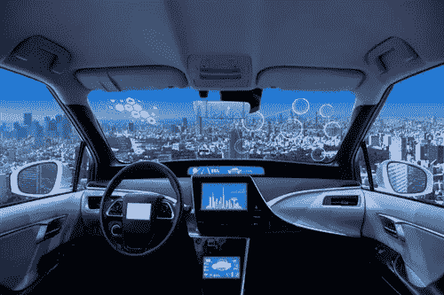

# 乘客经济——我们这个时代最大的经济机遇

> 原文：<https://medium.datadriveninvestor.com/the-passenger-economy-the-greatest-economic-opportunity-of-our-time-834cf7044a99?source=collection_archive---------8----------------------->

拼车——乘客经济的基础——让我们看到了我们这些花了太多时间开车的人的未来。

在过去的五年里，我经常使用拼车应用，我发现我现在的出行方式——拼车——对我生活质量的影响远比看起来要大得多。

是的，我摆脱了在拥挤的洛杉矶或海湾地区开车的烦恼，但对我来说好处远不止这些。拼车让我能够利用以前浪费的时间打电话、阅读和与客户、同事、家人和朋友交流。

 [## 在自动驾驶汽车发生事故的情况下，谁应该承担法律责任？数据驱动的投资者

### 我仍然认为自动驾驶汽车是一种奢侈品，而不是必需品…

www.datadriveninvestor.com](https://www.datadriveninvestor.com/2018/11/02/who-is-legally-accountable-in-the-case-of-an-autonomous-vehicle-accident/) 

这仅仅是未来的一个预兆:人们将钥匙交给自动驾驶汽车的时刻即将到来。通勤者将可以高枕无忧地享受旅程，没有压力(也许除了那些客户电话！).

> 想象一个没有路怒症的世界

近年来，技术为我们这个时代最大的经济机会之一——乘客经济——铺平了道路。大多数汽车制造商承诺在 2020 年推出自动驾驶汽车。这为开发新应用和设计制造新硬件创造了机会，从而增强和驱动自动驾驶汽车。经济学家预测，2035 年经济规模将达到 8000 亿美元，到 2050 年将达到 7 万亿美元。那是一大笔钱，不是吗？

几个月前，我在拉斯维加斯参加 CES 时，坐在[德勤](https://www2.deloitte.com/insights/us/en/industry/dcom/automotive-trends-millennials-consumer-study.html)在他们的 CES 展台上展示的虚拟现实演示中，领略了客运经济的未来。我坐在 VR 座位上，戴上耳机，节目开始了。我可以使用所有新的“汽车便利设施”我的暂定时间表出现在屏幕上，我可以接电话、参加会议、看新闻报道、订购食品杂货、预订晚餐、玩简短的游戏，以及查看当地的娱乐日历。这次经历简直令人窒息。

随着自动驾驶汽车的前景变得普遍，以及每个乘客的个性化内容摄入、交付和体验，乘客经济将成为这种新交通模式第一阶段货币化的重要参与者。

乘客经济的到来将推动一个更安全、更有竞争力的世界。同时也节省了我们几年的时间，不用再为在交通堵塞中疯狂驾驶而烦恼了！

Gena 瓦兹奎 2019