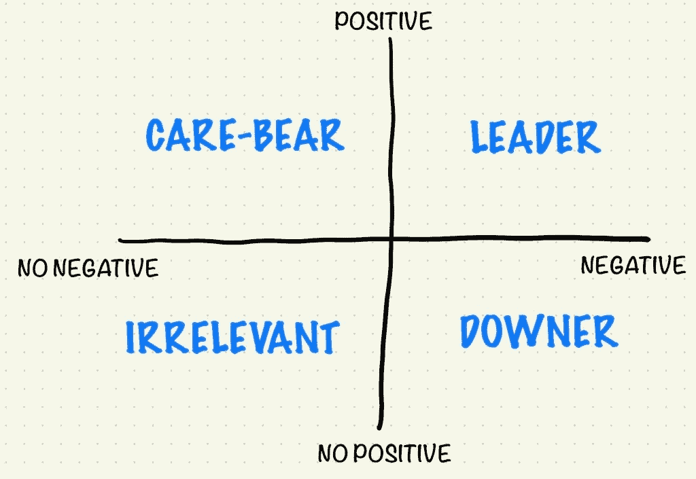

# 轻拍后背

> 原文：<https://medium.datadriveninvestor.com/the-pat-on-the-back-a7d8a98094d0?source=collection_archive---------6----------------------->

每当我与科技行业的高管交谈时，反馈是一个经常被提起的话题。这是你推动团队前进的最重要的工具之一。然而，众所周知，这也是科技领域的领导者不擅长的事情。说到他们提供反馈的方式，有四种类型的领导者:

你在这里适合做什么？你组织中的经理呢？

 [## 想知道领导是谁？请他决定。数据驱动的投资者

### 一个有效的领导者能为组织提供的最有价值的东西之一是决策能力…

www.datadriveninvestor.com](https://www.datadriveninvestor.com/2019/01/25/want-to-know-who-the-leader-is-ask-him-to-decide/) 

在这篇文章中，我将关注那些沮丧的人，那些只提供负面反馈的人。首先，测试一个人是否属于这一类是很简单的。回想一下过去几周以及在此期间您提供的反馈。其中有多少次让另一个人感到快乐？(很难记住任何反馈？ [*订阅*](https://avivbenyosef.com/newsletter/) *并获取下一篇文章，关于其他类型的反馈提供者)*

*成为令人沮丧的人的五个缺点*

*   *当人们最终了解到你提供的所有反馈都是负面反馈时，他们就会慢慢产生免疫力。你就是那个喊"狼来了"的男孩。*
*   *我在客户那里看到，一些天生沮丧的人在感到敌意时会完全停止提供反馈。*
*   *当有人“做得好”时，不提供积极的反馈意味着你没有强化想要的行为，失去了团队的快速成长和改进。*
*   *缺乏积极的反馈会打击士气，增加人员流动。*
*   *作为一个组织的领导者，你是一个榜样。沮丧者创造了越来越多的人充当沮丧者的文化，从而降低了整个团队的整体反馈质量。*

*以我的经验来看，沮丧者可以分为两个小组:那些没有意识到这一点的人，以及那些认为自己在执行“严厉的爱”管理的人。如果你是前者，我希望现在你已经使用了前面的指导来自我诊断，并且变得开明了。*

*当谈到那些依赖于后者的人，即“严厉-热爱”的支持者时，这通常包含了一个人作为领导者的整个运作系统。是的，有效地领导你的“伙伴”几乎是不可能的。是的，你不应该做一个“爱心熊”,在人们搞砸的时候告诉他们。然而，如果你认为让你的团队成长的方法是放下他们，永远不要让他们觉得他们有时会赢，那么…你需要的帮助比这篇文章所能提供的更多(联系我！).*

*现在，无论你属于这两类中的哪一类，提供积极的反馈都不会自然而然地来到你身边。当给高管们提建议时，我推荐一些“先假装后动手”的方法。选择一对最符合你性格的情侣。*

****开始提供正面反馈的五种快速方法****

*   *每天提醒自己回想今天做得好的事情，给相关的人发一条简短的短信，甚至仅仅是“今天做得好，顺便说一句。”*
*   *在你办公室的屏幕上贴一张便利贴(或者你通常有 1:1 和提供反馈的地方),提醒你不要默认只有负面反馈。*
*   *每隔几个月提醒一次，看看即将到来的里程碑是否进展顺利(不一定超出预期)，并确保获得一些带有特制标签的葡萄酒(我个人最喜欢的)、t 恤或任何东西来纪念胜利。*
*   *作为我的反馈可见性模型的一部分，确保你每周至少公开提供一次积极的反馈，即使只是在一个公共的 Slack 频道上回复或者回复所有人说“干得好！”配上合适的 GIF。*
*   *以一对一的方式询问其他人他们看到他们周围发生了什么，如果这是你没有想到的，请确保稍后与相关人员讨论。*

*这里的要点是，如果你或你手下的一位经理情绪低落，在问题开始对团队造成损害之前，解决问题并进行补救。*

**Aviv Ben-Yosef 2019 —最初发布于*[*avivbenyosef.com*](https://avivbenyosef.com/the-pat-on-the-back/)*