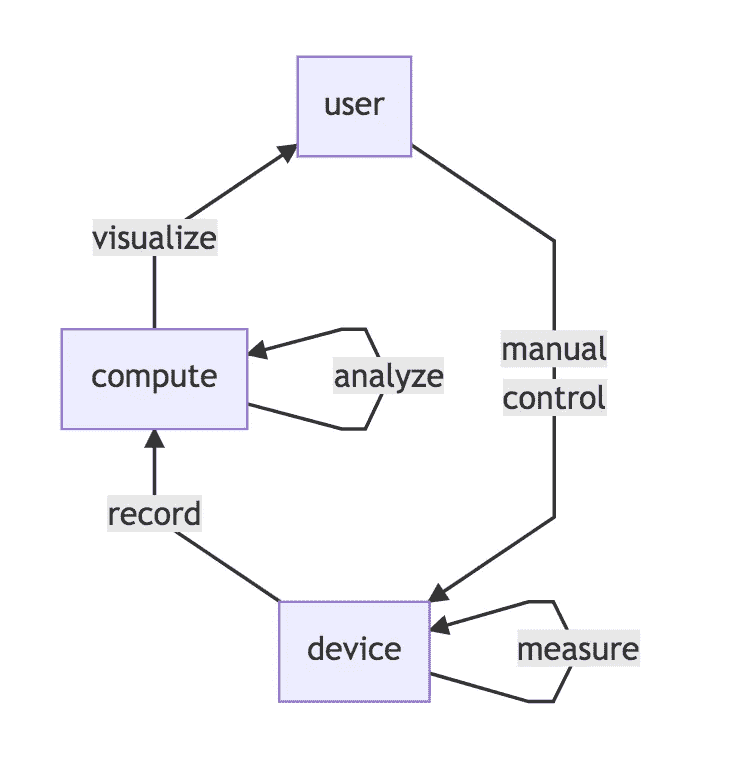
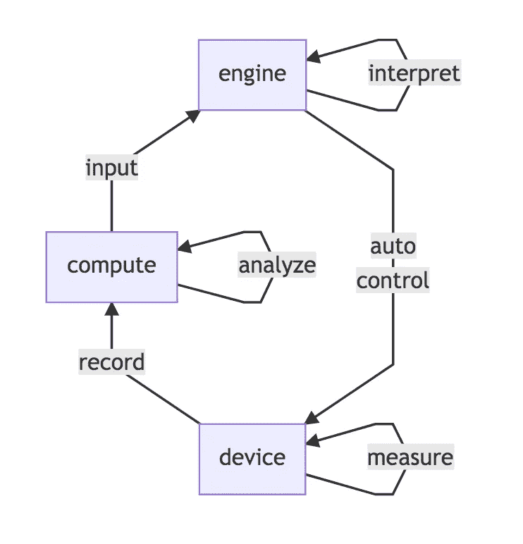

# 物联网最大化的途径

> 原文：<https://medium.datadriveninvestor.com/the-path-to-maximized-iot-46d447c2799a?source=collection_archive---------8----------------------->

# 介绍

物联网(IoT)是一种将传感器和控制器嵌入资产的运动，使应用程序能够创建更安全、更高效的本地和全球化系统。物联网空间需要超越单纯的监控，还需要包括控制，当实时执行时，将为物联网项目带来最大化的回报。

# 第一阶段:监控

截至 2019 年，很大一部分物联网计划和解决方案专门关注物联网的监控方面。数据流的方向主要是向北，从设备开始，目的地是云中的消费。实际上，这些解决方案支持以下操作:

-测量
-记录
-分析
-可视化

在这个阶段，系统的输出是分析，可视化给用户。决策引擎是人，项目投资的回报完全依赖于人从分析中被动地获得价值。这增加了风险，因为大型物联网数据集仍未挖掘，无法提供可操作的见解。由于人必须解释数据，所以决策和补救都是手动的，从而减慢了系统可能需要补救的任何改变。

 [## 理解物联网|数据驱动的投资者

### 一个系统越开放，它就越有利于创新和产生信任。然而，当谈到开放系统时…

www.datadriveninvestor.com](https://www.datadriveninvestor.com/2019/09/28/making-sense-of-iot/) 

# 第二阶段:控制

在许多系统中，控制没有被仔细考虑，或者没有在设计中考虑。挑战在于这些系统的控制需要:

-对数据的可靠理解
-对数据完整性的信任
-可靠的数据传输信任链

一旦建立，解释和补救的手动步骤将分别由决策引擎和硬件控制器处理。这种实时控制能够减少延迟、更新安全机制、最大化效率并减少人为错误。

这些引擎将支持双向数据流:

-北行传送监控数据
-南行传送实时自动控制命令

# 小路

在未来几年，物联网作为一个整体将继续受益，并在许多方面走向成熟:

-传感器成本将继续以平均每年 11.5%的速度下降，从 2004 年的 1.30 美元降至 2020 年的 0.38 美元
-Zigbee 等物理协议将变得更加可靠和强大
-MQTT 等应用协议将变得更加标准化
-物联网安全模型将继续接受现场测试和完善
-用于模拟设备负载的强大工具已经出现，并将继续改进， 提高大规模生产系统的稳定性
-不断改进的硬件模块减少了将现成设备和传感器配置到棕色区域系统中的摩擦***

# 结论

总之，向前迈进的最佳步骤是将物联网系统的控制方面作为主要设计考虑因素。

# 参考

*[2004 年至 2020 年工业物联网(IoT)传感器的平均成本](https://www.statista.com/statistics/682846/vr-tethered-hmd-average-selling-price/)
** [CEP vs 尼拉杰·维西那波尔坦](https://www.linkedin.com/pulse/cep-vs-rule-engine-why-how-what-neeraj-vishnuvardhan)
*** [TPM 模块](https://en.wikipedia.org/wiki/Trusted_Platform_Module)