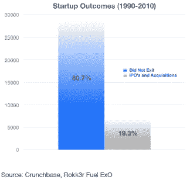
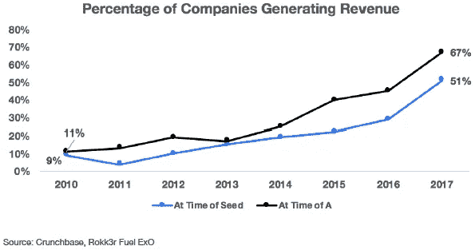
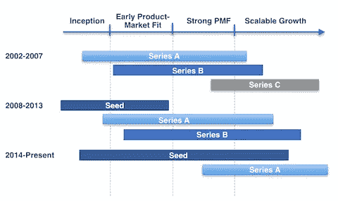

# 通往 A 系列的道路

> 原文：<https://medium.datadriveninvestor.com/the-path-to-series-a-6c904d90e61f?source=collection_archive---------3----------------------->

Photo by [Sayan Nath](https://unsplash.com/@sayannath?utm_source=medium&utm_medium=referral) on [Unsplash](https://unsplash.com?utm_source=medium&utm_medium=referral)

根据 Crunchbase 对 1990 年至 2010 年间成立的 35，568 家初创公司的研究，其中 81%已经不复存在，只有 19%实现了 IPO 或收购。这些数字证明了一个严酷的事实——十家创业公司中有八到九家无法生存，或者每家创业公司都面临着 80%到 90%的失败率。然而，失败率不是一成不变的，应该随着公司的生命周期而降低，因为当公司在风险资本漏斗中走得更远时，失败的可能性就会降低。

一般来说，公司经历的融资阶段越多，潜力越大，失败率越低。A 轮融资是初创公司走向成功的第一个重要里程碑，因为它凸显了公司获得机构投资者认可并得到认真考虑的时刻。话虽如此，通往首轮融资的道路从来都不容易。

事实上，它变得更加困难，大多数公司在达到这个阶段之前就失败了。

与之前的几轮融资相比，如朋友和家人或种子融资，A 轮融资要困难得多，因为它涉及大型机构参与者，这些参与者对其有限合伙人有严格的授权和受托责任。首轮融资不仅需要初创公司提供无懈可击的陈述和清晰的游戏计划，还需要投资者提供详细的法律和深入的尽职调查报告，因此需要更长的时间来完成。

另一方面，当你从朋友、家人或种子投资者那里筹集资金时，你是在提高创始人(团队)的素质和愿景(想法)的实力。另一方面，A 系列不是讲故事；这都是关于度量和数字的。这些指标和数字需要证明在客户接受度、病毒式传播、收入、参与度等方面的进展和牵引力，这是公司获得首轮融资所需的。

根据 Crunchbase 的另一项研究，该研究调查了 2003 年至 2013 年间成立的 15，600 家美国科技公司，只有约 40%的公司在首轮融资前筹集了资金，并最终进入了首轮融资

自 2013 年以来，随着众筹平台、加速计划和小额风险投资基金的爆发，风险投资融资格局发生了显著变化。因此，公司在筹集早期资金和种子资金方面没有太多困难。相比之下，种子基金公司的大幅增长导致后续资金的竞争加剧；而且，越来越多的人难以进行首轮融资。因此，我们预计，如果我们对 2013 年到今天的数据进行同样的分析，只有不到 40%的种子基金创业公司实际上获得了首轮融资。

# A 系列的门槛比以前高了

一家进行首轮融资的公司被赋予了比以往市场更高的标准。虽然在 2010 年，只有 11%的公司进行了 A 轮融资，但今天 67%的初创公司已经实现了收入。鉴于目前 A 轮的平均规模(从 2010 年的 490 万美元增长到 2017 年的 1210 万美元，增长了 2.5 倍)，难怪如今 A 轮投资者对创业公司的要求会更高。投资者等待看到真正的证据，这代表着增长的势头和对去风险商业概念的强调，然后他们才会投入资本。除了收入，首轮投资者还关注用户数量、参与度和其他吸引人的指标。他们将这些指标与竞争对手的指标进行比较，并在环比、同比的基础上进行分析。对于所有这些，指标和增长需要是合法的产品/市场匹配和执行的结果，而不是分散注意力的信息。

在 2002 年至 2007 年期间，一家公司可以在建立任何市场吸引力之前筹集 A 轮融资，或利用 A 轮融资来推动产品/市场契合度。在当前时期，为了吊起 A 轮投资者的胃口，初创公司需要已经获得足够的牵引力，实现一些增长里程碑，并显示出它准备扩大规模。下图展示了风险投资领域最近讨论的主题:种子是新的 A 轮，A 轮正在成为新的 b 轮。

# 关于募集 A 轮的思考

今年夏天，按需纳税申报平台 Taxfyle 将加入 A 轮俱乐部，我们正在努力工作，在这个关键的融资阶段为他们提供支持。Fuel Venture Capital 很高兴在不到一年的时间里，我们已经为我们投资组合中的三家公司选择了 A 轮融资。这一经历让我们在为一家公司制定战略以战略性地成功筹集 A 轮资金时，以及在识别一家公司是否为这一关键的融资阶段做好准备时，得出了一些深刻的见解。筹集 A 轮融资有不同的策略，根据公司利用什么工具吸引投资者进入 A 轮融资，这些策略可以分为三类。

1.  **未来的愿景**

根据这一战略，创始人需要提出他们相信的最大愿景来激励投资者。故事应该简洁有力，遵循以下大纲:

-用一个特定的问题描述当今世界，这个问题影响到许多人

-展示解决方案并解释它如何扰乱市场，以及为什么这是公司产品/服务的理想时机

-以一个真实的例子结束，展示该解决方案如何让世界变得更加美好，并传达未来的信息:巨大的增长机会、巨大的压力、知名顾问和蓝筹客户

这种策略似乎是最难的，因为许多投资者更看重可量化数据的证据，而不是令人信服的叙述。然而，如果公司的产品/服务是一个颠覆者，目标是一个非常大的潜在市场，创始人应该选择它。

2.**前进势头**

创始人需要把这个策略的重点放在让很多人知道和使用公司的产品/服务上。也许他们还没有付钱给顾客，但是，他们的目标是表明对该产品有强烈的需求。已证实的用户吸引力是大的和不断增加的顶线数字的指标。

为了向客户证明产品的价值，创始人可以使用“净推广者得分调查”( Net Promoter Score survey)和“肖恩·埃利斯产品/市场契合度调查”,前者显示客户愿意推广产品的可能性，后者衡量没有产品会有多少客户心烦意乱。除了调查之外，为了证明客户势头，创始人应该绘制任何与用户相关的数据，如活跃用户数、注册用户数、参与度等。这些图表应该总是显示向上的方向，并且指向右边。

3.**真实而有意义的收入**

收入是产品/市场匹配的黄金标准，尤其是如果收入来自知名的大公司客户。这种策略对于 Hyp3r 筹集其 A 轮融资非常有效，该轮融资可能会被超额认购。我们预计 Taxfyle 的首轮融资也会有同样的结果。Hyp3r 与万豪酒店签订了一份执行合同，该合同已从 5 年延长至 7 年，而 Taxfyle 则与四大会计师事务所签订了一份为期 5 年、价值数百万美元的合同。该合作公司最近请求扩展该平台，为美国以外的其他分支机构提供服务；工作范围的扩大预计将大大增加合同的规模。与四大会计师事务所的合同证明了 Taxfyle 的强大市场验证，并为其他本地和跨国专业服务公司打开了许多新机会的大门。在很短的时间内，Taxfyle 成功地与一家在 78 个国家开展大规模全球业务的法国领先会计事务所建立了合作关系。目前，Taxfyle 正在与几家顶级的专业税务和会计公司进行洽谈；一旦关闭，Taxfyle 将成功与全球前十名中的两个和美国前二十名中的四个合作。我们认为 Taxfyle 是一家开创性的金融科技初创公司，旨在颠覆税务/会计服务行业。

除了制定筹资策略，我们还需要确保公司为首轮融资做好准备。就绪性通过关键因素来衡量，包括但不限于已证实的单位经济性、收入增长、商业模式的证明、产品/市场适合度、客户获取策略或支持高效扩展的任何系统。这些因素的 A 系列目标总是随着市场环境的变化而变化，并且随着行业的不同而不同。具体来说，A 轮的 B2B 指标是 ARR 为 150 万美元，同比增长超过 100%。Taxfyle 以 250 万美元的 ARR 超过了这些要求，与去年相比增长了 400%。

我们不希望我们的投资组合公司过早地筹集资金，然后遭遇下跌。在实现产品/市场契合度并为 A 轮(扩展阶段)做好准备之前，公司被建议保持低烧钱率。另一方面，当一家公司已经实现了足够引人注目的里程碑，让投资者相信现金是扩大业务规模的唯一限制时，我们鼓励该公司启动首轮融资。考虑到耗时的融资过程，这轮融资应该在公司需要资金之前至少六个月开始。此外，他们应该以一种为公司提供足够缓冲以实现下一组里程碑的方式来确定这一轮的规模。

筹资是创始人角色中最具挑战性的部分之一。我们的目标是在最早阶段为我们的投资组合公司提供指导和正确的支持，以便他们能够专注于产生重大影响。我们期待看到并帮助更多的公司达到这一关键阶段，并成功获得首轮融资。

*本文作者是燃料风险投资公司总经理* *合伙人兼首席投资官 Maggie Vo，CFA。Maggie 管理投资活动，领导对潜在投资的尽职调查，并对现有投资组合公司进行估值分析。要联系玛姬，发电子邮件到 maggie@fuelventurecapital.com。在社交媒体上关注 Fuel 风投，via*[*insta gram*](https://www.instagram.com/fuelventurecapital/?hl=en)*，*[*Twitter*](https://twitter.com/FuelVC)*和*[*LinkedIn*](https://www.linkedin.com/company/fuelventurecapital/)*。*