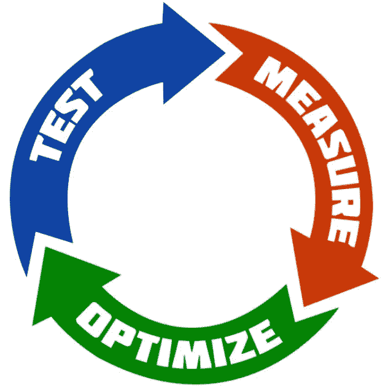
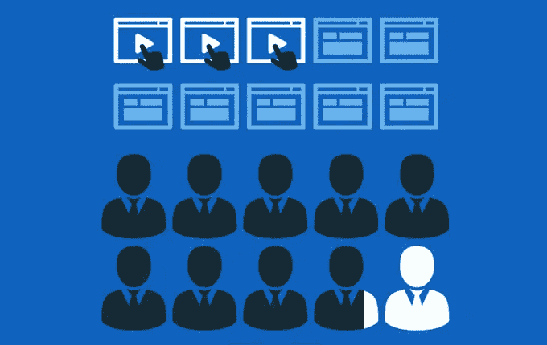

# 你需要关注的点击付费指标

> 原文：<https://medium.datadriveninvestor.com/the-pay-per-click-metrics-you-need-to-watch-413d2b04bcb4?source=collection_archive---------11----------------------->

点击付费(PPC)广告有很多种形式——有脸书、谷歌、推特、Linkedin、Youtube 等等。它们的工作方式或多或少都是一样的，只是某些平台增加了额外的功能。

例如，Youtube 允许在其他人的频道上播放广告——也就是竞争对手，如果他们的设置没有切换到阻止这一点的话。

 [## 2019 年值得关注的 20 种数字营销趋势和技术|数据驱动的投资者

### Faisal 在加拿大工作，拥有金融/经济和计算机方面的背景。他一直积极从事外汇交易…

www.datadriveninvestor.com](https://www.datadriveninvestor.com/2019/02/04/20-digital-marketing-trends-techniques-to-watch-out-for-in-2019/) 

谷歌也可以用来在专门为你的竞争对手做的搜索上做广告——所以你的广告会显示在他们自己网站的上方！

反正这不是今天帖子的重点。

今天我想谈谈统计数据和 KPI。如果你在经营任何营销，你需要很好地掌握你的统计数据，并经常衡量它们。我有一个 3 步系统，我用它来为我所有的客户营销，以确保他们以最低的成本获得最好的结果:

测试:测试不同的广告、受众、图像、视频、优惠、登录页面等。

衡量:衡量所有的结果，特别是我今天要分享的某些数据。

优化:从结果中学习，只使用最好的测试并不断改进。

然而，仅仅知道你需要衡量你的营销是不够的。一般统计，如支出，投资回报等是一个良好的开端，但你需要更深入。

然而，我经常发现的问题是 PPC 广告的使用变得混乱——公平地说，对于一个第一次使用的用户来说，试图创建一个广告——更不用说理解它的统计数据——似乎是一个不可能的任务。

事实上，所有的 PPC 平台都提供了绝对海量的数据。不要误解我的意思，保持透明很好，所有的数据都有它们的用途。

然而，这往往只会增加混乱。这就是为什么我认为分享所有最需要衡量的 PPC 广告的主要统计数据是一个好主意。

# 费用

大概是最明显的，PPC 广告成本需要控制和衡量。每个 PPC 平台都有多个级别的广告。例如，脸书有活动层，广告设置层，最后是广告层。因此，成本可以来自各个层次，并在每个层次告诉您不同的信息。

至少，你需要知道你每天的花费，你的预算，并确保你只花你想花的钱。确保你花了足够的钱也很重要。

糟糕的优化或错误配置的广告会导致广告预算没有花掉或几乎没有花掉——所以要小心！

# 点击

所有的 PPC 广告都包括不同层次的互动——比如 Reach，即一个广告被展示给多少人。其他平台用视图让它更清晰。这些统计数据很重要，但是你要注意的主要交互是点击。

点击是你希望任何人看到你的广告时做的第一件事——他们已经读过你的广告，看过视频，看过图片——并且有足够的兴趣点击进入你的网站/登陆页面。

准确地知道哪些广告能让你获得最多的点击是至关重要的。

# 每次点击成本(CPC)

拥有成本和点击意味着你现在知道每次点击的成本。再次，这是至关重要的优化任何和所有的点击付费广告。一个广告可能看起来做得很好，因为它有 100 次点击，但如果每次点击的成本太高，最好将更多的预算投入到其他广告中。

# 转换

这就是事情变得有点复杂的地方。成本和点击很简单，他们就是他们所谓的。然而，转换是一个动作的更广泛的术语。根据你广告的内容，人们点击你的广告后会采取不同的行动。最常见的转换形式有:

注册—参加网上研讨会、活动、电子邮件简讯等。

选择加入—提交他们的电子邮件以下载免费的销售线索磁铁(指南、清单、电子书等。)

购买——买了一些东西。

所有的 PPC 广告都可以编程，所以很容易衡量每个广告实现的转换数量。例如，脸书的 pixel 可以放在网站/漏斗上，用于跟踪行动。所有其他人也有他们自己的方式。

转化再次变得如此重要——否则就不会出现在我的小清单上。你可能拥有世界上最好的广告，以极小的成本让你获得数千次点击——但如果广告没有转化，即导致人们采取你想要的行动，那么它实际上就没有发挥作用。

同样，每次点击成本低的广告可能看起来不好，但如果它的转化率高，它实际上做得很好。

# 每次转换的成本

同样，我们现在需要将转化的统计数据与成本联系起来。一个广告可能会带来大部分的转化，但如果每次转化的成本高于你愿意支付的价格，那么它可能需要关闭。

这引出了另一个重要的统计数据，它对整个营销来说更通用，所以我在这里没有特别列出。统计数据是每次转化的目标成本——你愿意花多少钱来实现这一行为。这受到许多其他统计数据的影响——如行动利润、现金流和其他许多东西。它超越了市场营销。

# 汇率

最后，这是一个大问题。转化率。另一个令人困惑的数据，但却是最重要的。转化率是采取行动的人的百分比。

具体到 PPC，它是转化的点击量的百分比。例如，一项活动产生了 1，000 次点击，并导致 100 次转化。

那就是 10%的转化率。

转换率讲述了许多故事，特别是如何登陆页面/网站的表现对获得转化。但它也揭示了一些经常被忽视的东西。

它揭示了某个特定的观众有多喜欢这个提议。PPC 广告应该测试多个受众和人群，有些会比其他人带来更高的转化率。

虽然这些是主要的统计数据，我建议每个人都从他们的 PPC 广告来衡量，但衡量不应该止步于此。人们可能通过其他几个阶段的行动进入网站/登录页面。每个都需要测量，计算出转换率。这将允许这些步骤被优化等等。

优化永远不应该停止。这是一个持续的过程，没有它，所有的营销注定会失败。即使是世界上最好的营销活动最终也会失败——这是不可避免的，人们会改变，他们的偏好也会改变。

不断测试，衡量和优化所有的 PPC 广告和所有的营销-并不断保持领先和负责。