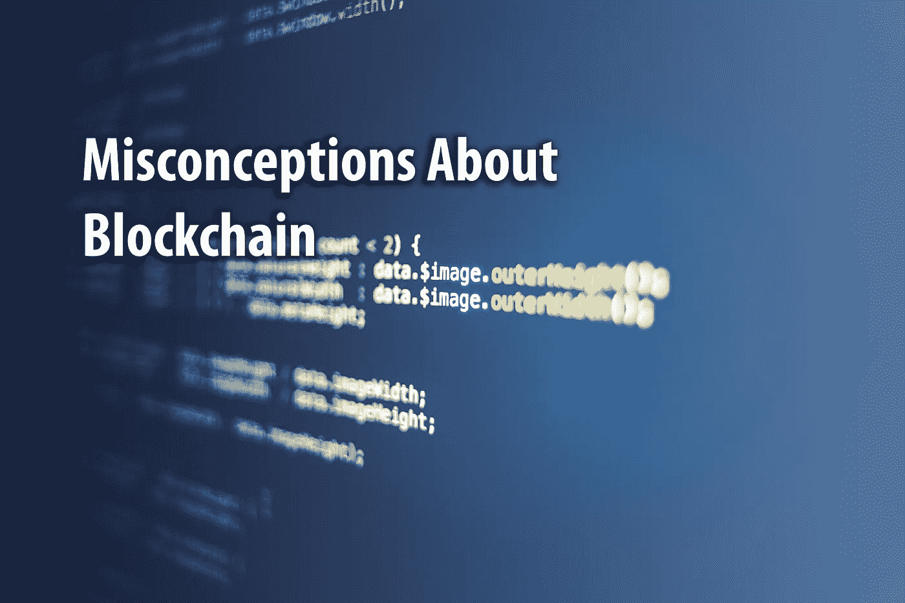

# 创新的长期阻力:关于区块链的误解

> 原文：<https://medium.datadriveninvestor.com/the-perennial-resistance-to-innovation-misconceptions-about-blockchain-c4e21cacbe27?source=collection_archive---------23----------------------->

Photo by [Markus Spiske](https://unsplash.com/photos/AaEQmoufHLk?utm_source=unsplash&utm_medium=referral&utm_content=creditCopyText) on [Unsplash](https://unsplash.com/search/photos/technology?utm_source=unsplash&utm_medium=referral&utm_content=creditCopyText)

**区块链最近变得越来越受欢迎，它在感兴趣的话题中的出现引发了关于它将如何影响我们生活的问题、犹豫和好奇。**

起初，我想写的是区块链教对我们社会生活的影响，以及我们如何在这个生态系统中相互交流。我决定最好就这个话题展开对话，为这个领域的新人们阐明一些仍然不清楚的观点。不久前，我看到了这篇博文:[生活的金融化](https://startupsventurecapital.com/the-financialization-of-life-a90fe2cb839f)，我发现这是一个很好的起点。因此，我在这里回答作者提出的关于区块链的问题和疑虑，旨在帮助澄清它们。

我希望你有机会先看看那篇博文，因为我的论点是直接回答其中的一些观点的。尽管如此，我还是复制了我正在处理的部分。

> **……**
> 
> 我的批评不是技术性的，而是心理性的。
> 
> 它跨越了感知和理解现实的领域。
> 
> **在这个领域——人们和他们的关系在解释世界时参与和分享的心理过程之一，以了解如何定位自己和如何在其中行动——像区块链这样的技术是一场灾难。**
> 
> **为什么？**
> 
> **一方面，它们是“生活的交易化”的一个非常强大的代理，也就是说，我们生活的所有元素都在逐渐变成交易。**

即使没有区块链，生活也是由大量的交易组成的。在社会层面上，我们交流思想、观点和情感。在个人层面上，我们与周围的环境、物体、人和世界互动。

区块链并没有给交易化的过程增加多少东西(真是拗口！)这并没有让这个过程变得更加激进。其实跟那个没关系。一切都已经被事务化了，只是包装不同而已。

> 另一方面，他们将注意力转移到算法、系统和框架上。这些系统不是支持和维护在人类之间建立共同责任的必要性和文化，而是以程序性的方式包括“信任”。从技术角度来说。因此，信任的必要性(以及基于人际关系赋予信任的责任)逐渐消失。
> 
> 因此，连同它，社会消失了。社会是由那些自由决定是否以及何时相互信任，并集体同意这种归属方式的人积极而有意识地构建的。

我们可以使用相同的论点来解释人们创建第三方法律实体来建立和维护人类之间的信任，因为人类层面的信任(以及社会，因此)当时没有消失，现在也不会消失。它只会转变，这一次，甚至不会非常彻底，因为这不是人类历史上第一次将信任委托给第三方实体，无论是集中的组织还是分散的人员网络。

> **技术不是中性的。**
> 
> **我可以用锤子在你头上钉一颗钉子或者把它砸碎，这是真的。但同样真实的是，只要我手里有一把锤子，一切都开始看起来像钉子。**
> 
> 对于区块链来说也是如此。一旦我开始使用它们，一旦我开始通过它们想象世界，一切都开始看起来像一个交易，一个“可标记”的东西。这是一场灾难，在这个词的古老意义上(灾难，没有星星的指引)。

诚然，技术不是中立的，在这一行，什么是中立的？它的偏性取决于是谁在应用，是以什么样的心态和意图在应用。这就好像我们说，一旦我们开始使用刀子，每个人的脖子和肚子就变得“可以切”了。但这是真的吗？更重要的是，它应该阻止我们创造和使用刀吗？

作者是如何得出这个结论的，即这种符号化是一场灾难？为什么简化我们的互动并从等式中去掉第三方会是一场灾难？作者没有回答这个问题，而是决定定义“灾难”这个词的含义。

> 一方面，我们开始设计完全开放和透明的系统。从一个角度来看这是一件好事，但从另一个角度来看这是一件有问题的事情。(除非我们对“圈子”场景的完全透明感到满意)。

如果作者所说的“圈子”指的是同名电影，那么区块链的透明度完全不是这样。这种“透明”适用于规则、条例和准则，而不是人们的个人和私人生活。在区块链的环境中，人们的隐私可能会更受尊重。

然而，在区块链的环境中，擦除以前活动的记录确实是有限的，这是这个平台的一个故意的功能，使任何从操纵数据中受益的人，无论是黑客还是腐败的政客，都很难，如果不是不可能的话。

> **机构和其他人消失，取而代之的是一种算法。谁知道信任在哪里！它无处不在，分散在对等网络中。也就是说它不在任何地方，也不在任何人身上。**

这种人的消失，或者更准确地说，工作的消失并不是从区块链的崛起开始的。早在那之前，就有了第一个自动化系统。这本身并不是一件坏事。那些自动化的工作创造了一些新的工作。一个世纪前，数据科学家和应用程序开发人员这样的工作是不存在的。现在它们很流行。因此，对于就业来说，这是一个转变而不是淘汰的问题。

至于信任，在区块链系统中，信任编织在系统的结构中，它无处不在，因为它不仅仅在一个特定的中心位置。在区块链平台中，信任存在于代码中，这就是这项技术的魅力所在。

> **区块链是关于权力分配的。**
> 
> **然而，如果我们的目标是共同创造一个拥有更多自由、团结以及关系、情感、交流和知识机会的社会，这种分配就是它的弱点。**
> 
> **因为这种权力分配不需要良心和欲望，以及这些良心和欲望的责任。因为这些都在算法里，不在我们自己，不在我们的关系里。**

区块链的权力分配如何是它的弱项？！正如作者所解释的，是因为*“……这种权力分配不需要良心和欲望，以及这种良心和欲望的责任。”那么如果良心和欲望在算法程序中被重新定义，它们就失去了价值？*

这个论点对我来说是不一致的，就像心灵哲学中的论点，对于“身心二元论”和“同一性理论”是，与“功能主义”相反。简单来说，前两者认为精神状态依赖于身体或大脑状态，如果我们改变大脑的物质物质，如果我们逐渐用逐个执行相同计算的芯片组取代神经电路，我们将不会获得相同的功能。而在功能主义中，无论物质是什么，如果执行了某种功能，就可以实现精神状态(该理论的实现在神经假体和脑机接口领域都是可用的)。

同理，如果良心和欲望可以在机器中实现，它们会不会失去价值？如果有什么的话，这两个可以在机器中更严格地实现，良心是算法中定义的一套伦理规则，而欲望，我不知道作者为什么要提出来！当欲望存在于我们的头脑中时，它会产生利益冲突和问题。那么，我们为什么要将这个特性应用到我们的交易中呢？

> **服务我们的不是算法，是我们想要的。是算法把我们变成了它本身，让我们变得像它一样。**

这确实是不真实的。当社会法则被强加在我们身上时，我们是如何变得更像法则的？算法在这方面没有什么不同。

如果作者说我们会受到算法的限制，我可以接受。但是，如果我们愿意这样做，即使这样也不是一件坏事。毕竟，在我们的付出和回报之间总有一个平衡。如果我们在一个平台上做同样的事情得到更多的便利和更好的结果，与没有它相比，我们难道不会选择那个平台吗？选择权在我们，我们可以根据自己的价值观自由选择。

考虑到所有这些，我们可以决定不把区块链作为工作或前进的平台。就像几年前我们可以拒绝接受互联网成为我们生活的一部分一样。如果互联网不是我们今天生活的一部分，它会是一个与我们现在经历的完全不同的现在。我们会少得多的便利，许多我们认为理所当然的技术因为拥有和使用互联网而得以实现。

同理，是的，区块链也有改变我们未来的力量。这是我们的选择。

**马拉勒·谢赫扎德**

[Weriz.app](https://weriz.app) 的数字营销主管

韦里兹出版社的作家[medium.com/werizapp](https://medium.com/werizapp)