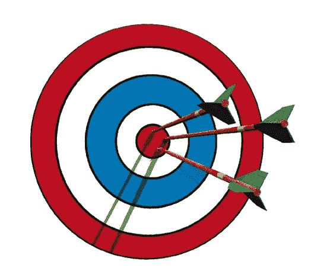

# 完美的合作关系——击中靶心

> 原文：<https://medium.datadriveninvestor.com/the-perfect-partnership-hitting-the-bullseye-41aef3c8beb?source=collection_archive---------1----------------------->

求解。Care (www.solve.care)是一个旨在打破医疗支付管理并改善医疗服务的平台。它成功地完成了象征性的销售，并获得了全额认购。

在最近于华盛顿举行的弗吉尼亚州医疗保健峰会上。护理出席并提出护理。钱包在行动。首席执行官帕拉德普·戈尔由 Solve 陪同上台。护理顾问 David Randall 博士与亚利桑那州护理网络(ACN)首席执行官 David Hanekom 博士在一起。

退伍军人健康管理局是美国最大的综合医疗保健系统，在 1，243 个医疗保健机构提供护理，每年为 900 多万退伍军人提供服务。

**ACN 伙伴关系**

ACN 已经参与解决。Care 共同开发复杂的解决方案，为大量人群提供医疗保健服务。Hanekom 博士称之为“我们的完美伙伴关系”。他接着说，是什么吸引他去解决。关心是在不需要对现有遗留系统进行大规模改造的情况下满足组织需求的能力。换句话说，解决。护理与这些系统并行，是对它们的补充。

Hanekom 博士强调了满足患者需求和提供优质、高效和及时护理的重要性。他注意到提供医疗保健并不容易，需要更有效的管理流程。ACN 采用了“行政简化”的口号，Hanekom 博士说。就及时提供适当的护理而言，护理是“消除患者和为患者服务的员工的所有痛点”。

虽然 ACN 的重点首先是改善患者体验，但如果不满足护理提供者的需求，这一目标就无法实现。听到 Hanekom 博士谈到通过减轻他们的“管理负担和低效率”来“创造更好的提供商体验”是很有趣的。他举了一个例子，他的供应商网络目前被迫打了数千个电话来验证病人的保险资格；本应花在提供护理上的宝贵时间。

Hanekom 博士表示，该伙伴关系将开发的下一个关键用例是“医生奖励方案”。他提到了他从供应商网络收到的反馈，以强调这一点的重要性:“我们需要一些不同的东西；我们现有的办法行不通”。该用例将通过奖励分级系统激励提供者提高护理标准和患者体验。快乐的病人，快乐的供应者。

令人鼓舞的是，ACN 只试验它认为可以扩展到全国的技术解决方案。这对 Solve.Care 具有潜在的重大意义。ACN 由 Tenet Health 和 Dignity Health 共同拥有，两家公司运营着近 200 家医疗机构，年收入总额为 470 亿美元。

**关心。钱包演示&小心。市场**

关怀。钱包演示贯穿了预约安排和患者与提供商钱包之间同步的用例。它还包括预约前往约会地点的适当交通工具，如有需要，还包括任何其他所需的设施(如轮椅、氧气瓶)。关心。卡片被解释和演示，理解它们的多功能性和灵活性是令人兴奋的。关心。卡片也可以针对特定的个人进行个性化处理，甚至可以用于有限的或一次性的用途。

下个月解决。Care 将运行其初始社区参与计划，邀请开发人员提交他们自己的 Care。卡片创意。这是利用外部专业知识和发现其他富有想象力的解决方案来增强医疗保健服务和改善用户体验的绝佳方式。

**总结**

联合陈述证实了 Solve 之间存在的良好工作关系。关怀与 ACN。这种伙伴关系有助于解决。注意确认和验证其平台的关键初始用例。一旦目前正在进行的试验证实了所提出的益处的实现，ACN 似乎很有可能会要求对其更广泛的网络进行大规模推广，这也可能会扩展到其母公司的设施。

正如帕拉德普所观察到的。Care 似乎“击中了我们客户实际需求的靶心”。此外，我们还了解到，目前正在与美国、加拿大和中东的一些重要潜在客户进行讨论，这进一步证明了这一点。

激动人心的时刻似乎就在眼前。

