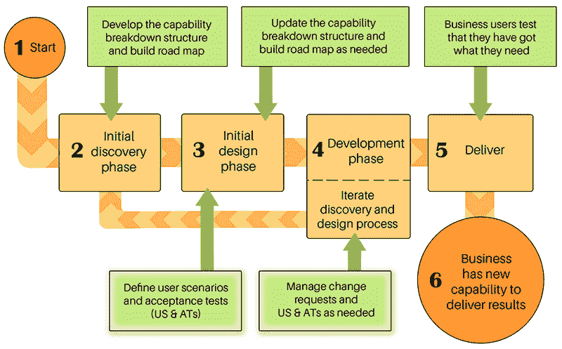
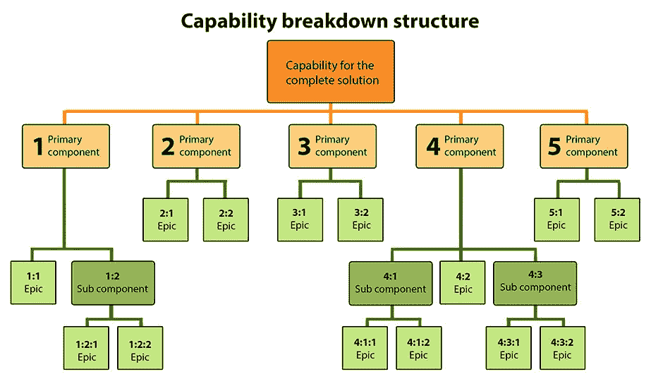

# 项目成功的完美软件需求:教程

> 原文：<https://medium.datadriveninvestor.com/the-perfect-software-requirements-to-succeed-in-your-project-tutorial-276e36cac0f8?source=collection_archive---------2----------------------->

[](http://www.track.datadriveninvestor.com/1B9E)

每位首席执行官或负责软件项目的人都需要一个强大的开发团队，他们可以信任这个团队来交付成果。但是同样重要的是要有清晰的软件需求，这样你才能有效地开发和管理你的项目。写需求需要时间和精力，但是如果你有一个好的结构和一个过程，你就不会失去重点。

# 功能需求的好处

格式良好的需求(“**用户场景和验收测试**”或**美国& ATs** )的一些好处是它们更容易理解，并且清楚地陈述了客户需要的能力。定义良好的需求对您的软件开发投资有直接的影响。如果您的项目已经因为糟糕的需求编写的复杂性而陷入困境，那么扭转局面似乎是一项艰巨的任务。这个过程需要时间和努力，但是如果你有一个好的结构和过程，你就不会失去重点。

[](https://www.datadriveninvestor.com/2019/01/25/want-to-know-who-the-leader-is-ask-him-to-decide/) [## 想知道领导是谁？请他决定。-数据驱动型投资者

### 一个有效的领导者能为组织提供的最有价值的东西之一是决策能力…

www.datadriveninvestor.com](https://www.datadriveninvestor.com/2019/01/25/want-to-know-who-the-leader-is-ask-him-to-decide/) 

好消息是，有一些经过试验和测试的沟通、开发和管理需求的过程。在软件开发领域，这是业务分析师的核心职能。业务分析师与部门经理和业务部门的成员一起工作:

*   确定业务需求。
*   编写和管理需求，以定义所需的业务能力。
*   对需要完成的工作进行优先级排序，以最好地向业务交付价值。

## 为什么团队中的每个人都需要参与

那么，谁应该参与软件需求的编写，扮演什么样的角色呢？

开发人员负责了解一个格式良好的需求的外观和感觉。这是因为需求是他们如何完成工作和交付成果的主要方向来源。为你的客户提供优质服务意味着对他们诚实，让他们知道什么时候需要澄清他们的要求。当你是被动的，基于糟糕的需求开发代码时，你将不可避免地因为糟糕的结果而受到指责。

作为一名**部门经理**或**高级用户，**你需要确保以清晰一致的方式定义自己的需求。如果你不这样做，你会使开发团队很难或者不可能交付你想要和需要的东西。当然，这意味着最终产品将无法帮助你比以前更有效地工作和交付更好的结果。你也需要问问自己，这样做会给你带来什么后果。如果你无法取得预期的进步或达到老板设定的目标，你还能指望什么？

作为**首席执行官**和**企业主，**你需要记住，如果你的团队或供应商走捷径，责任由你承担。为了让开发人员为您提供数字解决方案，他们需要了解您的业务需求。如果您不能确保为此步骤分配足够的时间、资源和预算；对你个人会有什么后果？

# 如何创建您的用户场景和验收测试

为了专注于为我们写什么组件&AT，以什么顺序，我们使用能力分解结构和构建路线图。



您可以在开始开发之前留出时间来开发项目的所有 US & ATs，或者您可以使用滚动式计划的概念。滚动式计划意味着您将把您的高层次需求基于能力分解结构。一旦这样做了，你将展开我们的发展&在项目期间的详细要求。这使您能够利用您在早期阶段获得的知识，为项目后期阶段开发的组件改进 US & ATs。这个系统还有一个好处，就是允许开发团队在获得足够的信息来交付解决方案的单个组件时就开始开发。

按照构建路线图的相同顺序定义 US & ATs 使您能够了解和识别您通常不会考虑的问题。从企业的角度来看，这通常会产生更好的解决方案。

[](https://medium.com/@donlowe/4-steps-to-create-a-perfect-roadmap-for-your-project-6a52db4f30be) [## 为项目创建完美路线图的 4 个步骤

### 每个成功的项目都需要能够协调技术和业务发展。没有一个合适的计划…

medium.com](https://medium.com/@donlowe/4-steps-to-create-a-perfect-roadmap-for-your-project-6a52db4f30be) 

# 创建一个能力分解结构

每个软件项目都是从一个想法开始的。许多人犯的错误是，在没有充分考虑企业真正需要什么之前，就从构思阶段跳到开发阶段。



这里有几个有用的提示供你在这一点上遵循:

*   将讨论重点放在实现目标所需的最终能力上。
*   避免讨论特性和功能的诱惑。他们将提供您需要的功能。
*   将功能领域分解成更小的组件，这些组件是独特的，彼此独立的。在您有足够的信息来理解最终结果应该是什么样子之前，一些功能领域可能已经深入了五六层。

# 用户场景和验收测试模式

## 用户场景模式

```
"As a (role) I want/need (add ability you need) so that (describe what the benefit of this ability is)."
```

示例:

```
"As a ​customer, I want to ​​log into my account​​​ so that ​I can see my order history."
```

## 验收测试示例

**选项 1:**

```
“As a (role) I will (specify the action/event) to confirm that (the ability you asked for) does the following (describe what you expect to happen).”
```

示例:

```
“As a ​customer, I will ​log into my account to confirm that ​correct login details give me the order history.”
```

**选项 2:**

```
“Given (one scenario and related conditions) when (specify the action/event) then (expected outcome).”
```

示例:

```
“​As a customer, I will log into my account to confirm that incorrect login details do not give me the order history.”
```

# 写得好的 US&AT 的特征

格式良好的 US & AT 具有以下特征和模式:

*   可以理解
*   独立
*   可协商
*   有价值的
*   可以估计为努力
*   小(最好少于 5 天开发)
*   可试验的

## 可理解的

US & AT 模式的结构使人们更容易快速理解客户想要什么功能。因此，重要的是 US & AT 描述所需的能力，而不是功能或特性。技术团队的职责是决定交付业务功能所需的最合适的功能或特性。

## 独立

每个 US & AT 都应该关注史诗中的独立特征。然而，epic 中的所有 US & ATs 都是相互依赖的，因为它们旨在构建最终的联合组件。这有助于变更管理，因为您可以发现进行小调整的机会。

## 可协商

这是指开发人员如何创建交付所需功能的特性或功能。产品所有者决定需要什么样的业务能力，开发人员应用他们的技术知识来决定如何最好地交付该能力。

## 有价值的

每个美国电话电报公司都必须为企业创造价值。您在用户场景构造的第三部分中定义了这个值“作为一个(角色)我想要/需要(添加您需要的能力)以便*(描述这个能力的好处是什么)*”

## 可以估计为努力

开发团队必须能够阅读用户场景和验收测试。由此，他们应该能够给出创建该能力所必需的工作的粗略估计。

US & AT 是估算所需工作量和衡量项目交付进度的主要单位。没有结构良好的 US & ATs，就不可能有效地管理项目财务和资源。

## 小

每个 US & AT 最好用不到 5 天的时间来开发。将你的需求分解成小的可理解的交付物有几个好处:

*   更容易进行和管理变更。
*   别人更容易明白你需要什么。
*   您可以尽早并经常进行测试，以确保所构建的内容是业务所需要的。
*   可以更准确地监测进展情况，从而改善财务和资源管理。

## 可测试的

验收测试描述了你将如何验证软件做了你需要它做的事情。它们有四个非常重要的功能:

*   它们使开发团队能够理解您将如何使用所需的功能，以便他们可以测试他们构建的内容。
*   它们使您能够验证您是否拥有您所要求的能力。
*   它们防止范围蔓延。
*   它们是“完成”的定义，这样你就可以衡量进展。

# 从您的业务中获得巨大收益

数字化往往是让你的业务更有效率、只需点击几下鼠标就能完成繁琐任务的关键。即使是本质上不是数字化的企业，通常也会从实施数字化解决方案中获益。

如果你有合适的数字工具，你的业务的某些方面很可能会变得更有效率。这些数字解决方案可以让您的员工更聪明、更高效地工作，也可以扩大您的市场覆盖范围。

通过投资数字化你的业务，你可以节省时间和金钱，同时增加你的收入。如果是这种情况，你不应该优先考虑让开发团队容易理解你想要什么吗？毕竟，这是确保他们快速高效地交付您所需的最佳方式。

*最初发表于*[*【https://forbytes.com】*](https://forbytes.com/blog/user-scenarios-acceptance-tests/)*。*

> ***需要一个可靠的软件伙伴？*** [***触点为字节***](https://forbytes.com/contact/)

# 阅读更多信息:

[](https://medium.com/@donlowe/what-you-didnt-know-about-effective-project-management-c5f9c56bea39) [## 你不知道的有效项目管理

### 成功之路总是在建设中，有效的产品管理是其中很大的一部分。当我们设法…

medium.com](https://medium.com/@donlowe/what-you-didnt-know-about-effective-project-management-c5f9c56bea39) [](https://medium.com/@donlowe/top-3-project-management-approaches-and-why-you-should-invest-in-them-72b7615a010c) [## 前三名的项目管理方法以及为什么你应该投资它们

### 在团队中工作是一项复杂的工作，但是团队和项目管理可能是一个更加困难的过程。每个…

medium.com](https://medium.com/@donlowe/top-3-project-management-approaches-and-why-you-should-invest-in-them-72b7615a010c) [](https://medium.com/@donlowe/how-to-create-effective-communication-in-the-workplace-where-everyone-wins-87ade51935b7) [## 如何在双赢的职场中创造有效的沟通

### 伟大的沟通是任何企业的艺术和动力。它创建了对项目及其…

medium.com](https://medium.com/@donlowe/how-to-create-effective-communication-in-the-workplace-where-everyone-wins-87ade51935b7)