# 令人困惑的宠物科技世界

> 原文：<https://medium.datadriveninvestor.com/the-perplexing-world-of-pet-tech-72c3f707a541?source=collection_archive---------5----------------------->

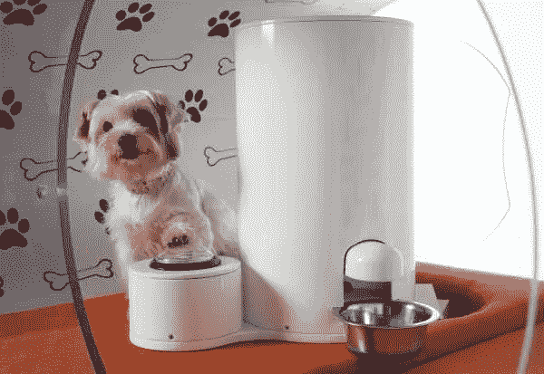

## 狗狗 Fitbits，汪翻译机，跑步机。

*(内容摘自本周版* [*the hi，tech。时事通讯。*](https://mailchi.mp/16ff381c064c/hi-tech-signup)

## *人类和动物之间的关系揭示了我们对世界的看法和我们在世界中的位置。*

*动物可以是符号、伴侣、食物、礼物、交通工具，甚至是神。*

* [## 新兴的宠物技术市场|数据驱动的投资者

### 在过去 15 年左右的时间里，花在宠物身上的钱翻了一倍多。仅在 2017 年，美国人就花费了超过 700 亿美元…

www.datadriveninvestor.com](https://www.datadriveninvestor.com/2019/02/21/the-emerging-pet-tech-market/) 

它们在我们集体想象中的位置可以追溯到最早的洞穴壁画。肖韦的墙上蚀刻着许多野牛和长毛犀牛，但没有人像。

动物和科技之间的联系也根植于我们的历史中。动物为我们一些最重要的发明提供了灵感，在工业革命之后，它们才在我们的日常生活中被边缘化。

举几个例子:蚊子叮咬帮助塑造了现代针的设计；海獭皮启发了潜水服，没有鲨鱼皮就没有鲨鱼皮套装。

**这只是对我今天最喜欢的由动物主导的创新的一个快速总结:**

*   美国国土安全部有一种模仿龙虾眼睛内部运作的装置，让它们能够“看穿”钢铁来识别违禁品。
*   隐形眼镜的未来取决于壁虎的眼睛。他们的眼睛比我们灵敏 350 倍；科学家们希望复制它们的结构，为人们提供夜视能力。
*   一家公司正在研究基于巨嘴鸟喙内部结构的汽车面板。巨嘴鸟巨大的喙由骨头和泡沫组成，既轻又结实。

“跟着我的鼻子走，它总是知道的！”就像巨嘴鸟山姆下令的方式一样，早在 [**公元 1982 年就为 Froot Loops**](https://www.youtube.com/watch?v=QLSB-oU6aUU) 。37 年后，我们接受了智者的建议。

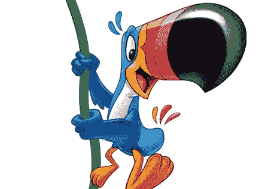

我们与家畜的关系总是与我们自己物种的现状联系在一起。

许多品种的狗都是为了在人们的生活中扮演一个角色而特别培育的。例如，澳大利亚梗是在 19 世纪被“开发”出来的，用来提供陪伴和在矿井下捕猎讨厌的动物。

我们将狗拟人化，赋予它们“忠诚”和“爱玩”的特征，但这些是人类意图的副产品，而不是天生的倾向。动物总是以人类的眼光来看待。

我上周末参加的狗展展示了众多的特质，但其中最普遍的是使用狗品种名称中的字母作为该品种个性特征的首字母。

这就像一个纵横字谜，我们对单词进行逆向工程，并对其组合字母的偶然事件应用一些因果关系。

想知道澳大利亚梗的名字是从哪里来的吗？我敢打赌，你认为这是因为它是一个澳大利亚梗。

我也是个傻瓜，直到我看到这个:

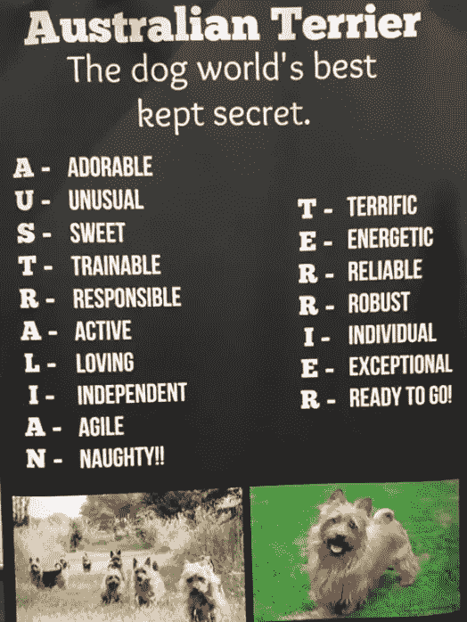

公平地说，它们是优秀的狗。我在节目中的前五名之一。

不管怎样，我们与动物相互依赖的残余影响今天仍然可以看到。动物展示了我们设计它们所拥有的特征，我们训练它们来抑制那些原始的欲望。

“宠物”一词的词源存在争议，但大多数人认为它源于一个词的组合，意思是“被宠坏的孩子”和“动物伴侣”听起来差不多。

“Pet”从 16 世纪就开始使用了，但是我们养狗至少有 15000 年了。

科学家分析了是什么导致我们今天养宠物。我们知道他们可以成为好朋友，他们带我们出去锻炼，他们甚至帮助我们与其他人交往。

一项**研究发现，我们养宠物的决定可能与基因有关。对瑞典双胞胎的分析发现，“在瑞典，遗传因素极大地促进了狗的拥有，遗传率估计为女性 57%，男性 51%。”**

**这些数字明显高于瑞典的全国平均水平。**

**是的，在这一点上，你可能想知道我们什么时候才能看到这些小玩意。**

**然而，序言确实起到了一些作用。**

****这个友好专栏的核心目标之一是理解技术如何塑造我们的集体文化和个人意识，以及如何被它们塑造。****

**确实是崇高的目标，也可能是遥不可及的目标，但我们会努力。**

**在这方面，我们通过科技溺爱宠物的方式比我们想象的更能揭示问题。**

**例如，宠物在我们的日常生活中扮演着重要的角色**

*   **68%的美国家庭，大约 8500 万个家庭，拥有一只宠物。**
*   **狗是全球最受欢迎的宠物，22 个国家 33%的家庭拥有狗，猫位居第二，占 23%。**
*   **阿根廷(82%)、墨西哥(81%)和巴西(76%)的宠物拥有率最高。**
*   **在韩国，只有 31%的人说他们有宠物，其次是香港的 35%和日本的 37%。**

**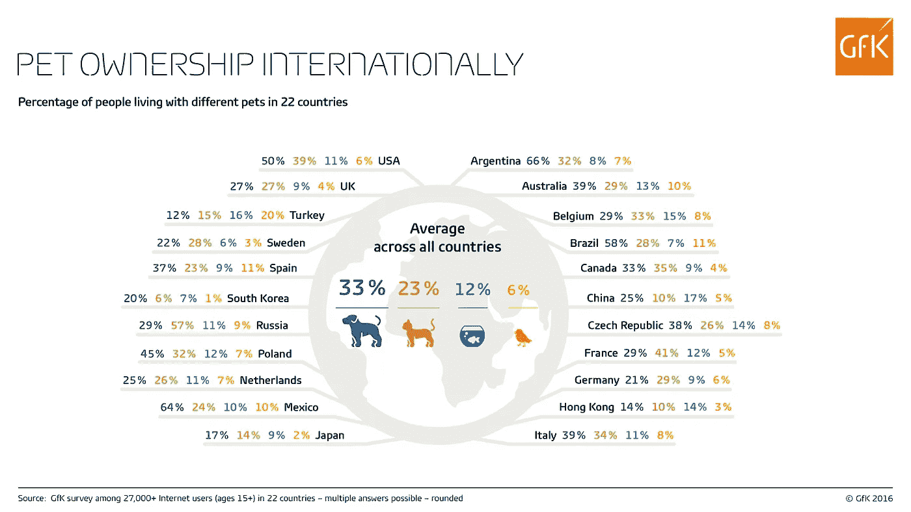**

**各国宠物拥有趋势的差异表明，我们与家养动物的关系是由当地社会塑造的。**

**我们可以进一步了解世界各国喜欢的狗的种类:**

**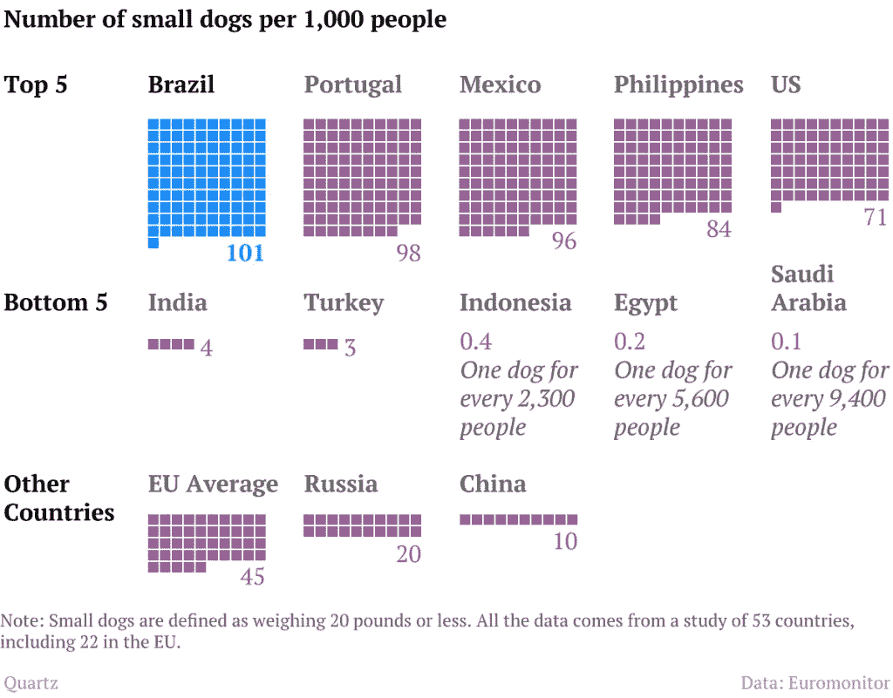**

**没有“人类”想要养小型犬的欲望。相反，某些社会保持这种偏好。**

**我们还可以在一张图表中看到永恒的猫与狗之战:**

**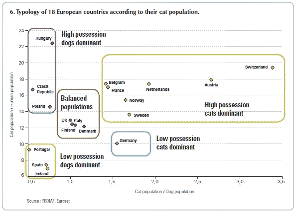**

**在城市层面也有明显的区别。这张图表向孩子们介绍了这项分析，旁边还有猫和狗:**

**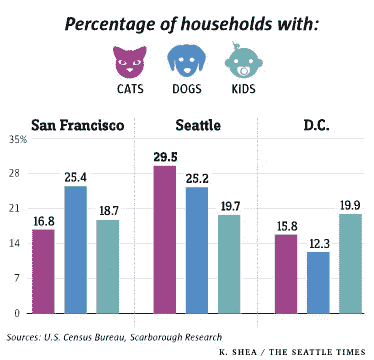**

**尽管在过去的几十年里，我们一直都养宠物，而且拥有宠物的比例也很稳定，但今天我们只是在养尊处优的朋友身上花了更多的钱。**

**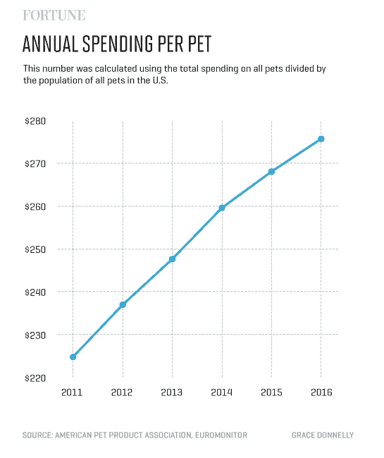**

**这为有利可图的宠物科技产业铺平了道路。毕竟，在你没有主意之前，你只能为一只猫或狗买这么多东西。**

****当今宠物技术市场的规模:****

*   **Global Market Insights，Inc .估计，到 2025 年，宠物技术市场规模将超过 200 亿美元。**
*   **美国 56%的宠物主人为他们的宠物购买了特殊技术。**
*   **宠物科技创业公司的风险投资从 2012 年的 6700 万美元增长到 2019 年的 5 亿多美元。**
*   **将物联网技术应用于家畜的专利申请数量从 2014 年的 28 项增加到 2018 年的 66 项，增加了一倍多。**

**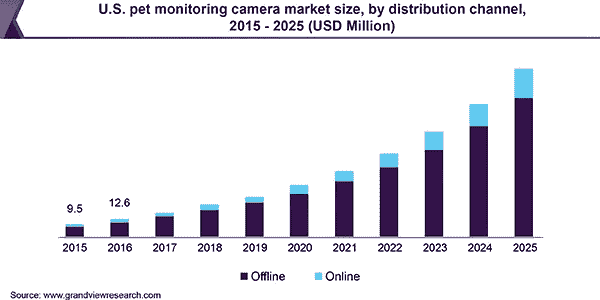**

**这显然是一个为宠物推出新玩意的好时机。但是有什么有用的宠物技术吗，或者公司只是想利用我们与家养动物联系的愿望来赚钱？**

**在下一部分，我们将在评估这项技术的真正含义之前，探索一些当今最好和最差的宠物技术创新。**

# **狂吠:今日宠物科技**

**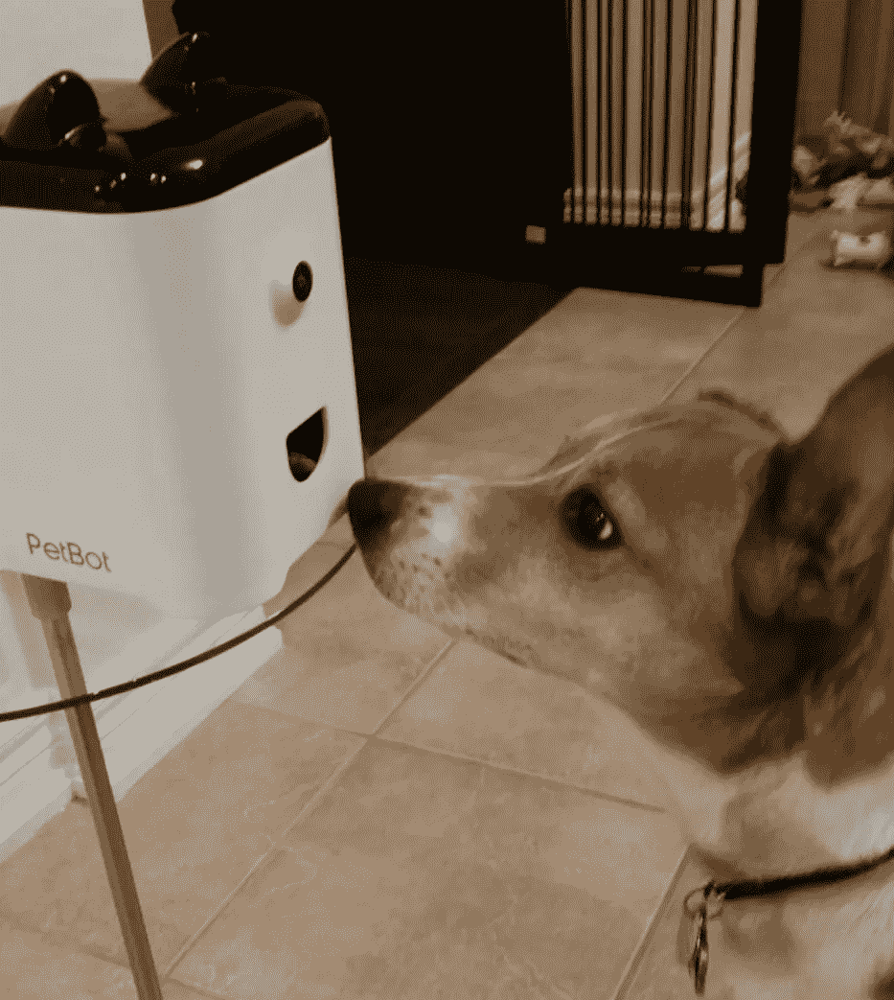**

> ****“我们发明了宠物识别——一个全新的东西。****
> 
> ****它利用了“半官方”智能——人工智能可以识别你宠物的脸，自拍并在主人不得不离开时给他们发送宠物的短片。”****
> 
> ****— Jason Yu，PetBot 联合创始人****

**通过多余的技术进步，我们很容易(也很有趣)将“宠物技术”视为我们对小动物的爱的可笑表达。**

**对我来说，宠物服装太过分了。毕竟，狗需要夹克就像骆驼需要摩托车一样。**

**无可否认，一只狗在它设计完美的自然皮毛上穿上一件夹克，就像一个孩子穿着他父亲的笨重衣服溜进一部 R 级电影，是晚期资本主义光谱的无害一端。**

**也就是说，一些宠物科技的例子确实有用。**

**因此，我们可以说，这个行业容易受到今天定义任何其他技术领域的相同力量的影响。**

**大多数创新都会失败，但有一些会无缝融入我们的生活。**

**成功晋级的将有望像这种宠物喂食器一样，它可以被编程为全天分配食物:**

**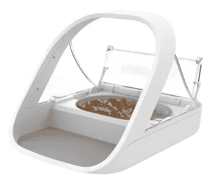**

**对于需要让宠物独处一天的主人来说，这似乎是一个有用的工具。**

**其他自动喂食工具也有，比如这个，由一只看起来像知道自己在广告中而宁愿在其他地方的狗模仿的:**

**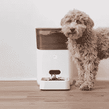**

**这个自动清洁猫砂盒也是安静天才的作品:**

**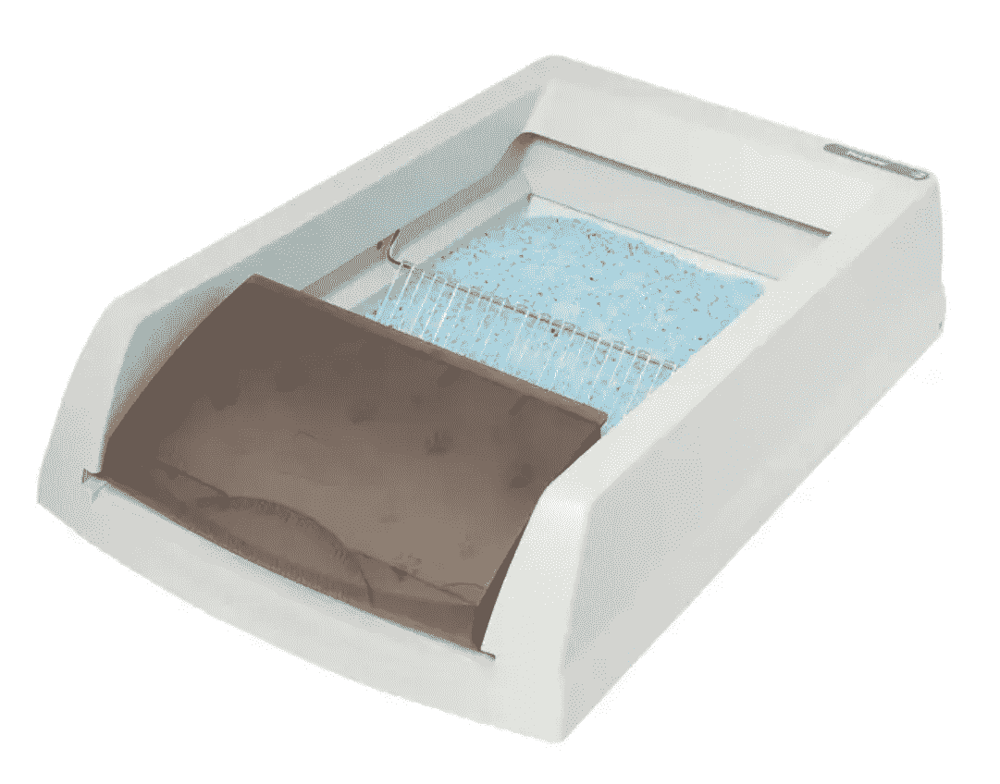**

**当然，这些技术代表了当今更广泛的宠物科技产业。**

**宠物技术现在已经正常化，以至于全国性的报纸可以刊登关于“六大狗狗健康追踪器”的文章，而没有丝毫的讽刺意味。**

**下面，我试图收集当今市场上最雄心勃勃、最不明智、最疯狂的宠物科技。**

## **iFetch**

**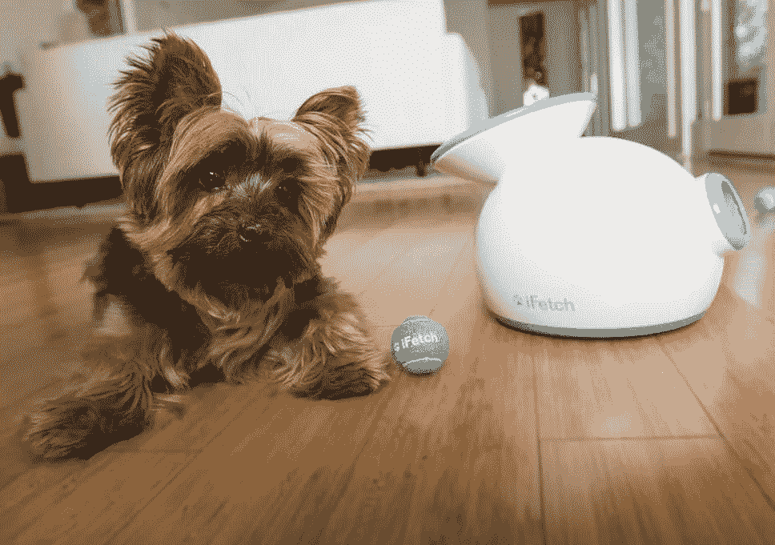**

**这项运动消除了投球的困难。宠物主人将球放在顶部，iFetch 将球射出，射到三个编程距离中的一个。**

**训练狗把球放进机器里也是可能的，所以你在任何阶段都不需要伸展肌肉。这个设计足够好，但它让我想到孤独的囚犯对着墙扔网球。**

## **狗用 GoPro 背带**

**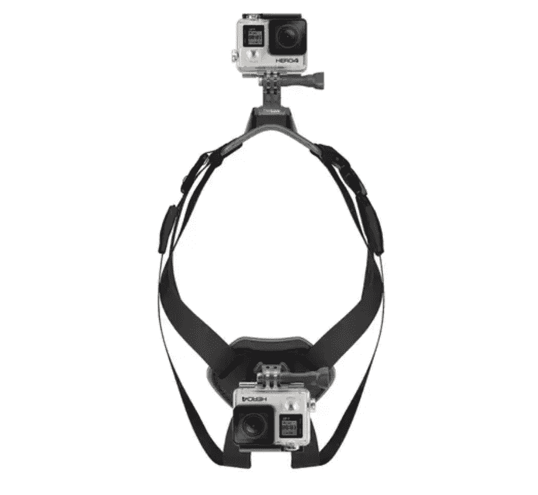**

**是的，它可以让你给你的狗绑上 GoPro，这样它就可以拍摄它看到的东西(地面，猫，灯柱)，然后再回头看。**

**网站上的宣传 bumpf 说它可以把你的狗变成 YouTube 明星，这听起来似乎有点道理。创造性地使用并配上合适的画外音，它甚至可以成为一部红极一时的电视剧。**

## **不再汪汪叫了**

**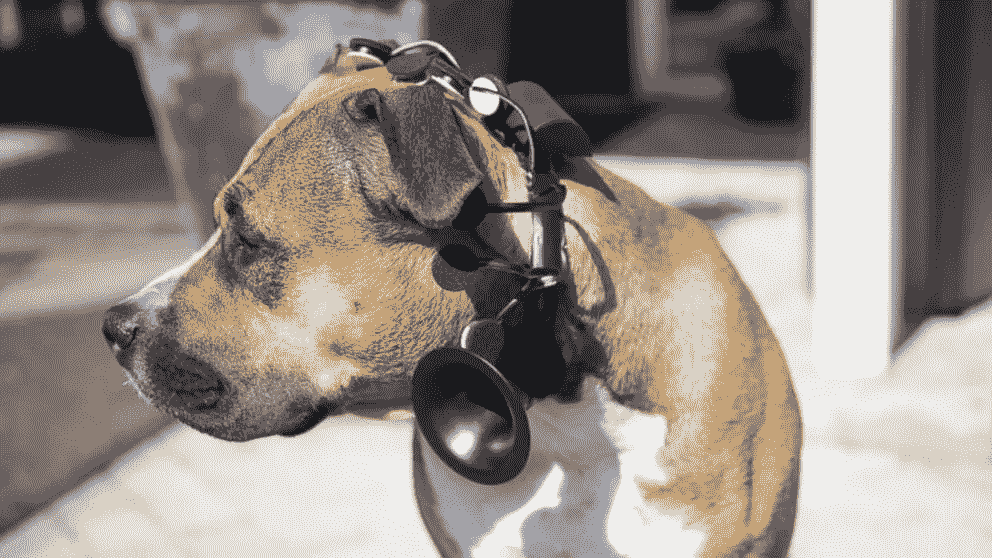**

**很难挑出一种能让狗“说话”的设备。No More Woof 之所以被裁掉，主要是因为它包含了一个扬声器。**

**由斯堪的纳维亚科学家发明，它解释狗脑电波中的信号模式，并将其转化为短消息，通过扬声器播放。**

**例如，如果门铃响了，狗可以说，“我很好奇那可能是谁。”**

**在晚餐时间，狗可以说，“虽然我饿了，但我今晚更喜欢另一种食物。”**

**这些是该公司引用的真实短语。**

**毫无疑问，这些优雅的语言风格与狗在这种时刻疯狂和不稳定的身体行为不一致。**

**同样来自这家公司:宠物飞毯。仍在开发中，它会让宠物像阿拉丁一样在地毯上飞。他们混乱的网站是 [**这里**](http://www.nomorewoof.com/) 。**

## **狗起搏器跑步机**

**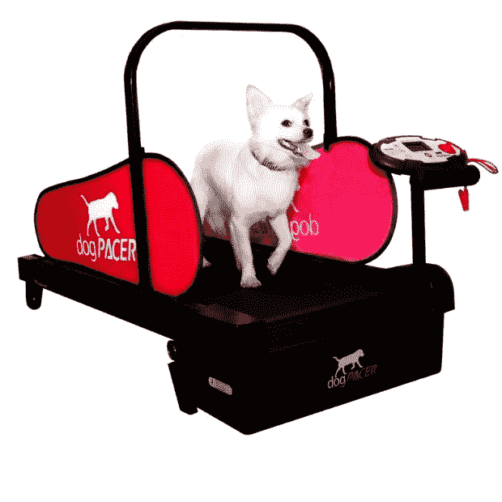**

**本周，我向几个人提到了这项宠物科技，但大多数人都认为这是个玩笑。**

**唉，很真实。**

**该网站称，这是市场上最实惠的狗跑步机之一，可悲的是，这表明还有其他人。**

**天啊，还有其他人。这是 Firepaw dog 跑步机，仅售 899 英镑外加 99 英镑邮费。**

**在一个已经荒谬的环境中，真正吸引我注意的是 99 英镑的邮资，因为它看起来像一个中世纪的酷刑装置。**

**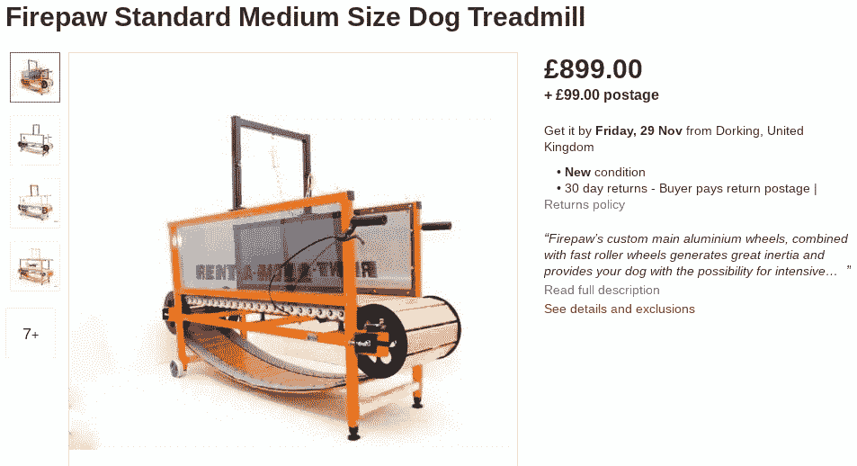**

**理论上，我可以想象狗用运动机器的情况。恶劣的天气，某种伤害，主人的时间不够，都可能使这个小工具有用。这是我们生活的时代的直接结果。**

**但是，你怎么让一只狗在跑步机上跑呢？**

**我发现让一只狗洗澡是不可能的，更不用说让一只狗当场慢跑了。**

## **PETKIT 智能舒适猫**

**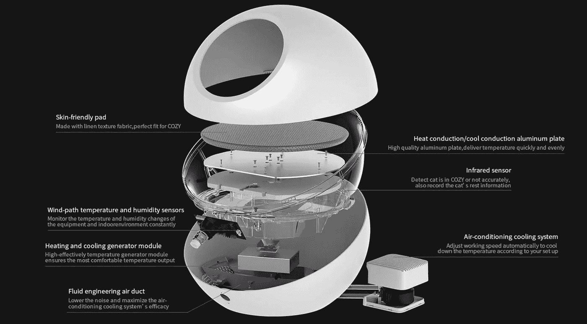**

**猫可能比狗聪明(这是有争议的，我承认这一点)，但它们无法逃脱宠物科技行业的魔爪。**

**这个有趣的超顶装置是猫的智能房子，充满了温度控制，睡眠监测和风道湿度传感器。它有一个应用程序，所以你可以在外出时调节温度。**

**我最近在撒丁岛和一只流浪猫成了朋友，她吃了一碗牛奶和一包奇巧就足够开心了。一只猫是否需要空调是有争议的。**

**这还不是这个智能家居最奇怪的地方。看看他们用来说明产品运行的图片就知道了:**

****

**他们似乎 PS 了一张受惊的猫的照片，给人的感觉是这只猫在里面过得特别不好。**

**我应该说，类似的发明也存在于狗身上，包括三星的狗梦之屋。至少，他们用了一张狗的照片，这张照片看起来有点满足于待在那里。**

****

## **富尔博**

**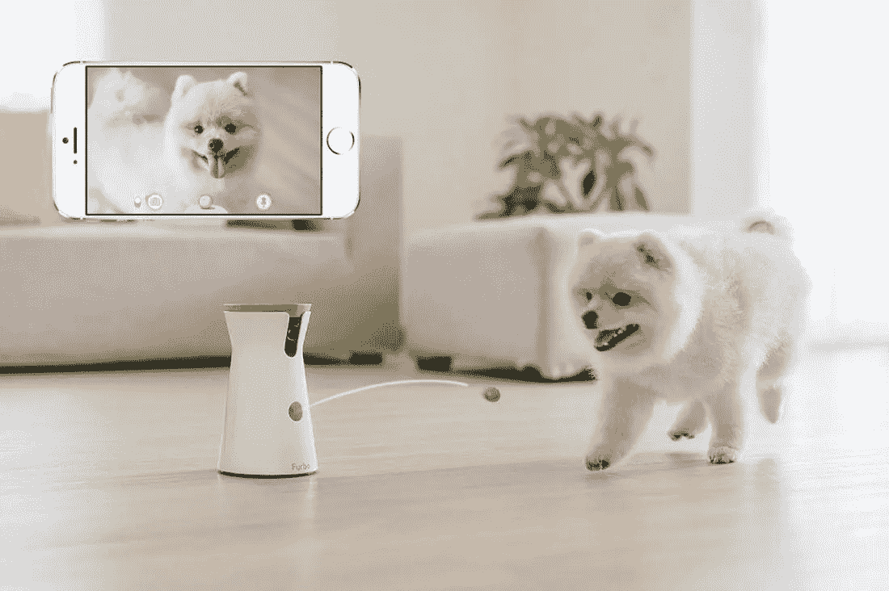**

**我们以 Furbo——扔糖果的狗摄像机——来结束本周的文章。**

**有了 Furbo，狗主人可以全天查看他们的宠物，并按下一个按钮给狗一个奖励。**

**如果狗叫，它甚至会向主人的手机发送推送通知。**

**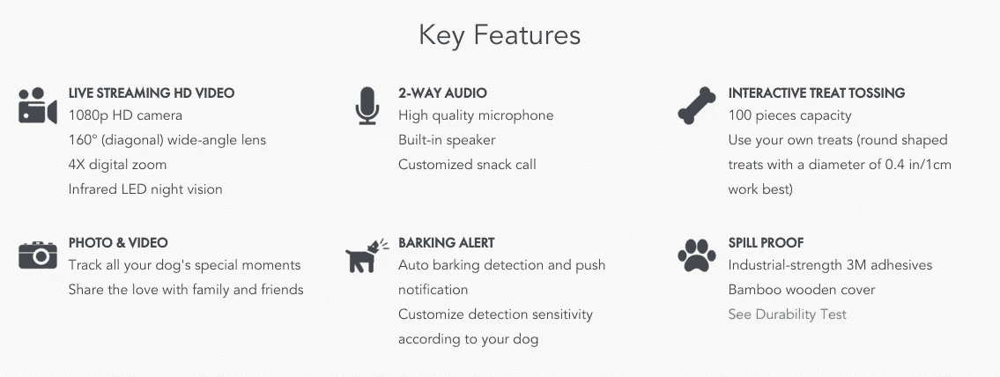**

**几年前，我们装了一个摄像头来监视家里的狗 Champers。这是有新闻价值的，只是因为那天他发现了照相机:**

**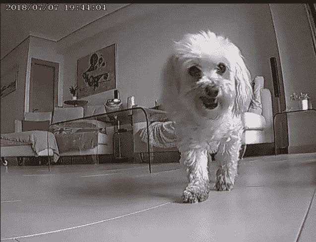****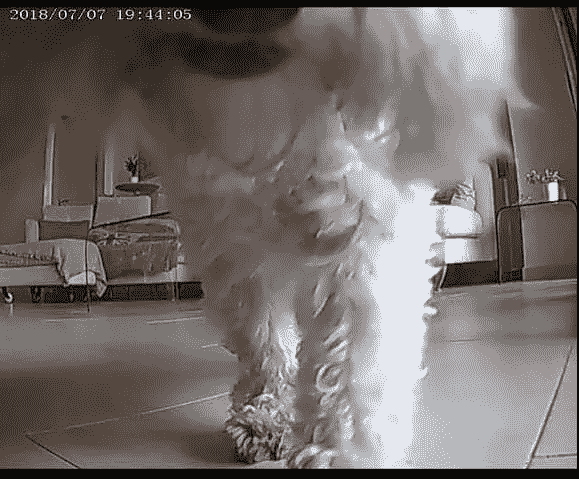**

**我们以 Furbo 结尾还有其他原因。**

**它提出了技术对我们理解世界的影响的问题。**

**一切都被编码，“数据驱动”，通过一个设备控制。**

**这将导致我们与动物关系的根本改变。**

**我们最好记住动物可以教给我们很多东西。当我们把它们封闭在我们对在当今技术密集的世界中生存意味着什么的有限理解中时，我们就减少了它们的真实性。**

# **“[注意力经济]与这样一种观点联系在一起，即一切都是一台机器，它只需要被修复，或者变得更有效率。”珍妮·奥德尔***