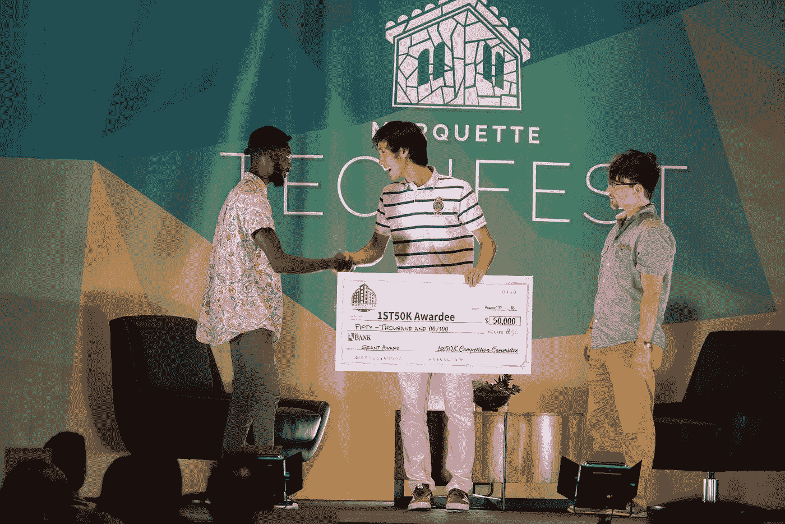
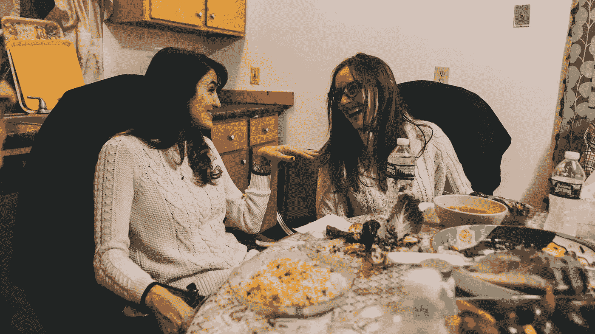
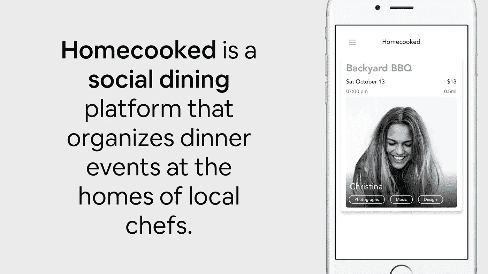

# 赢得 82，000 美元的摊位游戏

> 原文：<https://medium.datadriveninvestor.com/the-pitch-deck-that-won-us-82k-c241eba7f4db?source=collection_archive---------13----------------------->

## 前 30 秒你就赢了。原因如下

Accepting the [1st50k Startup Competition](http://1st50k.org) Award — a big ass check.

几个月前，我的朋友 Vaibhav 辞去了他在 Lazard——世界上最大的金融公司之一——的工作，开始创业。他是我认识的最有能力的人之一，但刚开始工作不久，他就给我发短信说他在苦苦挣扎。

“我真的相信我们正在建设的东西，”Vaibhav 说。“但是我们的现金快用完了。不知道[吃货](http://thefoodieapp.com)没有资本还能走多久。”

正如我之前所写的，我发现[的创业生活可能是混乱和孤独的](https://medium.com/@talldarkandhojung/finding-balance-in-chaos-a-dropout-startup-ceos-take-1f2ec269768a)——我想确保我的朋友不必独自应对所有这些事情。因此，在一个秋天的下午，我打电话给维布哈夫，当时他正在马克·吐温国家公园徒步旅行。

当我走上一个小悬崖的堤岸时，我问瓦伊巴夫:“你有没有尝试过申请任何投球比赛？”

“我不知道，我不太相信球场比赛，”他说。

我回答说不是为了比赛，是为了讲一个让人有所感悟的故事。爬上斜坡，树木逐渐消失，露出一片空地，陡峭的斜坡伸入深蓝色的泻湖。我坐在这里，拿出我的笔记本电脑，告诉他我会给他发一封电子邮件。

“你给我发什么？”瓦伊巴夫问道。

“这，”我说，“是赢得我们 82，000 美元的球场。”

## 构建不可否认的叙事

我发给 Vaibhav 的宣传资料是为我们的初创公司 [Homecooked 准备的，这是一款社交餐饮应用，在当地厨师家中组织小型公共餐饮](http://www.homecooked.io)。如果你喜欢通过食物交流，你很有可能会喜欢上[产品](http://bit.ly/homecookedsocialdining)。

当我们在一月份开始的时候，这个项目只不过是一些鸡毛蒜皮的小事。到 8 月份，我们已经建立了一个平台，帮助我们完成了 82，000 美元的非摊薄拨款。没有稀释。我们没有放弃百分之一的股权。作为大学生创业者，它给了我们宝贵的跑道，让我们对退学的决定充满信心。

牵引力、团队、市场规模——当然，这些都很重要。但所有这些都只是锦上添花。如果你不能在最初的 30 秒内吸引住你的观众，这些事实将会完全落空。

相反，我们在前两张幻灯片上磨砺，以立刻建立一个强大的叙事结构。以下是我们如何在 30 秒内完成的:

The first slide. [Homecooked: Social Dining.](http://bit.ly/homecookedsocialdining)

## #1.对趋势的洞察

通过 20 场比赛，我几乎见过所有的滑梯组合。90%的创业公司用一个*问题—解决方案*框架来建立他们的营销。通常他们会附上一个旨在吸引观众注意力的个人故事。

这就是为什么它不起作用。你的故事越个人化，任何一个法官实际遇到同样问题的可能性就越小。即使他们这样做了，人们*也不喜欢被告知他们有问题，你可以解决它。*

相反，我们喜欢从这两件事开始:

1.  展现对广泛社会趋势的洞察力。
2.  说明为什么会恶化。

> 57%的饭菜都是一个人吃的。这个数字每年都在上升，每一代人都越来越孤独。

创始团队不仅洞察了一种趋势，而且还挖掘了一种持续增长的趋势。它立即传达出你的业务因团队知识和不断增长的市场而得到加强。

## #2.为什么重要？

> 先说为什么。—西蒙·西内克

在《华尔街之狼》中，莱昂纳多·迪卡普里奥扮演的角色正在舞台上接受一场演讲。他沉默地停下来，看着外面的观众。然后，他慢慢走下舞台，走到第一排。他直视观众的眼睛，说:

> [把这支笔卖给我。](https://www.youtube.com/watch?v=ftFAbPnNYrg)

在迪卡普里奥阻止他之前，这个可怜的家伙结结巴巴地说出了这支笔有多棒，然后继续他的下一个受害者。当他往下走的时候，每个观众都在谈论这支笔是什么，谈论它的优秀品质。迪卡普里奥打断了他们，从他们手中夺走了钢笔。

当然，这支笔可能会很棒。但是为什么*我*要买呢？为什么这很重要？

这与你做什么无关。这就是世界需要它的原因。

以下是我们的原因:

> 孤独正在慢慢地*杀死我们*。心理健康问题正在激增。我们现在知道，数字化隔离正在直接损害所有社会经济阶层和年龄层的健康。

孤独的趋势将很快影响到大量的人。它将对我们的精神和身体健康产生非常真实的影响。通过社交媒体的大规模数字化是一个主要的影响因素。

我们真正构建的东西解决了大量人苦苦挣扎的核心需求。

在你提出解决方案之前，这会让你正在构建的东西具有影响力。

## #3:你是怎么做到的？

A photo from Fayzeh’s table. Fayzeh is a Syrian home cook and mom, and one of our most amazing Homecooked hosts.

> 今天，我想告诉大家，我们希望如何重新联系家庭餐桌周围的人们。

在你谈论你正在建造的东西之前，告诉评委你将如何去做。在告诉他们产品是什么之前，这表明了你的产品*的目的。*

所有这些都为你打下了基础。

## #4:你在建造什么？

在 30 秒结束之前，我们甚至不知道我们在做什么。因为这是最不重要的。

And if you love connecting with people over food, you can download it [here](http://bit.ly/homecookedsocialdining).

如果我们从这里开始，评委们会想:

> 哦，他们在卖家常菜。

但我们不是在卖食物。我们正在提供一种连接*人*的体验。

但是如果我们不从孤独的潜在趋势入手，这一切都没有意义。我们所做的不会强迫人们——让他们*感受到*某种东西。

但是我们为什么要这么做呢？这是很强大的。

这是完整的 30 秒。我们在每个部分之间暂停一下，从**趋势-影响(为什么)-如何-什么**开始。

> 57%的饭菜都是一个人吃的。这个数字每年都在上升，每一代人都越来越孤独。
> 
> 孤独正在慢慢杀死我们。心理健康问题正在激增。我们现在知道，数字化隔离正在直接损害所有社会经济阶层和年龄层的健康。
> 
> 今天，我想告诉大家，我们希望如何重新联系家庭餐桌周围的人们。
> 
> Homecooked 是一个社交餐饮平台，在当地厨师家中组织小型公共餐饮。每个事件都是个人的、亲密的、独特的。

如果你遵循这个框架，会发生这样的事情。

**在你推销的前 30 秒内，你已经成功地进行了沟通:**

1.  你对趋势的了解。
2.  这种趋势的影响。
3.  你如何以及为什么建造。
4.  最后，也是最不重要的 : *你正在构建的*。

## 最好的推销是关于重要的问题

当然，成功的推销绝不仅仅是套牌。无数的时间被用来建立伟大的企业。每个方面*都与*相关——团队、市场规模、吸引力、**愿景**。

但是，当通过拨款和竞标来激励初创公司时，故事才是王道。最好的故事是围绕重要的问题展开的。

> 求解。问题。那个。事。——Chamath Palihapitiya，[社会资本](https://www.socialcapital.com/)的创始人兼首席执行官

这与球场比赛无关。这是一个故事，是你业务各个相关部分的基础，寻找会购买你所卖产品的客户、会支持你的风险投资伙伴，以及会成为你创始团队核心的队友。

## 应许之地

就在我们通话两周后，Vaibhav 给我回短信说他刚刚得到了 Y Combinator 的面试机会——Y Combinator 是世界上最负盛名的创业加速器。

然后，两周后，Vaibhav 欣喜若狂:**他刚刚被 Y Combinator 的 W19 班录取。**

下次我去旧金山，他请客。