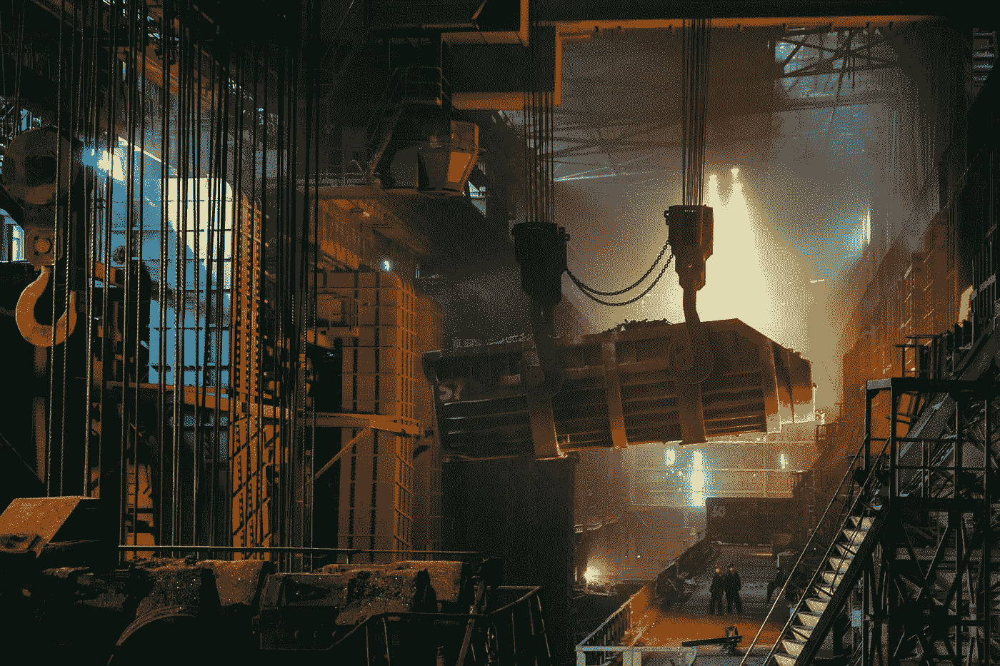
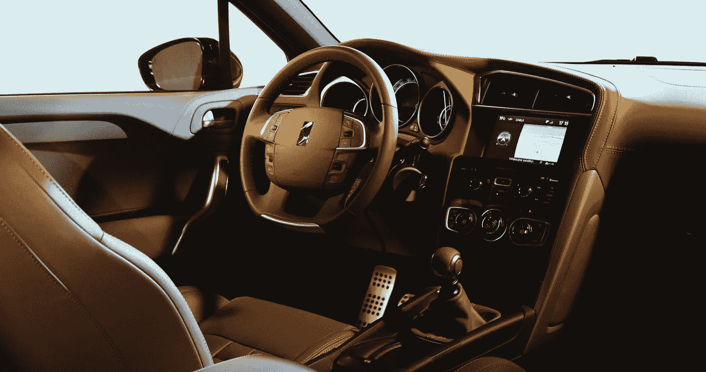

# 机器学习和人工智能在汽车行业的地位

> 原文：<https://medium.datadriveninvestor.com/the-place-of-machine-learning-and-artificial-intelligence-in-the-automotive-industry-618368db80f9?source=collection_archive---------0----------------------->

说到车辆，拨号盘和开关用来控制一切。随着[汽车行业](https://www.fpt-software.com/industries/automotive/)的发展，其规范也在发展。今天，我们正在快速走向一个共享和自动驾驶汽车的世界。

汽车制造商实施了一系列人机界面技术(HMI)，包括语音控制、面向内部的摄像头、触摸感应表面和更智能的个性化平台。

 [## 在自动驾驶汽车发生事故的情况下，谁应该承担法律责任？数据驱动的投资者

### 我仍然认为自动驾驶汽车是一种奢侈品，而不是必需品…

www.datadriveninvestor.com](https://www.datadriveninvestor.com/2018/11/02/who-is-legally-accountable-in-the-case-of-an-autonomous-vehicle-accident/) 

语音控制是 HMI 比例最高的首选界面之一，因为它允许免提控制，因此减少了对道路的干扰。其他示例包括多功能控制器、触摸屏和平视显示器。

机器学习和人工智能在汽车行业的地位

相当长一段时间以来，自动驾驶一直是汽车行业关注的焦点。没有人工智能的帮助，这个革命性的概念是不可能实现的。

人工智能在几个部门得到了快速实施。然而，它给汽车行业带来的优势是目前的一个趋势问题。汽车制造商和科技公司正在竞相开发最好的人工智能和自动驾驶技术。

人工智能在汽车行业的应用不仅限于自动驾驶。人工智能和机器学习也有助于保持我们的安全和联系。此外，正是这些新兴技术现在被应用在制造过程中。

所有这些加起来是一项有利可图的生意。未来五年，人工智能在汽车制造和云服务中的价值[将超过 107.3 亿美元](https://www.marketwatch.com/press-release/automotive-artificial-intelligence-market-share-will-increase-us-1073-billion-by-2024-2018-10-07)。汽车行业使用新兴技术来模仿和支持人类行为。今天的联网汽车和未来的汽车将依赖于人工智能系统。

为了确定机器学习和[人工智能](https://www.fpt-software.com/service/artificial-intelligence/)在汽车行业的地位，我们列出了一些用例:

# 云服务

联网车辆会产生大量数据。预计自动驾驶汽车将[每天制造 4000 GB](https://www.futurecar.com/876/Think-Your-Cellphone-Uses-a-lot-of-Data-Report-Claims-Autonomous-Cars-Will-Use-4000-GB-in-one-Day-)。人工智能云平台确保所有这些数据在需要的时候都可用。云服务提供的一些机会包括:

# 个性化营销

广告竞争很激烈。这使得个性化广告对有效营销至关重要。此外，要锁定合格的潜在客户，您需要浏览未分类的数据，这非常不切实际。

基于人工智能的云平台是完美的解决方案。它们与大数据和车辆信息娱乐系统的连接可用于向驾驶员提供个性化建议。在这种情况下，人工智能的力量在于它知道司机，并可以根据他们的位置做出相关的提议。

# 预测性维护

我们现在已经习惯了用油和检查引擎灯来提醒我们的车辆。然而，联网汽车可以做的远不止这些。人工智能监控一个传感器中的所有传感器，这使它能够在任何潜在问题发生之前检测到它们。

人工智能可以很容易地发现任何可能表明故障的变化，远在它可能影响车辆性能之前。去年[大众与微软](https://internetofbusiness.com/vw-microsoft-partnership-connected-vehicles/)合作，这是他们对未来汽车云计算感兴趣的明显迹象。这种合作关系使这家汽车制造巨头能够向其客户提供预测性维护和无线软件更新。

# 人工智能驾驶

在驾驶方面，人工智能大有可为。以下是它为汽车提供的两个主要机会:

# 自动驾驶

自动驾驶汽车可能是汽车行业讨论最多的话题。该领域的所有领导者都宣布了他们向客户提供自动驾驶汽车的时间表。

除了大脑之外，汽车拥有一切可以带我们到处跑的东西。给他们提供一个或人工智能，可以让他们足够聪明，不再需要司机。然而，这是一个即使是现代计算机程序也无法处理的任务。人工智能允许车辆学习，这就是驾驶的要求。

特斯拉非常接近开发完全无人驾驶的汽车。另一方面，谷歌的 Waymo 已经在路上测试了相当长一段时间。人工智能为这种车辆提供的最重要的优势是学习和调整其规则的能力。此外，车辆收集的所有信息可供车队的其他成员使用。这就创造了一个边走边学的汽车网络。

# 驾驶员辅助

如果你觉得自动驾驶汽车离我们还有点远，这里有一个更流行的人工智能功能——驾驶辅助。在摆脱方向盘之前，汽车行业应该让其客户和监管机构对人工智能的存在感到舒服。

这就是为什么近年来驾驶辅助系统越来越受欢迎。汽车巨头，如梅赛德斯-奔驰，已经推出了他们的[驾驶辅助包](https://ride.tech/self-driving/techsplaining-mercedes-benz-driver-assistance-package/)，并在他们的最新车辆中实施，以改善驾驶员的体验。

交叉交通检测器、盲点监测和紧急制动只是这些助手提供的一些功能。如果需要避免事故，他们甚至可以紧急控制车辆。

# 智能制造

人工智能不仅改善了最终产品，还改善了总体制造流程。

装配线机器人已经成为汽车生产的一部分[超过 50 年](https://www.robotics.org/blog-article.cfm/The-History-of-Robotics-in-the-Automotive-Industry/24)。然而，新的智能机器人现在可以和他们的人类同伴一起工作。[现代背心外骨骼(H-VEX)](https://techxplore.com/news/2018-10-hyundai-exoskeleton-aims-workers-strains.html) 在 2018 年成为起亚汽车制造流程的一部分。它为装配线提供可穿戴机器人。

人工智能有助于整体生产，同时感知人类员工的工作，并调整他们的动作以避免伤害他们。更重要的是， [AVGs](https://en.wikipedia.org/wiki/Automated_guided_vehicle) (自动引导车)可以自己在植物周围移动材料。它们可以识别路径上的物体并调整路线。还有喷漆机器人，它遵循预先编程的程序，可以提醒质量控制人员任何已识别的缺陷。

所有这些都由人工智能驱动，以在不影响质量的情况下，将生产时间缩短到最低限度。

# 保险

保险公司试图预测未来，拥抱人工智能技术使他们能够比以往任何时候都更好地做到这一点。它有助于实时进行风险评估。对客户来说非常方便的是它在事故发生时提出索赔的能力。

保险公司和人工智能的合作创造了保险技术。该技术可以根据驾驶员的风险因素创建他们的风险档案。它可以根据驾驶员之前的行为预测他们的行为。AI 可以识别任何可能影响他们安全驾驶能力的个人问题。

此外，保险公司可以为他们的客户提供汽车应用程序，在紧急情况下帮助司机。

# 走向智能汽车

正如我们列出的用例所表明的那样，机器学习和人工智能在整个汽车行业的发展中发挥着重要作用。从智能工厂到自动驾驶汽车，人工智能技术是创新的核心。它赋予物体学习的能力，因此我们可以比以往更有效地使用它们。

每年都有新的人工智能解决方案在汽车行业实施，所有这些都让我们向更高效的制造和无人驾驶的未来迈进了一步。这些功能可以无缝过渡到完全自主模式。在[“未来汽车行业结构— FAST 2030”报告](http://functionalprint.com/wp-content/uploads/2018/11/Owyman-openFast-2030Pamplona.pdf)中，HMI 被称为到 2030 年将重塑汽车行业的七大趋势之一。其余的一些包括自动驾驶、联网汽车和电动汽车。

HMI 联网汽车目前正处于过渡阶段。为了一窥未来，我们将分享一些人机界面趋势，这些趋势正引领我们走向更直观的[联网汽车](https://www.fpt-software.com/service/connected-vehicles/)。

# 汽车是我们的助手

梅赛德斯-奔驰透露，新的 [MBUX(梅赛德斯-奔驰用户体验)](https://www.mercedes-benz.com/en/innovation/mbux-mercedes-benz-user-experience-revolution-in-the-cockpit/)充满了 HMI，如自然语音交互，触摸屏和触摸板。他们的目标是让用户容易访问系统。

在机器学习和人工智能的帮助下，这款 MBUX 还能够预测司机的愿望，例如将收音机调到他们最喜欢的电台。其他虚拟助手如亚马逊的 Alexa 将你的数据发送到云服务器，而梅赛德斯-奔驰将所有数据保存在汽车中。

这个系统将作为他们一致的基础层，他们也将在未来的工作中使用，成为消费者可以依赖的东西。

[沃尔沃的最新概念](https://www.volvocars.com/sg/cars/new-models/xc60/stories/intuitive-user-experience)根据重要性对信息进行优先排序。他们把它分成以下几类:“现在”，也就是说，出现在司机面前的信息；“过一会儿”——降低到方向盘后面的仪表组中，以及“无论何时”——所有信息都显示在中央的大触摸屏上。

早在 2017 年，沃尔沃和谷歌就合作开发了基于 Android 的下一代信息娱乐系统。这个想法是为车主提供个性化的体验和预测服务。这些功能还包括访问 Play Store 和谷歌地图。

汽车制造业正朝着把汽车变成不仅仅是交通工具，而是变成一个连接设备的方向发展，就像你的智能手机一样。

# 屏幕之外

启动汽车人机界面革命的是用仪表板屏幕取代按钮。后来，语音命令被包括在内，汽车开始向司机学习。奥迪 A8 配有 AMOLED 显示器，用于后座娱乐。预计越来越多的型号将配备这种先进的显示器，主要是因为它们为信息娱乐功能提供了清晰度。

博世目前正在研究被动 3D，这将引起人们对危险的注意，并且不需要特殊的镜头来实现这种效果。

然而，人机界面的进步远远超出了屏幕。虹膜扫描仪和机舱摄像头将用于监控司机的行为，因为我们距离完全自动驾驶汽车还有几年的时间。

随着自主性的提高，驾驶员注意力的重要性会降低。这意味着制造商必须实现车主、乘客和车辆之间的沟通。

[BYTON](https://www.byton.com/) 展示了与司机和乘客进行不同互动的人机界面，以实现进一步的个性化。他们希望为车里的每个人提供舒适的旅程，而不仅仅是司机。

# HMI 在互联汽车中的发展

人机界面旨在为驾驶员提供多种方式来与车辆的功能进行交互。制造商现在正与 IT 公司合作，创造更好的、颠覆性的人机界面。新的可能性，如从物理显示器转向[增强现实](https://www.fpt-software.com/service/ar-vr/)平视显示器(hud)一直在出现。

自主性水平的提高将使这些挡风玻璃 hud 成为必须。这带来了诸如触觉和运动控制的优势。不仅通过语音控制，而且通过简单的手部动作，功能将变得可远程访问。这种系统被称为触摸全息主动。

正如我们已经提到的，HMIs 也指乘客。车载信息娱乐系统将能够为车里的每个人提供他们想要的活动，并与外界联系。

旅行体验现在正在发生根本性的变化，制造商应该跟上最新的技术。完全自动驾驶汽车的逐渐到来激发了与车辆互动的新方式。

如今，我们总是试图通过让周围的物体变得智能来缓解我们的生活。这正是远程信息技术发展背后的原因。它已经成为大多数交通工具的一部分，不仅包括我们每天驾驶的汽车，还包括船、卡车和飞机。

远程信息技术正在重塑联网汽车的未来。据预测，这项技术将很快被汽车行业广泛应用。预计到 2026 年，全球车载信息系统市场[将达到 980 亿美元](https://www.globenewswire.com/news-release/2019/06/11/1867173/0/en/Vehicle-Telematics-Market-To-Reach-USD-98-27-Billion-By-2026-Reports-And-Data.html)。

根据[麦肯锡的研究，](https://www.mckinsey.com/industries/automotive-and-assembly/our-insights/telematics-poised-for-strong-global-growth)如今汽车远程信息技术的采用水平仍低于 20%，但一旦达到 40%，死亡人数将大幅下降。为了显示远程信息处理的全部潜力，需要对该技术进行更大的调整。

为了更深入地了解远程信息处理的优势，我们列出了它推动未来交通的一些方式，但首先，让我们做一个简短的介绍。

# 什么是远程信息处理？

正如我们已经提到的，远程信息处理监控和共享关于车辆和其他物体的运动、行为和状态的有用信息。它是[物联网](https://www.fpt-software.com/service/internet-of-things/)的一个分支，专注于长距离传输的挑战。

今天广泛使用的全球定位系统与 12000 英里外的卫星通信。远程信息处理允许车辆每秒钟与 GPS 通信多次。这提供了位置或交通的实时更新，就像 Waze 应用程序一样。

GPS 不是远程信息处理的唯一应用。黑匣子是另一种，它可以收集关于性能、速度和距离的数据。我们可以给你更多汽车远程信息应用的例子，但现在让我们来看看这项新兴技术将如何彻底改变交通。

# 车辆与一切的连接

车辆到一切或 V2X 连接允许现代车辆连接到任何可能影响它们的物联网设备。它支持与智能基础设施、其他车辆和第三方产品进行数据交换。

车辆远程信息系统是 V2X 连接的中心枢纽。然而，这种通信不仅仅是将车辆连接到物联网连接的设备。它还鼓励物联网数据在发生时进行交换。

未来，V2X 将不再依赖 WLAN 无线电频率，并将转向基于云的服务。这样，它将克服目前的低效率。随着远程信息处理技术的进步，V2X 能力将对车辆变得至关重要。

# 车队管理

远程信息处理为商用车辆提供了极好的优势。无论管理哪种类型的车队，该技术都能显著提高此类运输的效率和安全性。

车队管理服务越来越迫不及待地想尽一切可能采用物联网技术。它通常通过为他们提供基于云的管理来改善他们的工作，他们可以通过他们想要的任何设备来访问这些管理。他们正在考虑定制设计的应用程序，这些应用程序可以与车辆的远程信息处理进行交互，并提供车辆如何运行的完整视图。

远程信息处理为车队经理提供了以前没有的数据，这带来了一些好处，使他们的工作比以往任何时候都更有效率。

# 实时绘图

谷歌地图已经在使用远程信息处理数据的组合为用户提供实时地图交通。同样，智能城市可以利用这些数据来优化交通。

已经有帮助城市实施各种优化的解决方案。例如，澳大利亚首都堪培拉已经部署了一个，现在拥有世界上最大的交通数据库之一。

# 保险

我们都希望有一个更公平的汽车保险政策。想到那些从未被抓到的不负责任的司机，这是多么不公平，让我们在我们的列表中分享这种远程信息处理的优势。

汽车远程信息处理将报告他们的司机，即使他们没有被执法部门抓住。一些国家已经在采用这种方法。他们将远程信息处理信息应用于定制保险。例如，[直线集团](https://www.directlinegroup.co.uk/en/index.html)是一家保险公司，它已经通过跟踪司机的行为来使用后台远程信息处理来削减保费。

基于远程信息处理的保险可以执行故障和事故分析，这使得找到问题的确切原因更加容易管理。这种方法使得保险费率对每个人都公平。路上越小心，付出越少。

# 移动应用

远程信息处理允许驾驶员、原始设备制造商和乘客通过信息娱乐显示屏与车辆互动。尽管如此，手机应用程序通常能提供比汽车用户界面更好的功能。

一些有用的汽车应用程序包括低成本车队跟踪、UBI 保险、车辆诊断和维护警报等功能。这种与远程信息处理相关的应用程序现在已经出现在应用程序市场上，一旦开发人员了解他们可以通过远程信息处理系统访问多少数据，预计会有更多的应用程序出现。

# 消费者远程信息处理

最后但并非最不重要的一点是，我们包括联网车辆远程信息技术可以为驾驶员提供的所有有用功能，如远程车辆定位和访问、自动紧急呼叫、维护和碰撞通知等。

预计自动驾驶将显著增加对汽车移动应用的需求。在此之前，由于越来越多的[联网车辆](https://www.fpt-software.com/service/connected-vehicles/)上路，市场需求将超过供应。

# 对未来的展望

随着技术的进步，汽车远程信息处理的潜力只会越来越大。5G 网络的实施，加上改进的摄像头和激光雷达传感器，将使我们更接近自动驾驶，并使其更安全、更便宜。

智能城市将为交通拥堵提供解决方案，提供更实惠、更高效的方式让人们到达他们想要的目的地。无人机可能会在短短几年内使用远程信息技术将包裹送到我们家门口。