# 平台战争

> 原文：<https://medium.datadriveninvestor.com/the-platform-wars-67a84b012480?source=collection_archive---------2----------------------->

*相互竞争的软件、硬件和政治意识形态如何加速人类现存的分歧进入未来*

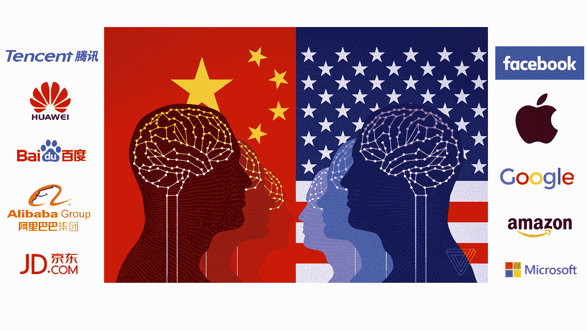

[*Credits: The Verge*](https://www.theverge.com/2017/8/3/16007736/china-us-ai-artificial-intelligence)

很高兴得到人们对上一篇关于[“iPhone 20”](https://medium.com/datadriveninvestor/the-iphone-20-xx-912a020f2741)的文章的想法和反馈。你们的一些回复认为，鉴于苹果的商业模式实际上是一个[围墙花园](https://www.fool.com/investing/2019/01/19/is-apples-walled-garden-crumbling.aspx)，这使得未来与人体的任何整合都不太可能。

这就是为什么在这篇文章中，我将探索科技公司和组织(包括政府机构)将在软件、硬件和协议上竞争的一些方式，而不是关注苹果，这些方式将塑造人类通往 2029 年的旅程，这可能会加速我们现有的分裂，扼杀合作并分裂我们的未来社会。

**当前分部**

*软件和硬件生态系统*

我们已经经历了几乎一种对不使用和我们一样的软件平台的人的技术排外。iOS 用户对其他人的文本在 iMessages 上不显示为蓝色感到恼火。使用[隔空投送](https://en.wikipedia.org/wiki/AirDrop)的快速文件传输也是如此，替代方案是通过 WhatsApp 以低分辨率分享，或者上传到 DropBox/Google Drive，供其他人在以某种方式分享链接后下载。哦，这是一个大视频？抱歉，你必须升级文件存储服务才能适应。其他第三方文件传输应用程序会向你收取费用，因为高级版本实际上可以跨平台工作。所以下一个最好的办法就是通过脸书或信使来分享，对吗？哦，等等，其他人跟进了 [#deletefacebook](https://deletefacebook.com/) 运动，现在你必须安装并通过 SnapChat 发送给他们。然后突然，你在玩换脸…

然后你必须去参加一个工作会议，你被邀请去参加，在那里你被要求发言。太好了。你希望会场有迷你 DisplayPort 电缆，而不是只有 HDMI 来连接你的 MacBook，或者如果没有，希望他们有 Apple TV，而不是 Chromecast 或那些有问题的 WiFi 连接显示器。你的 iPhone 也快没电了，所以没有充电器，你也希望他们有备用的 Lightning 电缆，而不是 USB-C。

会议开始时很尴尬，但最终你会让技术发挥作用。之后，你被指派为你的小侄子挑选圣诞礼物，所以你在 JB Hifi 给他们买了一台苹果 Homepod。几天后，你在一个秘密的圣诞老人聚会上收到了同样的礼物，因为他们想要一个能够更好地与 Spotify 集成的 Alexa。

我在想我以后应该把这篇文章贴在哪里……[Medium](https://medium.com/@peterxing)还是 [Linkedin](https://www.linkedin.com/in/peter-xing-8b251b27/detail/recent-activity/posts/) ？你明白了。这些科技公司想把你锁在他们有围墙的花园里，鼓励你留在他们的生态系统中，并让别人相信你要么“支持我们”，要么“反对我们”。

软件和硬件生态系统的另一个战场正在 VR 和 AR 中展开— [Oculus](https://developer.oculus.com/platform/) 、 [Vive](https://developer.vive.com/au/) 、[微软 Hololens](https://www.microsoft.com/en-us/hololens/developers) 、[谷歌 AR](https://developers.google.com/ar/) 以及即将到来的[苹果 AR](https://developer.apple.com/arkit/) 。

但最有趣的平台战争正在云服务和人工智能(AI)开发领域展开。

*云服务*

对于企业，亚马逊网络服务(AWS)、微软 Azure、谷歌云平台(GCP)和 IBM Cloud 等公司的云市场份额如下:

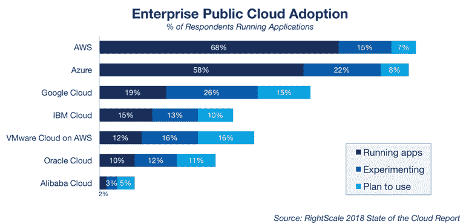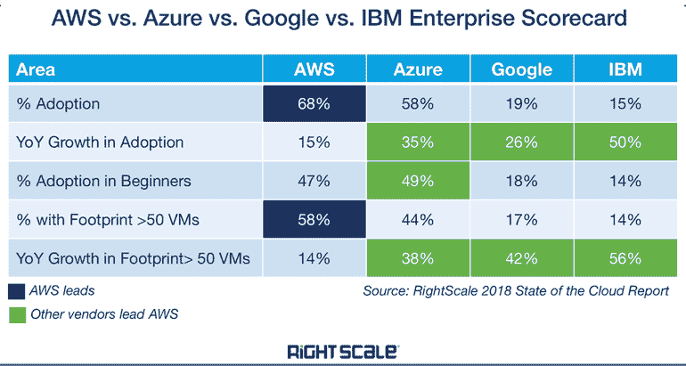

[*Credits: ZDNet*](https://www.zdnet.com/article/top-cloud-providers-2018-how-aws-microsoft-google-ibm-oracle-alibaba-stack-up/)

像 [OpenStack](https://en.m.wikipedia.org/wiki/OpenStack) 这样的开源云平台也为那些有动机将你锁定在他们的生态系统中的大公司提供了一个很好的选择。挑战在于实施和可用技能组合的复杂性。

云平台中的碎片化产生了对第三方容器化和编排工具的更大依赖，如 [Docker](https://en.wikipedia.org/wiki/Docker_(software)) 和 [Kubernetes](https://en.wikipedia.org/wiki/Kubernetes) ，它们必须处理[稳定性问题](https://jaxenter.com/kubernetes-1-13-stability-extensibility-152636.html)以支持互操作性。

然而，不同的云平台也造成了数据科学家和人工智能研究人员采用的[深度学习框架](https://youtu.be/SJldOOs4vB8)的碎片化。

*人工智能发展*

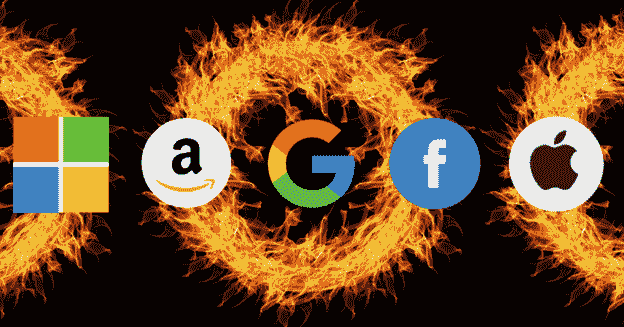

*The “*[*G-MAFIA*](https://inform.tmforum.org/insights/2019/01/g-mafia-control-future-ai/)*” of AI: Google, Microsoft, Amazon, Facebook, IBM and Apple.*

在人工智能开发中，你采用的深度学习框架将取决于你是否:

*   使用微软 Azure——更容易与微软认知工具包 [CNTK](https://www.microsoft.com/en-us/cognitive-toolkit/) 集成。
*   使用 AWS——更容易与 Apache [MXNet](https://mxnet.apache.org/) 集成
*   使用 GCP——更容易与谷歌 [Tensorflow](https://www.tensorflow.org/) 集成。(Google DeepMind 也使用 TensorFlow，外加一个名为 [Sonnet](https://deepmind.com/blog/open-sourcing-sonnet/) 的开源库进行研究。基于 [DeepMind 的 AlphaStar](https://deepmind.com/blog/alphastar-mastering-real-time-strategy-game-starcraft-ii/) 对职业星际 2 玩家的表现，这很可能是 AI 研究的前沿。)

[*Credits: DeepMind*](https://deepmind.com/blog/alphastar-mastering-real-time-strategy-game-starcraft-ii/)

*   一名脸书人工智能研究员——在这种情况下，你可能会使用 [Pytorch](https://pytorch.org/) 和 [Caffe2](https://caffe2.ai/)
*   应用 [OpenAI 的](https://openai.com/)开源工具包——在这种情况下，你可能会使用 OpenAI 的[健身房](http://gym.openai.com/)来比较[强化学习](https://en.wikipedia.org/wiki/Reinforcement_learning)框架。(OpenAI 可能在 2018 年 8 月的 Dota 2 国际赛上[输掉了 5v5 的比赛](https://www.theverge.com/2018/8/28/17787610/openai-dota-2-bots-ai-lost-international-reinforcement-learning)，但从那时起它的进步很可能在今天超越了这个里程碑。)
*   IBM 或英特尔的人工智能研究员——在这种情况下，你可能会使用 [Chainer](https://chainer.org/)
*   一个 Java 开发者——使用 [DL4J](https://deeplearning4j.org/) 更容易。

我不会探究不同的编码语言和开发人员框架，但是这里有一个基于[指环王](http://carlcheo.com/wp-content/uploads/2014/12/which-programming-language-should-i-learn-first-infographic.png)角色比较编码语言的很好的类比:

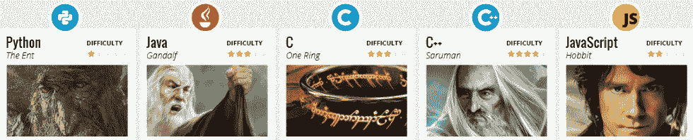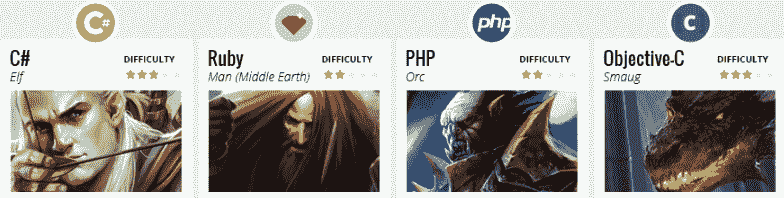

然后还有一大堆其他机器学习工具和框架，包括 [Mathworks 的 MATLAB](https://au.mathworks.com/solutions/deep-learning.html?s_tid=hp_brand_deeplearning) 、 [scikit-learn](https://scikit-learn.org/stable/) 、[ML.Net](https://dotnet.microsoft.com/apps/machinelearning-ai/ml-dotnet)(for。NET 开发者)、 [PaddlePaddle](http://www.paddlepaddle.org/) 和 [XGBoost](https://xgboost.readthedocs.io/en/latest/#) 。

为了解决深度学习社区的碎片化问题，亚马逊、脸书、微软和其他公司已经支持一种开放格式来表示深度学习模型，称为开放神经网络交换( [ONNX)。](https://onnx.ai/)

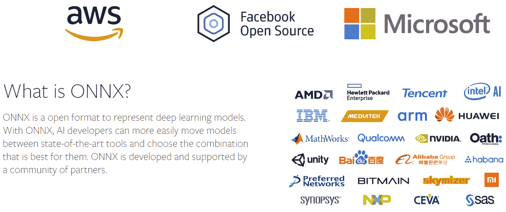

ONNX 通过 [ONNX 模型动物园](https://github.com/onnx/models)实现了 Apache MXNet、Caffe2、CNTK 和 PyTorch 等深度学习框架之间的互操作性。它在未来获得支持的程度可能取决于主要科技公司之间的利害关系…

*分布式账本技术协议*

还有另一场战斗正在发生，它可能会决定我们所知的互联网的未来。故事到此为止:

*   万维网最初是由蒂姆·伯纳斯·李在 1991 年设计的，当时他是欧洲粒子物理研究所的一名合同工。它是可以通过网络浏览器访问的所有网页、图片、视频和其他在线内容。相比之下，互联网(建立在[阿帕网](https://en.wikipedia.org/wiki/ARPANET)之上)是允许我们发送电子邮件和访问网络的底层网络连接。阿帕网利用小单元发送信息的优势，这些小单元被称为包，可以在不同的路径上路由，并在目的地重建。20 世纪 70 年代, [TCP/IP 协议](https://en.wikipedia.org/wiki/Internet_protocol_suite)的发展使得在互联网上以有序的方式扩大网络规模成为可能，现在网络已经变成了网络的网络。
*   Web 2.0 是 Web 自最初设计以来的持续发展，包括交互式(社交)媒体和用户生成的内容，几乎不需要技术技能，如博客和维基。可以说，Web 2.0 已经被像脸书和腾讯的微信这样的社交媒体公司赢得了。
*   Web 3.0 今天正在发展，包括蒂姆·伯纳斯·李描述的语义网。这场战斗正在激烈进行，因为分布式账本技术(DLT)协议将被用来创建“[新的互联网](https://www.youtube.com/watch?v=a0NjDx5UJsg)”。目前，区块链协议[以太坊](https://www.ethereum.org/)有最大的开发者社区在 [Web3](http://ethdocs.org/en/latest/introduction/web3.html) 上工作，因为它进入了开发中的下一个[硬分叉](https://usethebitcoin.com/who-will-really-win-from-the-next-ethereum-hardfork/)。

对于 DLT 协议和加密货币的概述，这里有一个高层次的竞争格局，由澳大利亚 DLT 初创公司， [XCredits](https://xcredits.com/) 提供。

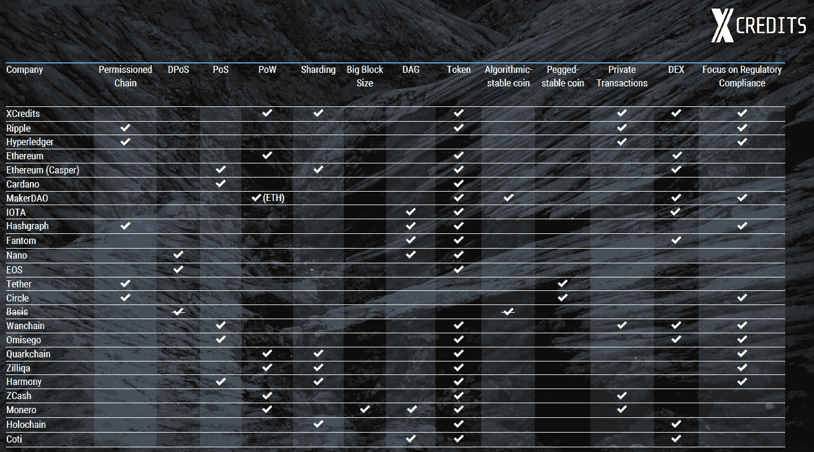

[*Credits: XCredits*](https://xcredits.com/)

*政治思想*

然而，世界各地的用户体验互联网的方式已经存在事实上的分歧，尤其是在内容审查更严格的国家。中国已经禁止所有加密货币，但正在考虑支持区块链在贸易和金融方面的各种举措。这可能最终导致中国政府支持的可编程货币，这将加强其对社会和经济交易的控制。

截至本文发稿时，中美之间的[贸易战](https://en.wikipedia.org/wiki/China%E2%80%93United_States_trade_war_(2018%E2%80%93present))仍在[进行](https://www.cnbc.com/2019/01/28/us-china-trade-war-stable-deal-with-is-an-elusive-quest---commentary.html)。有人将马歇尔计划与中国的“一带一路”倡议相提并论，这让人想起了美苏冷战的开始。这两个全球超级大国之间在语言、文化和政治意识形态方面存在沟通障碍，这可能会在不知情的人之间滋生不信任，并抑制商业和科学研究的合作。

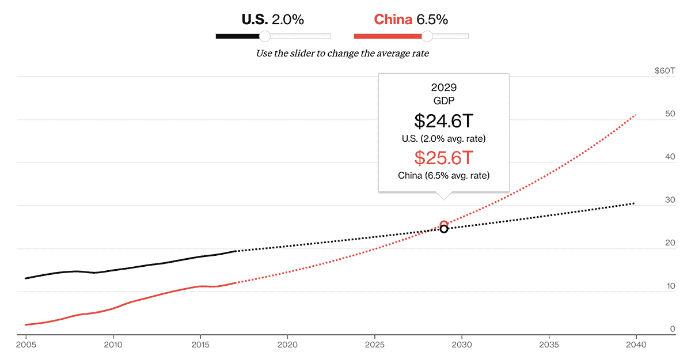

[Credits: The Verge](https://www.bloomberg.com/graphics/2016-us-vs-china-economy/)

中国目前对谷歌、脸书和中国政府无法控制的其他美国科技公司的服务实施的审查限制，以及以美国为首的西方国家目前对华为部署 5G 和知识产权盗窃指控的鹰派立场，加剧了这种情况。除此之外，像中央电视台、福克斯新闻频道、川普和 T21 这样的媒体在每日新闻报道中的民族主义弦外之音，让我们看到了世界最大经济体之间的深刻分歧。

可以说，通过中国民众对微信的大规模采用，中国已经有了一个新版本的网络。微信已经成为中国事实上的[操作系统](https://www.intheblack.com/articles/2018/05/01/wechat-super-app)，它集成了大多数应用程序&支付([微信快捷支付和二维码支付](https://pay.weixin.qq.com/wechatpay_guide/help_faq.shtml))、数字身份和社交网络，所有这些都可以在应用程序中使用。

这些信息可以被中国政府获取，并被添加到政府拥有的所有中国公民的社交图谱中。到 2020 年，中国计划在全国范围内推广社会信用体系，该体系已经在深圳、济南、苏州和江苏等城市进行了试点。

令人想起黑镜插曲， [*急转直下*](https://www.imdb.com/title/tt5497778/) ，有一些[报道和猜测](https://www.youtube.com/watch?v=0jVq04poU9I)关于社会信用评分是如何来的以及它的走向。

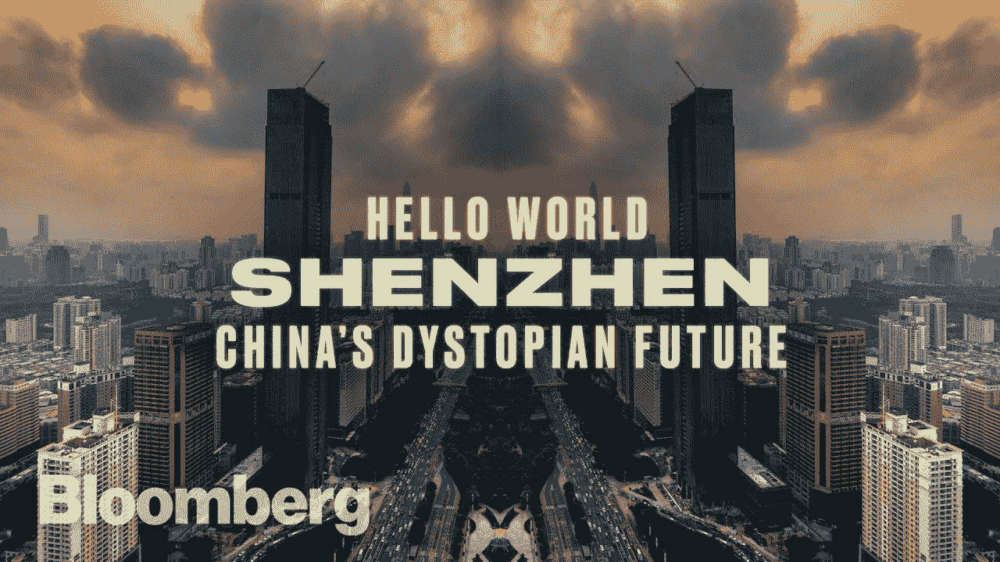

[*Hello World: Shenzhen — China’s Dystopian Future*](https://www.youtube.com/watch?v=ydPqKhgh9Mg)

中国已经测试了向微信等社交媒体平台开放社会信用评分，创建了像你身边欠债人的热图这样的迷你应用程序:

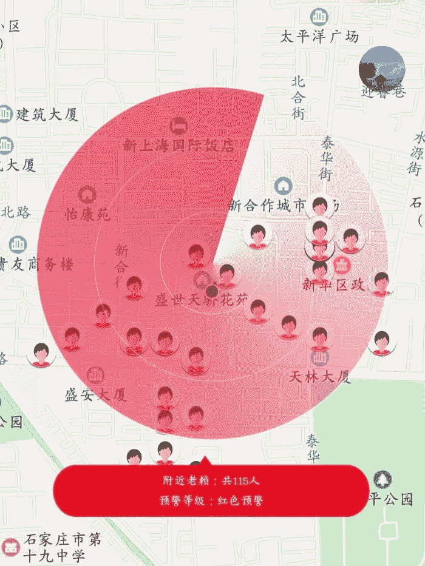

*This* [*mini app in WeChat*](https://www.abc.net.au/news/2019-01-24/new-wechat-app-maps-deadbeat-debtors-in-china/10739016) *marks out people in debt within a 500-metre radius of the user.*

如果你是分数较低的人的“朋友”，你的社会信用分数甚至会被扣分。

**未来的分工**

用软件、硬件和政治意识形态来推断社会中的这种分裂趋势，想象一下人类成员之间的通信手段被完全限制的未来？在未来的几十年里，前谷歌首席执行官埃里克·施密特(Eric Schmidt)预计将会有两个主要的互联网出现(T1)——一个是我们熟知的，我们爱或恨的，另一个是由中国政府建立的，审查更加严格的新互联网。

到 2029 年，[脑机接口(BMIs)](https://medium.com/datadriveninvestor/the-iphone-20-xx-912a020f2741) 的发展很可能将由各种科技公司和政府组织的智能设备和操作系统来推动，因为它将成为公民之间保持竞争力以及与其他国家人口竞争的“必需品”。

但是，如果你试图用身体质量指数与之交流的另一个人或服务在不同的平台上——一个由另一个政府或大公司支持的平台，这些政府或大公司受到激励为其[网民](https://en.wikipedia.org/wiki/Netizen)保留一个有围墙的花园呢？

*隐私与透明，开源与专有*

马歇尔·布雷恩的短篇小说 [*甘露*“澳大利亚计划”的乌托邦描绘了如何潜在地避免美国未来反乌托邦社会的命运。在美国，通过越来越好的狭窄(或薄弱)人工智能实现的自动化创造了一个无法就业的阶层，他们受困于政府提供的基本服务，过着平静、不满足的生活。它允许通过*吗哪* AI 拥有生产资料的人和成为“](http://marshallbrain.com/manna1.htm)[无用阶级”](https://www.cnbc.com/2018/07/24/creative-careers-to-be-spared-from-job-disruption-automation.html)一部分的大多数人口之间的不平等过度扩大。

The Australia Project existed on the basis that a competing AI to Manna was developed by its founder, and was open-sourced to serve citizens of the Australia Project. In exchange, an initial investment was made by its new citizens for one “share” in the Australia Project. As the [Fourth Industrial Revolution](https://en.wikipedia.org/wiki/Fourth_Industrial_Revolution) accelerated, a post-scarcity society emerged and the fruits of automation created abundance for its citizens. Every citizen was given 1,000 credits to spend on whatever they like, and this covered almost everything they wanted, let alone needed, with the exception of certain large projects which required [pooling](http://marshallbrain.com/manna5.htm) of resources.

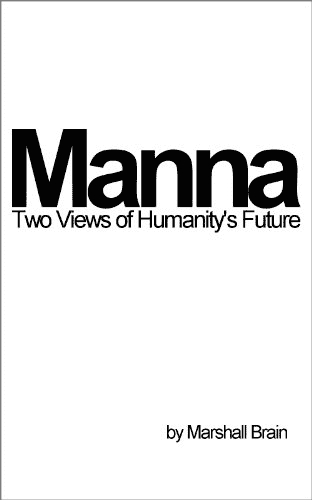

In this “utopia” however, the only catch is that the AI of the Australia Project was granted full transparency over its citizens, with the following [principles](http://marshallbrain.com/manna5.htm):

*   Everyone is equal
*   Everything is reused
*   **Nothing is anonymous**
*   Nothing is owned
*   Tell the truth
*   Do no harm
*   Obey the rules
*   Live your life
*   Better and better

You see, although the citizens had access to BMIs which enabled them full access to the collective intelligence of humanity (along with an ability to perform brain-to-brain communication), nothing was done anonymously. This enabled the AI powering the BMI network to function with full effect. It enabled the AI to stop people [murdering](http://marshallbrain.com/manna5.htm) each other, and penalise those who abuse or exploit the abundant resources in the economy.

Sound familiar? Try comparing the Australia Project’s “principles” to the basic policies of “[Xi Jinping thought](https://en.wikipedia.org/wiki/Xi_Jinping_Thought)”.

The Australia Project’s credit system is also reminiscent of the [universal basic income (UBI) movement](https://en.wikipedia.org/wiki/Basic_income), which argues that such a safety net would remove wasteful bureaucracy in administering welfare payments (since everyone receives the same amount of UBI, there’s no need to prevent rorting), and promote economic activity in the form of risk taking, pursuit of projects aligned with the individual’s skill sets and passions, as well as quantifying the value for those who perform tasks that are currently not recognised by economic measures like [Gross Domestic Product (GDP)](https://en.wikipedia.org/wiki/Gross_domestic_product). This includes looking after children and the elderly at home.

There is a growing trend to recognise measures like the [Gross Happiness Index](https://en.wikipedia.org/wiki/Gross_National_Happiness), such as in Bhutan and the [focus on wellbeing](https://www.budget.govt.nz/budget/2018/economic-fiscal-outlook/budget-2019-focus-on-wellbeing.htm), as promoted by New Zealand’s Prime Minister, Jacinda Ardern in her government’s 2019 Budget.

One potential way to fund a UBI or enable citizens to live a UBI-like lifestyle is moving towards Web 3.0, where [personal data can be monetised by individuals users](https://www.computing.co.uk/ctg/news/3068805/microsoft-tests-feature-to-allow-users-control). You see, services like Facebook and Google are “free” because of the data users enrich these platforms with. As the data becomes more and more valuable, we are essentially paying a higher and higher price for these services. In the age of automation, this may be the mechanism for enabling individuals to fairly benefit from these technologies.

*AI Supremacy and Accelerating Artificial General Intelligence*

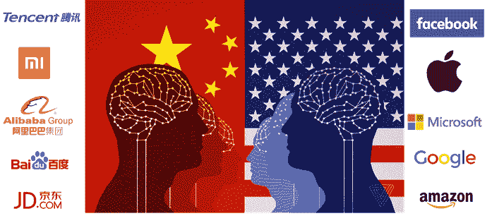

[*Credit: The Verge*](https://www.theverge.com/2017/8/3/16007736/china-us-ai-artificial-intelligence)

On the journey to 2029, the geopolitical battle on artificial intelligence between China and the US is likely to accelerate. China has a [2030 strategy](https://d.docs.live.net/e9ac4488694c4415/Transhumanism/Keynotes%20and%20Videos/The%20iPhone%20XX.docx#_ftn2) to become the global dominant player in AI, and with “[Xi Jinping thought](https://en.wikipedia.org/wiki/Xi_Jinping_Thought)” weaved indefinitely into the DNA of Chinese governance, this path is unlikely to be altered or deterred.

Rather than an iOS vs Android integration problem, we could be racing towards a real Cold War division of internet communications, and future brain-to-brain communications — one developed with “Xi Jinping thought”, and the other powered by AI from the [G-MAFIA](https://inform.tmforum.org/insights/2019/01/g-mafia-control-future-ai/) US tech giants (Google, Microsoft, Amazon, Facebook, IBM and Apple). In the future, the G-MAFIA may need to merge (along with [Elon Musk’s Neuralink](https://medium.com/datadriveninvestor/the-iphone-20-xx-912a020f2741)) just to compete with China’s [unified front from Baidu, Alibaba and Tencent](https://singularityhub.com/2018/08/17/baidu-alibaba-and-tencent-the-rise-of-chinas-tech-giants/#sm.00003zfkky6vnecbrka16jsioqio2) (BAT), backed by the Chinese government.

这场人工智能竞赛将加速人工智能(AGI)的发展。AGI 以何种形式出现将由赢家决定，这是一个赢家通吃的局面。这就是为什么 AGI 的思想领袖们，如奇点网的本·戈尔策尔(Ben Goertzel)表示，AGI 开发的开源方法提供了与全人类价值观接轨的最佳机会。[然而，埃隆·马斯克对 Neuralink](https://www.youtube.com/watch?v=Ra3fv8gl6NE) 采取了不同的方法，从本质上使人类能够与潜在的 AGI 融合。当你不能打败他们时，加入他们。反抗是徒劳的？

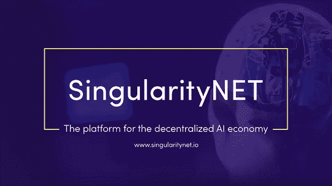

SingularityNet

或者，在中国与美国或 AGI 问题上，我可能是错的，仇外心理不再关乎你来自哪个国家，而是你运行的是哪个操作系统。这可能会在运行不同身体质量指数操作系统的用户之间产生不信任和敌意。科技公司将继续加剧这些分歧，将投资投入到大公司之间的冷战中，一场关于更好的特性、功能和更身临其境的脑对脑体验&虚拟现实的战争。虚拟世界可能是铁幕的新岛屿，正如澳大利亚项目的[公民被分为喜欢虚拟世界的人和选择主要在现实世界互动的人。](http://www.marshallbrain.com/manna7.htm)

*收尾思路*

我们正处在迈向 2029 年和社会未来的十字路口。这就是为什么创建 G-MAFIA、BAT 和政府机构等提供的最新特性和功能的开源版本现在可能比以往任何时候都更重要。

如果您对开源 DLT 协议和 AGI 的一些最新发展感兴趣，请查看 SingularityNet 上的[开发者社区。要了解更多当今社会面临的困境，请查阅尤瓦尔·赫拉利的《21 世纪的 21 个教训》。](https://community.singularitynet.io/)

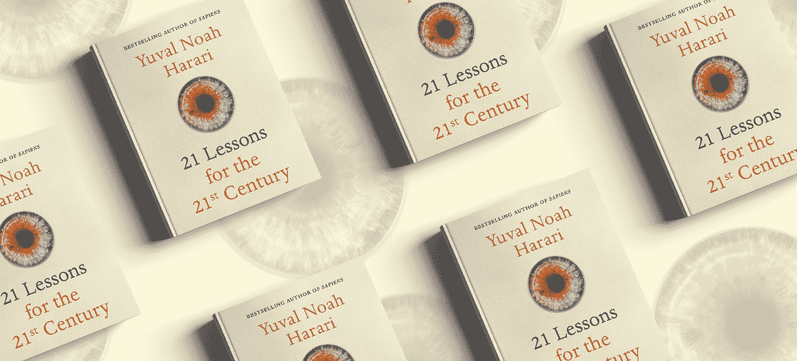

如果你想了解更多关于超人类主义和新兴技术的内容，请关注我。

# DDI 推荐阅读:

*   人类不需要申请:人工智能时代的财富和工作指南
*   [*生活 3.0:成为人工智能时代的人类*](http://go.datadriveninvestor.com/daib04/mbmp000110) 马克斯·泰格马克著
*   [*Python 人工智能:为 Python 初学者和开发者构建智能应用的综合指南*](http://go.datadriveninvestor.com/daib09/mbmp000110) 作者 Prateek Joshi