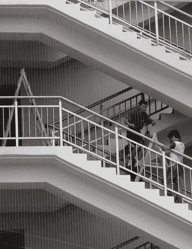
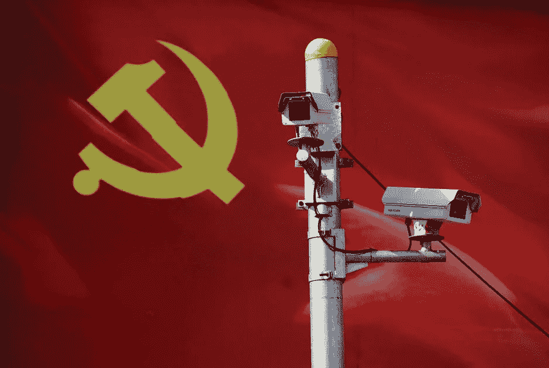
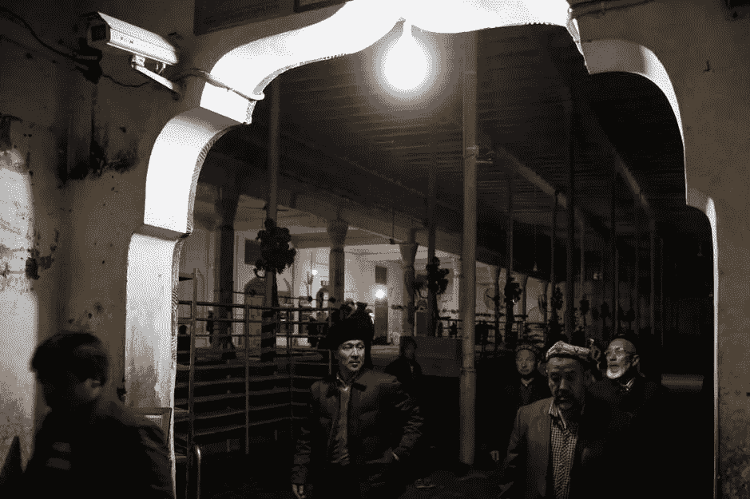
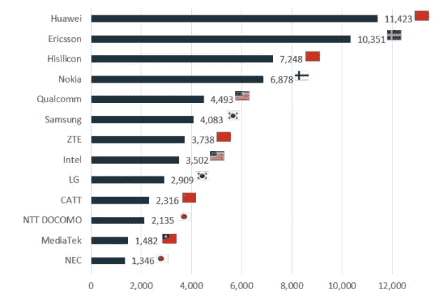

# 富豪机器人

> 原文：<https://medium.datadriveninvestor.com/the-plutocratic-robot-a5e05ee7741a?source=collection_archive---------24----------------------->

Spain, nowdays: “a thousand machines can never make a flower.”

## 关于什么样的管家会在家工作的警告

过去几年，由于技术进步，世界正在经历一种社会转型。这些社会变革包括重新思考我们未来的工作模式。

在一个人口过剩、文化水平高的社会里，社会不公将越来越近，这使得我们有必要重新思考我们的工作和消费模式。尽管消费模式仍不可持续，但发达国家出现了不同的减缓增长方式。

 [## 模式和机器人:一个复杂的现实数据驱动的投资者

### 哈耶克的名著《复杂现象理论》(哈耶克，1964)深入探讨了复杂性的话题，并断言…

www.datadriveninvestor.com](https://www.datadriveninvestor.com/2019/03/04/patterns-and-robotics-a-complex-reality/) 

对人们来说，学会用他们仅有的一点钱来配给他们所拥有的东西似乎更合理。因此，**全民基本收入**被认为是一个解决方案。机器人应该代替人来负责工作。

但是这篇文章并不完全是关于经济学的。

When I was a kid, I thought they were robots. [Photo by [Katarzyna Pe](https://unsplash.com/@kasiape?utm_source=unsplash&utm_medium=referral&utm_content=creditCopyText) on [Unsplash]](https://unsplash.com/search/photos/plutocratic-robot?utm_source=unsplash&utm_medium=referral&utm_content=creditCopyText)

可以说有两种类型的**文明**:一种关注真理、科学、道德、真实的……另一种关注物质、金钱、表面的……

例如，卡尔·马克思认为对物质的研究可以引导世界解决道德问题。从这个角度看，他会是第一批人之一。而一个旨在为自己囤积所有资源的独裁者宁愿成为第二类人，也不愿成为他的追随者。

> 富豪模式的真正区别在于，它能够接受比真实产品更便宜的替代品。

所以，第一个集团是由**民主**、**资本主义**、**社会主义**、**原教旨主义**、**无政府主义**……，而第二个集团我们将称之为**。有没有迹象表明我们的西方文明是一个财阀统治？我们怎么知道？最重要的是，它会如何影响我们的日常生活？**

****

**We need to talk about our dolls.**

**5G 来自中国，伴随着领先的技术和社会模式。他的工人[自杀](https://www.nytimes.com/2012/01/26/business/ieconomy-apples-ipad-and-the-human-costs-for-workers-in-china.html?_r=2&pagewanted=all&)的模式，如台湾公司[富士康](https://www.youtube.com/watch?v=TmLsV9cSk0o)(苹果和其他主要制造商)。你可以在中国找到阿里巴巴的 996 系统，这意味着一周工作 6 天，从早上 9 点到晚上 9 点。**

****

**Putting material obstacles to a deeper problem**

**在中国共产党领导人 Xi 习近平担任主席期间，一个电子计分系统已经建立起来。一台机器将控制中国人民每一个居民的善恶。这可能不是第一次这样做，但印象必须与数字密切相关:你能想象 14 亿人被道德分类吗？**

****

**Democracy, socialism or…, plutocracy?**

**中国的*天网工程*无法手动运行，即使所有这些人的命运都围绕着民选的政府总统。人们喜欢维吾尔族，一个被禁止与中国其他民族有文化差异的民族。新疆省因此成为全国冲突最激烈的地方。**

****

**Uigurs, after praying.**

**强制大规模拘留(没有太多保证)被带到再教育中心。在《发条橙》*最纯粹的风格中，为了让他们消除种族和宗教的束缚，他们被要求以重复的方式观看电影。***

**但是为什么我要谈论政治呢？**

# **回到技术**

**富豪模式与非富豪模式的真正区别在于，它能够接受更便宜的替代品。这就是为什么我们有时不得不停下来想想我们放入家中的机器有什么样的内部工程。**

**在革命的历史上，总是经济上最稳定的帝国，或者说是金融上最先进的帝国，保持了世界霸权。没有银行业的发明，大英帝国永远不可能推翻西班牙帝国的霸权。现在，中国正在通过华威冲突为技术和经济设定路线。**

****

**Technical contributions to the 5G standard**

**5G 比我们预期的要多得多，这意味着一台机器不需要有一个智能系统来工作，只需要在地球上的某个地方建立连接来管理这项服务。**

**所以，我们来放几个数字:**

*   **一个被剥削玩电子游戏的工人每年给公司造成 11，000 美元的损失。也许它的工作方式类似于阿里巴巴的 991 模式。**
*   **一个超逼真的性爱娃娃大约要 1500 美元。**
*   **一个好的原生移动应用，价格超过 33000 美元。**

**你可以想象，对性产业来说，植入非常逼真的机器人是多么简单，这些机器人实际上是由一个被困在财阀政权中的人指挥的。以及为性爱机器人植入与人类治疗相当的意识的巨大成本。**

**考虑到性行业一直有一个拥有最前沿技术的对口单位，如果机器学习之前没有社会化，那么将在我们家中实施的不同机制会发生什么变化？**

**在未来消费者需求的背景下，今天的行业是否能够承担人工智能的成本？或者，考虑到政府不会因此迫害他们，他们会更愿意承担更多的财阀成本吗？**

# **结论**

**一个玩家被困在显示器前多久？如果是因为工作原因，他可能会停下来吃午饭，休息一下。**

**田口元一因其[田口方法](https://en.wikipedia.org/wiki/Taguchi_methods)而闻名:**质量**必须通过**损失函数**以**货币形式**定义，其中规格相对于名义价值的变化越大，转移给消费者的货币损失就越大(指数级)。**

**从那个角度来说，质量是只有有钱的人才买得起的东西。你能想象这样的未来吗？**