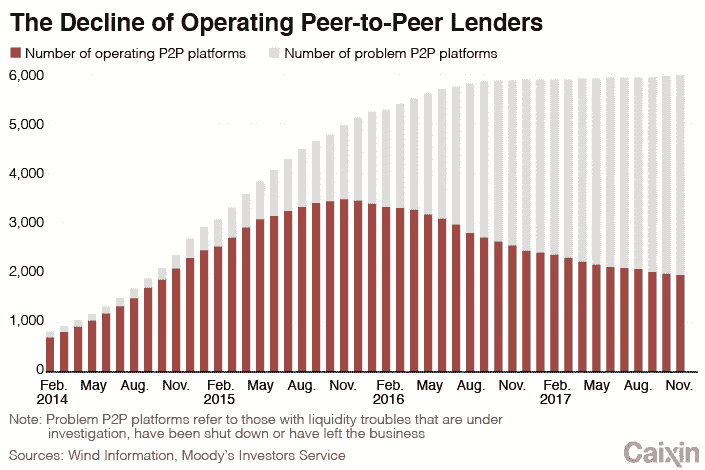
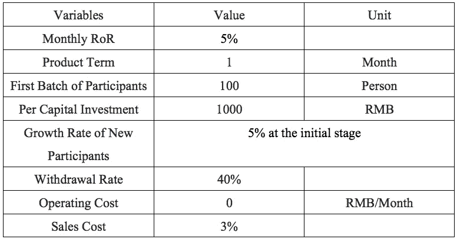
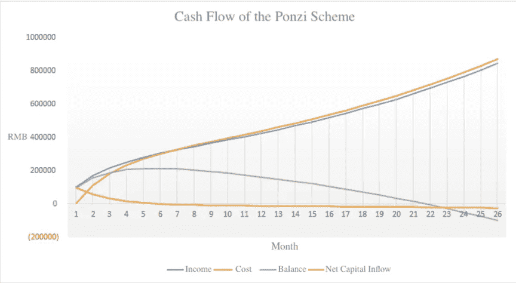

# 庞氏骗局 101:庞氏骗局的生命周期和生存方式，第 1 部分

> 原文：<https://medium.datadriveninvestor.com/the-ponzi-scheme-101-a-ponzis-life-cycle-and-ways-to-survive-part-1-a5464bb85e2a?source=collection_archive---------7----------------------->

## 我们构建了一个简单的庞氏骗局的模型，推断出这个骗局会持续多久，以及一个理性的发起人会在什么时候逃离城镇。

*由创新研究机构 X-Order 的金融分析师 Alan Zhang 撰写，该机构试图结合分布式计算、计算博弈论、人工智能和密码学等跨学科领域来发现未来的扩展订单。它的创始人是托尼·陶，他也是 NGC 风险投资公司的合伙人。*

基本上我们日常生活中看到的死气沉沉的 P2P 平台或者资产管理产品，大部分都是庞氏骗局。

The Decline of Operating Peer-to-Peer Lenders, Caixin Global

# 构建一个简单庞氏骗局的模型

一般来说，庞氏骗局的参与者只有两种:**发起人**通过承诺难以置信的高额利润吸引资金；和**投资者**，他们为高于平均水平的利润付钱。最终，当资金不足以偿还每个投资者时，发起人就会跑路。

为了简化解释，我们假设在一个微观社会中，一个发起人发起了一个庞氏骗局。方案**不会因为缺少调节器而被迫停止**。只有当发起人不再能够偿还现有投资者时，它才会崩溃。

Ponzi Scheme Collapses Like a House of Cards When the Base Collapses, The Real Deal

*假设项目规则和各方初始条件如下:*

## **发起人的意图**

为了延长庞氏骗局的生命周期，赢得足够的时间逃离城镇，他们吸引了更多的资金。

1)仅使用新投资者的资金偿还现有投资者；

2)完全没有每月的运营成本(如人工、场地成本)，而综合销售成本占每期产品规模的 3%。

## **投资目标**

*发起人为吸引投资者而设计的资金游戏。*

1)产品期限为一个月，月 RoR 为 5%；投资者只能在到期时进行再投资或提取资金；

2)每月产品到期时，提现率为 40%；选择不退出的会再投资；

3)每期只有一个产品。

## **投资者**

参与获取更高利润的计划。

1)人均投资 1000 元人民币；

2)初始投资者 100 人；

3)参与人数月增长率 5%。

Initial Values of Project

*据此，我们可以确定本实验中计算收入和成本的关键等式:*

## **当期收入**

=本期新参与者的资金+前期的再投资资金

=新参与者数量*每笔资本投资+前期资金总额*(1-提款率)

## 市价

=当期支付给现有投资者的款项+营业成本+销售成本

=前期收入* (1+月 RoR) +营业成本+当期收入*销售成本率

## 净资本流入

=当前收入—当前成本

## 保持平衡

=每期净资本流入的总和

Simulation: Cash Flow Table of the Ponzi Scheme

我们可以看到，在第 22 个月，启动子的余额将减少到 0。换句话说，发起人不再有能力偿还投资者。因此，**庞氏骗局将持续长达 22 个月。**

然而，考虑到资金余额**在第五个月**达到高峰，理性的发起人倾向于在此时**逃离城镇**以**最大化**他或她自己的收入，在这种情况下是 213，759 元人民币。

## 下一步是什么？

*在* [***第二部分***](https://medium.com/@xorder/the-ponzi-scheme-101-a-ponzis-life-cycle-and-ways-to-survive-part-2-2a947fd48ac4) *中，我们研究了庞氏骗局以及不同变量的影响，如提现率、用户增长率、上限等。最后，在第三部分***中，我们总结了我们的发现，以帮助用户更好地了解庞氏骗局，从而降低他们的投资风险。**

> **在我们的*[*Linkedin*](http://linkedin.com/company/xorderglobal)*上与我们连线！**
> 
> ****由*** *(通过我们的微信账号)****:****Transladom**
> 
> ****编辑:*** *谭**