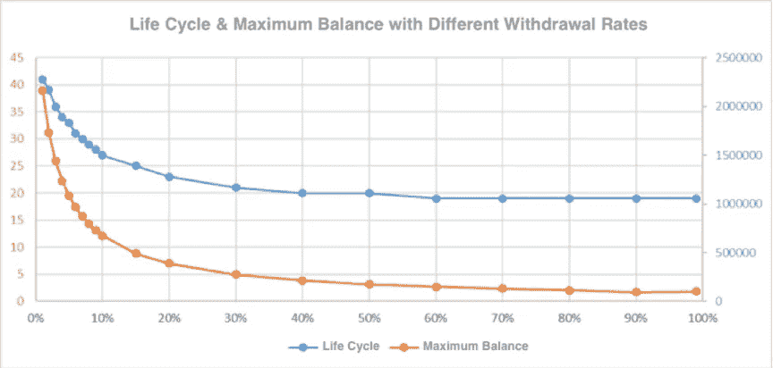
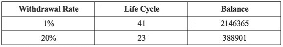
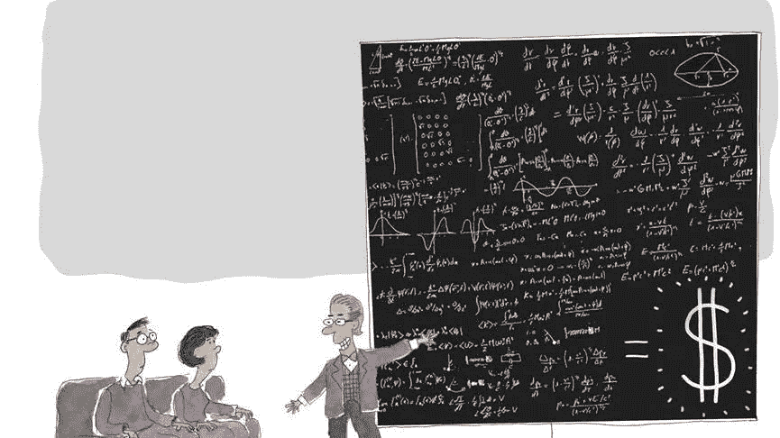
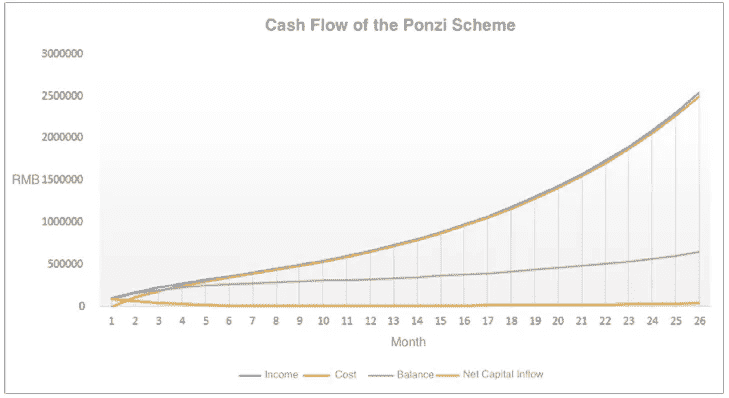
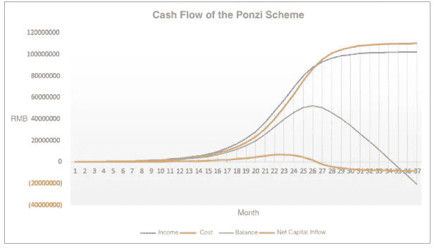
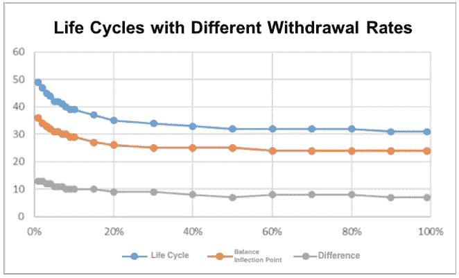
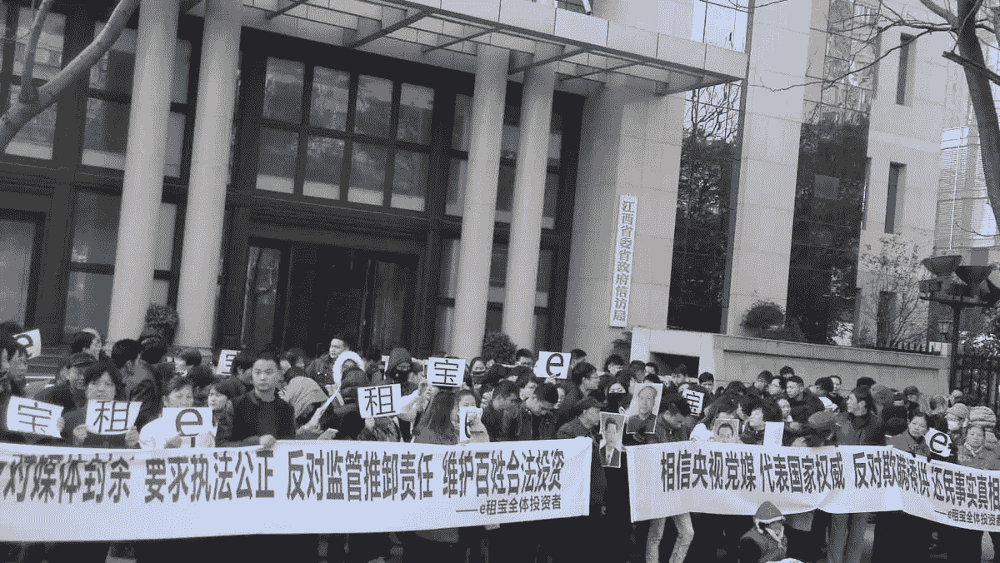

# 庞氏骗局 101:庞氏骗局的生命周期和生存方式，第 2 部分

> 原文：<https://medium.datadriveninvestor.com/the-ponzi-scheme-101-a-ponzis-life-cycle-and-ways-to-survive-part-2-2a947fd48ac4?source=collection_archive---------10----------------------->

## *我们研究庞氏骗局和不同变量的影响，如提款率、用户增长率、上限等。*

*由创新研究机构 X-Order 的金融分析师 Alan Zhang 撰写，该机构试图结合分布式计算、计算博弈论、人工智能和密码学等跨学科领域来发现未来的扩展订单。它的创始人是托尼·陶，他也是 NGC 风险投资公司的合伙人。*

在这里赶上第一部分。

 [## 更好的预算，打造更大的|数据驱动型投资者

### 即使是专家也承认它们并不完美。从 1 到 10 的范围内，安东尼·科普曼和德尔…

www.datadriveninvestor.com](https://www.datadriveninvestor.com/2018/11/08/budget-better-to-build-bigger/) 

# 不同变量的影响

参考第 1 部分中构建的基本模型:

> 我们刚刚假设庞氏项目有两个主要目的:
> 
> ①延长方案的生命周期；
> 
> ②有较高的平衡性。

*接下来，我们来看看不同变量对这两个因素的影响。*

## 提款率的影响

假设其他条件不变，将**提取率分别设置为 1%到 99%**计算方案的生命周期和余额。

Life Cycle & Maximum Balance with Different Withdrawal Rates

Withdrawal Rate: 1% vs 20%

从图表中我们可以推断，对于一个方案项目，最小化用户的提现率可以显著**缓解其现金流压力，延长生命周期，获得最大利润。**

## 回报率、用户增长率和销售成本的影响

**更高的回报率(RoR)** 意味着项目需要偿还的利息呈指数级增长。

> 然而庞氏骗局是一个*“借新人还老用户”*的游戏。

无论承诺的 RoR 有多高，只要新用户的增长率保持不变，欺诈者总能实现它。在大多数情况下，较高的 RoR 对用户更有吸引力。但值得注意的是，当传统市场频繁曝出财务丑闻，某个项目的 **RoR 超过某个阈值**时，可能不利**引起怀疑**，导致**用户增长率下降。**

Defrauding to Get New Users, The National

在我们最初的假设中，如果**没有用户数量的上限**，那么只需将**每一轮的用户增长率设置为 10%** 就可以让这种模型持续运行，如下图所示。

A Sustainable Ponzi Scheme Model

如果用户增长率没有限制**，那么在计算一个指数函数的参与者数量时，我们可以看到，即使在初始阶段只有 100 个参与者；以 10%的速度增长 166 个月后，**的总参与者可以超过 70 亿。****

World Population, World News

> 这显然是不可能的。

当然，在现实世界中，当参与人数达到一定规模时，必然会受到地理、人口、文化等因素的**制约，切断用户的可持续增长。看，天花板是存在的。**

## 天花板的影响

尽管如此，假设有 100 名初始参与者，但是**将增长率提高到每期 30%。**当某个时期新人数量达到 2 万人时，增长速度就会停滞，开始以每月 5%的速度下降，直至为零。

*在其他条件不变的情况下，我们来看看现金流的变化。*

The Cash Flow Model of the Ponzi Scheme with a 30% User Growth Rate

当用户增长**达到上限并开始下降**时，净流入的增长在下个月急剧下降，余额很快变为零。

> 因此，上限可以极大地限制庞氏骗局的规模。

进一步研究，我们可以看到，用户高速增长时，**提现率和收益率对生命周期**影响不大。然而，一旦参与者**达到上限**，较低的退出率可以为该计划赢得更多时间。

Life Cycles with Different Withdrawal Rates

同样，将提款率从 1%切换到 100%，并查看**生命周期**和**余额拐点**(从该点开始，项目将通过使用以前的余额支付利息来实现收支平衡)。我们发现在提款率从**下降到 20%** 后，无论是生命周期还是差额拐点都从的 9 个月上升到了**的 13 个月。**

> 当庞氏骗局达到平衡拐点时，较低的提款率有助于为项目赢得更多时间。

Buying Time, CartoonStock

## 案例研究:e 租宝

P2P 贷款公司 e 租宝成立于 2014 年 2 月，总部位于中国安徽省。

Ezubao, SBS

**天花板**

2015 年，全国 P2P 平台的估计成交额不到 1000 亿，月均成交额为 1000 亿。假设其用户可以不受地域限制在全国范围内**扩张，并最终占据 **10%的市场份额**；最高月收入可达 100 亿人民币。**

**现金流出**

e 租宝**平均年化收益率**为 **12%** ，**月 RoR 1%**；**月佣金**按**平均值 0.5%** 计算；并保守假设有**杂七杂八的费用**占**月总收入**的 20%(即人工费、工作场地租金、多个空壳公司的注册费、贴豪车装富图片吸引新投资人，以及内部侵吞)。

> 因此，其每月现金流入需要以 21.5%或以上的速度稳定增长才能生存。(Ps。这里的周转金额包括再投资金额。)

由此判断，当**月成交额超过 100 亿**或**月增速低于 21.5%** 时，极有可能 e 租宝方案崩盘。

Ezubao Protestors, jsfmk Twitter

从实际数据来看，e 租宝 2015 年 9 月的成交额早已突破 100 亿(达到 134.5 亿)。10 月和 11 月的营业额分别为 162.11 亿和 162.32 亿，**分别增长 20.5%和 0.1%** 。从 10 月份开始，e 租宝**破产**的概率大大增加，而**实际“引爆”时间**正是 2015 年 12 月 3 日。

> 虽然这样的模型只是一个估计，但通过估计上限和每月成本，预测庞氏骗局何时崩溃是可能的。

## 下一步是什么？

最后，在 [***第三部分***](https://medium.com/@xorder/the-ponzi-scheme-101-a-ponzis-life-cycle-and-ways-to-survive-part-3-16f886fd2dac)**中，我们总结了我们的发现，以帮助用户更好地了解庞氏骗局，从而降低他们的投资风险。**

> **在我们的*[*Linkedin*](http://linkedin.com/company/xorderglobal)*上与我们连线！**
> 
> ****翻译*** *(通过我们的微信账号)****:****Transladom**
> 
> ****编辑:*** *谭**