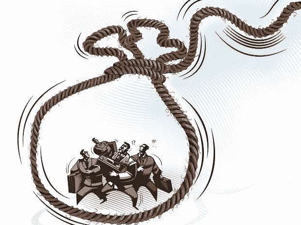
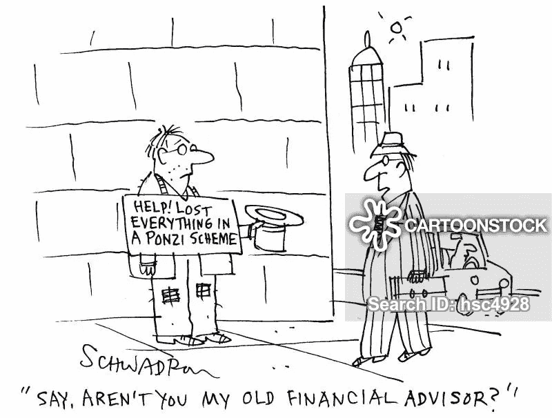

# 庞氏骗局 101:庞氏骗局的生命周期和生存方式，第 3 部分

> 原文：<https://medium.datadriveninvestor.com/the-ponzi-scheme-101-a-ponzis-life-cycle-and-ways-to-survive-part-3-16f886fd2dac?source=collection_archive---------7----------------------->

## 我们总结我们的发现是为了帮助用户更好地理解庞氏骗局，从而降低他们的投资风险。

*由创新研究机构 X-Order 的金融分析师 Alan Zhang 撰写，该机构试图结合分布式计算、计算博弈论、人工智能和密码学等跨学科领域来发现未来的扩展订单。它的创始人是托尼·陶，他也是 NGC 风险投资公司的合伙人。*

# 结论

参照第 [1](https://medium.com/datadriveninvestor/the-ponzi-scheme-101-a-ponzis-life-cycle-and-ways-to-survive-part-1-a5464bb85e2a) 和 [2](https://medium.com/datadriveninvestor/the-ponzi-scheme-101-a-ponzis-life-cycle-and-ways-to-survive-part-2-2a947fd48ac4) 部分讨论的研究:

 [## Azbit 旨在连接传统金融和加密货币|数据驱动的投资者

### Azbit 是下一个提供交易平台的加密项目，该平台提供保证金和算法交易。一样多…

www.datadriveninvestor.com](https://www.datadriveninvestor.com/2019/03/20/azbit-aims-to-connect-traditional-finance-and-cryptocurrency/) 

## **1。庞氏骗局是有天花板的，肯定不可能不断增长**

庞氏骗局的上限因投资市场、投资者的教育背景和金融开放程度而异。然而，一旦规模达到一定的阈值，该方案就可能崩溃。这就是为什么像 e 租宝和泛亚这样的 P2P 巨头可以在早期**快速增长**但在达到数十亿的营业额后很快**失败。**

CartoonStock

## **2。团队的执行力决定能否达到上限**

虽然庞氏骗局确实有上限，但不能用来判断诈骗团队什么时候跑路。如果团队**缺乏执行能力**或者**野心**，方案可以破产，团队甚至可以**跑路，没有达到所谓的天花板。**

Business Standard

## **3。唯一的选择是指数级增长，裂变或多级分配只是本质上不可避免的“权宜之计”**

既然利息成本是指数级增长，新用户的增长必须跟上，才能维持运营。当用户数量达到一定规模时，团队很难利用自己的能力接触到足够多的用户，因此转向通过口碑或病毒式广告进行营销。所以像**裂变、多级传销这样的手段，可能是短期内唯一有效的成倍增长的选择。**

CartoonStock

## **4。警惕增长放缓，并警惕提款率的突然下降**

> 增长率是庞氏骗局的唯一生命线。

当增速开始放缓甚至下降时，就是投资者谨慎的时候了。团队通常会采取以下措施来应对恐慌撤退:

1) **通过延长验证期、控制舆论等强制手段降低撤回率**；

2) **夸大利润，提高用户提现成本**，如短期内突然提高收益率，或通过更长的锁定期增加利润；

3) **在平台上开发各种工具或游戏**留住用户的钱。

记住，这样的行为只能在短期内为团队争取一些时间。看到这样的信号要保持警惕。

CartoonStock

## **5。当净流入为负时，团队跑路的可能性增加**

在传统行业，我们很难收集到公司的信息。然而，在区块链领域，由于所有数据都可以在链上审查，资金情况是透明的。许多庞氏骗局需要使用公共钱包地址作为存款渠道。如果你知道它的钱包地址，也许有机会在队伍跑路的时候发现。

庞氏骗局可以追溯到 1919 年，麦道夫 650 亿美元的欺诈催生了更复杂的模式。在加密领域，像意识形态印记、引力透镜等模型只是使用这些概念名称来说大话，这给许多科幻术语蒙上了阴影。

> 不管模式怎么变，最重要的是保持清醒的头脑，快速把握事物的本质。这些发现不仅与庞氏骗局有关，也与日常生活有关。

CartoonStock

> 那都是乡亲们！敬请关注我们的下一个系列！

> *在我们的*[*Linkedin*](http://linkedin.com/company/xorderglobal)*上与我们连线！*
> 
> ***由*** *(通过我们的微信账号)****:****Transladom*
> 
> ***编辑:*** *谭*