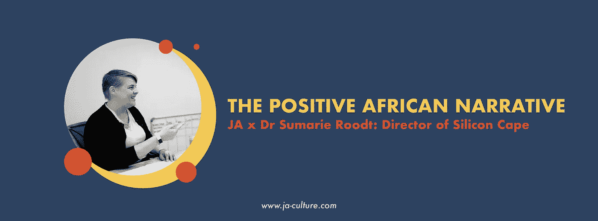

# 积极的非洲叙事

> 原文：<https://medium.datadriveninvestor.com/the-positive-african-narrative-ja-x-dr-sumarie-roodt-director-of-silicon-cape-2dca44466923?source=collection_archive---------43----------------------->

非凡的洞察力、建设性的解决方案和开放的思想，这些正是南非现在所需要的！Sumarie Roodt 博士提醒我们，为什么当地和国际投资者都应该欣赏那些宣扬积极的非洲故事。

你会读到投资 SA 的原因，我们本地叙事的重要性，以及为什么创新技术大杂烩是一个充满希望的承诺，而不是第四个工业噩梦。

最困难的任务是确定我们讨论的许多信息部分中哪些将在这里分享，但下面的摘录是一个很好的例子，说明为什么当考虑积极大使时，Roodt 博士是一个自然的选择——让我们开始吧！

# 对国际伙伴关系的非理性恐惧。

约翰:在我们生活的国家，我们的身份对我们的发展至关重要，但这很大一部分涉及国际合作。当我们考虑合伙关系时，我们是否在正确的轨道上？

鲁特博士:目前，我们围绕中国和非洲的关系做了很多宣传。我最近与北京方面进行了一次电话会议，目的是围绕非洲的科技开展一系列活动，并确定我们如何在自己和中国之间建立更好的网络。我们希望改变围绕中国的实际叙述，从人们不幸相信的无知的负面情绪，到通过这种伙伴关系已经取得的伟大成就。只是很刺激。

约翰:我同意！Heidi Dahl 和她在挪威创新公司的团队提供了额外的证据，证明其他国家并不是来偷非洲的东西，而是提供他们自己的资源，以提升和增强我们非洲经济的能力，建造自己的经济火箭。过早否定很容易，但鉴于我们的衰退，其他国家与我们合作应该更能说明问题，因为我们有增长的潜力，而不是我们不愿意成为容易和绝望的目标。

Roodt 博士:改变这种说法是非常重要的，因为在大多数情况下，我所看到的干预措施是真正有帮助的。他们不是来拿我们的东西逃跑的。在这一点上考虑资源暴露是倒退的。其他国家想过来帮忙，如果人们想过来帮忙，为什么不让他们来呢？他们在这里不是为了加强他们的叙述——他们在这里是为了增强我们当地的文化。

国际球员向我展示了他们在媒体上看到的东西；难怪他们会恐慌。有很多东西需要揭开神秘的面纱。我们有责任。尤其是以你现在的方式。

# 硅岬景点。

Johan:你领导着一家公司，这家公司对许多当地企业家来说是不可或缺的，所以你自然理解 Silicon Cape 的角色价值，但你个人为什么相信 Silicon Cape？

鲁特博士:我们的文化植根于服务生态系统。我们不受任何主要利益集团的驱使，我们的独立性使我们能够代表该领域每个人的利益。有很多合作正在发生，人们非常愿意分享以实现更大的目标。生态系统也伴随着某种能量，你可以在开普敦感受到这种能量。你有这个创意空间和技术空间的大杂烩。所以是的，这是我的能量。能源和文化生态系统，事实上，它试图统一这个泛非洲的现实，就这 100 个尚未统一的技术热点而言。开普敦现在也被视为统一点——这让它如此令人兴奋！

我对非洲、创业和创新充满热情。说有银弹是天真的，但作为一种理想，我认为这是难以置信的追求。Silicon Cape 需要我站出来，我 40%的时间都在这里。这是我所相信的——从创新的角度来看，我相信非洲是未来的潜在领导者；我想成为这个旅程的一部分。我必须补充一点，生态系统中需要强大的女性榜样，这对我来说绝对是关键。

# 非洲的问题需要非洲的解决方案。

Johan:你能说出三个你真正尊重和钦佩的创新方法或公司，它们可以被描述为解决“非洲问题”的“非洲解决方案”吗？

鲁特博士:其中两个恰好在农业领域，一个在数字服务领域。第一个例子是[SweepSouth](https://l.facebook.com/l.php?u=https%3A%2F%2Fsweepsouth.com%2F%3Ffbclid%3DIwAR0CKJTcOwl1Qh6ZliKA5JoTFsCzAIB4UmbftK-RfLTaxVUtrqZQzf1OADE&h=AT2z4a8HDFt6rsRQk3lcwR_dzCoX7uJYLEW51boKvOo2iU3JPlUij6UCDSjtbB664P3m7TSri_Ge-nS7Wnlo7NxQU7nUbUgtGQRNok57IgNPJNI41V4ov9oniw7U7zPJno16af_f)——就有影响力的企业家精神而言，这是纯粹的社会创新。他们不仅从会计角度谈论它，而且还利用了 PPP 方法。人、地球和利润。从历史上看，我们传统的资本主义商学院都是关于工作价值最大化的。另一方面，SweepSouth 建议会计原则应该转换为购买力平价。是的，他们当然从中赚钱，但这在很大程度上是一个社会改善项目。他们专注于他们的彩票，并为他们提供其他服务，这将在全国范围内改善他们的生活。这对我来说很关键。

我认为对我来说，这是一个不可思议的创业例子，它可能会对人们的生活产生巨大的影响，同时还能赚钱。并有可能成为这类事情的全球主导模式。

约翰:不久前我写了一篇关于[赛西斯:南非濒危物种投资部门](https://l.facebook.com/l.php?u=https%3A%2F%2Fmedium.com%2F%40JA_Culture%2Fsaesis-tomorrows-investment-9875eb19c23b%3Ffbclid%3DIwAR2P4RTtFPdr4mk3EGzysH_CTQhabtRpP6i4-pHfqRcmlTR8f-UuCkbB3fE&h=AT22PZm5ApMlL4qlCbEK7FVv9M5iE-wiowHukGMH9Et2QlSuOXY9Sai__lV7h350pNfEduoozCoVNGxv-DAM9NvqFjL84aVuTO8sDNvnYOsomVAIMkUgPuOfCGfDhcojdQkM8SZD)的文章。

在所有的独角兽和瞪羚中，SweepSouth 完全属于斑马类，在资本主义丛林中同等重视利润和社会进步。疯狂的事情是，与独角兽相比，斑马真的很罕见，但话说回来，也许独角兽是否认的犀牛！

鲁特医生:太棒了！我喜欢动物的比喻和第三种动物的加入——所以我一定会去看看！

另外两个:[Abalobi](https://l.facebook.com/l.php?u=http%3A%2F%2Fabalobi.info%2F%3Ffbclid%3DIwAR3x43sLiZNDaEEBFJfi1-fk1DvOs1V_LEWt7ph7Tk54Zf4vwTpe6v6GG_8&h=AT3UwQtNraoTMWlWOyr9A2gmmIjv1dwj1EefMnZzlQfrJ4H67QHulh4b-oN-SPz5nbSd1Q1pIILIlIFtEEB_Mzk7aavv07V4G5yZk829PfNC9pP2chLjpSRBAkv8CGPPZf7EH9NT)——可持续渔业倡议；还有[特技飞行公司](https://l.facebook.com/l.php?u=https%3A%2F%2Fwww.aerobotics.io%2F%3Ffbclid%3DIwAR2-4rk4qMAz_0V1zoHRRfCMY6TvBO8j7-lXS9DueEwdwdCEBVoFm9Uu82o&h=AT28gkKSiEJwdcxrNupAyFF3DZEhB8DHN_h8mkud7fAcTjIweLrvK86DdlIrYuJvpENuQyRWTQY71hNvZ1X-9SZZ5EM6a5NZqtOBnBb0uqbYAZn4dVHNd6LCJXkxeMmvANH5yTp7)，我相信你知道这家公司。Abalobi 计划为我们提供了一个高度可转移的模型，可以跨行业使用——当涉及到这种类型的东西时，没有地理边界。

# 工业 4.0 积极性。

约翰:为什么人们应该对第四次工业革命持积极态度？

Roodt 博士:我昨天从[世界经济论坛](https://l.facebook.com/l.php?u=https%3A%2F%2Fwww.weforum.org%2Fabout%2Fthe-fourth-industrial-revolution-by-klaus-schwab%3Ffbclid%3DIwAR0YpJyyK4rzGbD22qKr5-dcxJkfIgVdzpW4aq7doJ0HQajMoWanQuivodc&h=AT0V0O3HyJMLZk060acYoir5FBvqV6E1s8lPaCJVXFrPHx-JQVDbcZzH1eHpqGhd_vReCkP31oBLKaCu3R__--eHxQNOl5duorG3ZkaXz2xENVismbebcyiUJsORvcc0FnAyf4eI)上读到一篇文章，文章指出第四次工业革命实际上是关于赋予人们权力，而不是关于技术本身。这与“机器的崛起”无关。人们非常关注第四次工业革命，我们把它浪漫化了，你知道吗？啊，它将会改变世界，诸如此类。这也有其黑暗的一面——“我们都将失去工作，这是一种厄运和黑暗”。我不同意围绕它的负面观点。

我们需要开始用不同的眼光看待它。它可以产生巨大的变革效应。例如，如果你认为-大约 30 亿人没有电-第四次工业革命可能会解决这个问题！它可能使我们能够大规模地解决我们历史上无法真正解决的社会问题。就这么简单。

# 投资者应该继续关注南非吗？

Johan:投资者为什么要看好南非的前景？

鲁特博士:让我们来看看一个有着卑微开端的公司——Naspers。它实际上是美国以外世界上最大的媒体公司。这是一家初创企业，现在它已经向非洲当地的生态系统投入了 45 亿兰特。Naspers 还大力投资于海外市场的其他投资，例如，已经收购了许多亚洲公司的股份。从投资的角度来看，它们确实是创新的巨大成功故事之一。

再看看最近在南非投资峰会上发生的事情，Ramaphosa 成功地关闭了 900 亿美元——你为什么不兴奋呢？南非被视为通往非洲的门户。如果你想进入这个大陆的其他地方，那么这就是你需要开始建设的地方。

有数据显示，到 2030 年，非洲人口将占全球人口的一半。全球人口的一半！太惊人了！也没那么远。11 年后，我们可能会成为全球下一个最大的劳动力群体。

# 教育是南非叙事的一部分。

约翰:教育应该被认为是传播希望的一个促进因素。不是在一个“理想的世界”，而是以一种非常实际和必要的方式。你对教育的信念是什么？

鲁特博士:当你这么说的时候，我真的起鸡皮疙瘩了，因为我相信这是核心。就这么简单。如果只给我一项任务，我会把重点放在教育周期上。我昨天读了一篇文章，指出过时的教育体系应该以企业家精神为模式进行改革；企业家精神是我们课程的核心。

约翰:李·雷尔在他的 [Seedpod](https://l.facebook.com/l.php?u=http%3A%2F%2Fcreativeseed.co.za%2Fportfolio%2F02-seraj-toefy%2F%3Ffbclid%3DIwAR0ipQQ0Wu3K-8DUcLRLc4pvvuZDq__J3iibwXirOVmNM2EpM-pTGG0V4_A&h=AT38QILaZI7jChOJgJ77xH5KBwV3ABX0QcjsmgFDYw0HxYM5iLYFa_Cm8Twx3wKK80Ga-i4pNsnnNXI0iKqxj-U_nq99m1-MzhlvJ56wCZ--nwRLkNJ1SlW8w4yrOOKB12Kwge3a) 播客上采访了塞拉杰·托菲，谈到了一个曾经在课堂上提出的问题。问题类似于“你们知道吗，50 个学生中只有 5 个会考虑成为企业家？”他们继续谈论这个百分比，以及 5 个人各自雇佣大约 10 个人的结果。突然间，这 5 位企业家为大约 50 人提供了工作。因此，我完全同意我们所知道的教育制度已经过时了。世界在不断升级，而我们却在限制自己的过时。因此，我很兴奋地看到一些新公司，如[幼徒](https://l.facebook.com/l.php?u=https%3A%2F%2Fyounglings.squarespace.com%2F%3Ffbclid%3DIwAR28cp5KeI3-bLNcngIqLPGOI8Hw5s9p-jx4LRxF6h50xCydeHA6jrnOA9o&h=AT26aucUD3LSiMuoum4x36EyfiPa4OAHkekAE2EZdE4kR9p1ehZV-rK2bBi_J-T0WOVxLyIk1qr-mQNMXruVfddYEKkQvkpZkmJpFnn2Symg1f6HKqZbW_zF6SPMt9XzcYn7BedM)，开始重塑教育，并改善拒绝进入我们市场的过时壁垒的解决方案。

# 最后

约翰:所以我们已经接受了讲故事和依靠非洲解决方案的想法，也许这是教育应该开始关注的事情。超越旧的传统模式，开始利用这种未来主义的以人为本的模式来讲述故事，在这种模式下，我们改变了叙事方式。

鲁特博士:是的，就像你之前说的，讲述当地的故事。如果你走进南非的传统创业课堂，你会学到什么？你打算学习大部分的国际范例吗？如果你学会了扫雷或特技飞行，你就很幸运了！这才是我们真正需要改变的(在某些地方我们确实在改变)，但我们需要主要关注我们当地的故事。

约翰:有太多我们可以讲述的了。

鲁特医生:完全正确！

亲切问候 www.ja-culture.com 约翰·布朗霍斯特
导演&联合创始人
