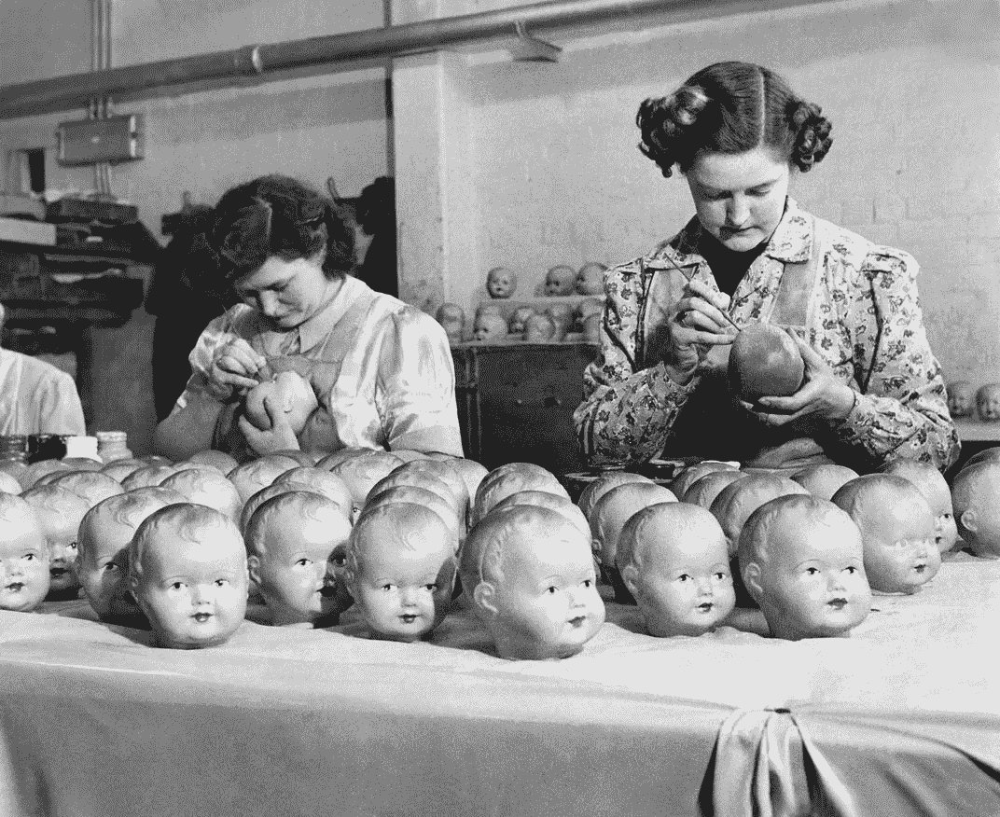
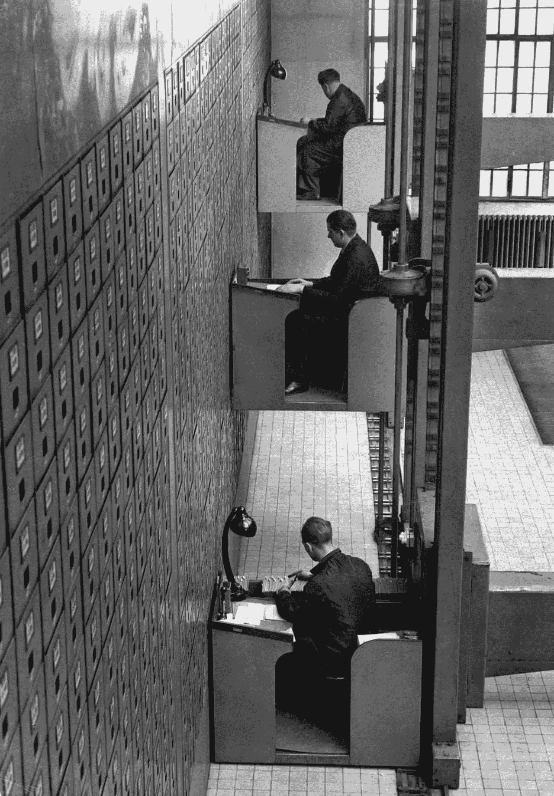
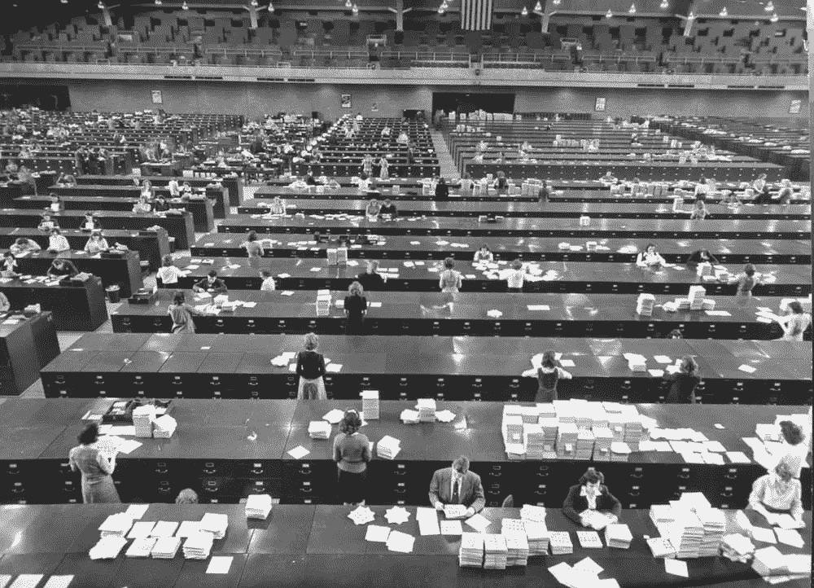

# 邮局经济是如何榨干我们所有人的

> 原文：<https://medium.datadriveninvestor.com/the-postmate-apocalypse-9f6453396a78?source=collection_archive---------1----------------------->

# PODIEM 论文#6:现实需求经济的衍生

ThePodiemPapers 是一个正在进行的短文系列，旨在围绕贯穿新闻和社交媒体的核心问题加强公众对话。

_________________________________________________________________

E.威尔逊说得好。*“我们是一个由旧石器时代的情感、中世纪的制度和神一般的技术组成的文明。”*

在硅谷，这句话现在被滥用了，因为它是有先见之明的。人们认为这对于特斯拉汽车保险杠贴纸来说已经足够简洁了。值得注意的是，没有人继续澄清“上帝般的”技术实际上指的是什么。全部吗？核武器？新款 iPad Air？

我敢说，威尔逊指的是我们无忧无虑的按需现实个性化世界。全新的*经济型*。想象一个“东西”的“上帝般”的力量，几分钟之内，“东西”就出现在你家门口。“购买”和“上门”之间的时间是 5 分钟还是 5 个小时无关紧要。威尔逊暗指的是没有摩擦的存在。一个我们永远不必“处理”任何事情的世界。

网飞调整了它的算法，以确保你不会在一个你可能不喜欢的节目上多浪费一分钟。亚马逊将地球上所有能想到的消费品送到你的门前，通常是在同一天。(*我最近参加了一个聚会，主人点了 50 磅。通过亚马逊 Prime 把小龙虾送到他们家门口。) *Tinder* 和 *Bumble* 和 *Hinge* 等人已经把浪漫和寻找爱情变成了一场净化的、众包的交换。Postmates 把米其林星级餐厅变成了披萨外卖站。我们命令年轻的有抱负的大学毕业生来我们家，在我们睡觉的时候为我们刷牙，这只是时间问题，因为你知道，效率。

我觉得最能体现这种无摩擦*“按需现实”*现象的应用是 *Instacart。*杂货店购物应用程序，你可以在网上选择杂货，几个小时后它们就会送货上门。你与有情生命的唯一互动是一个大材小用的兼职者打来的电话，*“很抱歉希利先生，您选择的* ***酸补丁小孩西瓜糖*** *不可用。您希望我将它们换成原来的* ***酸奶儿童*** *非西瓜味的，还是希望我购买其他品牌的酸奶？”如果你愿意，整个互动可以通过文本进行。*

我在这里想说的是，这种孤立的、即时满足的唯我主义趋势，中间没有任何人际交往，是一种精神税。对下游产生灾难性后果的税收。

这种新的即时经济正在对抗消费资本主义最糟糕的心理方面。我认为，困扰当今大多数千禧一代和 Y/Z 一代文化的焦虑是这种消费者接触空虚的直接结果。与隐藏在屏幕后面的交易者进行无意义的交流，被当作有意义的互动。一种疾病的蔓延是自愿的，这一切都是为了“效用”和“方便”。

我们现在经历的是多年前启动的效率曲线不可避免的终点。让一个农民杀了我们的牛，让一个屠夫把它切碎，让一个商店把它打包出售，让一个跑腿的把它送到你家门口，所有这些都是为了让我们远离混乱。没有摩擦和努力。从外界的混乱中解脱出来。

所有这一切最终限制了我们在一个相互关联的供给/需求网络中理解自己的位置和目的的能力。感觉不像是掌控我们自己命运的人类，而更像是某个*大公司的*全球供应链的端点。在自由市场经济的每一个领域中乘以这一点，然后当抑郁、孤独和混乱的比率开始飙升时，我们假装震惊。

想象一下下面这个假设的例子:这是一个前 T4 时代的周日早晨，你蜷缩在沙发上，享受着半严重的宿醉。你的身体同样渴望咖啡因和碳水化合物。

所以你挣扎着从沙发上起来，走了整整六分钟，来到街道尽头的一家精品咖啡店，这家咖啡店有一个时髦的名字，比如*“Drip”*

你排在队伍的最前面，一个大学生丹妮尔向你打招呼。丹妮尔有棕色的头发，褪色的雀斑，和一些残留的痤疮疤痕，让你知道她可能在高中没有被欺负，但可能也不是返校节女王。这自动让你更喜欢她。丹妮尔微笑着问候你，并问你周六过得怎么样。你不去探究血淋淋的细节。

你看着玻璃糕点盒，就好像在商场宠物店里扫描一笼小狗，希望其中一只会叫并与你联系。你问丹妮尔，*“有什么推荐吗？”*她告诉你，新的蓝莓烤饼是*“神奇球”*，店主 30 分钟前刚从烤箱里拿出一批新的，所以它们*“看起来还是很热的。”这几乎就像是一位老朋友让你知道一部新电影或一家新餐馆有多棒。*

所以你答应点了烤饼。一旦你把它放进嘴里，你就开始把它吐回你的手里，尽管很有礼貌。丹妮尔自然而然地认为她应该为你令人遗憾的购买决定负责。

接下来，话题转到，作为朋友，而不是雇员，丹妮尔该如何报答你把你引入歧途。丹妮尔正积极尝试纠正这种情况，不是出于经济原因，而是出于社会原因。你拿起这个，并试图向丹妮尔保证这与她无关。那是你的错。尽管如此，丹妮尔确保烤饼不收费，并再次道歉。

丹妮尔试图弥补糟糕的烤饼推荐的举动足以平衡客户/员工关系。你对她的信任，以及滴滴作为一家值得你花钱的咖啡馆的优点，以及你六分钟的步行路程，开始感觉更有道理了。

你不仅开始同情丹妮尔，她是一名努力赚取租金并度过一天的员工，更重要的是，你同情*滴滴*本身。一种团结的意识和帮助这家咖啡店继续经营下去的责任感向你袭来。

你对*滴滴*对抗大连锁的战斗有感觉。你同情房主关于租赁协议中租金上涨的争议，因为这个社区正在迅速中产阶级化。你开始意识到，老板在让员工享受滴滴的医疗保险，同时又不得不削减每个人的工作时间来弥补房租上涨的同时，要在两者之间周旋有多困难。想想 *Drip* 的老板每个周末都在从头开始做蓝莓烤饼，你就觉得很嫩。

所有这些都是因为丹妮尔提出了一个不符合你口味的食物建议。无独有偶，丹妮尔会是你未来回归*滴滴*的驱动力。你们俩都会拿蓝莓烤饼事件开玩笑，然后在那个时刻的基础上，开始精心制作关于她的推荐和她如何不可信任的更小的内部“笑话”。不久之后，你会问她今天过得怎么样，她来自哪里，她有几个兄弟姐妹。背景信息让你看到丹妮尔不仅仅是一个询问你是否想要一种不同的西瓜的提示。

当然，对于那些在美国各地小城镇长大的人来说，这些都不一定是爆炸性新闻，在这些地方，这种社交活动是日常生活的重要组成部分。虽然，我确实认为这项研究已经令人信服地表明，弥漫在美国小镇的强制“美好”已经足以驱散在*把一切都交给比弗维尔*的想法。诚然，关于小镇八卦的陈词滥调在某种程度上是有事实依据的。关键是，这篇文章绝对是**而不是**对所有国际化都市人发出的乡村购物的警笛。

不过，我想说的是，除了与丹妮尔面对面的互动，我不知道还有什么其他方法可以培养社区意识，在现实生活中的归属感。

蓝莓烤饼事故显然不是故意的。我们无法操纵这些时刻。但这正是问题的关键。

相反，滴滴事件是一个意想不到的结果，其协同效应会产生指数回报。一次事故造就了友谊和对商店的忠诚。一场事故让买方和卖方之间的关系变得更加流畅和人性化。

*Drip* 和 *Postmates* 或 *Instacart* 的基本区别在于 *Drip* 是为了保持意外收获的可能性。提醒我们自己，我们的整个日常生活不应该是为了效率或易用性而优化。优化，这样我们就再也不会因为一块变质的烤饼而让我们的味蕾遭受一分钟的痛苦。*点滴*是关于为一次糟糕的经历敞开大门，让它变成一次人性化的经历，并通过它发现一种社区意识。

我们对无摩擦效用函数的痴迷正在榨干我们的精神。剥夺了我们发现自我所必需的质感。这种摩擦需要真正的*“知道我们是由什么组成的”*

生活在“真实世界”的一个令人困惑的好处是，它充满了失望。十有八九，我们会因为与陌生人的交往而失望。因为过于信任而受到惩罚。因不知情而被敲诈。总有人在某个地方试图利用我们善良的本性。因此，彻底革新我们自己，不让自己感到失望或被利用的冲动是真实的，没有人会说这是不值得的。

但是这种强迫现在伪装成“省时”和“省事”“我用 Tinder 是因为我没有时间去参加一堆约会。”不，你用 Tinder 是因为在现实世界中被拒绝是很难的。在满怀希望之后，又一次次地失望，这就更难了。

但是如果我们排除了第十次互动的任何可能性，丹妮尔互动，我们就排除了人类扎根的任何机会，无论多么小。任何提醒我们在日益自动化的市场中不仅仅是没有灵魂的消费者的机会。

毕竟， *Drip* 从来都不是关于蓝莓烤饼的。烤饼总是一个借口。*滴滴*是关于寻找一个人的时刻，而不是效用优化曲线。这是关于希望在一个充满效率的世界里发生一次*【丹妮尔】*的不幸。