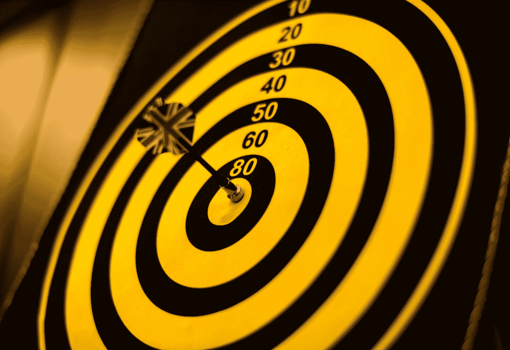

# 个人陈述的力量

> 原文：<https://medium.datadriveninvestor.com/the-power-of-a-personal-statement-6460e735a418?source=collection_archive---------20----------------------->

[](http://www.track.datadriveninvestor.com/DDIBeta11-23)

## 当你集中精力时，你会获得更多，感觉更好



Photo by [rawpixel](https://unsplash.com/@rawpixel?utm_source=medium&utm_medium=referral) on [Unsplash](https://unsplash.com?utm_source=medium&utm_medium=referral)

今年年初，我已经对阅读着了迷。我过去每两个月读一到两本书。然后，我意识到我可以通过设定每月阅读一本书的目标将它提升到一个全新的水平，我做到了。你可以在这里阅读一篇关于阅读如何影响我的生活的文章:

[](https://medium.com/datadriveninvestor/do-you-feel-wild-put-that-into-reading-3ed5dbca7e51) [## 你觉得狂野吗？把它放到阅读中

### 读书？真的吗？读书怎么会是一种技能？基本上受过高等教育的人知道如何在一个本土和第二…

medium.com](https://medium.com/datadriveninvestor/do-you-feel-wild-put-that-into-reading-3ed5dbca7e51) 

有一天，我在 LinkedIn 上看到一个帖子，来自我的一个熟人，关于<<*磨利锯子> >。当然，我谷歌了一下，发现它属于史蒂芬·柯维所著的《高效人士的 7 个习惯》*。我说:我一定要有它*。*

如前所述，我在一个月内阅读了这本书，发现了一个叫做**个人陈述的工具。**

*个人陈述被认为是你作为一个人的使命。你可能在公司或初创企业中见过这种情况。这是他们的指南针，他们成功的途径。*

*为了更好地说明你如何描绘你的个人陈述，我将解释斯蒂芬在他的书中使用的相同练习:*

> *想象你正走进一场葬礼。坐在椅子上的是你认识的多个人。有些人在哭，有些人只是低着头。你一直穿过过道走向棺材，只是为了意识到棺材里的人就是你。*

*这幅插图继续让我们思考，我们希望从朋友和家人那里听到什么关于我们的生活。*

*事情变得有趣了。你希望从别人那里听到关于你的什么？也许你是一个伟大的父亲或母亲，或者你是一个了不起的老板或同事。你谦逊、敬业、自我激励并且总是帮助别人。所以，如果你今天这样想。这在你的生活中是真实的吗？好吧，如果不是，你就在开始你的个人陈述的最佳位置。*

*对我来说，这是革命性的，因为像我们大多数人一样，我想给别人留下遗产，无论是家人还是朋友，但无论我多么想这样做，我每次都失败了。*

**个人陈述*哲学要求我们提供详细的，你猜对了，包含我们想要成为什么和/或我们想要实现什么的陈述。为了让你有一个例子，我将与你分享我的一部分:*

```
*I want to be a supportive son, a comprehensive boyfriend, and a loyal friend, being always present for all of them. In my professional area, I want to be a point of reference to future engineers, I want to inspire them and help them achieve more that they can right now. I want to start using data to create value. I want to be a great reader,and never get outdated in my career. I want to eat healthy and keep myself in shape...*
```

*嗯，你明白了。我写了一整页，描述了我生活中想要描述的每一部分，思考着我希望我的家人和朋友怎么评价我。*

*在这一点上，也许你认为这种说法是由“别人对我的看法”驱动的，我不得不说它不是，因为当你听你爱的人说话时，情况完全不同。*

*只有当我知道自己想要实现什么时，我才能集中精力去实现它。我无法满足自己的需求，因为我同时想做很多事情。自从有了*个人陈述*(我每两三个月就要查阅一次以保持注意力集中)，我已经能够完成我的项目了。*

*我们作为人类，可以被不同的场分散注意力或吸引；那么我们就不是只擅长一件特定事情的简单机器人。正如艾米莉·瓦普尼克在这次 [TED](https://www.ted.com/talks/emilie_wapnick_why_some_of_us_don_t_have_one_true_calling) 演讲中解释的那样，我们可以把自己视为“多重目标”。但是，我相信这是有限度的。我们不能一辈子追求在 100 个领域里出类拔萃。我们必须把精力集中在对我们最重要的事情上。*

*个人陈述帮助我集中精力。现在，我确切地知道我想在哪些方面取得成功。我每个月读一本书，时刻关注我的家人和他们的“东西”我正在努力学习和阅读数据科学。每天早上，我知道我醒来的原因，因为我已经缩小了我想要实现的目标的范围，而且它正在起作用。*

*那么，写完你的*个人陈述*后，你会完成你的目标吗？这是第一步。在那之后，你必须在你对这些目标的承诺水平上努力，但是如果你正在读这篇文章，我确信你想把自己带到一个新的表现水平。*

*我是厄瓜多尔人，但我认为自己是世界公民。我热衷于通过合作和知识来改善他人的生活。< <用文字的力量冲击我的周围。>T17*

*[](https://www.linkedin.com/in/marco-brito-f/)**[](https://www.instagram.com/marcobf30/)**[](https://twitter.com/marcobfec)*