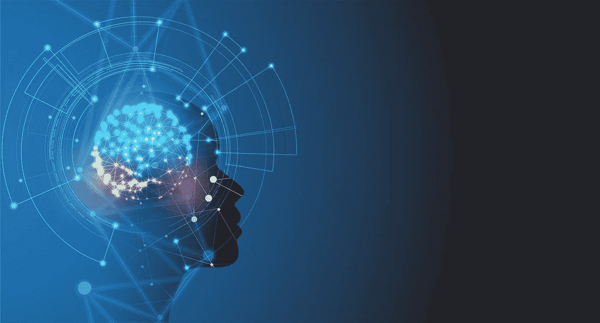

# 人工智能的力量

> 原文：<https://medium.datadriveninvestor.com/the-power-of-artificial-intelligence-5cf7d7152b77?source=collection_archive---------0----------------------->

亿万富翁微软联合创始人比尔·盖茨说，人工智能的力量“如此不可思议，它将在一些非常深刻的方面改变社会”。

Google image

人工智能，或称 AI，是约翰·麦卡锡在 1995 年发现的。它被称为“制造智能机器的科学和工程”人工智能是使用计算机科学编程来复制人类的思想和行动，通过分析数据和环境，解决或预测问题，以及学习或自学来适应各种任务。

人工智能无处不在，我们每天都在使用人工智能完成日常任务。无论是在你使用 Siri 的手机上，还是如果你有亚马逊的 Alexa，它们都使用 AI 来完成任务并回答你的问题。脸书 Feed 正在使用人工智能来预测哪些内容与你的用户最相关。网飞正在使用人工智能根据你的观看偏好来创建建议。总的来说，人工智能改善了我们的生活，让许多人更容易完成工作或消费内容。

 [## 人工智能预测能力的神话——数据驱动的投资者

### AI(人工智能)最有前途的优势之一似乎是它预测未来的能力…

www.datadriveninvestor.com](https://www.datadriveninvestor.com/2019/03/01/the-myth-of-ais-predictive-power/) 

然而，许多人担心这种特殊的技术将开始取代人类的工作。许多人对机器人对人类工人的潜在影响持否定态度。经济合作与发展组织(OECD)最近在 3 月份发布的一份报告预测，6600 万个工作岗位是高度自动化的，这份报告声称，在未来 15 到 20 年内，70%的工作岗位将实现自动化。

如果我们回到过去想一想，这种现象已经发生了，人们不一定会失去工作，但工作的概念正在发生变化，因为技术变得更加先进。一些工作被取代了，但许多工作被创造了出来。我相信同样的事情也会发生在 AI 身上。这将有助于我们变得更先进、更高效、更投入。机器人可以做很多事情，但它们需要人类在后面教它们这些任务，并指引它们正确的方向。现在的许多工作都很常规，人工智能可以为我们做这些工作，所以一旦涉及到未来的工作，创造性，创新性和善于设计思维是至关重要的技能。此外，如果我们从这个角度来看，所有这些都可以带来更快乐的工作环境和更充实的职业生活。

在对世界首富美国消费者新闻与商业频道的采访中，杰夫·贝索斯解释了他并不担心机器人会抢走工作。事实上，他非常乐观，他声称人工智能将是有益的，它将使人们更快乐。

贝佐斯说:“我预测，由于人工智能及其自动化某些过去不可能自动化的任务的能力，我们不仅会有一个更加富裕的文明，而且工作质量将会显著提高，更高比例的人将会有相对于今天的职业和事业。”。

有了人工智能给我们带来的所有好处，未来是有希望的，但它对每个故事都是不好的。此外，公布的许多事实对这种先进技术提出了一定的质疑。近年来，我们看到，如果缺乏监管，算法和社交平台可能会被用于错误的原因和不道德的原因。话虽如此，我们还是发现，美国、澳大利亚、新西兰、日本、德国，或许还有加拿大和英国，都将华为这家中国国家支持的科技公司视为国家安全风险。脸书假新闻及其在 2016 年选举中的作用。此外，谷歌和微软向美国政府和其他许多国家出售他们的服务。埃洛斯·马斯克和斯蒂芬·霍金多次提到，不受监管的人工智能可能会导致灾难和反人类罪。看起来人工智能可能是人类发生的最好或最坏的事情。你有什么想法？

参考资料:

c . Clifford(2018 年 5 月 11 日)。杰夫·贝索斯谈人工智能:自主武器“真的很可怕”，机器人不会让我们都失业。检索自[https://www . CNBC . com/2018/05/11/Jeff-be zos-on-ai-robots-wont-take-all-our-jobs . html](https://www.cnbc.com/2018/05/11/jeff-bezos-on-ai-robots-wont-take-all-our-jobs.html%C2%A0)

c . Clifford(2019 年 3 月 26 日)。比尔·盖茨:人工智能就像核能——“既有希望又有危险”。摘自[https://www . CNBC . com/2019/03/26/bill-gates-artificial-intelligence-both-promised-and-dangerous . html](https://www.cnbc.com/2019/03/26/bill-gates-artificial-intelligence-both-promising-and-dangerous.html%C2%A0)

Sraders，A. (2019 年 01 月 03 日)。什么是人工智能？2019 年的例子和新闻。检索自[https://www . the street . com/technology/what-is-artificial-intelligence-14822076](https://www.thestreet.com/technology/what-is-artificial-intelligence-14822076%C2%A0)