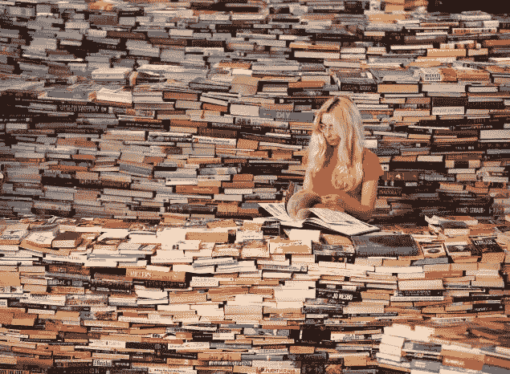
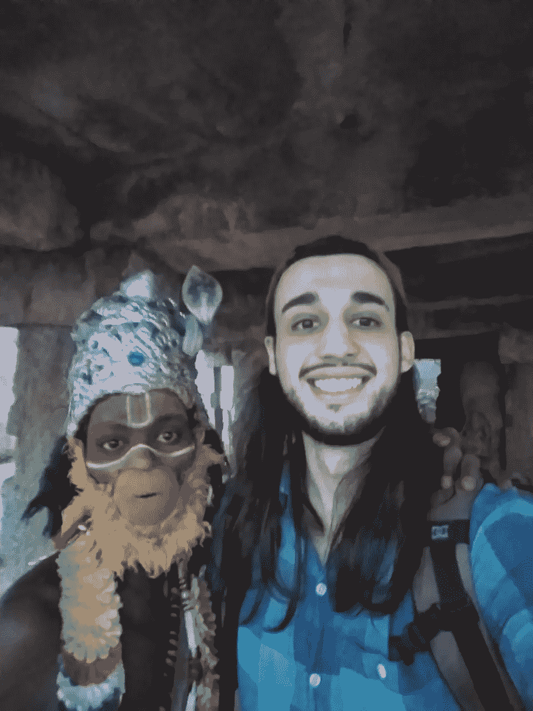

# 书籍的力量！

> 原文：<https://medium.datadriveninvestor.com/the-power-of-books-b27c77446ad6?source=collection_archive---------8----------------------->

嗨伙计们。

大约 5 年前(我 21 岁的时候)，我开始阅读很多很多关于一切的书籍。所以，我决定写这篇文章，和大家分享我到目前为止学到的一些东西。

所以，我从来都不是一个好学生。我在学校总是很糟糕，我讨厌每天早上都要去上学的事实(就像外面的许多人一样，哈哈)。我完全迷失了，不知道我的生活该怎么办(*青少年的事情*)。当我开始阅读书籍(主要是非小说类书籍，尽管我也阅读许多小说)时，事情才开始在我的生活中发生。

当然，不仅仅是读书，没有实现的读书仅仅是 ***无用。我说的是你读了很多遍的那本书，你真的相信你可以做你刚刚学到的那些事情。*你得活下去*。即使你现在做不到，这也是你需要时刻记住的一件事，当任何机会来临时(它们会出现)，你就能抓住它。***

> **读书不落实是没用的。**

我记得我从加拿大温哥华回来后就开始读书了。我在那里呆了六个月，我的主要任务是:学习英语。我在那里也有了我的第一份工作经历，那就是:搬东西！*是的*。基本上，我在一家轮班公司工作。所以，我们搬了家，等等。这些工作被称为入门级工作——服务员、保姆、建筑、搬运等——尤其常见于初来乍到的人或者没有任何就业经验的人。虽然你可以从中赚很多钱，但我不想下半辈子都做这个。

Vancouver, Canada

我一从温哥华回来，就开始阅读。我记得我读的第一本书中有一本真正改变了我:吉姆·科林斯的《从优秀到伟大》。这本书我读了两遍，我确信我可以用我的生命做更多的事情。我刚刚开始想大事，我发现了一件事:*如果你一直说你会做某事，并真的相信你能做到，最终，它会发生。迟早会发生的。*

我开始环游世界。我离开了自己的舒适区，走向未知。你知道，在生活中有很多方法可以学习。书只是其中一种方式。昨天我和一个住在同一个宿舍的家伙进行了一次奇妙的谈话。我们谈到了*印度*(是的，我在印度)；这个国家面临的挑战是什么，但主要是印度在不久的将来成为真正强大经济体的潜力。

Hampi, India

> 如果你一直说你会做某事，并且真的相信你能做到，最终，它会发生。迟早会发生的。

与人交谈是学习生活中新事物的好方法。重要的是*多听少说*。你只是从问题中学到的比答案多得多。在培养更好的倾听能力的过程中，书籍无疑起到了帮助作用——现在仍然如此。我会推荐这本:“*自我是敌人，作者莱恩·哈乐黛”。*

同理心是一个词，书籍可以帮助你培养同理心。当你明白为什么事情会是那样的时候，你就自动停止了对它的评判。你不需要认同它，但你会开始更加尊重它。目前，我读了很多印度作家的书。我建议*梦想家——年轻的印度人是如何改变他们的世界的——作者斯尼格达·普纳姆。*

我想我找不到比 12 分钟更好的工作了。*我们提倡平均在 12 分钟内完成图书摘要(音频和文本)的阅读习惯*。我最喜欢的一些书在那里。它凝聚了我的激情，也给了我做出自己决定的自由。目前，我正专注于印度，我们正在这里做一些很酷的事情。

感谢阅读伙计们！

好好呆着(: