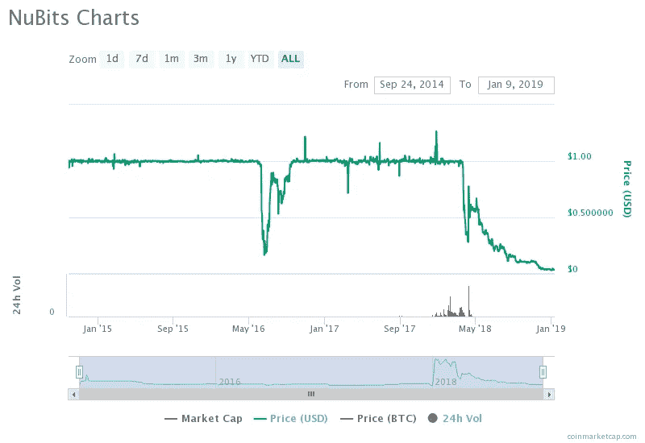
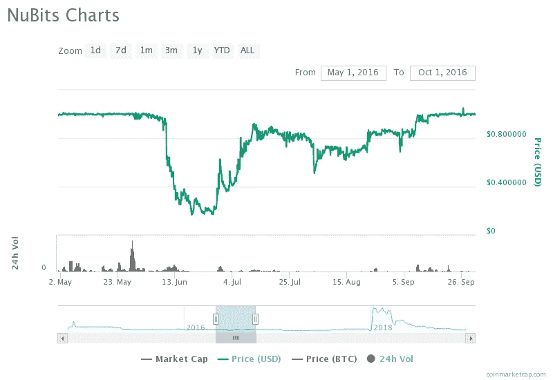
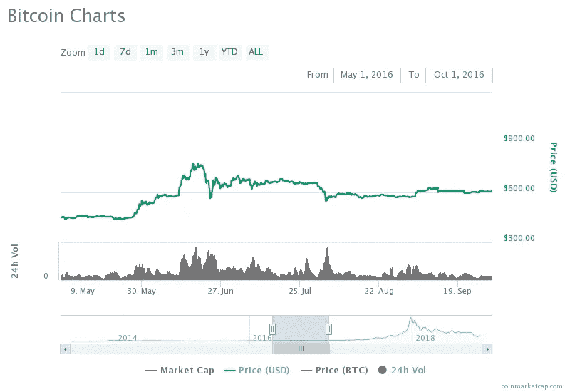

# 代码的力量:Stablecoins(第 4 部分)

> 原文：<https://medium.datadriveninvestor.com/the-power-of-code-stablecoins-part-4-5c18cc5b7f7?source=collection_archive---------18----------------------->

对加密“圣杯”——一种价格稳定、无需抵押的完全去中心化的加密货币——的探索引入了稳定货币的算法类型。算法稳定货币旨在维持稳定的目标价格，不锁定任何额外资产(加密货币或法定货币或商品)，也没有一个将价格驱动到理想水平的中央机构。一些算法稳定硬币解决方案包括用于供应和价格调整的补充债券类或股票类工具或行为，其算法模拟了中央银行的行为——这就是为什么这种类型的稳定硬币被一些作者称为“铸币税份额”。

从比特币诞生的十年来看，算法稳定币的想法并不算新，因为第一个算法稳定币是在 2014 年发行的。在过去的一年中，提议引入额外算法稳定币的已发布白皮书的数量显著增加，这是由于对加密货币的需求增加，加密货币将在市场收缩期间保持稳定的价格，以及对阿尔法菲亚特支持的稳定币(美元系链)的信任动摇。

过去一年最受期待的算法 stablecoins 之一，预计将于 2018 年第三季度推出，是基础*。基础提案包括发行一种算法稳定的硬币，同时发行一种类似债券的工具和一种类似股票的工具。“债券”的预期作用是在稳定的硬币以低于目标价格交易时，通过在 5 年期满后给予持有人以完全目标价格赎回的权利，减少稳定硬币的供应。稳定硬币的持有者可以通过“烧毁”他们的基础来获得“债券”。当基差超过目标价格时,“份额”(基差稳定币的额外供给，以红利的形式分配给持有者)会被用来增加供给，期望将价格降低到目标水平。

碳稳定币提出了一个与 Basis 相似的概念，但有两个显著的不同。首先，他们计划在推出时(预计在 2019 年第二季度)提供完全由菲亚特支持的 stablecoin，然后在稍后阶段通过混合(菲亚特支持的和算法的)价格目标阶段迁移到算法“治理”。另一个区别是“债券”的盈利能力，这是一种用于减少供应并将价格推高至目标水平的工具:尽管 Basis 提案允许“债券”持有者获得最高 15%的收益率，其余溢价作为股息分配给 Basis 持有者，但这种收益率限制并未针对碳信用(碳稳定币的“债券”工具)提出，这使得参与碳项目在理论上更有利可图。

Ampleforth algorithmic stablecoin 项目(目前也处于预发布阶段)最初以 Fragments 的名称推出，提供了一个类似的概念，无需额外的工具即可实现。提议通过一个被称为“重定基数”的过程，通过增加和减少稳定货币持有者的余额来进行供应调整。正如基差和碳一样，供应的减少预计将推动价格上涨，涨幅回落至目标水平。

本质上，我们可以说，算法稳定硬币试图通过一系列激励措施来调整硬币持有者的行为，目的是保持价格稳定。在硬币持有者和硬币(或驱动它的算法)的这种共生行为中，真正成功达到目标的程度将决定硬币是否真的是一种稳定的硬币，一旦它被投放到动荡的加密货币市场。加密货币市场的波动性在实现这种硬币的预期性能方面也起着重要作用:如果市场变化足够缓慢，稳定的硬币持有者可以通过燃烧(获得债券)或出售多余的硬币来及时做出反应，则有更大的机会保持价格接近目标并保持盯住。在市场快速剧烈波动的情况下，无论在哪个方向，稳定的币持有者的惯性，以及他们对市场变化的滞后反应，都可能导致钉住汇率的打破，而不管算法的表现如何，并进入一个目标价格无法恢复的下降螺旋。

## 前稳定币币的情况

这至少是 2014 年推出的第一款算法稳定币 NuBits 的情况。NuBits 在 2016 年第一次失去钉住汇率后幸存下来，并在一个多月徘徊在期望值以下后恢复到 1 美元的目标价，但在钉住汇率第二次被打破后，它没有恢复，目前交易价格为 0.037 美元。

NuBits trading information obtained from [coinmarketcap.com](https://coinmarketcap.com/currencies/nubits/)

挂钩首次被打破时，抛售压力是由比特币价格飙升以及持有者希望“随波逐流”而不是持有价格稳定的比特币造成的。

NuBits trading information obtained from [coinmarketcap.com](https://coinmarketcap.com/currencies/nubits/)

Trading information obtained at [coinmarketcap.com](https://coinmarketcap.com/currencies/bitcoin/)

如果放大到 1 美元的目标价格首次被突破的时期，并观察同一时期比特币价格的变化，就可以清楚地看到为什么比特币价格大幅下跌。随着比特币价格的稳定，即使在远低于 1 美元的一个月后，比特币也重新获得了其目标价值。但后来回想起来，一切都清楚了。

*由于该系列文章的研究已经开始，2018 年 10 月，stablecoin 项目 [Basis 的组织者在 12 月中旬取消了该项目，并将 ICO 资金返还给投资者](https://www.basis.io/)。该项目以美国为基地，美国证券交易委员会(SEC)将拟议中的 stablecoin 设计解释为一种证券，受到全面监管。尽管如此，本文还是选择了 Basis 进行分析，因为它具有建议的特性和可用的文档。

尚未推出的算法稳定积分将面临同样的挑战——监管和市场风险。随着加密货币、技术和市场的发展，人们可以预期已经吸取了一些教训，但这将再次留给算法稳定币和专有补充工具的持有者，以充分和及时的方式对激励做出反应，以确保项目的成功。

*本文表达的观点不是投资建议，也不是推荐。本文包含的事实不一定完整，本文的读者应该在投资前做好自己的尽职调查，包括寻求独立的财务建议。这篇文章不是一个要约，也不是要约邀请，购买或出售这里提到的任何资产。*