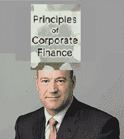

# 复利的力量迫使我

> 原文：<https://medium.datadriveninvestor.com/the-power-of-compounding-interest-rates-compels-me-521ebfd1a7ca?source=collection_archive---------5----------------------->

这让我想到…你怎么能用我的钱做这么多…并把它变成更多的钱？微小的回报怎么会变得如此巨大？

于是我去翻家里的数学书。我看了看书里的数字。我建立了一个流程图来概念化我的想法。我开始梦想我的核心股票和债券投资组合的复利。我的**目标**是了解如何在我自己的生活中使用这种复利力量。我怎样才能给自己头脑中的价值和知识带来复利呢？我该怎么做才能成为这种类型的兴趣？

有一天我老婆下班回家，看见我躺着，胸口顶着一堆金融课本。她说:

> *“你在干什么，你这个混蛋？”*

我说我从这些书里获得了复利，渗透进了我的身体。我开始对这些书感兴趣了。你只需要让它顺其自然。

***利息复利因为你让它坐在那里*** 。为了帮助你解释这一点，想象一下如果你有两件东西:

**1。投资**

**2。利息**

拿这两个让他们坐在一起。不要看他们。你必须尊重他们的隐私。你必须对他们说友好的话。你必须亲吻他们(但是闭着眼睛)。你必须热爱你的投资和兴趣。这就是诀窍。

多年后，当你到了退休年龄，准备从 401K 中提取资金时，你终于可以看看它了。在多年的相互依赖之后，你的投资和兴趣将会复合增长，变得超乎你的想象。这将是非常特别的。就像一份半熟的里贝耶牛排，有点脆脆的焦味。

直到今天，我下班回家，还会把金融教科书放在身上。我的知识合成了难以置信的智力增长。在我的银行账户里，我的投资和利息也是如此。每天我亲吻我的投资和利息(闭着眼睛)。我迫不及待地想看到收益。

我叫达雷尔·冈恩，是一名本地、国际和全球商人。如果你喜欢我的投资建议，或者曾经想谈论商业术语，请告诉我。让我们谈谈数字。

