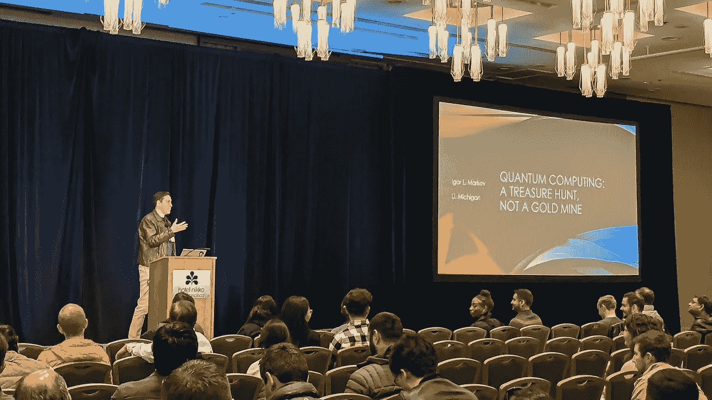

# 数据的力量 MLconf 2019 综述

> 原文：<https://medium.datadriveninvestor.com/the-power-of-data-a-review-of-mlconf-2019-f720124de7b7?source=collection_archive---------11----------------------->

MLconf San Francisco — 2019

(983 字)

上周五，当我系好鞋带，开始前往 MLconf 的晨间散步时，“雾都”名副其实。与 11 月寒冷的天气形成鲜明对比的是，旧金山 MLconf 的内容却一点也不冷。该活动在联合广场附近举办，由来自优步、网飞、谷歌、Airbnb、亚马逊等知名公司的多元化演讲者组成，所有人都在通过人工智能的使用推动“可能”的界限。

今年，我承诺开始终生学习并在自己的职业生涯中应用 ML，我非常兴奋有机会参加。

我没有失望。

数据科学正在以几年前我们无法想象的方式改善人类对周围世界的理解。这种令人难以置信的应用多样性是显而易见的，因为演讲者的主题从基于语音预测阿尔茨海默病的发作到利用技术来最大限度地减少你我等待 Ubers 到来的时间。尽管会议上代表了各种各样的应用和行业，但有一个事实听起来最清楚——人工智能对我们日常生活的影响比大多数人意识到的都要大，而且至关重要的是，我们要尽一切努力寻求理解，并从道德上实施人工智能，以造福我们的生活和企业。

虽然这次活动的每一个演讲都应该有一个自己的帖子，但我想强调几个我认为令人信服的演讲，并为任何有兴趣了解更多信息的人分享链接。

我们开始吧！

优步大学的数据科学主任 Franziska Bell 博士启动了这项活动。在她的演讲中，贝尔博士讨论了优步应对一个普遍面临的挑战的一些方法——模型的可重复性以及大规模合作和共享深度学习模型结果的能力。众所周知，自 10 年前成立以来，优步的发展一直是爆炸性的。随着快速增长，需要实施可扩展的流程和技术来支持它。

像优步这样的拼车公司成功的一个主要因素是方便。在这个国家的大多数地方和世界上的许多地方(问我在基辅使用优步的冒险)，你可以拿出你的手机，在 5-10 分钟内可靠地到达你的下一个目的地。随着全球数百万用户不断加入该平台，维护优步客户所期望的便利性和可靠性标准的挑战变得越来越难以管理。这是一个大规模的挑战，优步使用机器学习来应对。

 [## DDI 编辑推荐:5 本让你从新手变成专家的机器学习书籍|数据驱动…

### 机器学习行业的蓬勃发展重新引起了人们对人工智能的兴趣

www.datadriveninvestor.com](https://www.datadriveninvestor.com/2019/03/03/editors-pick-5-machine-learning-books/) 

如果您曾经花时间训练预测模型，您很可能熟悉台式机的能力限制以及与团队的其他成员存储/共享建模结果所带来的痛苦。进入[米开朗基罗](https://eng.uber.com/michelangelo/)，这是一个优步的内部解决方案，旨在解决优步在使用其数据时面临的以下挑战:

1.  管理数据
2.  火车模型
3.  评估模型
4.  部署模型
5.  做预测
6.  监控预测

除了米开朗基罗，贝尔博士分享了另一个优步内部工具，用于建立米开朗基罗提供的可访问性，优步将其称为“[数据科学工作台](https://eng.uber.com/dsw/)”。该工具秉承“先解决问题，再扩展”的理念，是一个用于数据探索、准备、建模和分析的集中式平台，具有适应不同技能水平用户的灵活性。优步使用这些模型，结合基于即将到来的事件、天气、一天中的时间和大量其他因素的预期激增来预测需求，并适当激励司机满足激增的需求。你可以在这里阅读更多关于贝尔博士和她在 T4 优步团队的工作。

机器学习的可访问性的挑战似乎是活动中几位发言者谈论的一个常见问题。令人欣慰的是(对我们中的许多人来说)，理解并在当今的商业中应用 ML 并不需要博士学位。 [Martin Isaksson](https://www.linkedin.com/in/mpei/) ，首席执行官&[percept ilabs](https://perceptilabs.readme.io/)的联合创始人，分享了他的公司的愿景，将人工智能的力量带给大众；拖放神经网络。虽然没有完全“放手”，但 PerceptiLabs 拖放平台能够非常简单地构建一个全功能的卷积神经网络(CNN)，包括处理图像预处理和可视化每一层的中间激活，允许不同技能水平的用户快速检查他们的模型输出并调试问题。使用(可编辑的)锅炉板代码，该平台允许用户连接 CNN 的层，以及完成训练和分析结果。在一个简短的现场演示中，马丁的团队展示了创建和评估“基本”CNN 性能的过程，从开始到结束只需几分钟，所有这些都没有编写一行代码。

但这不仅仅是方便、客户成功和可访问性。机器学习也被用于突破性的医学研究。在她的演讲中，Jekaterina Novikova 博士讨论了她在 [Winterlight Labs](https://winterlightlabs.com/) 的研究如何对抗阿尔茨海默病，这种疾病影响了全球数百万人。Novikova 博士的模型使用基于语音模式的自动语音识别和 ML 模型，对语音、语言和认知进行量化，以便将正常语音与阿尔茨海默病早期发展中的个体语音进行分类，从而提高早期诊断率和患者预后。对于那些有兴趣了解更多的人，你可以在她的[博客](https://jeknov.tumblr.com/works)上查看更多诺维科夫博士的工作。

总之，如果你是学生、数据科学家、数据工程师、企业主，或者只是有兴趣了解和认识人工智能世界前沿的一些人，你绝对不能错过 MLconf 的活动。

*关于 MLconf 旧金山 2019 演讲嘉宾的更多信息，可以查看这个* [*链接*](https://mlconf.com/speakers/) *。特别感谢 MLconf 创始人 Courtney Burton* *及其团队的其他成员组织了这次精彩的活动！*

希望下次能见到你们！

联系人:[https://www.linkedin.com/in/paul-woody/](https://www.linkedin.com/in/paul-woody/)