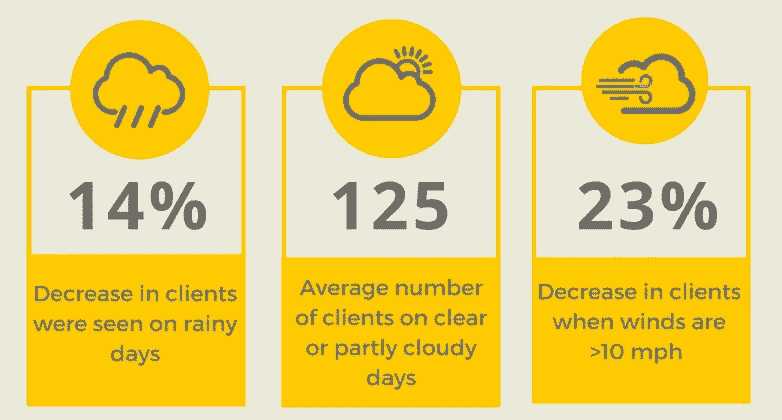
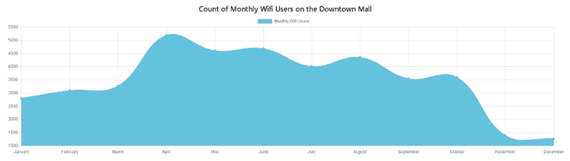
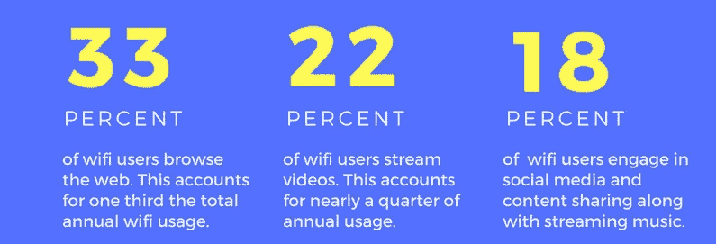

# 开放数据和众包分析的力量

> 原文：<https://medium.datadriveninvestor.com/the-power-of-open-data-and-crowdsourcing-analytics-98b7d083ccab?source=collection_archive---------4----------------------->

2005 年, *Wired* 杂志首次将“人群”和“外包”结合起来，并在互联网的推动下，众包是一种强大的外包模式，它利用了公共团体而不是组织自己的员工的深度经验和想法。在 [*中，众包的重要性*](http://www.exinfm.com/board/crowdsourcing.htm) Matt H. Evans 指出“众包利用了全球的想法，帮助公司通过快速的设计过程工作。你外包给大群人，努力确保你的产品或服务是正确的。”据称，使用众包的优势包括改善成本、速度、质量、灵活性、可扩展性或多样性。它被初创企业、大公司、非营利组织用来创造公共产品。维基百科维护着一个[众包项目](https://en.wikipedia.org/wiki/List_of_crowdsourcing_projects)的列表。

上周，夏洛茨维尔市举办了汤姆汤姆节应用机器学习会议。会议的重点是“促进对将数据科学和机器学习技术应用于现实世界问题的实际问题的理解”，并包括使用开放数据源的众包挑战。在其成为“智能城市”的旅程中，夏洛茨维尔希望通过首届城市开放数据挑战赛来加速其发展，该挑战赛由义神星的联合创始人兼首席技术官 Daniel Bailey 组织。该挑战的目标是使用开放数据和众包来吸引夏洛茨维尔及周边地区不断增长的数据科学社区，以帮助该市更好地了解行人对市中心购物中心的使用。该购物中心是美国最成功的步行购物中心之一，拥有超过 120 家商店和 30 家餐厅，这座城市希望确保资本基础设施计划得到有效优先考虑。

该挑战要求注册的数据科学家团队分析一年来关于免费 WiFi 使用的匿名时间序列数据，创建预测行人使用的预测模型，并通过可视化识别行人使用的影响因素。鼓励团队使用其他开放数据，包括在夏洛茨维尔开放数据门户的[城市找到的任何相关数据。](http://opendata.charlottesville.org/)

挑战分为两部分:

**最佳预测模型:**提供三种模型，为以下时间序列生成一周预测:

*   每天的客户端数—使用城市提供的 WiFi 服务的人数
*   会话数量—客户每天进行的会话
*   一段时间内的使用量—每 4 小时窗口的千字节使用量

**最佳数据故事:**精心制作一个叙述和可视化工具，解释数据中正在发生的事情(趋势、异常、异常值等)。).启发目标受众成员的洞察力，如果没有图表或图形，这些洞察力是不清晰的。

30 多支队伍，60 多名成员参加了挑战。Team HACK'D 是一个五人团队，主要由来自 Elder Research 的数据科学家组成，赢得了最佳故事奖。评委团采用的评估标准来自五个类别:

*   **稳健**——故事背后的分析有多稳健和严谨？
*   **可解释的** —这个故事在多大程度上解释了数据中正在发生的事情？
*   **吸引力** —视觉效果有多震撼？
*   **可访问性** —不同受众对调查结果的可访问性如何？
*   **参与度** —叙事和视觉的结合有多吸引人？

我采访了被黑客攻击的团队，以了解更多关于他们加入挑战的动机，他们如何着手开发成功的解决方案，以及他们在这个过程中遇到的挑战。

# 众包数据科学的价值是什么？

**Kazlin Mason:** 通过开放数据门户将众包应用于数据科学计划，可以以低成本获得高价值的数据。在典型的研究环境中，许多战略决策是基于相对较小的样本量或调查做出的。在我们这个互联的世界中，整合多种数据源并让有能力的研究人员和分析师有机会以创造性的方式走到一起，可以提高对数据的理解，并产生广泛适用的见解。

# 是什么激励你参加挑战？

Cory Everington: 虽然比赛占用了我们下班后的大量时间，但我们认为这是学习新技能的好机会。我想我们都是因为有机会参加本地比赛和支持夏洛茨维尔技术社区而受到激励。我想我们大多数人以前都没有参加过这样的比赛，我们认为这将是一个有趣的业余挑战。

# 这个项目最大的挑战是什么？

**哈利·梅森:**主要的挑战是时间。我们决定为挑战的两个部分创建提交材料，最佳预测模型&最佳数据故事。由于我们的团队由行业专业人士组成，并且我们在下班后还在应对这一挑战，因此我们在项目上花费的时间有限。最佳预测建模竞赛有三个模型需要训练和调整 **1** ，我们选择创建一个网站来展示最佳数据。每个任务都有一系列独特的挑战，时间是团队的限制因素。

# **使用开源数据有哪些挑战？**

Cory Everington: 我认为使用开源数据的最大挑战之一是决定我们想要使用什么数据源以及在哪里可以找到它们。有如此多的选项和有趣的数据集可用，以至于我们很容易把所有的时间都花在扩展数据集上，而不是专注于构建一个模型或故事。我们最终从小处着手，添加天气和假日数据，然后迭代创建功能，以确保我们有足够的时间来理解这些数据。

# 使用了哪些其他数据源(如果有)？

**Kazlin Mason:** 数据源主要关注假期数据、夏洛茨维尔事件数据和天气数据。

从那里，分析数据以确定事件和天气如何影响 WiFi 和行人的使用。所有数据都是从公开来源整合而来的。

# 你是如何解决这个问题的？

**Anna Godwin:** 我们通过总结、绘制和分析提供给我们的 WiFi 数据源，开始了开放数据挑战。我们开始识别原始数据源中固有的有趣趋势和异常值。

*图一。整个数据集的月平均用户数为 3，478。市中心购物中心的 WiFi 访客高峰时间是在天气变暖的春季(4 月份有 5，176 名用户)。随着时间的推移，访问者和使用量会逐渐减少，11 月(1，393 名用户)和 12 月* (1，262 名用户)达到历史最低点。*

然后，我们探索了如果我们加入额外的开放数据源，如天气和市中心购物中心发生的事件，会发生什么。从那时起，一个清晰的故事开始围绕着是什么吸引行人来到商场。随着故事的完成，我们能够在网站上总结我们的发现，并向夏洛茨维尔市提出建议。

# 你使用了什么工具和技术？

**Danny Brady:** 我们使用了容器化技术 [Docker](https://www.docker.com/) 来开发，然后交付我们的预测模型，以便于部署。我们用 Python 开发了我们的时间序列模型，使用了 *sklearn* 和 *statsmodel* 和[数据，使用了 *pandas* 包。数据存储在 MySQL 数据库中，我们使用 Python *SQLAlchemy* 包与数据库进行交互。Docker 用于集装箱模型部署，使竞赛管理员能够以可重复的方式验证我们的模型预测。](https://www.elderresearch.com/company/blog/what-is-data-wrangling)

**卡兹林·梅森:**为了更好地讲述数据，我们[使用 Javascript、Vue、HTML、CSS 和 Bootstrap4 开发了一个网站](https://haleemason.github.io/hackd-web/#/story)。静态图形和可视化是使用 Adobe Illustrator 制作的。

# 透露的最有趣的见解是什么？

**卡兹林·梅森:**最有趣的见解来自竞赛的前提:使用 WiFi 数据作为市中心购物中心行人使用的代理。从这个角度来看，我们大致确定了游客更有可能在购物中心互动的时间。我们惊讶地发现，周日对市中心购物中心的游客来说并不是那么受欢迎的一天。同样令人惊讶的是，节假日期间 WiFi 用户数量有所下降。这些见解可以确定未来社区参与和活动的关键时间框架，并在全年吸引更多的游客来购物中心。

HACK-d 团队的故事引出了夏洛茨维尔市的规划者可以用来推动市中心购物中心交通的建议，例如:

*   举办活动来吸引更多的苹果或科技用户到市中心的购物中心可能会带来更大的科技业务量，并增加 WiFi 用户的数量。
*   设备维修店可以利用这些数据来更好地为客户服务，并提供量身定制的服务。
*   考虑在购物中心开一家与技术相关的商店，比如苹果商店。
*   或者，在关键的技术相关活动中，比如 TomTom 节，引入这些特定的供应商。

[据 Bailey 先生说](http://www.cavalierdaily.com/article/2018/03/charlottesville-data-scientists-analyze-pedestrian-wifi-usage-in-the-downtown-mall)“这项挑战不仅提高了人们对夏洛茨维尔市开放数据计划的认识，还创造了一条途径，通过这条途径，该市及其各个县可以为了社会公益的目的与不断增长的技术社区进行互动。”

**需要帮助开始分析吗？我们为期半天的现场分析高管战略会议将提供使用分析改进组织决策的战略、关于如何发展您的分析能力的建议，以及基于可行性和投资回报确定优先级的短期和长期分析机会计划。** [**了解更多。**](https://www.elderresearch.com/analytics-executive-strategy-consulting)

[1]编者按:过了一会儿，我才明白他们队名的由来。(提示:看成员)

**【2】**编者按:HACK'D 确实有时间提交一个时间序列的良好预测，而且是竞赛中最准确的。但是准确性奖是所有三个时间序列的平均准确性。

# 有关系的

阅读博客[选择正确的分析问题](https://www.elderresearch.com/company/blog/choosing-the-right-analytics-problem)

下载电子书[挖掘自己的事业(第三章)](https://www.elderresearch.com/download-mining-your-own-business-ebook)

阅读博客[避免常见的数据科学业务错误](https://www.elderresearch.com/company/blog/avoiding-common-data-science-business-mistakes)

*原载于***。**