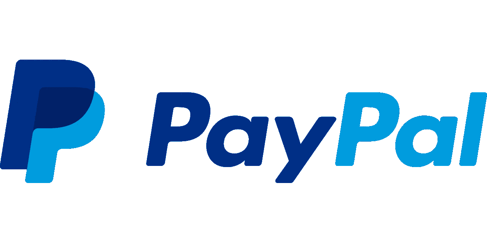
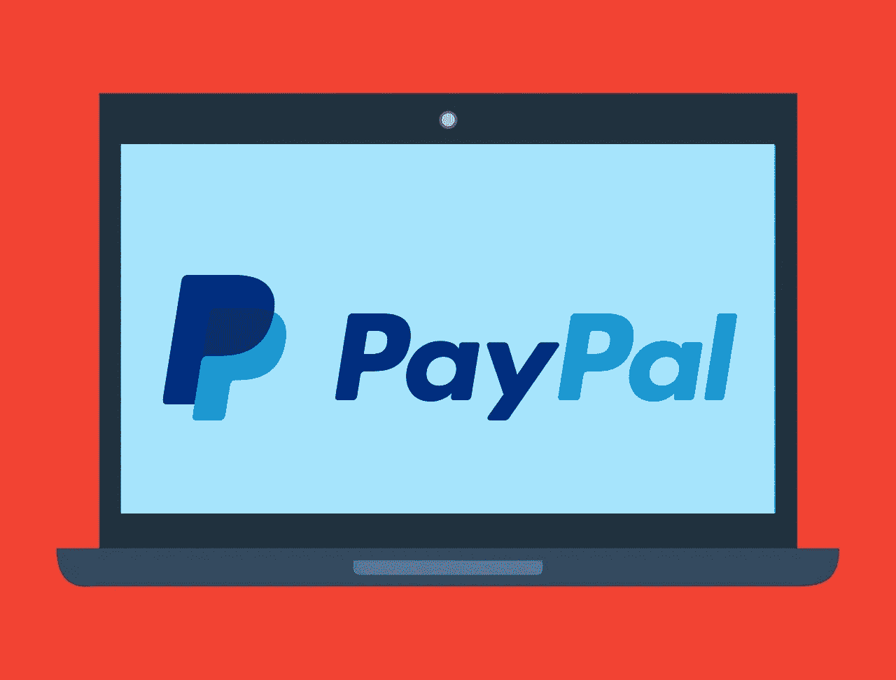

# 贝宝的力量(PYPL)

> 原文：<https://medium.datadriveninvestor.com/the-power-of-paypal-pypl-should-a-dividend-572e30472845?source=collection_archive---------11----------------------->

PayPal (PYPL)的力量远比大多数人意识到的要大。事实上，巴基斯坦财政部长 Asad Umar 正在邀请 PayPal 来到他的国家。

“我已经亲自联系了 PayPal 的首席执行官，为在巴基斯坦的国际交易提供这种支付工具，”Umar 告诉记者。值得注意的是，乌马尔声称他的政府希望与贝宝合作，《论坛报快报》报道称。

不仅仅是 PayPal，Umar 也想让蚂蚁金服的支付宝进入巴基斯坦，*《快报》论坛报*报道。很容易理解为什么 Umar 如此渴望让 PayPal 进入巴基斯坦。财政部长希望通过 PayPal 等资源让资金更容易进入他的国家。

# **PayPal(PYPL)跨境支付的力量正在快速增长**

据 PYMNTs.com[报道](https://www.pymnts.com/news/b2b-payments/2017/cross-border-b2b-payments-transfermate/)，BI Intelligence 估计，2018 年企业跨境 B2B 支付价值 18.5 万亿美元。

令人惊讶的是，这个数字只是跨境支付的一部分。解释一下，B2B 指的是企业对企业的交易。因此，这 18.5 万亿美元是企业给其他企业的钱。

此外，麦肯锡[估计](https://www.mckinsey.com/~/media/McKinsey/Industries/Financial%20Services/Our%20Insights/Global%20payments%20Expansive%20growth%20targeted%20opportunities/Global-payments-map-2018.ashx)全球支付提供商在 2017 年创造了 1.9 万亿美元的收入。此外，麦肯锡估计这些收入以每年 11%的速度增长，并将在五年内翻一番。

最后，中低收入国家之间的汇款支付数量在 2017 年增长了 8.5%。具体来说，世界银行[计算出](https://www.worldbank.org/en/news/press-release/2018/04/23/record-high-remittances-to-low-and-middle-income-countries-in-2017)2017 年个人在低收入和中等收入国家之间汇款 4660 亿美元。

此外，世界银行预测，2018 年全球汇款市场总额将增长 4.6%，达到 6420 亿美元。PayPal 可能会从中受益，因为它的数字钱包是个人之间完美的低成本汇款方式。例如，如果财政部长 Umar 的努力成功，一名在美国工作的巴基斯坦男子可以通过 PayPal 给他在国内的母亲寄钱。

# **贝宝(PYPL)的力量**

Umar 对媒体的声明代表了 PayPal (PYPL)的力量。具体来说，PayPal 建立了一个普通人喜欢使用的广泛而简单的支付网络。

为了证明这一点，2018 年 PayPal 注册账户的数量增长了 17%。Statista [估计](https://www.statista.com/statistics/218493/paypals-total-active-registered-accounts-from-2010/)活跃的注册贝宝账户数量从 2017 年第四季度的 2.29 亿增长到 2018 年第四季度的 2.67 亿。

因此，PayPal 在 2018 年为其网络增加了 3800 万个活跃账户。此外，Umar 的声明显示，PayPal 正在向全球新市场扩张。

# **2018 年 PayPal 总支付量增长 28%**

重要的是，人们通过这些账户汇来的钱比以往任何时候都多。

最后，PayPal 处理的金额在 2018 年增长了 28%。具体来说，Statista [计算](https://www.statista.com/statistics/419783/paypals-annual-payment-volume/) PayPal 的总支付量从 2017 年的 4512.7 亿美元增长到 2018 年的 5780 亿美元。

此外，PayPal 的总交易量在短短六年内增长了五倍。Statista 估计，2012 年 PayPal 的支付量为 1500.7 亿美元，2018 年为 5780 亿美元。

# PayPal 赚钱了吗？

PayPal 正以惊人的速度增长，但愤世嫉俗者会正确地问，它赚钱了吗？是的，最新的财务数据表明 PayPal 正在盈利。

例如，PayPal 报告称，2018 年第四季度的收入为 42.26 亿美元，毛利为 19.01 亿美元。重要的是，PayPal 的毛收入从 2018 年第三季度的 16.55 亿美元增长到第四季度的 19.01 亿美元。此外，PayPal 年第四季度的营业收入为 5.98 亿美元，净收入为 5.84 亿美元。

此外，PayPal 在 2018 年第四季度的收入增长率为 12.87%。澄清一下，PayPal 年第三季度的收入为 36.83 亿美元，2018 年第三季度为 42.26 亿美元。

# **PayPal 正在产生大量现金**

此外，PayPal 从其支付解决方案中获得了大量现金。具体来说，2018 年第四季度，PayPal 的运营现金流为 11.34 亿美元，投资现金流为 1.23 亿美元，自由现金流为 9.13 亿美元。

因此，PayPal 在 2018 年 12 月 31 日报告了 75.75 亿美元的现金和等价物以及 40.66 亿美元的短期投资。因此，截至 2018 年底，PayPal 的现金资产为 116.41 亿美元。然而，PayPal 的现金低于 2018 年第三季度的 116.99 亿美元和 2018 年第二季度的 134.68 亿美元。

我认为这些现金数字证明了 PayPal 是一家成功的金融服务公司。PayPal 是一家成功的金融科技公司，因为它产生了大量现金。

# **PayPal 应该支付股息**

在这种情况下，我认为 PayPal 应该加入其前母公司**易贝(纳斯达克代码:EBAY)** 的行列，支付股息。

PayPal 应该支付股息，因为它是一家被市场低估的金融和科技公司。为了证明这一点，PayPal 在 2019 年 2 月 20 日的交易价格为每股 94.73 美元。

与此同时，财务数据非常相似的网飞(纳斯达克代码:NFLX) 在同一天的交易价格为每股 359.91 美元。例如，网飞报告 2018 年第四季度的收入为 41.86 亿美元，毛利为 11.17 亿美元。

因此，PayPal 应该使用部分现金和短期投资来支付股息，以增加其股票价值。尤其是，我认为贝宝的股价可能会在熊市中迅速下跌。

因此，对于 PayPal 来说，发放股息是保护投资者免受熊市影响的明智之举。注意我的猜测；根据直觉，我们将在 2020 年看到熊市。

# **PayPal (PYPL)是价值投资**

我认为 **PayPal(纳斯达克股票代码:PYPL)** 是一项价值投资，因为它的业务。

解释一下，PayPal 经营着一项被许多人忽视的不性感、平淡无奇的业务。这个行业就是支付，一个每个人都在使用但大多数人很少想到的产品。

因此，贝宝的平台缺乏网飞的魅力，也没有亚马逊的戏剧性和争议性。然而，它提供了高增长率和较低的股价。值得注意的是，亚马逊在 2018 年第四季度的收入增长率为 19.73%。

# **PayPal (PYPL)是一项价值投资，因为它缺乏戏剧性**

此外，PayPal 不像亚马逊和网飞那样吸引眼球。这意味着更少的戏剧性，更少的争议，更少的冲突。例如，很少有人担心反垄断监管机构会针对贝宝。

相反，PayPal 的平台是如此可靠，以至于像 Asad Umar 这样的政府官员希望在他们的国家使用它。因此，我称 PayPal 是一种优秀的现代价值投资。

如果你想在你的投资组合中拥有一只不断增长且平淡无奇的科技股和金融股，PayPal 是值得研究的。