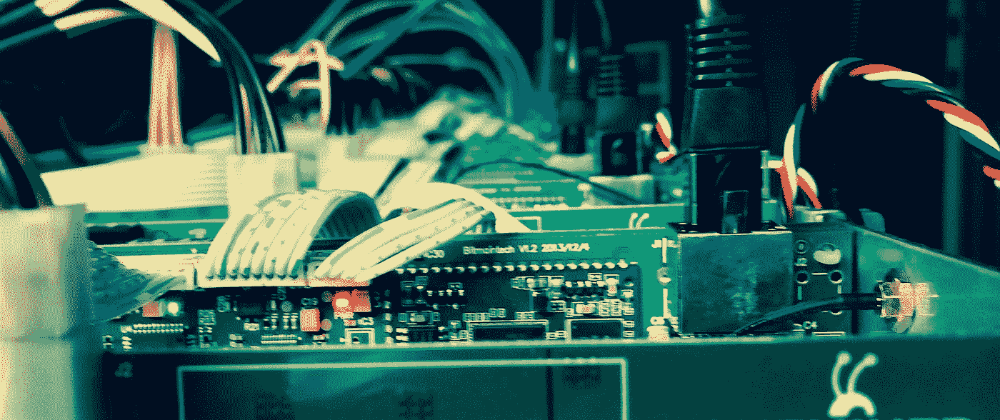

# 比特大陆岌岌可危的状态

> 原文：<https://medium.datadriveninvestor.com/the-precarious-state-of-bitmain-ea9089327810?source=collection_archive---------8----------------------->

比特大陆即将进行的首次公开募股可能是拯救公司的一个重大举措。成功的可能性有多大？

Bitmain is hoping to raise 18 billion USD in its IPO but this might not be realistic considering recent controversies and the fact the crypto market is in decline

比特大陆目前是最大的采矿设备制造商，也是世界上最大的采矿组织之一。然而，即使是最大的巨人有时也会倒下。比特大陆计划进行首次公开募股(IPO)。IPO 是指一家私人公司通过首次向公众出售其股票来筹集投资资本。

周三，比特大陆[正式申请](http://www.hkexnews.hk/APP/SEHK/2018/2018092406/Documents/SEHK201809260017.pdf)在港交所上市。该申请仍处于草案阶段，正等待香港交易所的进一步上市听证会。该公司的最终估值也不清楚。许多细节仍然受到审查，例如，将发行的股票数量和公开发行的确切日期。然而，这里有一个关键事实的总结:

*   截至今年 6 月 30 日的收入:2845467000 美元
*   截至今年 6 月 30 日的利润:1030151000 美元
*   截至 6 月 30 日出售的 ASIC 矿商:256 万
*   融资轮次:首轮融资 5000 万美元，B 轮融资 2.927 亿美元，上市前融资 4.2205 亿美元
*   2018 年员工:2594 人

我查看了比特大陆的投资者名单，并关注了加密领域的最新发展。我认为比特大陆的局势非常不稳定。在下文中，我概述了比特大陆目前面临的主要挑战。

## **比特币现金头寸**

比特大陆目前持有超过 100 万比特币现金(BCH)。众所周知，自 2018 年初以来，BCH 遭受了巨大损失。相对于比特币或以太坊，这种资产的流动性也很差，因为 BCH 没有规模可观的场外交易市场。比特大陆也不能在交易所出售其持有的股份，因为这将导致价格暴跌，并可能导致 BCH 的死亡。可以说，比特大陆出售大部分 BTC 换成比特币现金是一个错误，现在陷入了高度缺乏流动性且迅速减少的资产之中。

## **硬件方面的挑战**

比特大陆在硬件方面存在问题。矿业芯片行业的竞争越来越激烈，下龙矿业(最近[证实](https://bitcoinmagazine.com/articles/samsung-building-asic-chips-halong-mining/)与三星签订了制造 ASIC 芯片的合同)看起来越来越强，迦南矿业(也在 5 月申请 IPO)[也在扩张](https://news.bitcoin.com/canaan-creative-announces-worlds-first-mining-tv-set/)。

它最近释放的蚂蚁矿工 B3 是一场灾难。B3 致力于开采 BTM，这是比托姆区块链的本土象征。去年 4 月发布后不久，中国用户开始抱怨比特大陆在其营销中明显夸大了该产品的功率。五月，比特大陆[承认一些 B3](https://new.qq.com/omn/20180530/20180530A1JL4P.html)存在问题，但声称有问题的设备仅占总产量的百分之一。尽管如此，网上的批评仍在继续，有人指控比特大陆在 B3s 中使用二手零件(比特大陆对此予以否认)。网上团体也开始要求退款，一群据称是 B3 买家[亲自来到比特大陆的办公室投诉此事。](https://passport.weibo.com/visitor/visitor?entry=miniblog&a=enter&url=https%3A%2F%2Fweibo.com%2F6554557308%2FGiIrfaLHL%3Ffrom%3Dpage_1005056554557308_profile%26wvr%3D6%26mod%3Dweibotime%26type%3Dcomment&domain=.weibo.com&ua=php-sso_sdk_client-0.6.28&_rand=1534797823.8153#_rnd1527836483634)

## **整体不稳定的位置**

总结一下:

*   从 BTC 到 BCH 的大规模交易中，比特大陆正承受着相当大的机会成本。
*   比特大陆持有大量流动性很差的资产，这些资产正在迅速贬值。
*   人们的共识似乎是，比特大陆最近的硬件发展不如过去。

鉴于上述情况，比特大陆即将进行的首次公开募股似乎是拯救公司的一步大棋。但是成功的可能性有多大呢？比特大陆希望筹集 180 亿美元，但考虑到最近的争议和不断下滑的加密货币市场，这现实吗？软银和腾讯控股似乎不这么认为，因为[两家公司都否认参与了](https://www.coindesk.com/tencent-softbank-deny-involvement-in-bitmains-1-billion-pre-ipo-round/)比特大陆的 IPO。

## **比特大陆的下一步？**

牛市似乎是目前唯一能拯救比特大陆的东西。出于这个原因，我预计它最终将推迟 IPO，直到市场条件变得更加有利。

*订阅我在* [*上的频道*](https://medium.com/@minadown) *和*[*Twitter*](https://twitter.com/minad21)*如果你想了解更多关于区块链和加密货币项目的信息。

如果您对本文有任何疑问，请在下方评论区评论。
谢谢！*