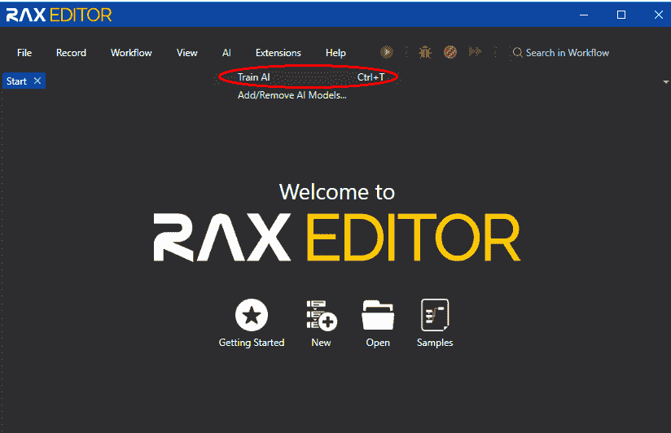
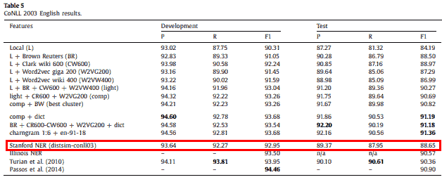
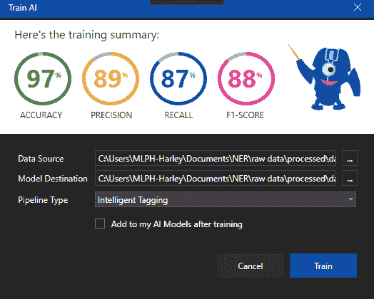

# RAX 编辑智能标注系统的现状与未来

> 原文：<https://medium.datadriveninvestor.com/the-present-and-future-of-rax-editors-intelligent-tagging-system-c4398dece02c?source=collection_archive---------14----------------------->

哈利·戴维森·雷加

命名实体识别 (NER)是自然语言处理的主要任务之一。这个想法围绕着识别文本中的专有名称，并将它们分类，例如*人*、*地点*、*组织*和*其他*。在 [**RAX 编辑**](https://www.raxsuite.com/rax-suite) 中，我们采用基于学习和机器学习的方法，为 NER 整合了一个智能标记活动。

对于智能标记活动， **RAX 编辑器**提供了内置的斯坦福 NER 模型，该模型还允许用户使用人工智能部分中的**训练模型来自由训练他们自己的数据集(*在线引用或手动创建*)。**

RAX EDITOR with Train AI feature

当在机器学习中训练分类器时，即使开发了模型，成功也不是最终的。单独获得一个模型分类器，虽然突出，但不是决定性的。

 [## 金融中的机器学习|数据驱动的投资者

### 在我们讲述一些机器学习金融应用之前，我们先来了解一下什么是机器学习。机器…

www.datadriveninvestor.com](https://www.datadriveninvestor.com/2019/02/08/machine-learning-in-finance/) 

评估 NER 模型的性能通常是通过测量精确度、召回率和 F1 值来完成的。精度是正确预测的正观测值与总预测正观测值的比率。同时，回忆是正确预测的正面观察与实际类中所有观察的比率。最后，F1 分数是精确度和召回率的调和平均值。

一个明显更好的 NER 模型性能有一个好的数据集和算法。RAX 编辑器在其当前状态下，采用了一种传统的基于特征的监督学习方法，使用了**条件随机场** (CRF)，这是一种在斯坦福核心 NLP 中实现的概率模型——一种相当好的模型性能。

我们在竞争激烈的 CoNLL 2003 数据集上测试了斯坦福 CRF 分类器的性能，以确认其性能，Agerri 和 Rigau 的 2016 年研究报告了 88.65%的 F1 得分。

CoNLL 2003 Results

在 RAX 编辑器中，训练人工智能工具要求训练数据集。该数据集分为 **70%训练集**和 **30%测试集**。分割后，将训练集输入斯坦福 CRF 分类器进行训练。然后，在使用默认参数配置获得 CRF 模型分类器之后，评估测试集(*现在被分组为句子*)上的性能。使用" **classifyToString(输入句子)**"函数对每个句子进行分类，该函数输出一个字符串，其中每个单词都有一个附加的预测标签。

我们构建了一个 ***nxn*** 混淆矩阵，其中 ***n*** 是在计算性能度量之前标签/标记的数量(*包括由‘O’*表示的负类的标签)。使用混淆矩阵，我们可以计算每个类的性能指标，我们将使用这些指标来计算 NER 模型的整体性能。

在 RAX 编辑器中训练人工智能模型后，它将显示性能指标。以下是对 CoNLL 2003 数据集进行训练后的结果:

Train AI using RAX EDITOR

根据我们的计算，F1 分数等于 **88.27%** (显示的*88%*)。这与 Agerri 和 Rigau (2016)在 CoNLL 2003 数据集上的评价几乎相同。

该模型在数据集上的性能相对较高，并被广泛应用于各种领域的文本，包括推文、生物医学和化学文本。然而，CRF 模型的一个缺点是，它只捕获文本序列中当前和以前的标签。因此，它没有前向标签的上下文。此外，在训练 CRF 模型时仍然需要应用额外的工程任务。

技术系统创新中唯一不变的就是变化，行业需要适应这些变化来维持自己的声誉。近年来，基于深度学习的 NER 模型通过实现最先进的结果而取得了进展。举一个具体的例子，Chiu 和 Nichols (2015)实现了一个特征推断神经网络单词+字符模型，该模型在同一数据集上测量了 91.62%的 F1 分数。**这意味着 RAX 编辑的火车 AI 模式可以做得更好，而且必须做得更好！**

**立即获得免费的 RAX 编辑器！**

[在此下载](https://www.raxsuite.com/freedownload?utm_source=Medium%20Post&utm_medium=medium&utm_campaign=medium_footer)

参考资料:

 [## [PDF]从深度学习模型中识别命名实体的最新进展调查-语义…

### 命名实体识别(NER)是自动问答、信息检索等自然语言处理系统的关键组成部分

www.semanticscholar.org](https://www.semanticscholar.org/paper/A-Survey-on-Recent-Advances-in-Named-Entity-from-Yadav-Bethard/7245e15da2a0f09aeca6c1e7478237985f7e4819)  [## [PDF]用于命名实体识别的深度学习调查-语义学者

### 命名实体识别(NER)的任务是识别提到命名实体的文本段，并对它们进行分类

www.semanticscholar.org](https://www.semanticscholar.org/paper/A-Survey-on-Deep-Learning-for-Named-Entity-Li-Sun/16c0ef924da1f6b510c9c783ac764156f5a3d631)  [## 命名实体识别(NER)，通过应用最先进的深度…

### 几年前，当我在一家初创公司做软件工程实习生时，我在一份招聘启事中看到了一个新功能…

towardsdatascience.com](https://towardsdatascience.com/named-entity-recognition-ner-meeting-industrys-requirement-by-applying-state-of-the-art-deep-698d2b3b4ede) 

阿格里和里高(2016 年)。具有浅层半监督特征的鲁棒多语言命名实体识别。人工智能。238.63–82.10.1016/j.artint.2016.05.003 .检索自:[https://www . research gate . net/publication/303423941 _ Robust _ Multilingual _ Named _ Entity _ Recognition _ with _ Shallow _ Semi-Supervised _ Features](https://www.researchgate.net/publication/303423941_Robust_Multilingual_Named_Entity_Recognition_with_Shallow_Semi-Supervised_Features)