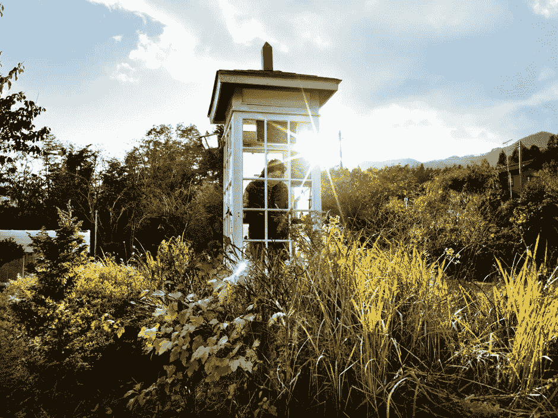
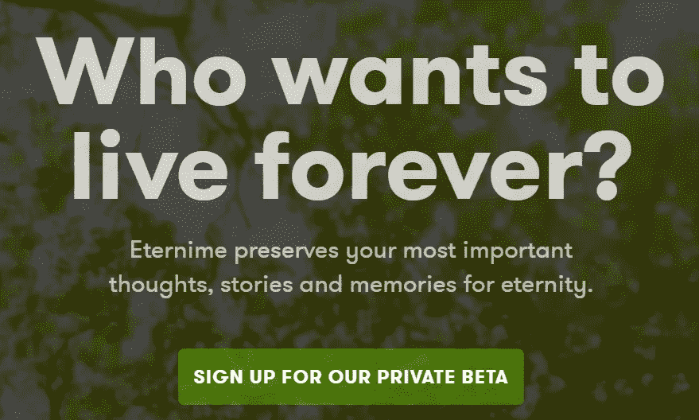
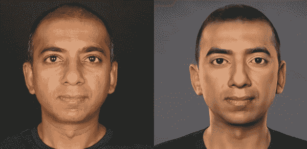

# 永生的代价

> 原文：<https://medium.datadriveninvestor.com/the-price-of-immortality-618649e9c852?source=collection_archive---------21----------------------->

Telephone of the Wind 風の電話 (Alexander McBride Wilson)

Each morning, Itaru Sasaki sweeps leaves and cobwebs from the booth. Visitors can jot their thoughts or messages down in a notebook next to the phone. (Alexander McBride Wilson)

In Otsuchi, Japan, overlooking the Pacific Ocean, in a rustic garden, there is a portal to the afterlife. 風の電話 (Kaze No Denwa) also known as the Telephone of Wind was created by local garden designer, Itaru Sasaki.

佐佐木的家乡大槌町是 2011 年海啸中遭受严重影响的众多城镇之一。在这场悲剧中失去了无数的亲人后，他决定创造一个可以和他失去的亲人交流的地方。

这个摊位现在吸引了来自全国各地的游客，他们喜欢佐佐木，寻求结束。对永生的需求一直是人类生活的主要部分。从墨西哥的亡灵节到佐佐木的风之电话，人类一直有一个既得利益，那就是保持对亲人的记忆。

Eterni.me

# 虚拟永生

通过利用人工智能和其他技术，公司正在寻求利用这一需求。如果你到现在还没有注意到，他们已经从你可预测的在线行为中获取你的数据来创建算法，并以一种影响你的购买或服务订阅的方式使用它。使用同样的数据来创建你自己的数字化身的能力已经存在，这并不奇怪。

Eternime 是一家旨在永久保存你最重要的思想和记忆的公司，它正在这么做。通过使用仍然活着的自愿参与者提供的数据，或者通过收集死者的社交媒体数据，他们希望创建一个智能化身，不仅看起来像你，而且行为也像你。这是目前我们能把你的意识上传到电脑的最接近的方法了。这带来了安全方面的重要问题。如果公司已经为你考虑这么远了，那么你可以肯定解决这个问题是首要任务。

当数据存储在中央位置时，通常容易受到攻击。在给永生定价时，必须考虑到这种风险。幸运的是，有技术进步可以用来减轻这种风险。分散数据库或区块链可以为存储交易提供广泛的保护，但它们能像人工智能化身中使用的数据那样存储有价值的数据吗？

ObEN’s Personal AI

一家将赌注押在这项技术上的公司是 ObEN T1。这家腾讯支持的初创公司正在建立个人人工智能化身。虽然他们没有直接试图利用“电子死亡”市场，但这一类别可以很容易地被他们已经功能化的化身所接受。通过在名为[项目 PAI](http://Projectpai.com) (个人人工智能)的专业人工智能区块链上构建应用程序，ObEN 正面解决了数据安全问题。PAI 区块链项目的开发者设想，未来每个人都将拥有一个像 Eternime 和 ObEN 正在构建的个人头像。同样，他们希望用户教会它的化身技能，改善它的外观和行为。然后，用户可以在像 PAI 区块链这样的安全环境中交易、存储和管理他们的数据和技能。

得知像 Pai 项目这样的基础设施的存在，令人松了一口气。这种类型的基础将作为当前和未来人工智能应用的基础构件。我们在网上留下我们的行为足迹，不管我们喜欢与否，这些数据都被其他人使用。随着个人人工智能技术的发展，我们需要知道我们的数据和个人头像不会被滥用。