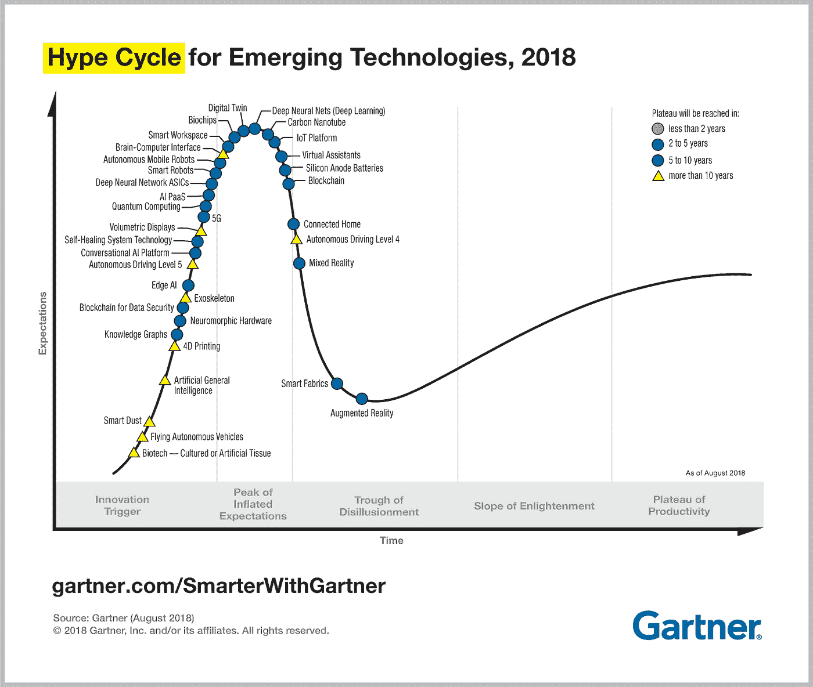

# 人工智能最先进的方法的问题是

> 原文：<https://medium.datadriveninvestor.com/the-problem-with-ai-state-of-the-art-methodology-db30762d4b84?source=collection_archive---------8----------------------->

随着我们的新闻不断充斥着“机器打败人类”的内容，很难相信根本的、困难的人工智能问题还没有得到解决。

去年，阿里巴巴和微软创造的人工智能在斯坦福大学问答数据集全球阅读理解测试中名列榜首，这是一个大新闻。SQuAD 网站上的排行榜显示，阿里巴巴和微软的得分分别为 82.44 和 82.65。分数高于人类的 82.304 分。

但这对 AI 进步意味着什么？正如[詹姆斯·文森特指出的](https://www.theverge.com/2018/1/17/16900292/ai-reading-comprehension-machines-humans)，这是“在一个非常具体和受限的任务中”完成的比如电子表格在计算方面胜过人类。然而，这并不是奇点的前兆。

## 今天的 AI 擅长狭窄的任务，但不是一般的。这很重要。

能否从狭窄的任务中获得良好的输出和应用？是的，我们可以。但这是否意味着用于这些狭窄任务的方法和工具，将足以带我们理解语言，并消除我们每天遇到的哑聊天机器人、语音助手和智能扬声器的挫折感？号码

> "建造一个更高的梯子并不能让我们到达月球."

如果我们为基准测试选择了错误的目标，我们每次都会错过“正确的”目标。备受推崇的深度学习之父之一， [Yoshua Bengio](https://www.technologyreview.com/s/612434/one-of-the-fathers-of-ai-is-worried-about-its-future/) 说

> “我认为我们需要考虑人工智能的艰难挑战，不要满足于短期的增量进步……我们需要能够扩展它来做推理、学习因果关系和探索世界等事情，以便学习和获取信息。”

自动驾驶汽车现在已经行驶了数百万英里，但仍然只是在环境受到严格限制的地方进行商业应用。这里有个问题，而且不是工程问题。这是一个科学问题。

## 实现完全的人类语言理解和视觉识别并不容易。

为了理解一段对话，人类不需要听到每一个可以想到的单词和短语组合(这是无限的)。我们只需要知道大约 3000 个单词，这是基本日常对话所需要的。

为什么机器需要几十亿的文本语料库去尝试和理解？或者，开几百万英里？因为机器不能一概而论。如果训练数据与测试数据不够相似，机器就会失败。

正如加里·马库斯在 [Synced](https://syncedreview.com/2019/02/15/ai-hasnt-found-its-isaac-newton-gary-marcus-on-deep-learning-defects-frenemy-yann-lecun/) 中所说，“(深度学习)非常擅长图像分类，它非常擅长标记一个单词是什么词性。它不太擅长理解一个场景或一句话的意思。开着一个家用机器人在你家转来转去真的不够好。有很多事情它做得不是很好。没有任何人工智能比我四岁或六岁的孩子更聪明。"

2018 年，来自 [Google Duplex](https://ai.googleblog.com/2018/05/duplex-ai-system-for-natural-conversation.html) 、来自 Al2[ELMo、](https://allennlp.org/elmo) [Google 的 Bert](https://ai.googleblog.com/2018/11/open-sourcing-bert-state-of-art-pre.html) 以及最近 OpenAI 的 [GPT2](https://blog.openai.com/better-language-models/) 的公告源源不断。

工程支持文件是媒体描述的淡化版本。而且，随后的产品，如 Bert 的 predictive typeahead，在发布后会受到限制，有代词限制。

为什么？因为渐进式的进步不会带来普遍的和自然的智能。有用的产品可以来自技术，但快速浏览一下 Gartner 2018 年的炒作周期，就会发现对这些工具和产品的预期过高的问题。深度学习正处于膨胀的期望的顶峰，虚拟助手已经转危为安，现在正在走向幻灭的低谷。

如果 2018 年是“人工智能宣布歇斯底里”的一年，那也是质疑最先进的方法是否能够提供前进方向的一年。

该领域最尖锐的批评者之一，朱迪亚·珀尔(贝叶斯网络的开发者)在量子杂志中表达了他的担忧

> “当今最先进的人工智能只不过是一代人以前机器已经可以做到的事情的加强版:在大量数据中找到隐藏的规律……(并且)陷入了概率关联的困境。”

人工智能杰出人物杰夫·辛顿最近在接受 Axios 采访时说:“我的观点是抛弃一切，重新开始……我不认为这是大脑的工作方式。我们显然不需要所有贴有标签的数据。”

## 那么我们如何进步呢？

帕特对 NLU 这个根本的、困难的“人工智能”问题的解决方案是从科学出发进行工程设计。并且，那门科学是 [Patom 理论](https://medium.com/pat-inc/patom-theory-explains-language-acquisition-part-1-609b3c42ed18)和[作用&参考语法](http://www.acsu.buffalo.edu/~rrgpage/rrg/RRGpaper.pdf) (RRG)。

认知科学家和 Pat 的创始人，[约翰·鲍尔](https://en.wikipedia.org/wiki/John_Ball_(cognitive_scientist))花了几年时间研究 NLU 问题，这使他产生了 Patom 理论。在研究大脑如何处理语言时，约翰假设如何用机器来表达人类语言。2011 年，他偶然发现了缺失的部分，即 RRG，这是一门类似的深度科学，专注于世界语言的工作方式，由小罗伯特·d·范·吕林燕开发。就像花生酱遇到巧克力。

2016 年，Pat 成立，旨在探索人类和机器之间对话的科学突破。

[Pat](http://pat.ai) 偏离了传统的统计 NLP 模型，专注于基于大脑的语言方法，以相对于上下文中的其他单词正确地分配单词的意义。

因此，Pat 能够正确分析复杂的自然语言交互，并将短语与含义直接联系起来。

> 聊天机器人和语音助手应该能够进行全面的对话，并提供有用、有价值和方便的客户体验。为了实现这一目标，我们需要将科学融入工程。

## **要加入帕特的私人测试版，请在这里注册:https://pat.ai/**