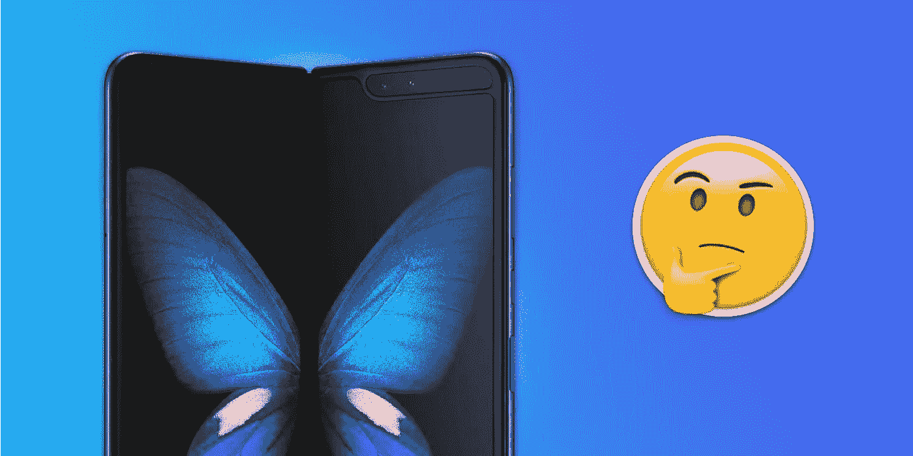
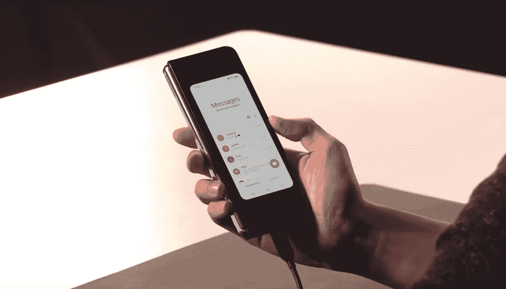
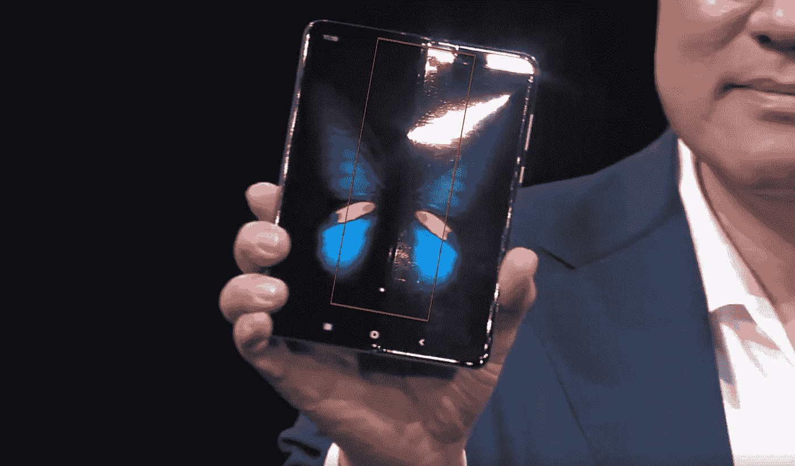
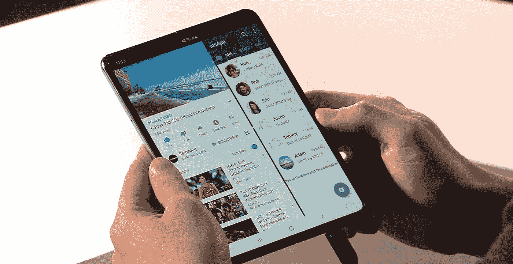
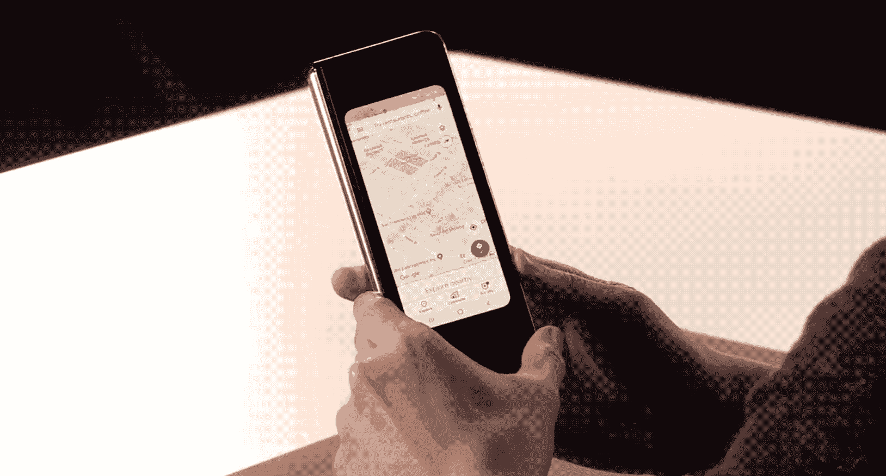
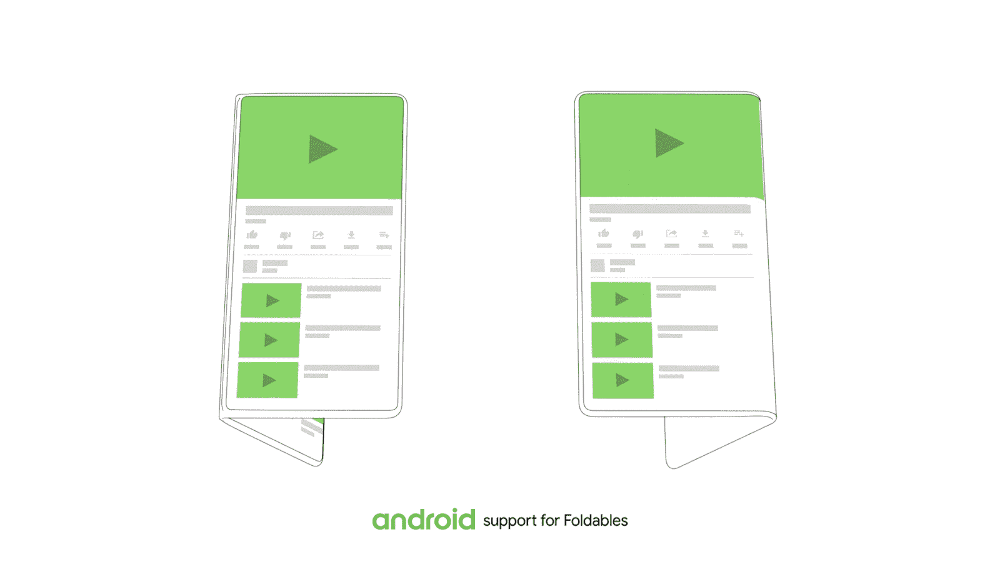

# 星系折叠的问题是

> 原文：<https://medium.datadriveninvestor.com/the-problem-with-foldable-phones-9f7fe8197b30?source=collection_archive---------11----------------------->

## 三星 Galaxy Fold 标志着可折叠手机时代的正式开始，关于它们，我有几个问题。

去年 11 月，三星用其可折叠智能手机的预览逗我们，今年 2 月，在三星 Unpacked 活动中，我们终于看到了它的全部荣耀。三星将其命名为“Galaxy Fold ”,计划于 4 月 26 日开始发货，价格为 1.980 美元。

你在这里为创新付出了相当大的代价，但考虑到这是第一款大规模生产的可折叠手机，有两个 AMOLED 屏幕，6 个摄像头和 2 块电池；此外，考虑到它试图充当手机和平板电脑的替代品，价格并不令人惊讶。这绝对是一项有趣的技术，但在展示 Galaxy Fold 的过程中，我想到了几个问题，我想与大家分享一下。

# 前屏幕

让我们首先从正面屏幕开始，我指的是较小的屏幕。由于 Galaxy Fold 仍然是一款你可以在大多数情况下随身携带的智能手机，你可能最终会使用较小的正面屏幕。例如，如果你走在街上，排队，去杂货店购物等。在所有这些情况下，将手机作为普通智能手机使用可能比在“平板电脑模式”下打开更方便。正如我所说，在大多数情况下，我相信你会将 Galaxy Fold 用作普通智能手机，这是我第一个担心的地方。

## 它有用吗？

从 Galaxy Fold 的演示中我们可以看到，正面屏幕将是一个 4.6 英寸的屏幕(对于今天的标准来说非常小)，具有非常窄的形状。

Image source: Samsung Unpacked Event 2019

紧接着，它被放置在框架的中间，为巨大的下巴留出了空间。这里我最关心的是小屏幕上的打字体验。我有一种感觉，使用这个屏幕并在上面打字不会那么容易，它将需要相当长的时间来适应它，即使在适应它之后，它仍然会感觉怪异和笨拙。想想看，我们生活在一个没有边框、边对边屏幕的时代，突然出现了屏幕下方有一个巨大下巴的 Galaxy fold。

# 第二个屏幕

现在让我们来看看你在“平板电脑模式”下使用的第二块可折叠屏幕。有几件事让我担心。

## 为什么看起来这么便宜？

首先，由于这是一个折叠屏幕，不可能像传统智能手机一样使用玻璃来覆盖 AMOLED 屏幕的薄层，因为屏幕的中间部分必须能够不断折叠和展开。因此，必须使用高度柔性的材料来覆盖 AMOLED 屏幕，这正是我最关心的中间部分。在演示过程中，当他们展示 Galaxy Fold 的第二块屏幕时，在特定的光线下，可以看到屏幕的中间可折叠部分有一些小突起。

Image source: Samsung Unpacked Event 2019

我认为这里的主要困难是，当屏幕被拉伸时，它的中间部分不会与智能手机机身 100%齐平，从而产生这些小的屏幕凸起。我真的希望这不像它在现实生活中看起来那么糟糕，因为现在，它让我想起了一个贴着标签的儿童玩具。

## 感觉一样吗？

这也让我想到了关于第二块更大的屏幕的第二个问题，那就是触摸体验。正如我所说，玻璃不能用来覆盖 AMOLED 屏幕，所以可能使用了柔性材料，我的问题是，触摸体验是否像玻璃屏幕一样好，一样光滑？还是使用屏幕时感觉更像塑料？我不是很确定，但这绝对是需要考虑的事情。

Image source: Samsung Unpacked Event 2019

## 它能弯曲吗？

关于第二块屏幕，我最后担心的是屏幕中间折叠部分的耐用性。在演示期间，三星向我们展示了他们如何在开发铰链系统方面投入了大量精力，我也确信他们进行了大量测试，以确保屏幕能够承受数千次折叠。我在这里关心的是，屏幕在不同的天气条件下将如何表现和忍受？我相信更冷的温度肯定会影响屏幕的伸缩能力，所以这也是需要考虑的因素。

# 双屏应用支持

最后我想提到的一个关注点是对这种双屏设置的应用支持，或者像三星宣传的那样“应用连续性”。应用程序连续性使你能够在小屏幕上开始与应用程序互动，然后在第二个更大的屏幕上无缝地继续使用它，反之亦然。

Image source: [The Verge](https://www.theverge.com/2019/2/20/18231249/samsung-galaxy-fold-folding-phone-features-screen-photos-size-announcement)

Android 最近也宣布将支持这种体验，但我担心有多少应用程序实际上会为此进行优化，以及它们需要多长时间才能得到优化？

Image source: Android Developers [Blog](https://android-developers.googleblog.com/2018/11/unfolding-right-now-at-androiddevsummit.html)

我这么说主要是因为你可能会为了双屏体验而购买 Galaxy Fold，如果大多数应用程序都没有针对它进行优化，这将极大地影响你的体验和你从这款设备中获得的价值。

# 结论

最后，我只想说清楚，可折叠屏幕仍处于成熟阶段，三星可能也在用 Galaxy Fold 试水，看看消费者市场对它的反应如何。所以你不能指望这里有一个完美的产品，但话说回来，你为它支付了 2000 美元，所以期待完美是有道理的。不幸的是，我不确定你是否能达到你想要的完美程度。

最后，仍然有几个问题悬而未决:

*   是智能手机行业的未来？
*   这会对智能手机行业产生重大影响吗？
*   如果价格可以接受，你会愿意购买可折叠智能手机吗？

如果你想看更多与科技相关的内容，请务必查看我的 YouTube 频道。

*我也有一个 YouTube 频道，叫做* [*【数字脉冲】*](http://www.youtube.com/digitalpulse) *，在那里我以评论和教程的形式分享我对最新科技和数字趋势的看法、经验和建议。*