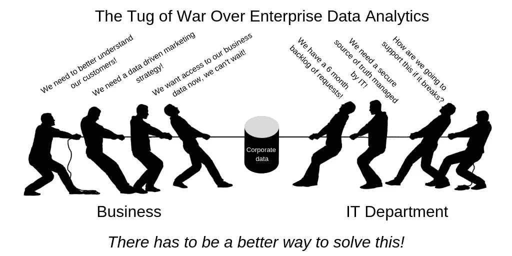
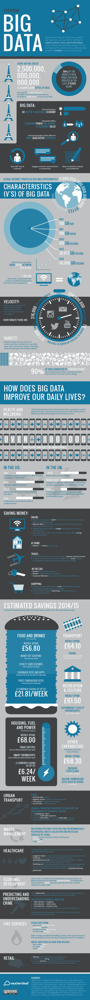
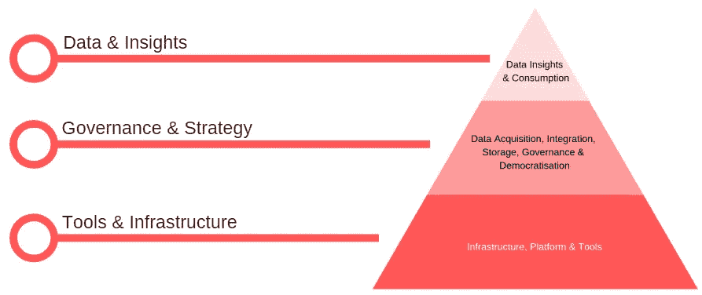
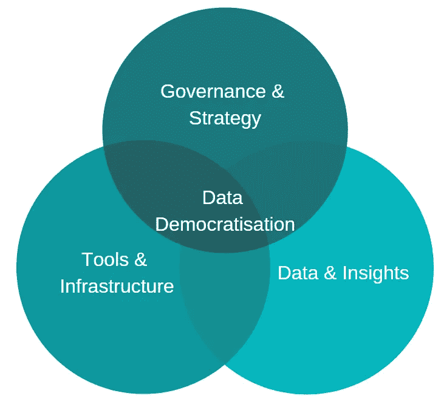
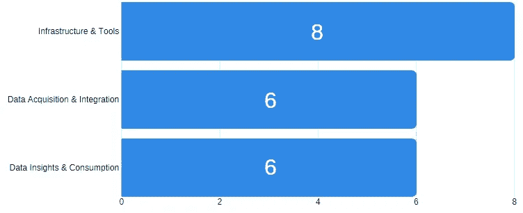
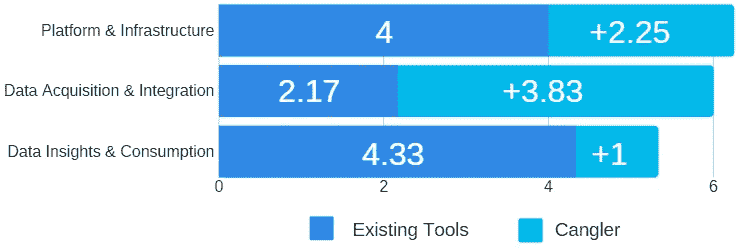

# 数据分析客户目前面临的问题

> 原文：<https://medium.datadriveninvestor.com/the-problems-facing-data-analytics-customers-today-eedfe527af2e?source=collection_archive---------2----------------------->

今天的组织被他们收集和存储的难以置信的大量数据所淹没

> 许多组织坐拥大量数据，但却没有有效的资源来分析数据，以实现其潜在价值。自动化和数据民主化是解决这个问题的关键。

如今，数据无处不在，企业比以往任何时候都更加依赖从数据中收集的见解来构建更好的产品和服务，做出更明智的商业决策，并在各自的行业中竞争。企业正在收集数量惊人的数据，但往往难以理解所有这些数据。

做出正确的数据驱动型决策会有很高的回报，但数据泄露和根据不准确或不完整的数据做出决策会带来很高的后果。这在企业中造成了业务部门和 IT 部门之间的紧张关系，这通常会导致对企业数据集和分析工具所有权的争夺。

> “只有 4%的公司表示，他们有合适的资源从数据中提取有意义的见解，并据此采取行动”——贝恩公司

业务部门的首要任务是利用公司数据做出更好的业务决策，并为组织发现机会。IT 部门的首要任务是保持数据的安全、管理和集中，并确保符合适用的法律。

这两个优先事项经常相互竞争，导致数据孤岛、访问积压数据的 IT 瓶颈，以及错过及时做出数据驱动的业务决策和发现新机会的机会。

# 究竟什么是大数据，公司为什么要关注大数据？

让我们后退一步，看看什么是大数据，当我们说当今的组织被他们收集和存储的难以置信的数据量所淹没时，我们指的是什么。

为了帮助我们掌握今天收集和存储的数据规模、新数据的创建速度以及挖掘数据的好处，让我们来看看这张由 [Forbes](https://www.forbes.com/sites/forbestechcouncil/2018/05/16/big-data-is-changing-the-way-people-live-their-lives/) 提供的绝对惊人的信息图。

Source: [https://www.forbes.com/sites/forbestechcouncil/2018/05/16/big-data-is-changing-the-way-people-live-their-lives/](https://www.forbes.com/sites/forbestechcouncil/2018/05/16/big-data-is-changing-the-way-people-live-their-lives/)

# 为什么组织会纠结于数据分析？

建立企业数据分析能力需要做大量的工作，没有“一刀切”的解决方案可供企业采用。

客户经常不得不购买和集成来自多个供应商的多种数据分析产品，这意味着需要大型团队来构建、集成和支持所有产品。

典型的企业数据分析架构分为三层，每一层都需要他们自己的大型专门团队，如下图所示:

如果没有在自动化和数据民主化方面的投资，您可以执行数据分析用例并实现商业价值的速度与您雇佣的数据工程师、数据科学家和数据分析师的数量成正比。这个可扩展性问题极大地增加了数据分析的成本。

> 这是一个大而复杂的问题，组织通常没有时间或资源独自解决这个问题。

# 什么是数据民主化，为什么现代企业需要它？

Data democratisation empowers all company employees to make data-driven decisions

> “数据民主化将把公司推向新的绩效高度——如果做得好的话”Eric Matisoff，InfoWorld

“每个企业都被来自各个角度的数据所淹没。使用我们从数据中收集的见解来提高业务绩效的压力很大。由于要处理的数据量惊人，而且新技术可以帮助非技术人员理解数据，因此人们渴望并要求数据民主化……”

“数据民主化意味着每个人都可以访问数据，并且没有在数据网关处制造瓶颈的看门人。这要求我们在访问数据的同时，为人们提供一种简单的方式来理解数据，以便他们可以使用数据来加快决策制定，并为组织发现机会。我们的目标是让任何人在任何时候使用数据做出决策，没有访问或理解的障碍。”畅销书《实践中的大数据》的作者 Bernard Marr 说。

你可以在这里阅读上面引用的伯纳德·马尔的原文。这是一篇很好的文章，Bernard 在业内很受尊重，因此非常值得您花时间阅读。

现在，我们已经了解了什么是数据民主化，以及它对组织有什么好处，让我们深入了解有助于在组织内实现数据民主化并实现相关好处的因素。

# 发现了三个主要的客户问题

我们试图找到公司未能正确实现数据民主化的根本原因，以及那些成功实现数据民主化的公司的工作方式。

我们观察了公司目前如何管理其企业数据分析功能，并使用我们之前讨论的架构金字塔作为参考点，我们发现了需要协同工作才能在组织内实现有效数据民主化的三个关键要素。

# 数据民主化的关键要素

既然我们已经发现了有效数据民主化的“秘方”,下一个挑战就是我们如何实现它。只有有限的人力资源能够实施每一个关键要素，因此为了提供一个可扩展的解决方案，可以在许多组织中复制，我们需要高度依赖自动化。

想象一下，如果一家公司能够找出数据民主化的秘方，使用行业最佳实践技术和策略构建一个自动化数据民主化的产品，然后为您的企业提供该产品作为服务。这对你来说值多少钱？我们来到市场，了解客户目前面临的问题的规模，他们目前如何解决这个问题，以及他们对解决这个问题的解决方案的重视程度。

如果你想更深入地研究数据民主化，我推荐你去看看 InfoWorld 的 Eric Matisoff 写的这篇优秀的文章。

如果你对深入研究数据民主化的数据科学特定方面更感兴趣，来自《哈佛商业评论》的 Jonathan Cornelissen 写了一篇[的优秀文章](https://hbr.org/2018/07/the-democratization-of-data-science)，值得一读。

# 寻找要采访的潜在客户

我们着手验证我们对当今数据分析客户所面临问题的理解。

在我们的[上一篇博文](https://www.linkedin.com/pulse/tug-war-over-data-analytics-enterprise-andrew-herbert/)中，我们邀请您分享您对当今公司面临的数据分析问题的看法，以及您对下一代数据分析产品需要什么来解决这些问题的想法。

# 回应

我们亲自采访客户，并从我们的[调查](https://andrewherbert1.typeform.com/to/WDfheT)的反馈中收集数据。

在我们采访的客户中，他们包括:

*   初创公司 rideshare 应用的创始人(不，不是优步！)
*   来自主要云提供商的数据分析客户专家
*   一家大型咨询公司的战略和管理顾问
*   大型运输和物流公司的数据分析支持经理
*   来自政府机构的数据分析解决方案架构师

我们采访的样本量相对较小。下一次，我们将以更高的回应率瞄准更多的观众。

在下一部分，我们将概述对我们的采访和调查的回应、我们的分析以及我们的发现和结论。

# 客户面临的问题有多大？

我们要求客户用 1-10 的评分标准来评价为其组织构建、管理和支持三个企业数据分析层的难度。

Averaged out responses to rating the scale of each problem

我们发现，大多数客户依靠人类来解决问题，他们通过使用包括 Excel 在内的工具和主要云服务提供商(GCP、Azure、AWS)提供的工具来提供支持。目前市场上没有工具可以完全解决这个问题，因此客户依赖人力和工具的组合来管理他们的企业数据分析能力。

客户正在雇佣专家团队，无论是内部的还是咨询机构的，来为他们解决这些问题。我们发现的一个共同主题是，客户表示他们的组织缺乏数据分析成熟度和技能，培训和变更管理是他们面临的主要问题。

> “在这个行业中，我看到了很多关于变革管理的问题。改变基础设施或平台被认为是有风险的。由于缺乏培训和知识，人们没有充分利用平台和工具。”——云平台提供商数据分析客户专家

我们发现客户说的另一个共同主题是，基础架构、工具和数据洞察力的初始设置不是他们的最大问题，而是持续维护、变更管理和确保整个组织的一致性是他们的最大挑战。

# 现有的工具能在多大程度上解决这个问题，Cangler 会如何比较？

我们要求客户在向他们描述解决方案后，对他们现有的工具解决问题的能力以及 Cangler 解决问题的能力进行评分，评分范围为 1-10。

> 对于所有的客户问题，Cangler 比目前市场上的工具更好地解决了问题，但我们相信我们可以做得更好

我们发现，在所有三个客户问题中，Cangler 被认为比他们当前的工具更好地解决了问题。这种差异在数据采集和集成客户问题中尤为明显，在这个问题上，Cangler 被认为比目前使用的现有工具好 3 倍。

我们发现，目前市场上的工具不足以独自解决客户的问题，因此客户正在通过雇佣第三方数据分析咨询公司来提供人力资源和专业知识，以构建、操作和管理他们的数据分析工具和项目，从而解决这一能力差距。

根据 [consultancy.uk](https://www.consultancy.uk/news/17427/global-client-spending-on-analytics-consulting-hits-record-43-billion) 的数据，2017 年在数据分析咨询服务上花费了 430 亿美元，超过三分之二(67%)的受访高管表示，他们预计他们的组织未来将增加分析咨询支出。

看看每家公司的咨询成本，如果我们假设一家公司将雇用 5 名数据分析顾问来帮助他们，则每天的成本为 7500 美元(1500 美元/天 x 5 名顾问)。

现在，如果我们将一年中超过 261 个工作日的成本进行外推，仅咨询费一项，一个组织每年的成本总计为**1，957，500 美元**。

# 哪些公司正在研究解决数据民主化问题的解决方案？

数据民主化在数据分析中是一个相对较新的领域，也就是说，已经有一些公司致力于开发解决方案来解决企业中的数据民主化问题。每个公司都有自己独特的解决问题的方法，据我们所知，目前正在解决这一问题的公司有:

*   [坎格勒](https://www.cangleranalytics.com/)
*   [数据砖块](https://databricks.com/)
*   [Teradata](https://www.teradata.com/)
*   [Alteryx](https://www.alteryx.com)
*   [Domo](https://www.domo.com/)

只有时间能告诉我们公司会认可哪种方法，并将其作为他们的数据民主化解决方案。有一点是肯定的，解决这个问题的竞赛已经开始了！

*Cangler democratises data analytics, making it simple, easy and accessible for everyone*

在我们的下一篇文章中，我们将讨论我们如何在 [Cangler Analytics](https://www.cangleranalytics.com/) 解决这个问题，如果你真的幸运，我们甚至可以向你透露我们的“秘方”!

请随意[注册 Cangler 邮件列表](https://www.cangleranalytics.com/mailing-list)以了解最新消息和产品开发。

你认为数据民主化会给世界带来什么变化？我们很想知道你的想法，请在下面的评论中告诉我们！