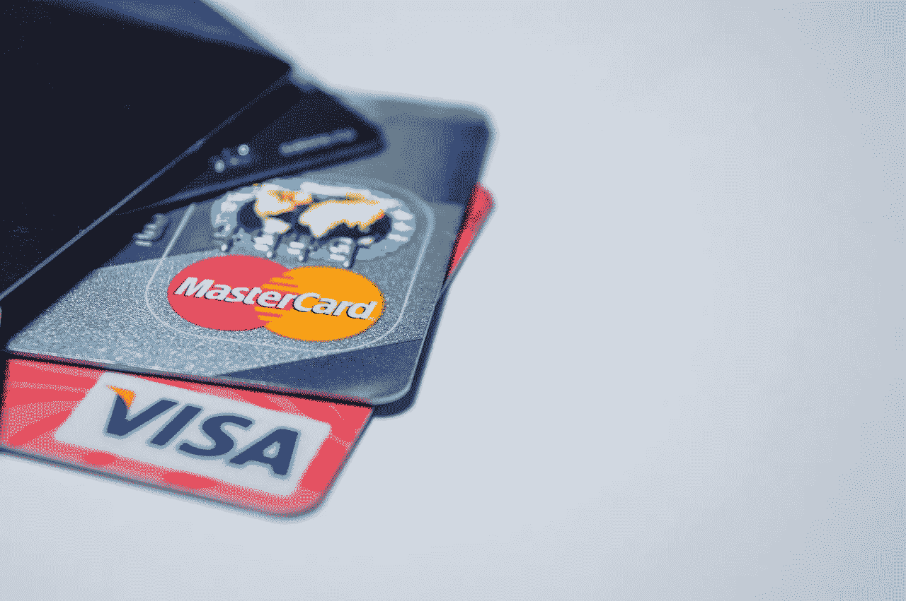
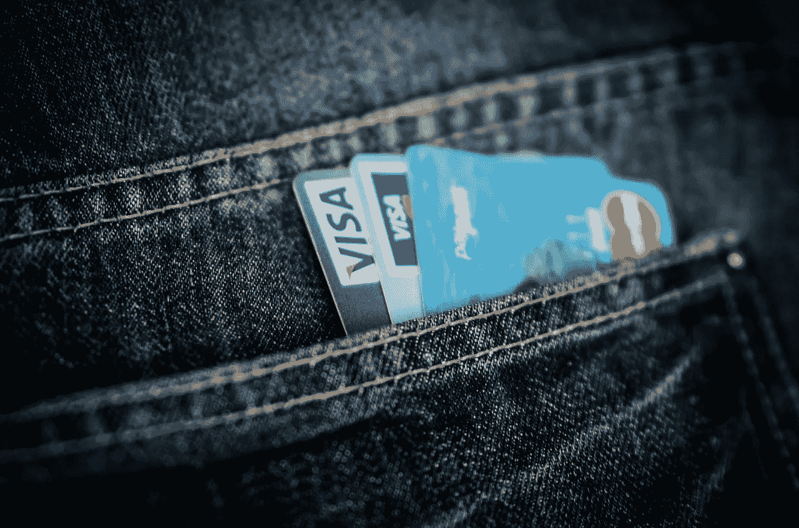
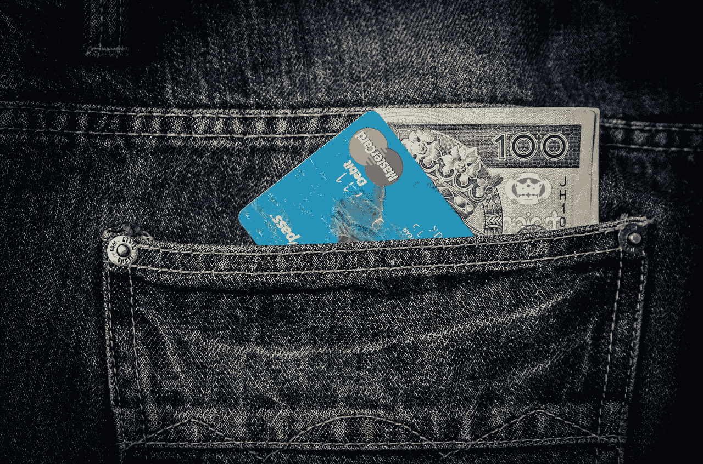
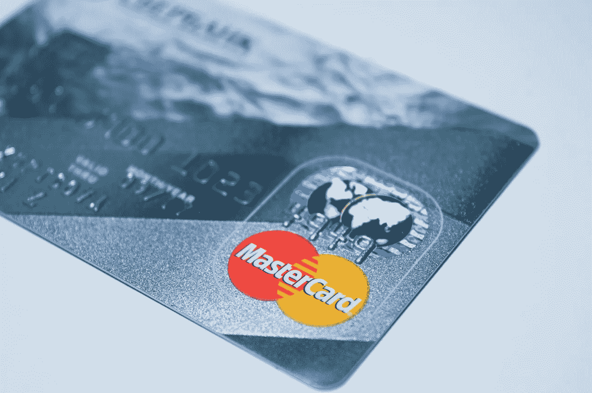

# 万事达卡的利润

> 原文：<https://medium.datadriveninvestor.com/the-profit-at-mastercard-ma-eafd58859d13?source=collection_archive---------10----------------------->

万事达卡(MasterCard)的盈利证明，信用卡提供商可能是当今的价值投资之一。

值得注意的是，万事达卡 2018 年第四季度的毛利等于其同期收入。相应地，**万事达卡(纽约证券交易所代码:MA)**2018 年第四季度的收入为 38.07 亿美元。因此，万事达在 2018 年第四季度实现了 100%的毛利率。

 [## 挑战你对人工智能和社会的看法的 4 本书——数据驱动的投资者

### 深度学习、像人类一样思考的机器人、人工智能、神经网络——这些技术引发了…

go.datadriveninvestor.com](http://go.datadriveninvestor.com/4AI1) 

此外，毛利润转化为万事达卡的大量现金。例如，万事达卡报告营业收入为 12.34 亿美元，同期净收入为 8.99 亿美元。

# **万事达卡的利润相当于一大笔现金**

价值投资者会喜欢万事达卡的利润，因为该公司正在产生大量现金。

例如，万事达卡 2018 年第四季度的运营现金流为 13.32 亿美元，自由现金流为 12.09 亿美元。然而，这些数字低于 2018 年第三季度的 23.67 亿美元和 22.37 亿美元。

最后，万事达卡在 2018 年新年前夕有 77.62 亿美元的现金和等价物，以及 16.96 亿美元的短期投资。因此，截至 2018 年底，万事达卡在银行的存款为 94.58 亿美元。

# **万事达卡是一种好的红利投资吗？**

不出意外，很多人会问万事达卡是不是一个好的分红投资。答案或许是，因为万事达卡的股息率为 0.59%，年化派息为 1.32 美元，派息率为 20.6%

然而，我不认为 2019 年 5 月 9 日计划的 33 股息证明 2019 年 2 月 27 日 223.84 美元的股价是合理的。事实上，我认为市场先生把万事达卡定价过高，为 223.84 美元。万事达卡连续 7 年的股息增长也不能证明其荒谬的股价是合理的。

然而，现金使得万事达卡成为一种安全的价值投资。此外，我认为万事达卡是一项伟大的长期投资，因为它的增长。例如，万事达卡在 2018 年第四季度的收入增长率为 14.95%。

因此，你不会损失投资在万事达卡上的钱，但你可能不会从中获利很多。另一方面，万事达卡的未来增长项目是好的。特别是，大型科技公司正在推动万事达卡的增长

# **苹果如何帮助万事达卡发展**

例如，**高盛(NYSE: GS)** 和**苹果(NASDAQ: AAPL)** 正在开发苹果品牌的万事达卡。

有趣的是，据彭博新闻[报道](https://www.chicagotribune.com/business/ct-biz-apple-credit-card-20190221-story.html)，万事达卡将与新的 iPhone 财务管理软件配对。值得注意的是，苹果品牌的万事达卡是高盛首次涉足消费者信用卡。

然而，高盛/苹果万事达卡可以赚钱，因为他们的目标是“苹果狂热者”解释一下，苹果狂热者显然是 MoffettNathanson 分析师 Lisa Ellis 对苹果僵尸的委婉说法。

值得注意的是，苹果僵尸愿意为过时的技术支付更多的钱，因为它带有苹果的品牌名称。在这种情况下，苹果客户的信用卡可能会成为摇钱树。

此外，如果苹果万事达卡提供在苹果商店购买电子产品的折扣积分，它就能产生真金白银。由此，Apple Pay 的流行；哪个**目标(纽约证券交易所:TGT)** 现在是[接受](https://marketmadhouse.com/target-is-accepting-google-pay/)正在推动万事达卡的增长。

# 数字钱包可能是万事达卡增长的关键

此外， **PayPal(纳斯达克股票代码:PYPL)** 快速增长的 Venmo 也在帮助万事达卡增长。

事实上，PayPal 现在提供 Venmo 万事达卡。值得注意的是，Venmo MasterCard 允许用户使用 P2P 应用程序传输的资金在实体店购物。

此外，Venmo 用户可以用万事达卡从 ATM 机提取现金。此外，用户可以在自动取款机上通过万事达卡向 Venmo 账户充值。

Venmo 是万事达卡的主要增长机会。具体来说，Venmo 的总支付量在 2018 年增长了 85 亿美元。具体来说，据 Statista [计算](https://www.statista.com/statistics/763617/venmo-total-payment-volume/)，Venmo 在 2017 年第四季度的支付额为 104 亿美元，2018 年第四季度为 190 亿美元。

# **万事达卡是成长股**

因此，万事达卡是一只成长股，因为像 Venmo 和 Apple Pay 这样的创新支付解决方案。

我预计在可预见的未来，万事达卡将实现稳定的收入增长。然而，我也怀疑万事达卡在未来一段时间内仍将被高估。

因此，我目前将万事达卡(MA)列为值得关注而非买入的股票。我的建议是等到万事达卡的价格跌到 150 美元以下再买。