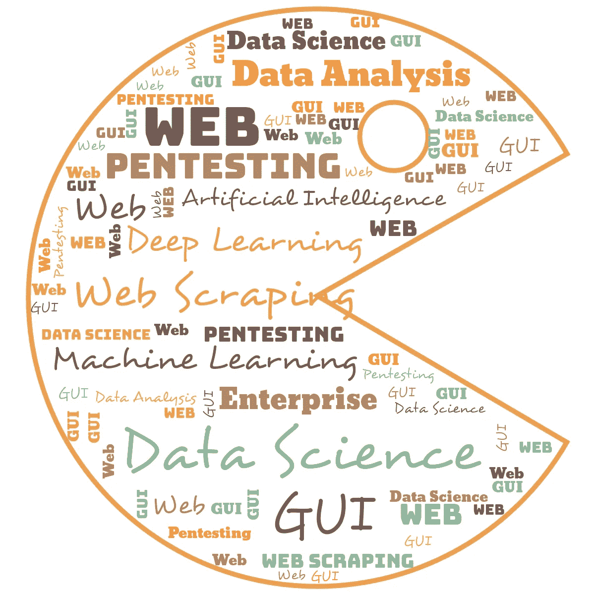
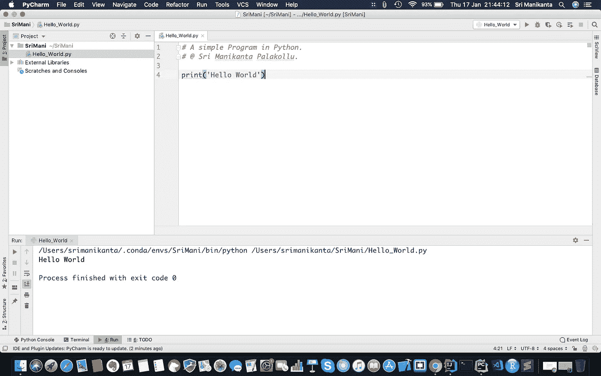
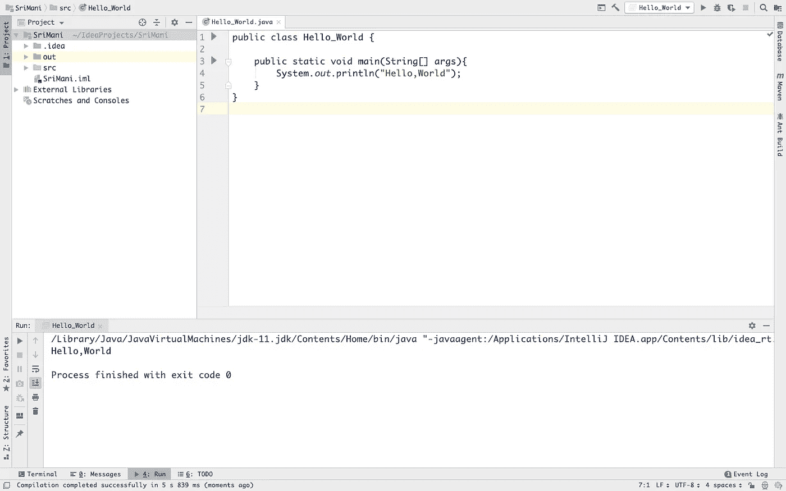
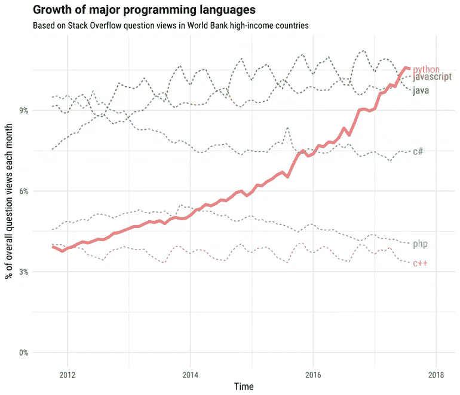

# Python 和 Java 之间的编程战争。

> 原文：<https://medium.datadriveninvestor.com/the-programming-war-between-python-and-java-332a3542608e?source=collection_archive---------5----------------------->

> 赢得战争不是杀死我们的敌人。而是打败我们的敌人。

Photo by [Frida Bredesen](https://unsplash.com/@fridooh?utm_source=medium&utm_medium=referral) on [Unsplash](https://unsplash.com?utm_source=medium&utm_medium=referral)

Python 和 Java 是最流行的编程语言，在全世界都有需求。两个开发人员之间总是会在应用领域、生产力、市场趋势、社区、工资等等方面发生冲突。

## 应用程序域:

当谈到应用程序领域的斗争时，我们可以借助这两种编程语言来构建许多应用程序。但是应用领域却完全不同。两种语言的应用领域如下:

**JAVA:**

过去几年，Java 主要用于以下领域，以解决商业和现实世界中的问题。其中几个是:

1.  大数据技术。
2.  金融应用。
3.  服务器端应用程序。
4.  安卓应用。
5.  嵌入式应用。
6.  企业级应用。
7.  游戏应用。
8.  桌面应用程序。
9.  科学应用也是如此。

**巨蟒:**

Python 的领域范围完全涉及如下各种领域:

1.  数据科学
2.  机器学习
3.  人工智能
4.  深度学习
5.  网页抓取
6.  数据分析
7.  Pentesting
8.  使用 TKINTER 的 GUI 应用程序。
9.  用 Django 开发 Web 应用程序。
10.  企业级应用。

## 生产力:

Photo by [Andreas Klassen](https://unsplash.com/@schmaendels?utm_source=medium&utm_medium=referral) on [Unsplash](https://unsplash.com?utm_source=medium&utm_medium=referral)

大多数开发人员认为 python 比 Java 更有生产力。主要原因是我们可以很容易地用 Python 编码，但我们不能通过考虑简单性来做出判断，因为 Python 是松散类型的编程语言，而 Java 是强类型的编程语言。在 Java 中，我们需要用特定的数据类型显式声明变量。"*声称 Java 不如 Python 有生产力是危险的"。为了比较两种编程语言的效率，我们需要考虑以下因素。它们是:*

1.  速度。
2.  语言类型。
3.  代码简单。
4.  内置数据结构。

**速度:**

Java 代码比 Python 运行得更快，因为 Java 是基于编译器的编程语言，而 Python 是基于解释的编程语言。基于编译器的编程语言总是比基于解释的编程语言快。

> 在速度上，Java 胜过 python。

**语言类型:**

Python 是一种动态类型编程语言，而 Java 是一种静态类型编程语言。当我们用动态类型的编程语言开发一个应用程序并投入生产时，我们可以比静态类型的编程语言更快地修复问题和错误。动态类型编程语言的主要优点是，我们不需要在后台执行任何修改后重新编译代码。

> 动态类型编程语言比静态类型编程语言有更多的优势。

**代码简单:**

在 Python 的帮助下，我们可以通过编写几行代码来执行任何类型的任务。与 Java 相比，Python 的语法简单而优雅。

**Python 代码:**

A Simple Hello World Program in Python.

**Java 代码:**

A Simple Hello World Program in Java.

> Python 的代码比 Java 简单。

**内置数据结构:**

Python 拥有比 Java 更强大的内置数据结构，这有助于程序员使用这些结构来提高工作效率。

**生产率结论:**

有一点大家都同意，Python 是一种具有优雅语法的解释型语言，这使得它成为许多领域中脚本编写和快速应用程序开发的一个非常好的选择。

## **市场趋势:**

Python 创造了一个新的市场记录，在世界上 100 多个国家使用它，许多大型公司也在使用它进行更好的软件开发，而 Java 只在不到 100 个国家使用，但由于其“一次编写，随处运行”的特性，它仍然是大多数大型公司的核心。

Source: Google

StackOverflow 进行的开发人员调查和 StackOverflow 中提出的问题数量清楚地表明，Python 正在取代 Java。

## 年收入:

Photo by [Sharon McCutcheon](https://unsplash.com/@sharonmccutcheon?utm_source=medium&utm_medium=referral) on [Unsplash](https://unsplash.com?utm_source=medium&utm_medium=referral)

一个 Python 开发者的平均年薪是**$ 116379**。它因地而异，而 Java 开发人员的平均年薪是 69，722 美元。这个工资值也因地而异。Java 是最受欢迎的编程语言，但从工资的角度来看，Java 的增长与日俱减，但程序员的可用性非常高，而 Python 的增长与日俱增，但程序员的数量越来越少，这导致 Python 程序员的工资上涨。

## 社区支持:

Photo by [Tim Marshall](https://unsplash.com/@timmarshall?utm_source=medium&utm_medium=referral) on [Unsplash](https://unsplash.com?utm_source=medium&utm_medium=referral)

由于这两种编程语言对业界来说都相当古老，所以他们有一个很好的社区来帮助处于项目困难时期的开发人员。这也有助于许多初学者在他们的学习曲线中快速采用这种特定的编程语言。

## 结论:

相反，这场战争没有完美的赢家，因为一种语言在某一点上优于另一种语言，但开发者和程序员之间的争论仍在继续。我不会决定谁是赢家，因为编程语言的使用是不同的，也就是说，我们不能在 Python 编程的帮助下构建一个高效的 Android 应用程序，而我们不能用 Java 构建一个卷积神经网络。我坚信不要根据一条鱼爬树的能力来判断它。同理，我们也不能完全根据一种编程语言的不同用法来判断它。