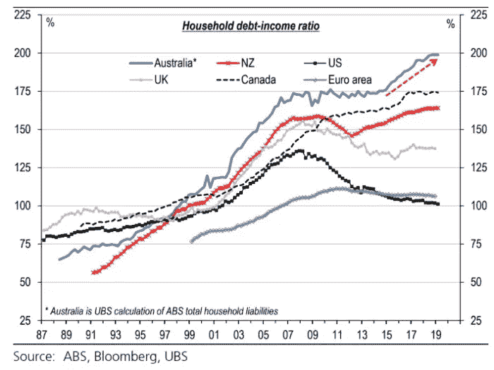
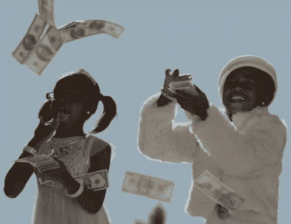
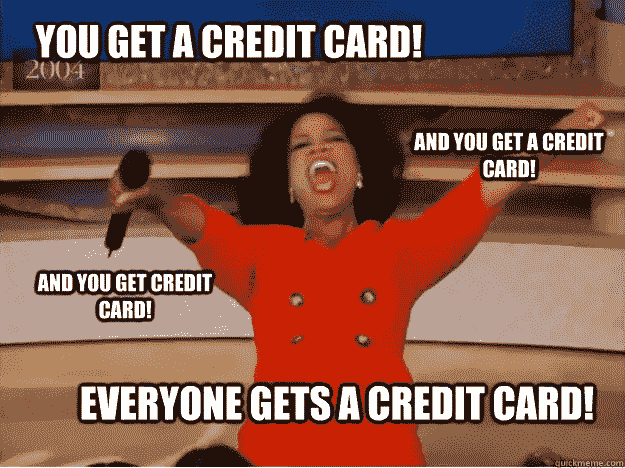
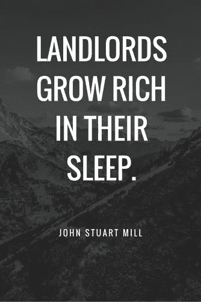
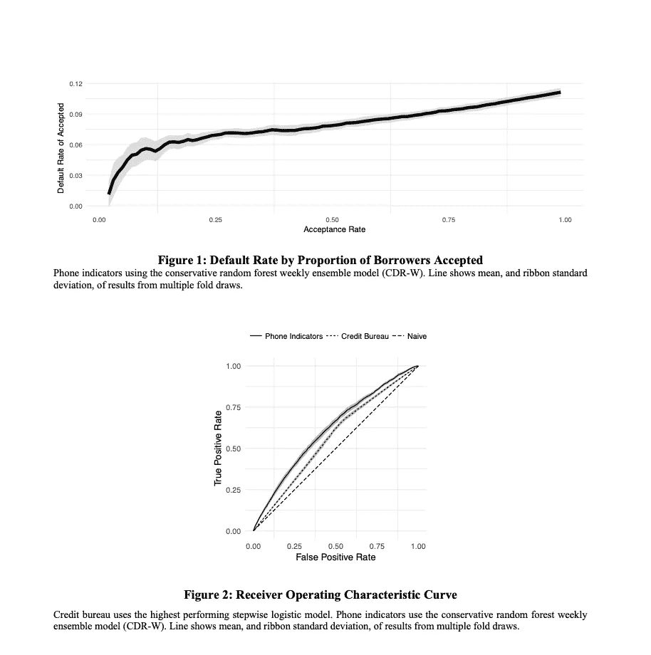
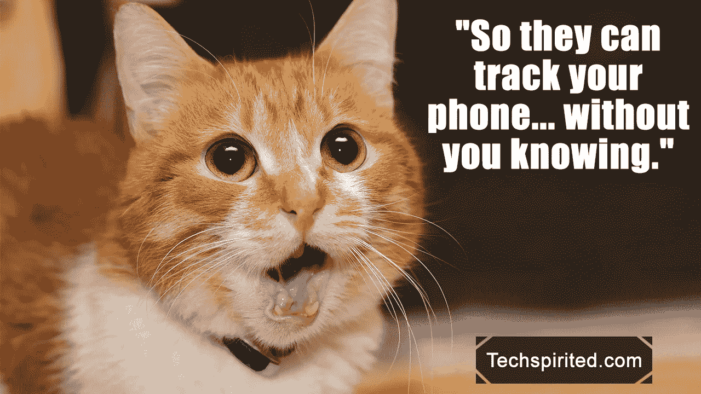

# 数据科学在非洲的前景:利用手机行为推进信贷准入

> 原文：<https://medium.datadriveninvestor.com/the-promise-of-data-science-in-africa-using-data-to-advance-credit-1897d69c84cf?source=collection_archive---------9----------------------->

获得信贷是现代市场经济的关键，而……在非洲是不存在的。下面是数据科学计划如何解决这个问题。

信用是现代成功市场经济的基石。在发达国家，信贷通过增加消费者和企业对基本资源的获取来刺激经济增长，并实现风险、成本和储备的有效分配。

 [## 成为数据科学家所需的 8 项技能|数据驱动型投资者

### 数字吓不倒你？没有什么比一张漂亮的 excel 表更令人满意的了？你会说几种语言…

www.datadriveninvestor.com](https://www.datadriveninvestor.com/2019/02/07/8-skills-you-need-to-become-a-data-scientist/) 

就个人而言，大多数人都会同意信用是必需品。

> 在发达国家，获得信贷是人们“留在游戏中”的手段([布鲁金斯学会](https://www.brookings.edu/blog/africa-in-focus/2018/08/01/giving-credit-to-africas-financial-markets-and-why-we-need-to-step-up-reform/))。

Source: [https://www.abc.net.au/news/2019-07-08/australia-leads-the-world-in-household-debt/11286678](https://www.abc.net.au/news/2019-07-08/australia-leads-the-world-in-household-debt/11286678)

信用报告和信用评分提供了一个客观的衡量标准，使消费者和私营公司能够作为知情的行为者自由地相互交易。据 TransUnion 称，在美国，消费者信用报告是一个价值 30 亿美元的行业，这还不包括在此报告基础上提供的信贷。

然而，在欠发达国家，情况并非如此。事实上，非洲获得信贷的机会远远落后于世界其他地区**。**

> “虽然撒哈拉以南非洲的信贷与 GDP 之比只有 18%，但南亚和拉丁美洲的可比数字分别为 37%和 47%。”——[布鲁金斯学会](https://www.brookings.edu/blog/africa-in-focus/2018/08/01/giving-credit-to-africas-financial-markets-and-why-we-need-to-step-up-reform/')。

在同一时期，这个地区的人口“增长了近三分之一，现在达到了 10 亿”，从 10%的低基数来看，18%的增长率是一个“令人印象深刻”的增长。

事实上，在非洲市场经济的许多领域，获得信贷的机会少得可怜，信用报告根本不存在。世界银行估计，66%的撒哈拉以南非洲人没有银行账户(2018 年)(T13 年)，并且由于对正规金融服务的了解有限，贷款人很少或根本没有他们传统上用来做出合理贷款决策的数据(即收入和信用记录的官方证明)。

由于信息不对称或不可用，获得贷款和信贷资源变得更加困难、昂贵和低效，导致市场功能失调。让我们考虑一下商业和抵押贷款的情况。

**商业信用**

在整个新兴市场，大约 85%的中小型企业无法获得信贷，这一事实阻碍了许多国家的发展。

*一个开明的解决方案:*21 世纪初，一些经济学家提出了小微金融，即。小额信贷是解决贫困和信用危机的灵丹妙药。2006 年诺贝尔和平奖得主穆罕默德·尤努斯(格莱珉银行)与金融家乔治·索罗斯和易贝联合创始人皮埃尔·奥米迪亚一道，承诺向小额信贷运动捐赠数亿美元。花旗集团(Citigroup Inc .)和德意志银行(Deutsche Bank AG)等大型银行也加入了进来。

然而，在 2000 年代中期，小额信贷的狂热降温了。随着经济学家转向对该工具的严格分析，他们意识到小额贷款对生活在贫困线以上的借款人比对生活在贫困线以下的借款人更有利。贫穷的借款人被发现厌恶风险；他们获得保守的贷款来保护他们的生存，而不是投资于技术、固定资本或雇佣劳动力，这些可以产生高于贷款利息的利润。经济学认为贷款应该回归资本市场。

**抵押信贷**

在发达经济体，房地产是数十年来数百万人积累家庭财富的途径。在非洲，抵押贷款市场几乎不存在。来自两个东非国家的统计数据很能说明问题:在乌干达，4100 万人口估计有 5000 份抵押贷款，而坦桑尼亚这个 5500 万人口的国家只有 3500 份抵押贷款。

由于这种市场失灵，那些没有土地或建筑的人无法从资产价格膨胀中受益，而资产价格膨胀为那些已经拥有资本的人创造了财富，助长了危险的分化和不平等社会。

**信用改革和数据科学**

由于这些关切，撒哈拉以南非洲的中央银行和决策者已经将发展正常运作的信贷市场作为其金融市场改革战略的优先成果。私营企业，如电信公司，也看到了巨大的机会，并已开始探索这一领域的可能性。

***无银行账户者的新信贷模式***

这给我们带来了一个岔路口，也许是非洲信贷获取的一个全新解决方案:[麦肯锡&公司](https://www.mckinsey.com/business-functions/risk/our-insights/new-credit-risk-models-for-the-unbanked)表示，与无银行账户者合作的贷款人应该寻找可以用作“身份(例如，减少欺诈)、还款能力(例如，收入或当前债务负担)和还款意愿(例如，过去的信贷经历)”的可靠代理数据。

他们强调了六个特别有用的数据源:电信提供商、公用事业、批发供应商、零售商、政府和金融机构自己以前忽略的数据。

**手机使用行为预测信用还款**

沿着这个思路，研究人员[丹尼尔·比约克格伦和达雷尔·格里森](https://dan.bjorkegren.com/danbjork_grissen_creditscoring.pdf)发现，手机数据提供了可以用来预测信用违约的行为特征。

研究人员使用了与一家南美电信公司提供的信贷还款结果相匹配的通话记录。

> 在一个拥有(单薄)金融历史的个人样本中，他们的方法在同一时间内和不同时间段的测试中都优于使用信用局信息的模型。

他们的方法(随机森林)在那些没有金融历史的人身上也获得了类似的表现，这些人不能用传统方法评分。按照我们的标准，风险最高的五分之一人口的违约概率是风险最低的五分之一人口的 2.8 倍。

Researchers use data science to show that using mobile behavior to predict default on credit performs better than credit bureau data. Source: [https://dan.bjorkegren.com/danbjork_grissen_creditscoring.pdf](https://dan.bjorkegren.com/danbjork_grissen_creditscoring.pdf)

> 这种模式可以推进信用报告，事实上也可以推进非洲的信用报告，那里的移动数据非常丰富，大约 75%的人口拥有手机。

**数据隐私和关注点**

虽然使用移动数据作为信用度的代理并提高信用的承诺似乎令人兴奋，但仍有许多潜在的陷阱和问题需要考虑，包括但不限于消费者隐私、数据和偏见。在撒哈拉以南非洲地区使用手机时需要考虑的一些问题包括:

1.  数据和隐私问题:移动运营商应该向银行和其他第三方提供电话使用数据吗？在何种情况下？

2.获取移动数据真的能解决信贷市场的功能障碍并带来更多的信贷机会吗？还是有一些内在的市场或社会学偏见仍然会阻碍非洲的信贷机会？

考虑到这一点，看看私营企业，特别是电信公司如何选择在新的数据驱动的世界中前进将是有趣的，在这个世界中，它们在撒哈拉以南非洲拥有主要的信息优势。对于对非洲感兴趣的投资者来说，这无疑是一个值得关注的领域。