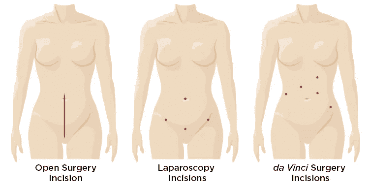
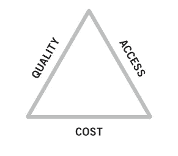
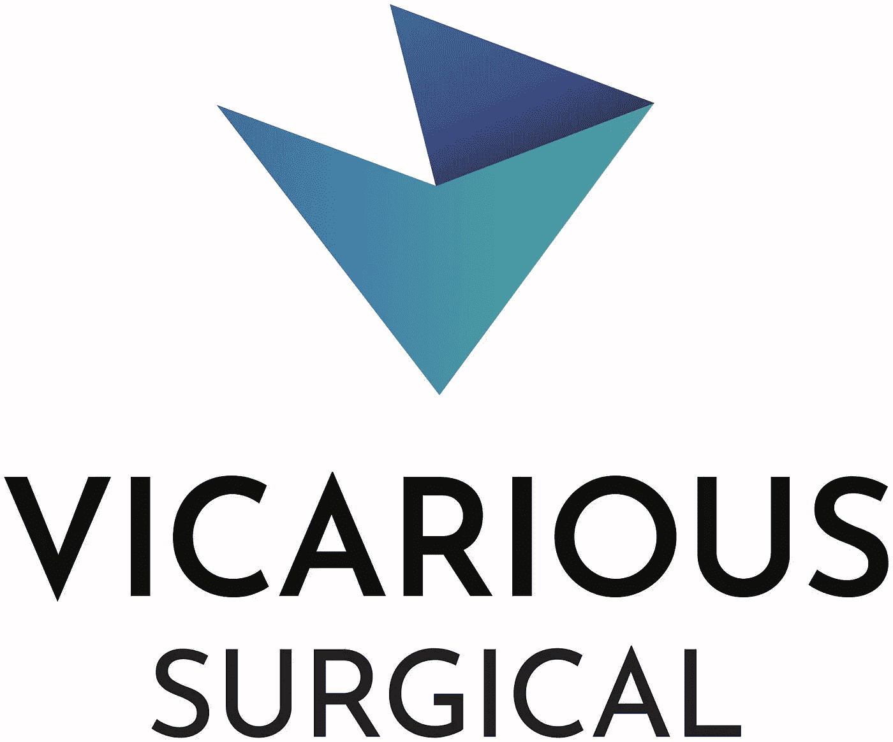

# 外科机器人的前景

> 原文：<https://medium.datadriveninvestor.com/the-promise-of-surgical-robotics-97f54386f3b9?source=collection_archive---------1----------------------->

Vicarious Surgical 正在努力实现外科机器人的承诺。自从几年前我第一次投资以来，它们一直处于“秘密模式”，所以我很高兴第一次公开谈论它们。在分享更多关于这个团队、他们的公司和他们的使命之前，我将从我自己的经历中的一些外科手术机器人的背景开始提供背景。

我已经在医疗保健行业工作了十多年( [TFW](https://media.giphy.com/media/l0IyajjbNiRvCr7RC/giphy.gif) )，第一次接触“机器人辅助手术”是在我读医学院的时候。这项技术预示着微创手术(MIS 也称为腹腔镜手术)的改进。

MIS 是野战外科手术中的一种“破坏”,它用一种只涉及几个小切口和复杂手工工具的技术取代了将病人切开的做法。好处包括减少失血、疼痛、疤痕、感染和平均住院时间。一些程序甚至从住院转移到门诊。这些好处为医院带来了成本效益，并最终降低了支付者的成本。因此，尽管学习起来很有挑战性，而且通常比开放手术花费的时间更长，但微创手术作为一种技术已经蓬勃发展。

Which would you rather have?

机器人技术在 MIS(MIRS)中的应用有望带来额外的好处。有了 MIRS，理论上我们可以有更少更小的切口，更精确的运动，从而享受更好的结果。经过多年的研究和开发，数百万的联邦拨款，长期的监管斗争，当然还有一些知识产权诉讼，机器人被制造和购买，外科医生被培训。

医院基于一些初始数据和管理信息系统运行良好的事实做出了购买的决定。出于类似的原因，临床医生接受了新设备的培训，并为采用机器人技术的决策做出了贡献。这种投资和期望的结合导致医生、医院和机器人制造商在具体证据之前吹捧 MIRS 的好处。

最终，患者开始了解 MIRS，并开始要求使用它。新出现的纵向数据开始显示，与管理信息系统相比，缺乏更好的结果和成本节约，或者至少在这些措施上存在不确定性。机器人确实推动了手术量，因为[的外科医生和病人会转移到任何一家提供机器人的医院。](https://www.hhnmag.com/articles/6337-surgical-robots-worth-the-investment)

离开医学院后，我加入了一家咨询公司。医院会要求我们帮助他们决定机器人是否是一项好的投资。通常，我们必须告诉医院，他们的选择是购买机器人或经历负投资回报率，因为收入的增加不足以证明数百万美元的费用，或者不购买机器人，随着机器人数量转移到医院，经历甚至更负的投资回报率。所以，要么承受损失，要么承受更大的损失，不管怎样，你的结果可能都不会改善。不是任何客户想听到的。

# 对更好结果的持续追求

记住这段历史，你可能会想为什么有人会投资外科机器人公司？好吧，更好结果的承诺仍然存在。机器人无疑提供了更精确的运动和更均匀的施力。更少和更小的切口在理论上是可能的，更快速的移动和远程操作也是可能的。有了足够的数据和编程，MIRS 甚至可以自动完成。如果提供正确，MIRS 可以在降低成本的同时提高可及性和质量，从而打破医疗保健的铁三角。

Improvement on one or two of the measures necessarily causes worsening of the other(s).

*虽然这个三角关系有点争议，也不是一个完美的框架，但这里有一些简单的例子:如果你突然给美国所有人提供医疗保险，医疗服务会增加，但随着资源的紧张，成本会增加，质量会下降。一种副作用更少的抗癌新药质量更高，但成本会更高，因此可获得性会更低。远程医疗可以以较低的成本提供，并且可以到达偏远地区的病人，但是它所能治疗的条件有限，因此对于亲自就诊来说质量较低。*

时间快进到 2015 年，我遇到了 Vicarious Surgical 的联合创始人亚当·萨克斯(Adam Sachs)和萨米·哈利法(Sammy Khalifa)。我在罗森伯格风险投资公司投资，寻找伟大的虚拟现实创始人和公司(另一个故事)。亚当和萨米既热情又认真。两人从麻省理工学院毕业后都在苹果工作。他们真诚地理解这项工作的复杂性，我们也对大鹏鸟的状态和潜力有着共同的信念。他们也有一个清晰的愿景和计划，用一个解决方案解决未来的众多挑战。我意识到他们从整体上考虑问题和系统。最重要的是，我相信他们真的能成功。于是，我们成了他们的第一个投资人。

从那时起，我见证了这个团队的成长和技术的发展。随着他们证明了自己的能力并取得了巨大的进步，他们现在拥有了 1675 万美元的 A 轮融资和科斯拉风险投资公司、埃里克·施密特的创新努力、比尔·盖茨的盖茨风险投资公司、雅虎的支持。杨致远的 AME 云风险投资公司的联合创始人，以及马克·贝尼奥夫。我很高兴再次投资于这个团队和这个任务。

Vicarious Surgical 的愿景包括虚拟现实与类人手术机器人的结合，使外科医生能够通过单个微切口进行微创手术。结果是出血更少，疼痛更少，恢复时间更短，疤痕更少，感染机会更少——所有这些都是 MIS 和 MIRS 最初的承诺。此外，该团队旨在通过“缩小外科医生”并将他们放入患者体内来提供真正直观的体验。为了增加患者接受微创手术的机会，这项任务不仅仅是一种新的市场设备。Vicarious Surgical 打算实现外科机器人的承诺。哦，还有[他们正在招聘](https://www.vicarioussurgical.com/career-opportunities/)！

New logo!

一些背景阅读:

《美国机器人外科杂志》的[历史和应用概述](https://www.ncbi.nlm.nih.gov/pmc/articles/PMC4677089/)。

关于机器人手术的详细文献综述。